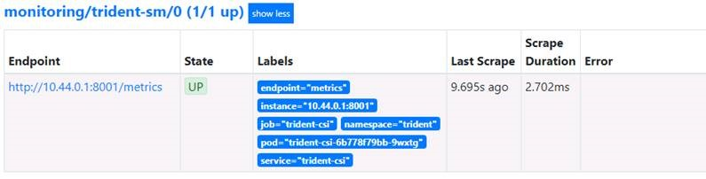

#########################################################################################
# SCENARIO 3: Install Prometheus & integrate Trident's metrics
#########################################################################################

**GOAL:**  
Now that all prerequites have been put in place, we can proceed with the installation

## A. Install Prometheus in its own namespace

Due to a bug in Helm, you first need to manually create some CRD.  
For more information about this, take a look at https://github.com/helm/charts/tree/master/stable/prometheus-operator#helm-fails-to-create-crds.  

```bash
# ONLY WITH KUBERNETES >= v1.16
kubectl apply -f https://raw.githubusercontent.com/prometheus-operator/prometheus-operator/master/example/prometheus-operator-crd/monitoring.coreos.com_alertmanagers.yaml
kubectl apply -f https://raw.githubusercontent.com/prometheus-operator/prometheus-operator/master/example/prometheus-operator-crd/monitoring.coreos.com_podmonitors.yaml
kubectl apply -f https://raw.githubusercontent.com/prometheus-operator/prometheus-operator/master/example/prometheus-operator-crd/monitoring.coreos.com_prometheuses.yaml
kubectl apply -f https://raw.githubusercontent.com/prometheus-operator/prometheus-operator/master/example/prometheus-operator-crd/monitoring.coreos.com_prometheusrules.yaml
kubectl apply -f https://raw.githubusercontent.com/prometheus-operator/prometheus-operator/master/example/prometheus-operator-crd/monitoring.coreos.com_servicemonitors.yaml
kubectl apply -f https://raw.githubusercontent.com/prometheus-operator/prometheus-operator/master/example/prometheus-operator-crd/monitoring.coreos.com_thanosrulers.yaml
```

Once the CRD installed, you can proceed with the Prometheus Operator:

```bash
# ONLY WITH KUBERNETES < v1.16
helm install prom-operator stable/prometheus-operator --namespace monitoring --set grafana.persistence.enabled=true,grafana.sidecar.datasources.defaultDatasourceEnabled=false

# ONLY WITH KUBERNETES >= v1.16
helm install prom-operator stable/prometheus-operator --namespace monitoring --set prometheusOperator.createCustomResource=false,grafana.persistence.enabled=true,grafana.sidecar.datasources.defaultDatasourceEnabled=false
```

You can check the installation with the following command:

```bash
$ helm list -n monitoring
NAME            NAMESPACE       REVISION        UPDATED                                 STATUS          CHART                           APP VERSION
prom-operator   monitoring      1               2020-08-31 15:18:20.350957085 +0000 UTC deployed        prometheus-operator-9.3.1       0.38.1
```

## B. Expose Prometheus

Prometheus got installed pretty easily.
But how can you access from your browser?

The way Prometheus is installed (service of _ClusterIP_ type) requires it to be access from the host where it is installed (with a *port-forwarding* mechanism for instance).

```bash
$ kubectl get -n monitoring svc -l app=prometheus-operator-prometheus
NAME                                    TYPE        CLUSTER-IP       EXTERNAL-IP   PORT(S)    AGE
prom-operator-prometheus-o-prometheus   ClusterIP   10.110.162.207   <none>        9090/TCP   3m15s
```

We will modify the Prometheus service in order to access it from anywhere in the lab.  
You could choose the *NodePort* method or the *LoadBalancer* one if you prefer.  
To keep it simple, I will use the *LoadBalancer* method.  

2 parameters of the Prometheus service (_type_ & _port_)need to be modified. You can either edit it or patch it, solution I chose here:

```bash
$ kubectl patch -n monitoring svc prom-operator-prometheus-o-prometheus -p '{"spec":{"type":"LoadBalancer"}}'
service/prom-operator-prometheus-o-prometheus patched

$ kubectl patch -n monitoring svc prom-operator-prometheus-o-prometheus --type='json' -p='[{"op": "replace", "path": "/spec/ports/0/port", "value":80}]'
service/prom-operator-prometheus-o-prometheus patched

$ kubectl get -n monitoring svc -l app=prometheus-operator-prometheus
NAME                                    TYPE           CLUSTER-IP       EXTERNAL-IP     PORT(S)        AGE
prom-operator-prometheus-o-prometheus   LoadBalancer   10.110.162.207   192.168.0.140   80:30446/TCP   30m
```

You can now access the Prometheus GUI from the browser using the IP address 192.168.0.140.  

## C. Add Trident to Prometheus

Refer to the blog aforementioned to get the details about how this Service Monitor works.
The following link is also a good place to find information:
https://github.com/coreos/prometheus-operator/blob/master/Documentation/user-guides/getting-started.md

In substance, we will tell in this object to look at services that have the label *trident* & retrieve metrics from its endpoint.
The Yaml file has been provided and is available in the Scenario2 sub-directory

```bash
$ kubectl create -f Trident_ServiceMonitor.yml
servicemonitor.monitoring.coreos.com/trident-sm created
```

## D. Check the configuration

On the browser in the LoD, you can now connect to the address http://192.168.0.140 in order to access Prometheus
You can check that the Trident endpoint is taken into account & in the right state by going to the menu STATUS => TARGETS



## E. Play around

Now that Trident is integrated into Prometheus, you can retrieve metrics or build graphs.

## F. Optional cleanup

If you want to delete this chart, you can use the following commands:

```bash
$ helm delete prom-operator -n monitoring
release "prom-operator" uninstalled
```

Also, this process does not clean up the CRD, nor the namespace. You can use the following commands to complete the cleanup

```bash
kubectl delete crd prometheuses.monitoring.coreos.com
kubectl delete crd prometheusrules.monitoring.coreos.com
kubectl delete crd servicemonitors.monitoring.coreos.com
kubectl delete crd podmonitors.monitoring.coreos.com
kubectl delete crd alertmanagers.monitoring.coreos.com
kubectl delete crd thanosrulers.monitoring.coreos.com
kubectl delete namespace monitoring
```

## G. What's next

Now that Trident is connected to Prometheus, you can proceed with [Grafana](../3_Grafana) & add your first graphs  

or go back to the [FrontPage](https://github.com/YvosOnTheHub/LabNetApp)