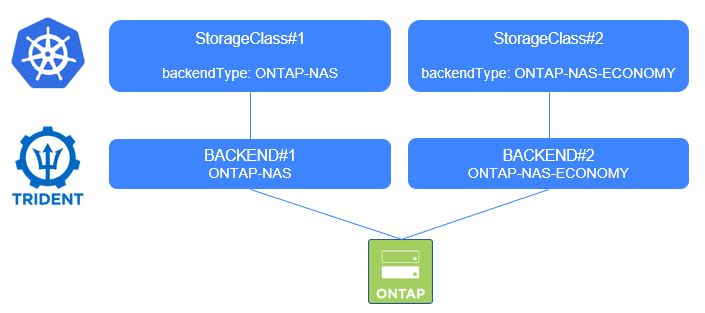

#########################################################################################
# SCENARIO 4: Create your first NFS backends for Trident & Storage Classes for Kubernetes
#########################################################################################

**GOAL:**  
Trident needs to know where to create volumes.  
This information sits in objects called backends. It basically contains:  
- the driver type (there currently are 10 different drivers available)
- how to connect to the driver (IP, login, password ...)
- some default parameters

For additional information, please refer to:
- https://netapp-trident.readthedocs.io/en/stable-v20.01/kubernetes/deploying.html#create-and-verify-your-first-backend 
- https://netapp-trident.readthedocs.io/en/stable-v20.01/kubernetes/operations/tasks/backends/index.html 

Once you have configured backend, the end user will create PVC against Storage Classes.  
A storage class contains the definition of what an app can expect in terms of storage, defined by some properties (access, media, driver ...)

For additional information, please refer to:
- https://netapp-trident.readthedocs.io/en/stable-v20.01/kubernetes/concepts/objects.html#kubernetes-storageclass-objects

Also, installing & configuring Trident + creating Kubernetes Storage Classe is what is expected to be done by the Admin.



## A. Create your first NFS backends

You will find in this directory a few backends files.  
You can decide to use all of them, only a subset of them or modify them as you wish

Here are the 2 backends & their corresponding driver:
- backend-nas-default.json        ONTAP-NAS
- backend-nas-eco-default.json    ONTAP-NAS-ECONOMY

```
# tridentctl -n trident create backend -f backend-nas-default.json
+-----------------+----------------+--------------------------------------+--------+---------+
|      NAME       | STORAGE DRIVER |                 UUID                 | STATE  | VOLUMES |
+-----------------+----------------+--------------------------------------+--------+---------+
| NAS_Vol-default | ontap-nas      | 282b09e5-0ff2-4471-97c8-9fd5224945a1 | online |       0 |
+-----------------+----------------+--------------------------------------+--------+---------+

# tridentctl -n trident create backend -f backend-nas-eco-default.json
+-----------------+-------------------+--------------------------------------+--------+---------+
|      NAME       |  STORAGE DRIVER   |                 UUID                 | STATE  | VOLUMES |
+-----------------+-------------------+--------------------------------------+--------+---------+
| NAS_ECO-default | ontap-nas-economy | b21fb2a7-975a-4050-a187-bb4f883d0e97 | online |       0 |
+-----------------+-------------------+--------------------------------------+--------+---------+

# kubectl get -n trident tridentbackends
NAME        BACKEND           BACKEND UUID
tbe-c874k   NAS_Vol-default   282b09e5-0ff2-4471-97c8-9fd5224945a1
tbe-d6szt   NAS_ECO-default   b21fb2a7-975a-4050-a187-bb4f883d0e97

```

## B. Create storage classes pointing to each backend

You will also find in this directory a few storage class files.
You can decide to use all of them, only a subset of them or modify them as you wish

```
# kubectl create -f sc-csi-ontap-nas.yaml
storageclass.storage.k8s.io/storage-class-nas created

# kubectl create -f sc-csi-ontap-nas-eco.yaml
storageclass.storage.k8s.io/storage-class-nas-economy created

# kubectl get sc
NAME                        PROVISIONER             AGE
storage-class-nas           csi.trident.netapp.io   2d18h
storage-class-nas-economy   csi.trident.netapp.io   2d18h
```

At this point, end-users can now create PVC against one of theses storage classes.  


## C. What's next

Now, you have some NAS Backends & some storage classes configured. You can proceed to the creation of a stateful application:  
- [Scenario05](../Scenario05) Deploy your first app with File storage  
or go back to the [FrontPage](../../)