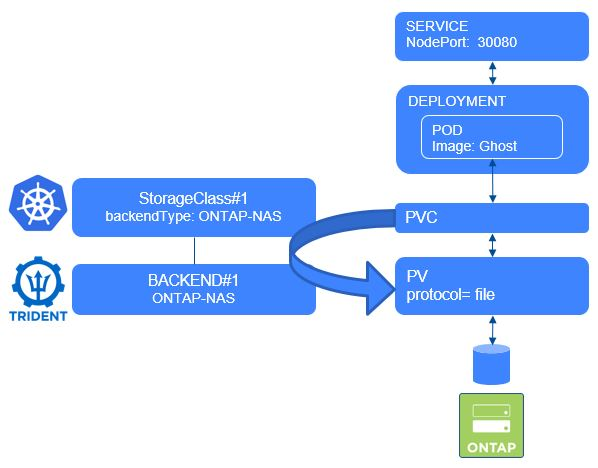

#########################################################################################
# SCENARIO 5: Create your first SAN backends 
#########################################################################################

**GOAL:**  
You understood how to create backends and what they are for.  
You probably also created a few ones with NFS drivers.  
It is now time to add more backends that can be used for block storage.  

:boom: **In order to go through this scenario, you first need to configure iSCSI on the ONTAP backend.** :boom:  
If not done so, please refer to the [Addenda5](../../Addendum/Addenda05).  



## A. Create your first SAN backends

You will find in this directory a few backends files:

- backend-san-default.json        ONTAP-SAN
- backend-san-eco-default.json    ONTAP-SAN-ECONOMY  

You can decide to use all of them, only a subset of them or modify them as you wish

:boom: **Here is an important statement if you are planning on using these drivers in your environment.** :boom:  
The **default** is to use **all data LIF** IPs from the SVM and to use **iSCSI multipath**.  
Specifying an IP address for the **dataLIF** for the ontap-san* drivers forces the driver to **disable** multipath and use only the specified address.  

If you take a closer look to both json files, you will see that the parameter dataLIF has not been set, therefore enabling multipathing.  

```bash
$ tridentctl -n trident create backend -f backend-san-secured.json
+-------------+----------------+--------------------------------------+--------+---------+
|    NAME     | STORAGE DRIVER |                 UUID                 | STATE  | VOLUMES |
+-------------+----------------+--------------------------------------+--------+---------+
| SAN-secured | ontap-san      | ad04f63c-592d-49ae-bfde-21a11db06976 | online |       0 |
+-------------+----------------+--------------------------------------+--------+---------+

$ tridentctl -n trident create backend -f backend-san-eco-default.json
+-----------------+-------------------+--------------------------------------+--------+---------+
|      NAME       |  STORAGE DRIVER   |                 UUID                 | STATE  | VOLUMES |
+-----------------+-------------------+--------------------------------------+--------+---------+
| SAN_ECO-default | ontap-san-economy | 530f18b1-680b-420f-ad6b-94c96fea84b9 | online |       0 |
+-----------------+-------------------+--------------------------------------+--------+---------+

$ kubectl get -n trident tridentbackends
NAME        BACKEND               BACKEND UUID
...
tbe-7nl8v   SAN_ECO-default       530f18b1-680b-420f-ad6b-94c96fea84b9
tbe-wgs99   SAN-secured           ad04f63c-592d-49ae-bfde-21a11db06976
...
```

## B. Create storage classes pointing to each new backend

You will also find in this directory a few storage class files.
You can decide to use all of them, only a subset of them or modify them as you wish

```bash
$ kubectl create -f sc-csi-ontap-san.yaml
storageclass.storage.k8s.io/storage-class-san created

$ kubectl create -f sc-csi-ontap-san-eco.yaml
storageclass.storage.k8s.io/storage-class-san-economy created
```

If you have configured Grafana, you can go back to your dashboard, to check what is happening (cf http://192.168.0.141).

## C. Validate the CHAP configuration on the storage backend

If you take a closer look at the SAN-secured definition file, you will see a bunch of parameter related to bidirectional CHAP, which will add authenticated iSCSI connections.  
You can learn more about it on the following link:  
https://netapp-trident.readthedocs.io/en/stable-v20.07/kubernetes/operations/tasks/backends/ontap/ontap-san/bidir-ontap-chap.html?highlight=chap#using-chap-with-ontap-san-drivers 

You can check that the CHAP configuration has been set correctly with the following command (password: Netapp1!)

```bash
# ssh -l admin 192.168.0.101 iscsi security show
Password:
                                  Auth   Auth CHAP Inbound CHAP  Outbound CHAP
Vserver    Initiator Name         Type   Policy    User Name     User Name
---------- ---------------------- ------ --------- ------------- -------------
svm1       default                CHAP   local     tridentchap   tridenttarget
```

You find here both usernames set in the backend parameters.  
Now, you can only see the CHAP configuraion on the host once a POD has mounted a PVC, which you will do in the Scenario07.

## D. What's next

Now, you have some SAN Backends & some storage classes configured. You can proceed to the creation of a stateful application:  

- [Scenario06](../Scenario06): Deploy your first app with Block storage  

Or go back to the [FrontPage](https://github.com/YvosOnTheHub/LabNetApp)