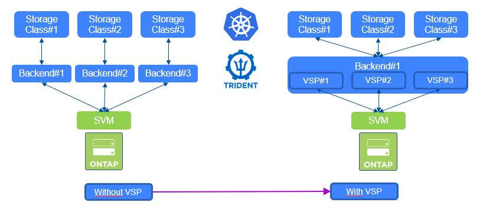

#########################################################################################
# SCENARIO 12: StatefulSets & Storage consumption
#########################################################################################

**GOAL:**  
StatefulSets work differently that Deployments or DaemonSets when it comes to storage.  
Deployments & DaemonSets use PVC defined outside of them, whereas StatefulSets include the storage in their definition (cf _volumeClaimTemplates_).  
Said differently, you can see a StatefulSet as a couple (POD + Storage). When it is scaled, both objects will be automatically created.  
In this exercise, we will create a MySQL StatefulSet & Scale it.  

We consider that a backend & a storage class have already been created. ([ex: Scenario04](../Scenario04)).  



To best benefit from the scenario, you would first need to go through the following Addendum:  
[1.](../../Addendum/Addenda01) Add a node to the cluster  
[2.](../../Addendum/Addenda02) Specify a default storage class  
[3.](../../Addendum/Addenda03) Allow user PODs on the master node  

## A. Let's start by creating the application

This application is based on 3 elements:
- a ConfigMap, which hosts some parameter for the application
- 2 services
- the StatefulSet (3 replicas of the application)

:mag:  
*A* **ConfigMap** *is an API object used to store non-confidential data in key-value pairs. Pods can consume ConfigMaps as environment variables, command-line arguments, or as configuration files in a volume. A ConfigMap allows you to decouple environment-specific configuration from your container images, so that your applications are easily portable.*  
:mag_right:  

```
# kubectl create namespace mysql
namespace/mysql created

# kubectl create -n mysql -f mysql-configmap.yaml
configmap/mysql created
# kubectl create -n mysql -f mysql-services.yaml
service/mysql created
service/mysql-read created
# kubectl create -n mysql -f mysql-statefulset.yaml
statefulset.apps/mysql created
```
It will take a few minutes for all the replicas to be created, I will then suggest using the _watch_ flag:
```
# kubectl -n mysql get pod --watch
mysql-0   1/2     Running   0          43s   10.36.0.1   rhel1   <none>           <none>
mysql-0   2/2     Running   0          52s   10.36.0.1   rhel1   <none>           <none>
mysql-1   0/2     Pending   0          0s    <none>      <none>   <none>           <none>
mysql-1   0/2     Pending   0          0s    <none>      <none>   <none>           <none>
mysql-1   0/2     Pending   0          4s    <none>      rhel2    <none>           <none>
mysql-1   0/2     Init:0/2   0          4s    <none>      rhel2    <none>           <none>
mysql-1   0/2     Init:1/2   0          24s   10.44.0.1   rhel2    <none>           <none>
mysql-1   0/2     Init:1/2   0          32s   10.44.0.1   rhel2    <none>           <none>
mysql-1   0/2     PodInitializing   0          40s   10.44.0.1   rhel2    <none>           <none>
...
```
Once you that the third POD is up & running, you are good to go
```
# kubectl -n mysql get pod -o wide
NAME      READY   STATUS    RESTARTS   AGE   IP          NODE    NOMINATED NODE   READINESS GATES
mysql-0   2/2     Running   0          24h   10.36.0.1   rhel1   <none>           <none>
mysql-1   2/2     Running   1          24h   10.44.0.1   rhel2   <none>           <none>
mysql-2   2/2     Running   1          24h   10.39.0.2   rhel4   <none>           <none>
```
Now, check the storage. You can see that 3 PVC were created, one per POD.
```
# kubectl get -n mysql pvc,pv 
NAME                                 STATUS   VOLUME                                     CAPACITY   ACCESS MODES   STORAGECLASS        AGE
persistentvolumeclaim/data-mysql-0   Bound    pvc-f348ec0a-f304-49d8-bbaf-5a85685a6194   10Gi       RWO            storage-class-nas   5m
persistentvolumeclaim/data-mysql-1   Bound    pvc-ce114401-5789-454a-ba1c-eb5453fbe026   10Gi       RWO            storage-class-nas   5m
persistentvolumeclaim/data-mysql-2   Bound    pvc-99f98294-85f6-4a69-8f50-eb454ed00868   10Gi       RWO            storage-class-nas   4m

NAME                                                        CAPACITY   ACCESS MODES   RECLAIM POLICY   STATUS   CLAIM                STORAGECLASS        REASON   AGE
persistentvolume/pvc-99f98294-85f6-4a69-8f50-eb454ed00868   10Gi       RWO            Delete           Bound    mysql/data-mysql-2   storage-class-nas            4m
persistentvolume/pvc-ce114401-5789-454a-ba1c-eb5453fbe026   10Gi       RWO            Delete           Bound    mysql/data-mysql-1   storage-class-nas            5m
persistentvolume/pvc-f348ec0a-f304-49d8-bbaf-5a85685a6194   10Gi       RWO            Delete           Bound    mysql/data-mysql-0   storage-class-nas            5m
```

## B. Let's write some data in this database!

To connect to MySQL, we will use another POD which will connect to the master DB (mysql-0).  
Copy & paste the whole block at once:
```
kubectl run mysql-client -n mysql --image=mysql:5.7 -i --rm --restart=Never --\
 mysql -h mysql-0.mysql <<EOF
CREATE DATABASE test;
CREATE TABLE test.messages (message VARCHAR(250));
INSERT INTO test.messages VALUES ('hello');
EOF
```
Let's check that the operation was successful by reading the database, through the service called _mysql-read_
```
# kubectl run mysql-client -n mysql --image=mysql:5.7 -i -t --rm --restart=Never -- mysql -h mysql-read -e "SELECT * FROM test.messages"
If you don't see a command prompt, try pressing enter.
+---------+
| message |
+---------+
| hello   |
+---------+
pod "mysql-client" deleted
```

## C. Where are my reads coming from ?

In the current setup, _writes_ are done on the master DB, wheareas _reads_ can come from any DB POD.  
Let's check this!  
First, open a new Putty window & connect to RHEL3. You can then run the following, which will display the ID of the database followed by a timestamp. 
```
# kubectl run mysql-client-loop -n mysql --image=mysql:5.7 -i -t --rm --restart=Never -- bash -ic "while sleep 1; do mysql -h mysql-read -e 'SELECT @@server_id,NOW()'; done"
+-------------+---------------------+
| @@server_id | NOW()               |
+-------------+---------------------+
|         100 | 2020-04-07 10:22:32 |
+-------------+---------------------+
+-------------+---------------------+
| @@server_id | NOW()               |
+-------------+---------------------+
|         102 | 2020-04-07 10:22:33 |
+-------------+---------------------+
```
As you can see, _reads_ are well distributed between all the PODs.  
Keep this window open for now...

## D. Let's scale!

Scaling an application with Kubernetes is pretty straightforward & can be achieved with the following command:
```
# kubectl scale statefulset mysql -n mysql --replicas=4
statefulset.apps/mysql scaled
```
You can use the _kubectl get pod_ with the _--watch_ parameter again to see the new POD starting.  
When done, you should have someething similar to this:
```
# kubectl get pod -n mysql
NAME      READY   STATUS    RESTARTS   AGE
mysql-0   2/2     Running   0          12m
mysql-1   2/2     Running   0          12m
mysql-2   2/2     Running   0          11m
mysql-3   2/2     Running   1          3m13s
```
Notice the last POD is _younger_ that the other ones...  
Again, check the storage. You can see that a new PVC was automatically created.
```
# kubectl get -n mysql pvc,pv 
NAME                                 STATUS   VOLUME                                     CAPACITY   ACCESS MODES   STORAGECLASS        AGE
persistentvolumeclaim/data-mysql-0   Bound    pvc-f348ec0a-f304-49d8-bbaf-5a85685a6194   10Gi       RWO            storage-class-nas   15m
persistentvolumeclaim/data-mysql-1   Bound    pvc-ce114401-5789-454a-ba1c-eb5453fbe026   10Gi       RWO            storage-class-nas   15m
persistentvolumeclaim/data-mysql-2   Bound    pvc-99f98294-85f6-4a69-8f50-eb454ed00868   10Gi       RWO            storage-class-nas   14m
persistentvolumeclaim/data-mysql-3   Bound    pvc-8758aaaa-33ab-4b6c-ba42-874ce6028a49   10Gi       RWO            storage-class-nas   6m18s

NAME                                                        CAPACITY   ACCESS MODES   RECLAIM POLICY   STATUS   CLAIM                STORAGECLASS        REASON   AGE
persistentvolume/pvc-8758aaaa-33ab-4b6c-ba42-874ce6028a49   10Gi       RWO            Delete           Bound    mysql/data-mysql-3   storage-class-nas            6m17s
persistentvolume/pvc-99f98294-85f6-4a69-8f50-eb454ed00868   10Gi       RWO            Delete           Bound    mysql/data-mysql-2   storage-class-nas            14m
persistentvolume/pvc-ce114401-5789-454a-ba1c-eb5453fbe026   10Gi       RWO            Delete           Bound    mysql/data-mysql-1   storage-class-nas            15m
persistentvolume/pvc-f348ec0a-f304-49d8-bbaf-5a85685a6194   10Gi       RWO            Delete           Bound    mysql/data-mysql-0   storage-class-nas            15m
```
Also, if the second window is still open, you should start seeing new _id_ ('103' anyone?):
```
+-------------+---------------------+
| @@server_id | NOW()               |
+-------------+---------------------+
|         102 | 2020-04-07 10:25:51 |
+-------------+---------------------+
+-------------+---------------------+
| @@server_id | NOW()               |
+-------------+---------------------+
|         103 | 2020-04-07 10:25:53 |
+-------------+---------------------+
+-------------+---------------------+
| @@server_id | NOW()               |
+-------------+---------------------+
|         101 | 2020-04-07 10:25:54 |
+-------------+---------------------+
```

## E. Clean up

```
# kubectl delete namespace mysql
namespace "mysql" deleted
```

## F. What's next

You can now move on to:    
- [Scenario13](../Scenario13): Resize a iSCSI CSI PVC  
- [Scenario14](../Scenario14): On-Demand Snapshots & Create PVC from Snapshot  
- [Scenario15](../Scenario15): Dynamic export policy management  

Or go back to the [FrontPage](https://github.com/YvosOnTheHub/LabNetApp)