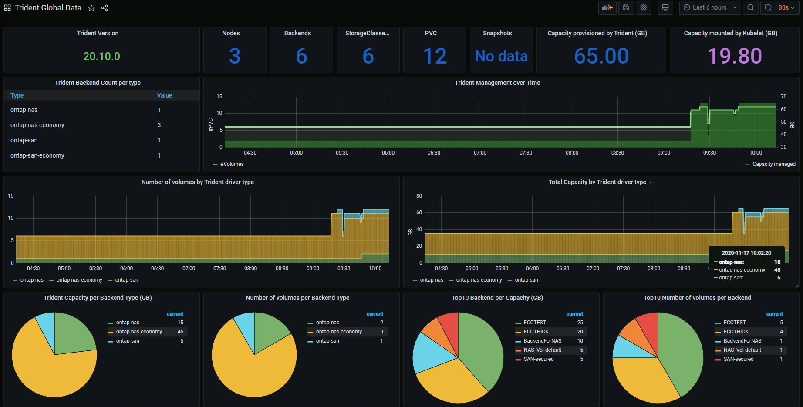

#########################################################################################
# SCENARIO 3: Update Monitoring configuration
#########################################################################################

**GOAL:**  
Now that the Prometheus Operator has been upgraded, we can connect to Grafana.  

## A. Log in Grafana

The _monitoring_ namespaces has plenty of different services. Let's see how to access the Grafana dashboard:

```bash
$ kubectl get -n monitoring svc grafana-dashboard
NAME                   TYPE       CLUSTER-IP       EXTERNAL-IP   PORT(S)          AGE
grafana-dashboard      NodePort   10.98.255.49     <none>        3000:30267/TCP   71d
```

This service is exposed via a NodePort method, on the port 30267.  
The first time you enter Grafana, you are requested to login with a username & a password ...
But how to find out what they are ??

Let's look at the pod definition, maybe there is a hint there...

```bash
$ kubectl get pod -n monitoring -l app.kubernetes.io/name=grafana
NAME                                     READY   STATUS    RESTARTS   AGE
prom-operator-grafana-7d99d7985c-98qcr   3/3     Running   0          2d23h

$ kubectl describe pod prom-operator-grafana-7d99d7985c-98qcr -n monitoring
...
    Environment:
      GF_SECURITY_ADMIN_USER:      <set to the key 'admin-user' in secret 'prom-operator-grafana'>      Optional: false
      GF_SECURITY_ADMIN_PASSWORD:  <set to the key 'admin-password' in secret 'prom-operator-grafana'>  Optional: false
...
```

Let's check what secrets there are in this cluster

```bash
$ kubectl get secrets -n monitoring -l app.kubernetes.io/name=grafana
NAME                    TYPE     DATA   AGE
prom-operator-grafana   Opaque   3      2d23h

$ kubectl describe secrets -n monitoring prom-operator-grafana
Name:         prom-operator-grafana
...
Data
====
admin-password:  13 bytes
admin-user:      5 bytes
...
```

OK, so the data is there, and is encrypted... However, the admin can retrieve this information

```bash
$ kubectl get secret -n monitoring -l app.kubernetes.io/name=grafana -o jsonpath="{.data.admin-user}" | base64 --decode ; echo
admin

$ kubectl get secret -n monitoring -l app.kubernetes.io/name=grafana -o jsonpath="{.data.admin-password}" | base64 --decode ; echo
prom-operator
```

There you go!
You can now properly login to Grafana.

## B. Create your own graph

Hover on the '+' on left side of the screen, then 'New Dashboard', 'New Panel' & 'Add Query'.
You can here configure a new graph by adding metrics. By typing 'trident' in the 'Metrics' box, you will see all metrics available.

## C. Import a graph

There are several ways to bring dashboards into Grafana.  

*Manual Import*  
Hover on the '+' on left side of the screen, then 'New Dashboard' & 'Import'.
Copy & paste the content of the _trident_dashboard_20_07.json_ file you can find in the Dashboard directory.  
The _issue_ with this method is that if the Grafana POD restarts, the dashboard will be lost...  

*Persistent Dashboard*  
The idea here would be to create a ConfigMap pointing to the Trident dashboard json file.

```bash
$ kubectl create configmap -n monitoring cm-trident-dashboard-dir --from-file=Dashboards/
configmap/tridentdashboard created

$ kubectl label configmap -n monitoring cm-trident-dashboard-dir grafana_dashboard=1
configmap/tridentdashboard labeled
```

When Grafana starts, it will automatically load every configmap that has the label _grafana_dashboard_.  
In the Grafana UI, you will find the dashboard in its own_Trident_ folder.  

Now, where can you find this dashboard:

- Hover on the 'Dashboard' icon on the left side bar (it looks like 4 small squares)  
- Click on the 'Manage' button  
- You then access a list of dashboards. You can either research 'Trident' or find the link be at the bottom of the page  

<p align="center"></p>

Your turn to have fun!

## D. What's next

OK, you have everything to monitor Trident, let's continue with the creation of some backends :

- [Scenario05](../../Scenario05): Configure your first iSCSI backends & storage classes  
- [Scenario10](../../Scenario10): Using Virtual Storage Pools  
- [Scenario13](../../Scenario13): Dynamic export policy management  

Or go back to the [FrontPage](https://github.com/YvosOnTheHub/LabNetApp)