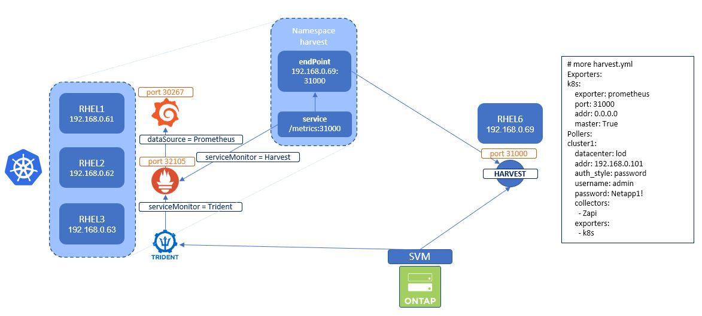

#########################################################################################
# SCENARIO 4: Integrating with NetApp Harvest
#########################################################################################

NetApp Harvest 2.0 is the swiss-army knife for monitoring datacenters. The default package collects performance,capacity and hardware metrics from ONTAP clusters. New metrics can be collected by editing theconfig files. Metrics can be delivered to multiple databases - Prometheus, InfluxDB and Graphite -and displayed in Grafana dashboards.
In the context of Kubernetes, you could use performance metrics gathered by Harvest & create neat dashboards in Grafana with regards to Persistent Volumes.

The scenario will not guide you in the installation of Harvest. However, we are going to see how to connect it to the Prometheur instance running in Kubernetes.  
Let's assume you have installed Harvest 2.0 on the host _rhel6_, with a prometheus exported exposed on the port _31000_.  
The file _Harvest.yml.templ_ can be used to configure Harvest to work on this lab.

As Harvest does not work as a containerized application, we will create the following objects so that Prometheus can retrieve metrics from Harvest:

- **NameSpace**: tenant that will host the EndPoint & Service
- **EndPoint**: Kubernetes object that specifies the address of the Prometheus exporter exposed by Harvest
- **Service**: Kubernetes object that describes how to access the metrics (port)
- **ServiceMonitor**: Prometheus object that specifies what Service to monitor & with what frequency

<p align="center"></p>

```bash
$ kubectl create -f Harvest_in_Kubernetes.yaml
namespace/harvest created
endpoints/harvest-metrics created
service/harvest-metrics created
servicemonitor.monitoring.coreos.com/harvest-metrics created
```

If all went well, you should see a new _Target_ showing up in Prometheus, with a status _UP_.  

<p align="center"></p>
