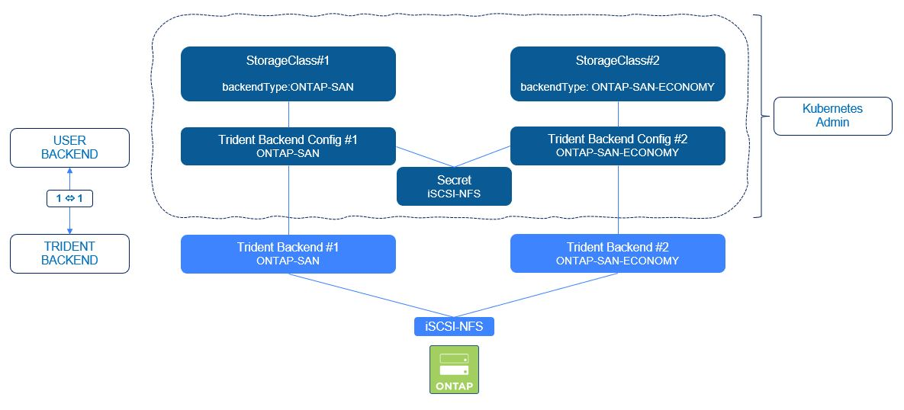

#########################################################################################
# SCENARIO 5: Create your first SAN backends 
#########################################################################################

**GOAL:**  
You understood how to create backends and what they are for.  
You probably also created a few ones with NFS drivers.  
It is now time to add more backends that can be used for block storage.  

<p align="center"></p>

## A. Create your first SAN backends

Trident 21.04 introduced the possibility to manage Trident backends directly with _kubectl_, whereas it was previously solely feasible with _tridentctl_.  
Managing backends this way is done with 2 different objects:

- **Secrets** which contain the credentials necessary to connect to the storage (login/pwd or certificate)
- **TridentBackendConfig** which is a new CRD that contains all the parameters related to this backend.

Note that _secrets_ can be used by multiple _TridentBackendConfigs_.

You will find in this directory a few backends files, both using the secret stored in the file _secret_ontap_iscsi-svm_username.yaml_:

- backend-san-secured.yaml        ONTAP-SAN
- backend-san-eco-default.yaml    ONTAP-SAN-ECONOMY  

You can decide to use all of them, only a subset of them or modify them as you wish

:boom: **Here is an important statement if you are planning on using these drivers in your environment.** :boom:  
The **default** is to use **all data LIF** IPs from the SVM and to use **iSCSI multipath**.  
Specifying an IP address for the **dataLIF** for the ontap-san* drivers forces the driver to **disable** multipath and use only the specified address.  

If you take a closer look to both json files, you will see that the parameter dataLIF has not been set, therefore enabling multipathing.  

```bash
$ kubectl create -n trident -f secret_ontap_iscsi-svm_username.yaml
secret/ontap-iscsi-svm-secret-username created
$ kubectl create -n trident -f backend_san-secured.yaml
tridentbackendconfig.trident.netapp.io/backend-tbc-ontap-san-secured created
$ kubectl create -n trident -f backend_san-eco.yaml
tridentbackendconfig.trident.netapp.io/backend-tbc-ontap-san-eco created

$ kubectl get -n trident tbc
NAME                                BACKEND NAME      BACKEND UUID                           PHASE   STATUS
backend-tbc-ontap-san-eco           san-eco           bd08f241-5ffe-4a8c-96fa-3d1113d3ea5d   Bound   Success
backend-tbc-ontap-san-secured       san-secured       6f6aa3da-0f00-4c6a-be93-8719beec4d2a   Bound   Success

$ kubectl get -n trident tbe
NAME        BACKEND           BACKEND UUID
tbe-n6tfq   san-secured       6f6aa3da-0f00-4c6a-be93-8719beec4d2a
tbe-xd75q   san-eco           bd08f241-5ffe-4a8c-96fa-3d1113d3ea5d

$ tridentctl -n trident get backend
+-----------------+-------------------+--------------------------------------+--------+---------+
|      NAME       |  STORAGE DRIVER   |                 UUID                 | STATE  | VOLUMES |
+-----------------+-------------------+--------------------------------------+--------+---------+
| san-eco         | ontap-san-economy | bd08f241-5ffe-4a8c-96fa-3d1113d3ea5d | online |       0 |
| san-secured     | ontap-san         | 6f6aa3da-0f00-4c6a-be93-8719beec4d2a | online |       0 |
+-----------------+-------------------+--------------------------------------+--------+---------+
```

A few things to notice:

- even though the backends were created with _kubectl_, you can see them with _tridentctl_
- all backend modifications must be applied to the _trident backend config_ objects, not the _trident backend_ ones.

## B. Create storage classes pointing to each new backend

You will also find in this directory a few storage class files.
You can decide to use all of them, only a subset of them or modify them as you wish.  

You will notice an _mountOption_ called _discard_ in these storage classes. This is used to allow -Space Reclamation_ from the underlying OS.  

```bash
$ kubectl create -f sc-csi-ontap-san.yaml
storageclass.storage.k8s.io/storage-class-san created

$ kubectl create -f sc-csi-ontap-san-eco.yaml
storageclass.storage.k8s.io/storage-class-san-economy created
```

If you have configured Grafana, you can go back to your dashboard, to check what is happening (cf http://192.168.0.63:30267).

## C. Validate the CHAP configuration on the storage backend

If you take a closer look at the SAN-secured definition file, you will see a bunch of parameter related to bidirectional CHAP, which will add authenticated iSCSI connections.  
You can learn more about it on the following link:  
https://netapp-trident.readthedocs.io/en/stable-v20.10/kubernetes/operations/tasks/backends/ontap/ontap-san/bidir-ontap-chap.html

You can check that the CHAP configuration has been set correctly with the following command (password: Netapp1!)

```bash
# ssh -l admin 192.168.0.101 iscsi security show
Password:
                                  Auth   Auth CHAP Inbound CHAP  Outbound CHAP
Vserver    Initiator Name         Type   Policy    User Name     User Name
---------- ---------------------- ------ --------- ------------- -------------
svm1       default                CHAP   local     tridentchap   tridenttarget
```

You find here both usernames set in the backend parameters.  
Now, you can only see the CHAP configuraion on the host once a POD has mounted a PVC, which you will do in the Scenario07.

## D. What's next

Now, you have some SAN Backends & some storage classes configured. You can proceed to the creation of a stateful application:  

- [Scenario06](../Scenario06): Deploy your first app with Block storage  

Or go back to the [FrontPage](https://github.com/YvosOnTheHub/LabNetApp)