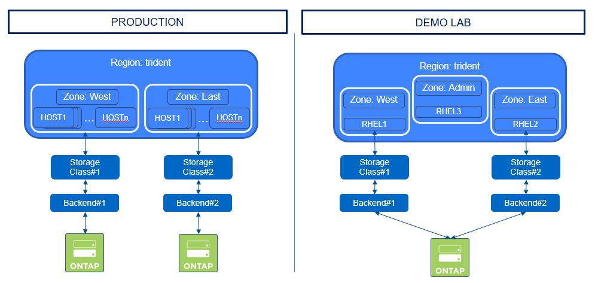

#########################################################################################
# SCENARIO 15: CSI Topology
#########################################################################################

**GOAL:**  
Trident 20.10 introduced the support of the CSI Topology feature. This scenario will guide you in the Trident configuration with regards to topology.  
Some details about it:

- Kubernetes details: https://kubernetes-csi.github.io/docs/topology.html
- Trident details: https://netapp-trident.readthedocs.io/en/stable-v20.10/kubernetes/operations/tasks/volumes/topology.html

This feature allows you to segment nodes of a Kubernetes cluster into sub-groups, so that you can manage:
- their location (Rack#1 vs Rack#2, Zone#1 vs Zone#2, DC#1 vs DC#2...)
- their target use (Production vs Dev)
- ...

In a real environment, you will probably use a different storage platform in each zone. To simplify the configuration of this scenario, we will use the same storage backend to host volumes from both zones, while using different prefixes, in order to simulate having two different zones or datacenters.

<p align="center"></p>

We are going to create two new backends, each one pointing to a different region.

```bash
$ tridentctl -n trident create backend -f backend_west.json
+----------+----------------+--------------------------------------+--------+---------+
|   NAME   | STORAGE DRIVER |                 UUID                 | STATE  | VOLUMES |
+----------+----------------+--------------------------------------+--------+---------+
| nas-west | ontap-nas      | b835bcff-d77b-4f55-855d-cc5930256ae4 | online |       0 |
+----------+----------------+--------------------------------------+--------+---------+

$ tridentctl -n trident create backend -f backend_east.json
+----------+----------------+--------------------------------------+--------+---------+
|   NAME   | STORAGE DRIVER |                 UUID                 | STATE  | VOLUMES |
+----------+----------------+--------------------------------------+--------+---------+
| nas-east | ontap-nas      | b7a3b13c-28af-42fc-a0fc-493143749814 | online |       0 |
+----------+----------------+--------------------------------------+--------+---------+
```

We can now also create Kubernetes Storage Classes that will point to each Trident Backend

```bash
$ kubectl create -f sc_west.yaml
storageclass.storage.k8s.io/sc-topology-west created

$ kubectl create -f sc_east.yaml
storageclass.storage.k8s.io/sc-topology-east created

$ kubectl get sc
NAME                          PROVISIONER             RECLAIMPOLICY   VOLUMEBINDINGMODE      ALLOWVOLUMEEXPANSION   AGE
sc-topology-east              csi.trident.netapp.io   Delete          Immediate              false                  6s
sc-topology-west              csi.trident.netapp.io   Delete          WaitForFirstConsumer   false                  6m39s
```

You will also notice that these is a specific optional parameter in the WEST storage classes: **volumeBindingMode** set to _WaitForFirstConsumer_ (default value: _Immediate_).  
This means that the PVC will not be created until referenced in a POD.  

Let's use a specific namespace for this scenario:  

```bash
$ kubectl create ns topology
namespace/topology created
```

This directory contains 2 sets of PVC/POD, one for each region. Let's start by creating the PVC:

```bash
$ kubectl create -n topology -f pvc_east.yaml
persistentvolumeclaim/pvc-east created

$ kubectl create -n topology -f pvc_west.yaml
persistentvolumeclaim/pvc-west created

$ kubectl get pvc -n topology
NAME                               STATUS    VOLUME                                     CAPACITY   ACCESS MODES   STORAGECLASS        AGE
pvc-east                           Bound     pvc-d0a8aa71-840b-4248-92d6-850b680988a3   5Gi        RWX            sc-topology-east    6s
pvc-west                           Pending                                                                        sc-topology-west    2s

$ kubectl get pv
NAME                                       CAPACITY   ACCESS MODES   RECLAIM POLICY   STATUS   CLAIM                  STORAGECLASS        REASON   AGE
pvc-d0a8aa71-840b-4248-92d6-850b680988a3   5Gi        RWX            Delete           Bound    topology/pvc-east      sc-topology-east             72s
```

As you can see, the _west_ PVC has not yet been created, simply because of the _volumeBindingMode_ parameter set in the storage class.

```bash
$ kubectl describe -n topology pvc pvc-west | grep -C 3 Events
Access Modes:
VolumeMode:    Filesystem
Mounted By:    <none>
Events:
  Type    Reason                Age                  From                         Message
  ----    ------                ----                 ----                         -------
  Normal  WaitForFirstConsumer  56s (x142 over 36m)  persistentvolume-controller  waiting for first consumer to be created before binding
```

Let's create two applications. As expected:

- the **WEST** Pod should run on **Host1**
- the **EAST** Pod should run on **Host2**

```bash
$ kubectl create -n topology -f pod-centos-west.yaml
pod/centos-west created

$ kubectl create -n topology -f pod-centos-east.yaml
pod/centos-east created
```

Now that the PODs have been requested, you can also see that the PVC-WEST has been succesfully created.

```bash
$ kubectl get pvc -n topology
NAME         STATUS   VOLUME                                     CAPACITY   ACCESS MODES   STORAGECLASS        AGE
pvc-east     Bound    pvc-d0a8aa71-840b-4248-92d6-850b680988a3   5Gi        RWX            sc-topology-east    15h
pvc-west     Bound    pvc-f468c589-1a88-4393-a827-f6bd0b4c1902   5Gi        RWX            sc-topology-west    15h
```

Finally, let's check that our 2 PODs have been created on the right hosts, as expected:

```bash
$ kubectl get pod -n topology -o wide
NAME             READY   STATUS    RESTARTS   AGE     IP          NODE    NOMINATED NODE   READINESS GATES
centos-east      1/1     Running   0          97s     10.44.0.8   rhel2   <none>           <none>
centos-west      1/1     Running   0          92s     10.36.0.5   rhel1   <none>           <none>
```

=> Tadaaaa!

## Cleanup the environment

```bash
$ kubectl delete namespace topology
namespace "topology" deleted
```

## What's next

You can go back to the [FrontPage](https://github.com/YvosOnTheHub/LabNetApp)