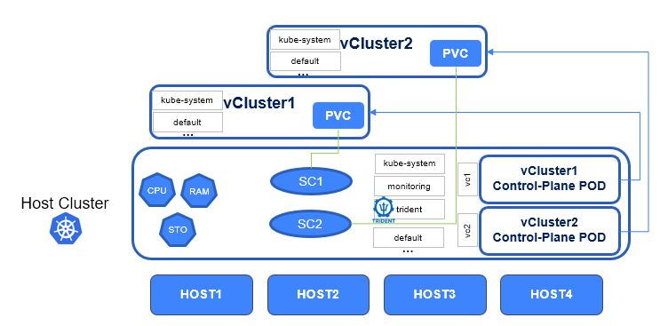

#########################################################################################
# SCENARIO 21: Persistent Volumes and virtual clusters.
#########################################################################################

Managing Kubernetes with multiple teams, projects, applications, use cases or environments can quickly become cumbersome, especially if each one of these requires its own cluster...  

Now, is a dedicated Kubernetes really necessary? Think about it for a second!  

Maybe the reasons for requesting or building new clusters are valid, however, maybe you don't have the resources to provide new clusters, nor the time, even if it takes juste a few minutes...  

Now, what if the end user THINKS he has a dedicated cluster, even though everything is just virtualized?  

Virtual Clusters (https://www.vcluster.com/) from https://loft.sh are quite an interesting piece of technology.  
They look & taste like real clusters, as you basically have access to everything (admin role, with your own set of APIs), but its construct reside in the namespace of an underlying Kubernetes cluster.

This has many advantages, especially when you dig into all the options you have at hand

- speed of deployment or retirement of a vCluster (just a few seconds, litteraly)
- resource management done in the underlying Kubernetes cluster (choose how many nodes you will run onto, quotas & limits management, ...)
- isolation (with pod security)
- ...

When it comes to storage management, especially in the K8S-aaS context, often comes on the table the question of who will manage the storage & how...  
Trident is fully integrated into Kubernetes, which is great, however some dont want to give access to the Trident configuration to the end-user.  

vClusters could definitely help:

- The storage class is managed by default on the underlying cluster, and can optionally be customized at the vCluster level
- Trident being part of the underlying cluster cannot be modified by the end-user
- Resource Quotas & LimitRanges can be applied to a vCluster to control storage consumption by the Kubernetes admin

Let's see this in action! We are going to create 2 vClusters in this environment:

<p align="center"></p>

## A. PreRequisites

In order to best benefit from this experiment, you will first need to:

- Install MetalLB: cf [Addenda05](../../Addendum/Addenda05)
- Add an extra node to the Kubernetes cluster: cf [Addenda01](../../Addendum/Addenda01)

With 4 nodes, your cluster will look the following:

```bash
$ kubectl get nodes -o wide
NAME    STATUS   ROLES    AGE     VERSION   INTERNAL-IP    EXTERNAL-IP   OS-IMAGE                                      KERNEL-VERSION          CONTAINER-RUNTIME
rhel1   Ready    <none>   596d    v1.18.6   192.168.0.61   <none>        Red Hat Enterprise Linux Server 7.5 (Maipo)   3.10.0-862.el7.x86_64   docker://18.9.1
rhel2   Ready    <none>   596d    v1.18.6   192.168.0.62   <none>        Red Hat Enterprise Linux Server 7.5 (Maipo)   3.10.0-862.el7.x86_64   docker://18.9.1
rhel3   Ready    master   596d    v1.18.6   192.168.0.63   <none>        Red Hat Enterprise Linux Server 7.5 (Maipo)   3.10.0-862.el7.x86_64   docker://18.9.1
rhel4   Ready    <none>   3d19h   v1.18.6   192.168.0.64   <none>        Red Hat Enterprise Linux Server 7.5 (Maipo)   3.10.0-862.el7.x86_64   docker://18.9.1
```

If you have not yet read the [Addenda08](../../Addendum/Addenda08) about the Docker Hub management, it would be a good time to do so.  
Also, if no action has been made with regards to the container images, you can find a shell script in this directory _scenario21_pull_images.sh_ to pull images utilized in this scenario if needed. It uses 2 parameters, your Docker Hub login & password:

```bash
sh scenario21_pull_images.sh my_login my_password
```

## B. Storage Configuration

Let's create two new Trident backends associated with specific storage classes, so that we can demonstrate how the Kubernetes admin can control the storage consumption of a vCluster

```bash
$ kubectl create -n trident -f trident_ontap_credentials.yaml
secret/sc21_credentials created

$ kubectl create -n trident -f trident_backend_vc1.yaml
tridentbackendconfig.trident.netapp.io/backend-vc1 created

$ kubectl create -n trident -f trident_backend_vc2.yaml
tridentbackendconfig.trident.netapp.io/backend-vc2 created

$ kubectl create -f sc-vc1.yaml
storageclass.storage.k8s.io/sc-vc1 created

$ kubectl create -f sc-vc2.yaml
storageclass.storage.k8s.io/sc-vc2 created
```

## C. Install vCluster

This is really the easiest thing ever... In short, download & use:

```bash
curl -s -L "https://github.com/loft-sh/vcluster/releases/latest" | sed -nE 's!.*"([^"]*vcluster-linux-amd64)".*!https://github.com\1!p' | xargs -n 1 curl -L -o vcluster && chmod +x vcluster;
mv vcluster /usr/local/bin
```

To get more information, you can refer to https://www.vcluster.com/docs/getting-started/setup 

## D. Create vClusters

Virtual clusters can be created on one node (default behavior), a subset of Kubernetes nodes (based on labels), or on all of them.  
We will create labels to use the second method:

```bash
$ kubectl label node rhel1 "vcluster1=true"
node/rhel1 labeled
$ kubectl label node rhel2 "vcluster1=true"
node/rhel2 labeled
$ kubectl label node rhel2 "vcluster2=true"
node/rhel2 labeled
$ kubectl label node rhel3 "vcluster2=true"
node/rhel3 labeled
```

We are now ready to create 2 virtual clusters !  
The admin can deeply customize the setup of the vClusters through the use of a parameter YAML file.  
In my case, I have specified a resource limit for the Control Planes & the labels to look for on the nodes.  

```bash
$ vcluster create vcluster-1 -n vc1 -f ~/LabNetApp/Kubernetes_v4/Scenarios/Scenario21/vcluster_vc1.yaml --expose
[info]   Creating namespace vc1
[info]   execute command: helm upgrade vcluster-1 vcluster --repo https://charts.loft.sh --version 0.7.1 --kubeconfig /tmp/918707822 --namespace vc1 --install --repository-config='' --values /tmp/3715143884 --values vcluster_vc1.yaml
[done] √ Successfully created virtual cluster vcluster-1 in namespace vc1.
- Use 'vcluster connect vcluster-1 --namespace vc1' to access the virtual cluster
- Use 'vcluster connect vcluster-1 --namespace vc1 -- kubectl get ns' to run a command directly within the vcluster

$ vcluster create vcluster-2 -n vc2 -f ~/LabNetApp/Kubernetes_v4/Scenarios/Scenario21/vcluster_vc2.yaml --expose
[info]   Creating namespace vc2
[info]   execute command: helm upgrade vcluster-2 vcluster --repo https://charts.loft.sh --version 0.7.1 --kubeconfig /tmp/3188407328 --namespace vc2 --install --repository-config='' --values /tmp/950448126 --values vcluster_vc2.yaml
[done] √ Successfully created virtual cluster vcluster-2 in namespace vc2.
- Use 'vcluster connect vcluster-2 --namespace vc2' to access the virtual cluster
- Use 'vcluster connect vcluster-2 --namespace vc2 -- kubectl get ns' to run a command directly within the vcluster

$ vcluster list
 NAME         NAMESPACE   CREATED                         AGE
 vcluster-1   vc1         2022-04-01 08:05:40 +0000 UTC   5m38s
 vcluster-2   vc2         2022-04-01 08:08:24 +0000 UTC   2m54s
```

I would recommend looking into how to connect to a vCluster to see the extent of what it possible: https://www.vcluster.com/docs/getting-started/connect.  
As there is a LoadBalancer configured, the IP address of the vCluster end-point will be automatically assigned.  
Also, let's create the kubeconfig files related to each vCluster:

```bash
$ vcluster connect vcluster-1 -n vc1 --kube-config ~/kubeconfig_vc1.yaml
[info]   Using vcluster vcluster-1 load balancer endpoint: 192.168.0.140
[info]   Use 'vcluster connect vcluster-1 -n vc1 -- kubectl get ns' to execute a command directly within this terminal
[done] √ Virtual cluster kube config written to: /root/kubeconfig_vc1.yaml. You can access the cluster via 'kubectl --kubeconfig /root/kubeconfig_vc1.yaml get namespaces'

$ vcluster connect vcluster-2 -n vc2 --kube-config ~/kubeconfig_vc2.yaml
[info]   Using vcluster vcluster-2 load balancer endpoint: 192.168.0.141
[info]   Use 'vcluster connect vcluster-2 -n vc2 -- kubectl get ns' to execute a command directly within this terminal
[done] √ Virtual cluster kube config written to: /root/kubeconfig_vc2.yaml. You can access the cluster via 'kubectl --kubeconfig /root/kubeconfig_vc2.yaml get namespaces'
```

After a few seconds, you should see all the vClusters pods in a running state:

```bash
$ kubectl get -n vc1 pod -o wide
NAME                                                READY   STATUS    RESTARTS   AGE   IP               NODE    NOMINATED NODE   READINESS GATES
coredns-cb89b564-fj6nx-x-kube-system-x-vcluster-1   1/1     Running   0          61m   192.168.24.68    rhel3   <none>           <none>
vcluster-1-0                                        2/2     Running   0          63m   192.168.24.131   rhel4   <none>           <none>

$ kubectl get -n vc2 pod -o wide
NAME                                                READY   STATUS    RESTARTS   AGE   IP               NODE    NOMINATED NODE   READINESS GATES
coredns-cb89b564-t6g2z-x-kube-system-x-vcluster-2   1/1     Running   0          47m   192.168.24.69    rhel3   <none>           <none>
vcluster-2-0                                        2/2     Running   0          47m   192.168.24.132   rhel4   <none>           <none>
```

The _vcluster_ pod is the "control plane" of your tenant, which runs K3S.  
You may wonder what the other POD is? It is the system POD running in the vCluster _kube-system_ namespace but viewed from a different perspective, directly on the host cluster in the vCluster namespace. In order to recognize the different resources on the host cluster, the following naming convention is applied: PODNAME-x-NAMESPACE-x-VCLUSTER

```bash
$ vcluster connect vcluster-1 --namespace vc1 -- kubectl get pod -A
NAMESPACE     NAME                     READY   STATUS    RESTARTS   AGE
kube-system   coredns-cb89b564-fj6nx   1/1     Running   0          3h50m
```

Our two vClusters are now up & running. Let's look closely at what we have here:

```bash
$ vcluster connect vcluster-1 --namespace vc1 -- kubectl get nodes -o wide
NAME    STATUS   ROLES    AGE     VERSION   INTERNAL-IP      EXTERNAL-IP   OS-IMAGE                                      KERNEL-VERSION          CONTAINER-RUNTIME
rhel1   Ready    <none>   60m     v1.18.6   10.103.188.115   <none>        Red Hat Enterprise Linux Server 7.5 (Maipo)   3.10.0-862.el7.x86_64   docker://18.9.1
rhel2   Ready    <none>   60m     v1.18.6   10.103.246.161   <none>        Red Hat Enterprise Linux Server 7.5 (Maipo)   3.10.0-862.el7.x86_64   docker://18.9.1

$ vcluster connect vcluster-1 --namespace vc1 -- kubectl get namespaces
NAME              STATUS   AGE
default           Active   45m
kube-system       Active   45m
kube-public       Active   45m
kube-node-lease   Active   45m

$ vcluster connect vcluster-1 --namespace vc1 -- kubectl get svc -A
NAMESPACE     NAME         TYPE        CLUSTER-IP      EXTERNAL-IP   PORT(S)                  AGE
default       kubernetes   ClusterIP   10.102.158.21   <none>        443/TCP                  45m
kube-system   kube-dns     ClusterIP   10.96.245.47    <none>        53/UDP,53/TCP,9153/TCP   45m

$ vcluster connect vcluster-1 --namespace vc1 -- kubectl get crd
NAME                              CREATED AT
addons.k3s.cattle.io              2022-04-01T08:06:06Z
helmcharts.helm.cattle.io         2022-04-01T08:06:06Z
helmchartconfigs.helm.cattle.io   2022-04-01T08:06:06Z

$ vcluster connect vcluster-1 --namespace vc1 -- kubectl get sc
No resources found in default namespace.
```

A few things to notice:

- It looks like a brand new K3S cluster
- There is no Trident resource in the vCluster, nor storage class, as these are managed directly from the underlying cluster
- From a vCluster standpoint, the nodes INTERNAL IP are different from the once you find using the _kubectl get nodes_ command on the underlying cluster

In order to create Persistent Volumes, the Kubernetes admin will have to provide the vCluster admin or the end-users with the right Storage Class to use.

## E. Use vClusters

The vCluster admin & end-users would be provided with their own kubeconfig file to use, which can be exported in the KUBECONFIG variable.  
In this lab, I will just use the parameter _--kubeconfig_ with the kubectl command in order to avoir juggling with multiple terminals.

As a vCluster admin, let's first check what we have:

```bash
$ kubectl --kubeconfig ~/kubeconfig_vc1.yaml get nodes -o wide
NAME    STATUS   ROLES    AGE   VERSION   INTERNAL-IP      EXTERNAL-IP   OS-IMAGE                                      KERNEL-VERSION          CONTAINER-RUNTIME
rhel1   Ready    <none>   59m   v1.18.6   10.103.188.115   <none>        Red Hat Enterprise Linux Server 7.5 (Maipo)   3.10.0-862.el7.x86_64   docker://18.9.1
rhel2   Ready    <none>   59m   v1.18.6   10.103.246.161   <none>        Red Hat Enterprise Linux Server 7.5 (Maipo)   3.10.0-862.el7.x86_64   docker://18.9.1
```

Let's install Ghost on this vCluster. For that, you can use the _ghost_vc1.sh_ file from the Ghost_vc1 directory.  
It will be installed in its own namespace called _ghostvc1_.  
Since this application's service is of LoadBalancer type, the script retrieves the IP address & sets in the pod.

```bash
$ sh ~/LabNetApp/Kubernetes_v4/Scenarios/Scenario21/Ghost_vc1/ghost_vc1.sh
namespace/ghostvc1 created
persistentvolumeclaim/blog-content-vc1 created
service/blog-vc1 created
deployment.apps/blog-vc1 created

$ kubectl --kubeconfig ~/kubeconfig_vc1.yaml -n ghostvc1 get svc,pod,pvc
NAME               TYPE           CLUSTER-IP      EXTERNAL-IP     PORT(S)        AGE
service/blog-vc1   LoadBalancer   10.98.133.177   192.168.0.142   80:31291/TCP   91s

NAME                            READY   STATUS    RESTARTS   AGE
pod/blog-vc1-768464bb45-qtg78   1/1     Running   0          90s

NAME                                     STATUS   VOLUME                                     CAPACITY   ACCESS MODES   STORAGECLASS   AGE
persistentvolumeclaim/blog-content-vc1   Bound    pvc-1e6211a9-a201-4523-8e5a-bf0386132dc8   5Gi        RWX            sc-vc1         91s
```

You can now connect to the IP address provided to the Ghost service by the LoadBalancer in order to use this app (192.168.0.142 in this example).  
Let's see what corresponding resources we have on the underlying cluster:

```bash
$ kubectl get -n vc1 pod,svc,pvc -l vcluster.loft.sh/namespace=ghostvc1
NAME                                                    READY   STATUS    RESTARTS   AGE
pod/blog-vc1-768464bb45-qtg78-x-ghostvc1-x-vcluster-1   1/1     Running   0          5m16s

NAME                                       TYPE           CLUSTER-IP      EXTERNAL-IP     PORT(S)        AGE
service/blog-vc1-x-ghostvc1-x-vcluster-1   LoadBalancer   10.98.133.177   192.168.0.142   80:31291/TCP   5m17s

NAME                                                             STATUS   VOLUME                                     CAPACITY   ACCESS MODES   STORAGECLASS   AGE
persistentvolumeclaim/blog-content-vc1-x-ghostvc1-x-vcluster-1   Bound    pvc-1e6211a9-a201-4523-8e5a-bf0386132dc8   5Gi        RWX            sc-vc1         5m17s
```

Here again we see the same resources, but from a different perspective & with a different naming convention.  
The vCluster2 could also decide to deploy Ghost (with the script ghost_vc1.sh in the Ghost_vc2 folder).

<p align="center"></p>

## F. Clean up

Deleting the vClusters is pretty straight forward. Note that all resources created within the vCluster will also be deleted:

```bash
$ vcluster delete vcluster-1 -n vc1 --delete-namespace
[info]   Delete helm chart with helm delete vcluster-1 --namespace vc1 --kubeconfig /tmp/3587168754 --repository-config=''
[done] √ Successfully deleted virtual cluster vcluster-1 in namespace vc1
[done] √ Successfully deleted virtual cluster pvc data-vcluster-1-0 in namespace vc1
[done] √ Successfully deleted virtual cluster namespace vc1

$ vcluster delete vcluster-2 -n vc2 --delete-namespace
[info]   Delete helm chart with helm delete vcluster-2 --namespace vc2 --kubeconfig /tmp/799684953 --repository-config=''
[done] √ Successfully deleted virtual cluster vcluster-2 in namespace vc2
[done] √ Successfully deleted virtual cluster pvc data-vcluster-2-0 in namespace vc2
[done] √ Successfully deleted virtual cluster namespace vc2
```

## What's next

You can go back to the [FrontPage](https://github.com/YvosOnTheHub/LabNetApp)