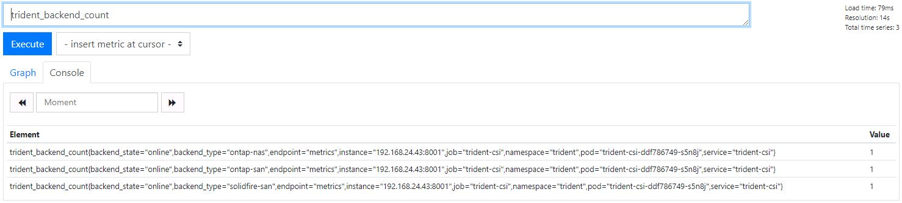

#########################################################################################
# SCENARIO 3.2: Navigate through Prometheus
#########################################################################################

**GOAL:**  
Discover how to connect to Prometheus & how to use it.  

## A. Check the configuration & understand how data is retrieved

How does Prometheus retrieve data from Trident?  
It uses the concept of **Service Monitor**. We can see that there are plenty already configured on this platform, and that one has been created for Trident.

```bash
$ kubectl get servicemonitor -n monitoring
NAME                                                 AGE
prometheus-kube-prometheus-apiserver                 34m
prometheus-kube-prometheus-coredns                   34m
prometheus-kube-prometheus-grafana                   34m
prometheus-kube-prometheus-kube-controller-manager   34m
prometheus-kube-prometheus-kube-etcd                 34m
prometheus-kube-prometheus-kube-proxy                34m
prometheus-kube-prometheus-kube-scheduler            34m
prometheus-kube-prometheus-kube-state-metrics        34m
prometheus-kube-prometheus-kubelet                   34m
prometheus-kube-prometheus-operator                  34m
prometheus-kube-prometheus-prometheus                34m
trident-sm                                           229d
```

Let's take a look at the specifications of the Trident Service Monitor:

```bash
$ kubectl describe -n monitoring servicemonitor trident-sm | grep -A 10 Spec
Spec:
  Endpoints:
    Interval:  15s
    Port:      metrics
  Job Label:   trident
  Namespace Selector:
    Match Names:
      trident
  Selector:
    Match Labels:
      App:  controller.csi.trident.netapp.io
```

Seems like it is looking for data every 15 seconds on a specific port called _metrics_, by using filters (_namespace_ & _label_).  
Let's look at the endpoint:

```bash
$ kubectl describe svc -n trident -l app=controller.csi.trident.netapp.io
Name:              trident-csi
Namespace:         trident
Labels:            app=controller.csi.trident.netapp.io
                   k8s_version=v1.22.3
                   trident_version=v22.10.0
Annotations:       <none>
Selector:          app=controller.csi.trident.netapp.io
Type:              ClusterIP
IP Family Policy:  SingleStack
IP Families:       IPv4
IP:                10.107.245.80
IPs:               10.107.245.80
Port:              https  34571/TCP
TargetPort:        8443/TCP
Endpoints:         192.168.24.197:8443
Port:              metrics  9220/TCP
TargetPort:        8001/TCP
Endpoints:         192.168.24.197:8001
Session Affinity:  None
Events:            <none>
```

There you go. Trident only has one service with several ports exposed, one of them called _metrics_.  
You can verify if you can get access these metrics by the using the _curl_ command:

```bash
$ curl -s 192.168.24.197:8001 | grep trident_backend_count
# HELP trident_backend_count The total number of backends
# TYPE trident_backend_count gauge
trident_backend_count{backend_state="online",backend_type="ontap-nas"} 1
trident_backend_count{backend_state="online",backend_type="ontap-nas-economy"} 1
```

Tadaaa! You now understand where the data comes from!

## B. Check the configuration

The _monitoring_ namespaces has plenty of different services. Let's see how to access the Prometheus dashboard:

```bash
$ kubectl get -n monitoring svc -l app=kube-prometheus-stack-prometheus
NAME                                    TYPE       CLUSTER-IP       EXTERNAL-IP   PORT(S)          AGE
prometheus-kube-prometheus-prometheus   NodePort   10.110.219.127   <none>        9090:32105/TCP   13h
```

This service is exposed via a NodePort method, on the port 32105.  
By using this port in your browser, you will notice you dont need any login.

On the browser in the LoD, you can now connect to the address http://192.168.0.63:32105 in order to access Prometheus
You can check that the Trident endpoint is taken into account & in the right state by going to the menu STATUS => TARGETS

<p align="center"></p>

In the _Graph_ page, you can start querying different metrics, from all objects monitored by Prometheus.  
If you type **tri** in the query box, you will see all the available metrics.  

Polling the _trident_backend_count_ metric will list all the backends configured in Trident:

<p align="center"></p>

You could also use more complex queries or even build graphs.  

## C. What's next

Let's see how to use [Grafana](../3_Grafana).