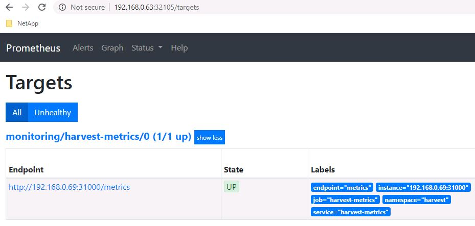

#########################################################################################
# SCENARIO 4: Integrating with NetApp Harvest
#########################################################################################

NetApp Harvest 2.0 is the swiss-army knife for monitoring datacenters. The default package collects performance,capacity and hardware metrics from ONTAP clusters. New metrics can be collected by editing theconfig files. Metrics can be delivered to multiple databases - Prometheus, InfluxDB and Graphite -and displayed in Grafana dashboards.
In the context of Kubernetes, you could use performance metrics gathered by Harvest & create neat dashboards in Grafana with regards to Persistent Volumes.

More information about Harvest can be found here: https://netapp.io/monitoring/

The scenario will guide you through the installation of Harvest on _rhel6_ (port _31000_)and how to connect it to the Prometheur instance running in Kubernetes.  
The file _harvest.yml_ in this repo can be used to configure Harvest to work on this lab.

Let's start by downloading Harvest & installing it (on _rhel6_):

```bash
$ cd
$ wget https://github.com/NetApp/harvest/releases/download/v.22.02.0/harvest-22.02.0-4_linux_amd64.tar.gz
$ tar -xvf harvest-22.02.0-4_linux_amd64.tar.gz
$ mv harvest*amd64 harvest
$ rm -f ~/harvest/harvest.yml
$ mv harvest.yml harvest/
$ cd harvest
$ bin/harvest start
Datacenter            Poller                PID        PromPort        Status
+++++++++++++++++++++ +++++++++++++++++++++ ++++++++++ +++++++++++++++ ++++++++++++++++++++
lod                   cluster1              9262       31000           running
+++++++++++++++++++++ +++++++++++++++++++++ ++++++++++ +++++++++++++++ ++++++++++++++++++++
```

To make sure your Harvest installation works, you can run the following:

```bash
$ curl 192.168.0.69:31000/metrics | grep volume_size_total
...
volume_size_total{datacenter="lod",cluster="cluster1",volume="import_san_flexvol",node="cluster1-01",svm="iscsi_svm",aggr="aggr2",style="flexvol"} 2040111104
volume_size_total{datacenter="lod",cluster="cluster1",volume="registry",node="cluster1-01",svm="nfs_svm",aggr="aggr1",style="flexvol"} 20401094656
volume_size_total{datacenter="lod",cluster="cluster1",volume="vol_import_manage",node="cluster1-01",svm="nfs_svm",aggr="aggr1",style="flexvol"} 2040111104
volume_size_total{datacenter="lod",cluster="cluster1",volume="vol_import_nomanage",node="cluster1-01",svm="nfs_svm",aggr="aggr1",style="flexvol"} 2040111104
...
```

As Harvest does not work as a containerized application in this scenario, we will create the following objects so that Prometheus can retrieve metrics from Harvest:

- **NameSpace**: tenant that will host the EndPoint & Service
- **EndPoint**: Kubernetes object that specifies the address of the Prometheus exporter exposed by Harvest
- **Service**: Kubernetes object that describes how to access the metrics (port)
- **ServiceMonitor**: Prometheus object that specifies what Service to monitor & with what frequency

<p align="center"></p>

```bash
$ kubectl create -f Harvest_in_Kubernetes.yaml
namespace/harvest created
endpoints/harvest-metrics created
service/harvest-metrics created
servicemonitor.monitoring.coreos.com/harvest-metrics created
```

If all went well, you should see a new _Target_ showing up in Prometheus, with a status _UP_.  

<p align="center"></p>

Last, Harvest comes with a predefined set of dashboards. If you would like to import them into this environment, I would recommend looking into the following link which also describes how to generate a API Token in Grafana, which will be used by Harvest:  
https://github.com/NetApp/harvest/blob/main/cmd/tools/grafana/README.md

As you will not need the ONTAP 7Mode dashboard, you can use the following command on the host RHEL6 to only import dashboards related to ONTAP 9:

```bash
$ cd ~/harvest
$ bin/grafana import -a "http://192.168.0.63:30267" --directory grafana/dashboards/cmode --serverfolder ONTAP9
using API token from config
connected to Grafana server (version: 8.3.1)
created Grafana folder [ONTAP9] - OK
...
OK - imported ONTAP9 / [harvest_dashboard_volume.json]
OK - imported ONTAP9 / [harvest_dashboard_volume_details.json]
Imported 15 dashboards to [ONTAP9] from [grafana/dashboards/cmode]
```
