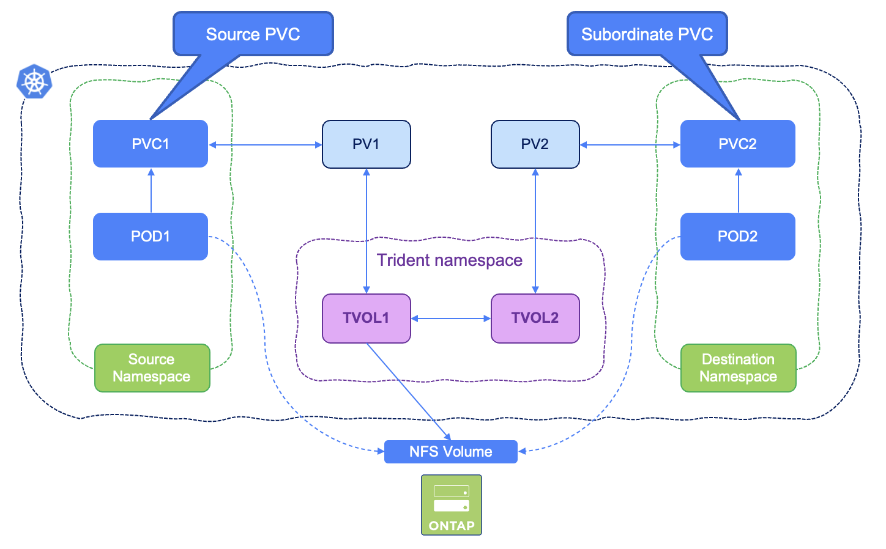

#########################################################################################
# SCENARIO 22: Sharing NFS volumes across namespaces
#########################################################################################

Have you ever wanted to share volumes between Kubernetes namespaces? You can now! Trident `v22.10` introduced cross-namespace volume access!  

This Kubernetes-native solution has the following benefits:
- Multiple levels of access control to ensure security
- Works with all Trident NFS volume drivers
- No reliance on tridentctl or any other non-native Kubernetes feature


This diagram illustrates NFS volume sharing across two Kubernetes namespaces:
<p align="center"></p>

## A. Set up the environment

#### First things first, ensure you are using version `22.10` of Trident

```sh
$ kubectl get tver -n trident
NAME      VERSION
trident   22.10.0
```
If you aren't, follow the steps in [Scenario01](../Scenario01) in order to upgrade to version `22.10`  

#### Ensure you have configured nas backend `nas-default` and storage-class `storage-class-nas` from [Scenario02](../Scenario02)  
```
$ kubectl get tbc -n trident
NAME                                BACKEND NAME      BACKEND UUID                           PHASE   STATUS
backend-tbc-ontap-nas-default       nas-default       1f5a1e30-5628-428f-9f63-4a68283b6c99   Bound   Success
s

$ kubectl get sc
NAME                          PROVISIONER             RECLAIMPOLICY   VOLUMEBINDINGMODE   ALLOWVOLUMEEXPANSION   AGE
storage-class-nas (default)   csi.trident.netapp.io   Delete          Immediate           true                   49m
```


## B. Create primary namespace, PVC and Pod
```bash
$ kubectl create -f primary.yaml
namespace/primary created
persistentvolumeclaim/primary-pvc created
pod/busybox-primary created
```
This will create the primary PVC and mount it into a busybox pod, in the `primary` namespace.

Notice the annotation `shareToNamespace` in `primary-pvc.yaml`, granting access to the volume from the `secondary` namespace
```yaml
  annotations:
    trident.netapp.io/shareToNamespace: secondary
```

Not setting this annotation would lead to the following error in the secondary namespace, when trying to mount a volume:
```yaml
csi.trident.netapp.io    subordinate volume source PVC is not shared with namespace secondary
csi.trident.netapp.io_trident-csi-xyz  failed to provision volume with StorageClass "storage-class-nas": rpc error: code = Unknown desc = subordinate volume source PVC is not shared with namespace secondary
```

 Confirm creations of resources with:

```
$ kubectl get pod,pvc -n primary
NAME                  READY   STATUS    RESTARTS   AGE
pod/busybox-primary   1/1     Running   0          41m

NAME                                STATUS   VOLUME                                     CAPACITY   ACCESS MODES   STORAGECLASS        AGE
persistentvolumeclaim/primary-pvc   Bound    pvc-988032b9-1fe7-4a5c-bf1c-371e17ee128e   10Gi      RWX            storage-class-nas   47m
```

Access the primary busybox pod shell and create a test file in the persistent volume:

```bash
$ kubectl exec -it busybox-primary -n primary  -- ls -ld /mnt/sharedvolume
drwxrwxrwx    2 99       99            4096 Nov 29 15:03 /mnt/sharedvolume

$ kubectl exec -it busybox-primary -n primary  -- sh -c 'echo "Testing cross-namespace volumes" > /mnt/sharedvolume/testfile.txt'

$ kubectl exec -it busybox-primary -n primary  -- more /mnt/sharedvolume/testfile.txt
Testing cross-namespace volumes
```

## C. Setup the secondary namespace

Create a TridentVolumeReference CR in the destination namespace that refers to the source namespace PVC.

```bash
$ kubectl create ns secondary
namespace/secondary created
$ kubectl create -f secondary-tvr.yaml
tridentvolumereference.trident.netapp.io/secondary-pvc created
$ kubectl get tvr -n secondary
NAME            AGE
secondary-pvc   33s
```

Create the secondary RWX PVC

```bash
$ kubectl create -f secondary-pvc.yaml
persistentvolumeclaim/secondary-pvc created
```

Notice the annotation `shareFromPVC` in `secondary-pvc.yaml`, referencing the source namespace and PVC:
```yaml
  annotations:
    trident.netapp.io/shareFromPVC: primary/primary-pvc
```

Check creation of resources with:
```bash
$ kubectl get pvc -n secondary
NAME            STATUS   VOLUME                                     CAPACITY   ACCESS MODES   STORAGECLASS        AGE
secondary-pvc   Bound    pvc-cb08a6a6-5520-4370-9244-71ee2ed2519c   10Gi       RWX            storage-class-nas   5s
```

Also notice with tridentctl that only one volume was created, but two PVCs: one of which is shown as `subordinate`
```
$ tridentctl get backend -n trident
+-----------------+-------------------+--------------------------------------+--------+---------+
|      NAME       |  STORAGE DRIVER   |                 UUID                 | STATE  | VOLUMES |
+-----------------+-------------------+--------------------------------------+--------+---------+
| nas-default     | ontap-nas         | a0a5f2f6-332e-4e48-b3bd-41b8873a8d2a | online |       1 |
+-----------------+-------------------+--------------------------------------+--------+---------+

$ tridentctl get volumes -n trident
+------------------------------------------+---------+-------------------+----------+--------------------------------------+-------------+---------+
|                   NAME                   |  SIZE   |   STORAGE CLASS   | PROTOCOL |             BACKEND UUID             |    STATE    | MANAGED |
+------------------------------------------+---------+-------------------+----------+--------------------------------------+-------------+---------+
| pvc-988032b9-1fe7-4a5c-bf1c-371e17ee128e | 10 GiB  | storage-class-nas | file     | a0a5f2f6-332e-4e48-b3bd-41b8873a8d2a | online      | true    |
| pvc-cb08a6a6-5520-4370-9244-71ee2ed2519c | 10 GiB  | storage-class-nas | file     | a0a5f2f6-332e-4e48-b3bd-41b8873a8d2a | subordinate | true    |
+------------------------------------------+---------+-------------------+----------+--------------------------------------+-------------+---------+
```

If the PVR was absent at the time of the creation of the PVC, you would see the following message in the PVC:
```yaml
Warning  ProvisioningFailed    1s (x4 over 55s)   csi.trident.netapp.io_trident-csi-xyz  failed to provision volume with StorageClass "storage-class-nas": rpc error: code = Unknown desc = volume reference secondary_primary/primary-pvc not found in cache
```


## D. Create Pod in the secondary namespace and mount the subordinate volume

```bash
$ kubectl create -f secondary-pod.yaml
pod/busybox-secondary created

$ kubectl get pods -n secondary
NAME                READY   STATUS    RESTARTS   AGE
busybox-secondary   1/1     Running   0          14s
```

Access the Pod shell, check the test file in the shared volume & try to write in the shared volume:
```bash
$ kubectl exec -it busybox-secondary -n secondary  -- ls -ld /mnt/sharedvolume
drwxrwxrwx    2 99       99            4096 Nov 29 15:08 /mnt/sharedvolume

$ kubectl exec -it busybox-secondary -n secondary  -- more /mnt/sharedvolume/testfile.txt
Testing cross-namespace volumes

$ kubectl exec -it busybox-secondary -n secondary  -- sh -c 'echo "Writing from the secondary namespace" >> /mnt/sharedvolume/testfile.txt'

$ kubectl exec -it busybox-secondary -n secondary  -- more /mnt/sharedvolume/testfile.txt
Testing cross-namespace volumes
Writing from the secondary namespace
```

**Voilà! we have demonstrated the use of cross-namespace Persistent Volumes with Trident!**

## E. Cleanup

```bash
kubectl delete ns secondary
kubeclt delete ns primary
```
