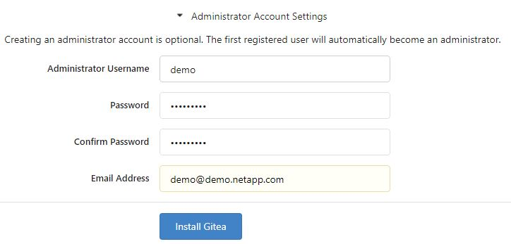
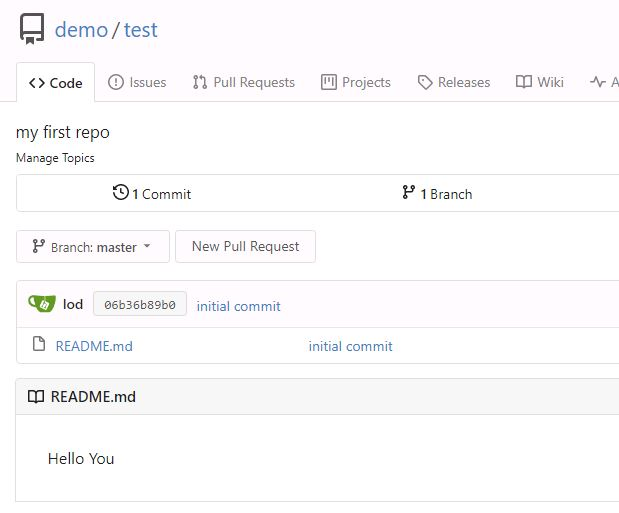
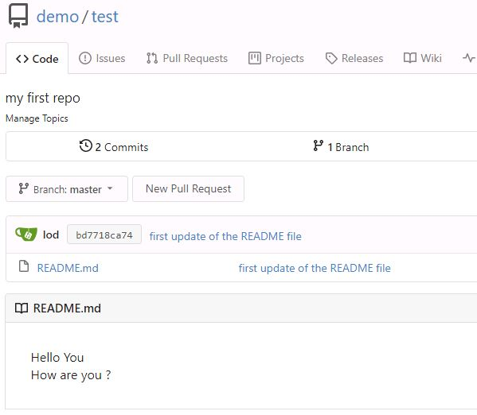

#########################################################################################
# ADDENDA 10: Set up a simple Source Code Repository
#########################################################################################

A source code management platform is a central piece for all developers & CI/CD environments.  
For this lab, I chose Gitea (https://gitea.io/), a lightweight SCR tool that I will install on the host RHEL4.  

## A. Gitea installation

We will install Gitea as a Docker service, with Docker Compose.  

First, once you are connected to RHEL5, retrieve locally this chapter:
```bash
cd
git clone --depth 1 --branch master --no-checkout https://github.com/YvosOnTheHub/LabNetApp.git
cd LabNetApp
git sparse-checkout set Kubernetes_v6/Addendum/Addenda11
git checkout
cd Kubernetes_v6/Addendum/Addenda11
```

If you have not yet read the [Addenda08](../Addenda08) about the Docker Hub management, it would be a good time to do so.  
Also, if no action has been made with regards to the container images, you can find a shell script in this directory *addenda11_pull_images.sh* to pull images utilized in this scenario if needed:  
```bash
sh addenda11_pull_images.sh
```

In order to build our Gitea application, we need to use the _podman-compose_ tool:
```bash
dnf install -y podman-compose
```

Podman compose will start 2 containers, one for the MySQL Database used by Gitea, one for the frontend.  
To connect to Gitea, you will need to use the following address: http://192.168.0.65:3000.  
If you prefer to use a FQDN (http://gitea.demo.netapp.com:3000) instead of the IP, remove the 3 _GITEA__server_ lines from the docker-compote.yml file & uncomment the ones related to the FQDN, after having updated the Domain (Alias: 192.168.0.65 = 'gitea'). Note that this whole page is described to work with the IP address.  
```bash
$ podman-compose up -d

$ podman ps
CONTAINER ID  IMAGE                          COMMAND               CREATED         STATUS         PORTS                                        NAMES
473214e43a74  docker.io/library/mysql:8.0.0  mysqld                32 seconds ago  Up 32 seconds                                               addenda11_db_1
d1ba524ea54b  docker.io/gitea/gitea:1.14.2   /bin/s6-svscan /e...  30 seconds ago  Up 30 seconds  0.0.0.0:222->22/tcp, 0.0.0.0:3000->3000/tcp  gitea
```

This will also create a bunch of folders & files, including Gitea's own init file.  
If you want to browse all the parameters, this file is located in the scenario subfolder: gitea/gitea/conf/app.ini  

The very first time you log into the Gitea UI, you will be asked to review the parameters (**no need to change anything**).  
For this demo, I would recommed creating an administrator account (demo/netapp123/demo@demo.netapp.com) which I will use for the rest of the lab.  
<p align="center"></p>

& voilà, your repository is ready to be used!

## B. Create a repository & how to use git

In order to store your code, you will need to create a new repository. This can be achieved through the UI, or simply by calling a REST API:  
```bash
$ curl -X POST "http://192.168.0.65:3000/api/v1/user/repos" -u demo:netapp123 -H "accept: application/json" -H "content-type: application/json" -d '{
  "name":"test",
  "description": "my first repo"
}'
```

Since we are going to use the command _git_ to interact with this repository, let's configure it with the following parameters:
```bash
git config --global user.email lod.demo.netapp.com
git config --global user.name "lod"
git config --global credential.helper store
git config --global alias.adcom '!git add -A && git commit -m'
git config --global push.default simple
```

The _credential_ parameter will store locally the username & password, while the _alias_ parameter creates a command that takes into account new files & commits them locally. You then still need to _push_ them to the Gitea repository. All these parameters are available in the _~/.gitconfig_ file.

Let's create a new folder with a small README file.  
```bash
cd
mkdir testrepo
cd testrepo
echo "Hello You  " >> README.md
```

The initial workflow with GIT is done in 3 steps (in this lab): initialization, add files, commit them locally.  
```bash
$ git init
Initialized empty Git repository in /root/testrepo/.git/
$ git add .
$ git commit -m "initial commit"
[master (root-commit) 06b36b8] initial commit
 1 file changed, 1 insertion(+)
 create mode 100644 README.md
```

The next step consists in sending the data to the Gitea repo. As it is the first time you connect to Gitea with git, you will be asked to enter some credentials (demo/netapp123). Those will be stored in the ~/.git-credentials file.  
```bash
git remote add origin http://192.168.0.65:3000/demo/test.git
git push -u origin master
```

Connecting to Gitea's UI, you can see some content in your repository !  
<p align="center"></p>

Let's modify the README file & go through the git process to update the repository (try out the git alias!).  
You will notice that this time, the credentials were not requested.  
```bash
echo "How are you ?" >> README.md
git adcom "first update of the README file"
git push
```

<p align="center"></p>

There you go, you are all set to use a Source Code Repository in the Lab on Demand.

<!-- GOOD TO HAVE
Retrieve a token for a specific user
curl -X POST -H "Content-Type: application/json"  -k -d '{"name":"token"}' -u demo:netapp123 http://192.168.0.64:3000/api/v1/users/demo/tokens
-->
