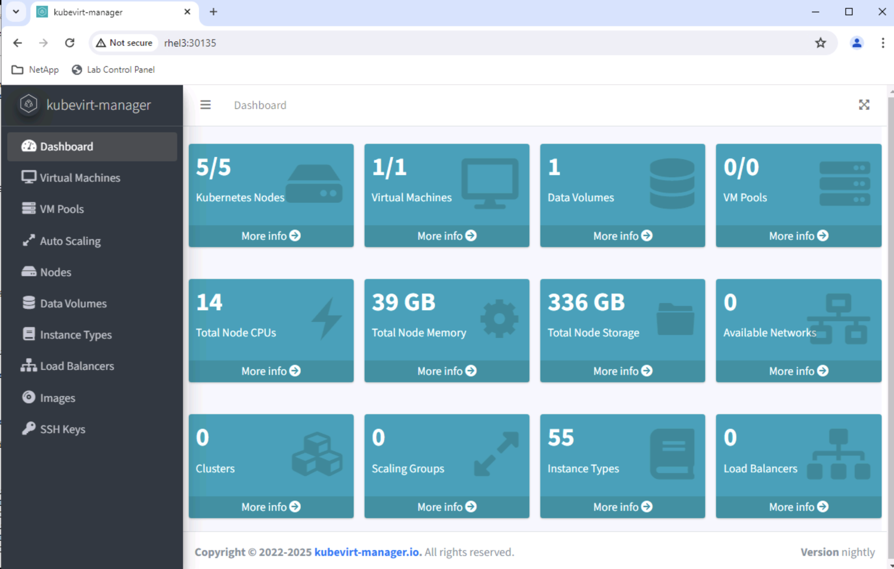

#########################################################################################
# ADDENDA 15: KubeVirt installation and configuration
#########################################################################################

KubeVirt allows you to run Virtual Machine inside Kubernetes.  
This can seem counter intuitive at first, especially since a lot of Kubernetes clusters still run inside Virtual Machines !  
Take an architecture, do a back flip & voilà!  

Why do I want to run VMs in Kubernetes?  
Probably the first question that comes mind...  

There are multiple ways to answer that:  
- build and manage only one platform to host both containerized applications and virtual machines, which may save costs  
- not all applications can be containerized  
- run in production both types of workloads on Kubernetes, while working on the modernization of the applications hosted in VMs  
- some big company may acquire a major player in virtualization and decide to change if only pricing, which pushed you to look for alternatives  
- ...  

Also, know that KubeVirt is part of the CNCF, listed as an incubating project.  

Last, if you want to automate the whole KubeVirt installation & configuration, you can use the *all_in_one.sh* scripts in this folder.  

## A. KubeVirt installation  
  
We are going to use an operator in this lab to install KubeVirt:  
```bash
kubectl create -f https://github.com/kubevirt/kubevirt/releases/download/v1.6.2/kubevirt-operator.yaml
```
This is going to create a KubeVirt deployment in its own namespace _kubevirt_, as well as a new CRD _kubevirts.kubevirt.io_.  
It is rather quick. When done, you can proceed with the creation of the KubeVirt CR:  
```bash
$ kubectl create -f https://github.com/kubevirt/kubevirt/releases/download/v1.6.2/kubevirt-cr.yaml
kubevirt.kubevirt.io/kubevirt created
```
It takes about 2 minutes to complete on the main Kubernetes cluster.  
Interestingly enough, there are plenty of new labels positioned on the worker nodes that list various features and configuration profiles used by KubeVirt to choose where to run Virtual Machines. You can take a look at the first node if you are interested:  
```bash
kubectl get node rhel1 -o yaml
```

## B. Nested virtualization  

The Lab on Demand is based on Virtual Machines. Hence, each Kubernetes node is already a VM.  
Running KubeVirt inside a VM is not possible by default, as usually you would deploy such product on a set of bare metal servers.  
However, you have the possibility to trick the system by enabling **nested virtualization**:  
```bash
$ kubectl -n kubevirt patch kubevirt kubevirt --type=merge --patch '{"spec":{"configuration":{"developerConfiguration":{"useEmulation":true}}}}'
kubevirt.kubevirt.io/kubevirt patched
```

## C. Virtctl installation

When it comes to Virtual Machines and Kubernetes, you can perform basic operations with _kubectl_.  
However, you may quickly opt for _virtctl_ which provides advanced features to interact with VMs; perfect example **console access**.  
Let's proceed with the installation of that tool on the control plane:  
```bash
wget https://github.com/kubevirt/kubevirt/releases/download/v1.6.2/virtctl-v1.6.2-linux-amd64
chmod +x virtctl-v1.6.2-linux-amd64
mv virtctl-v1.6.2-linux-amd64 /usr/local/bin/virtctl
```

## D. KubeVirt Feature Gates  

Not all KubeVirt features are mature enough to be enabled by default.  
Some of them need to be explicitly enabled through the Feature Gates mechanism.  

When you create a VM based on an image you download from Internet, it probably will come with a boot disk only.  
By default, you cannot attach other disks. In order to allow such operation, you also need to patch the KubeVirt configuration:  
```bash
$ kubectl -n kubevirt patch kubevirt kubevirt --type=merge \
  -p '{"spec":{"configuration":{"developerConfiguration":{"featureGates":["HotplugVolumes","DeclarativeHotplugVolumes"]}}}}'
kubevirt.kubevirt.io/kubevirt patched
```

**HotplugVolumes** and **DeclarativeHotplugVolumes** are both KubeVirt feature gates for attaching/detaching additional disks to running VMs, but they differ in how you use them:
- HotplugVolumes: Imperative (CLI/API) hotplug
- DeclarativeHotplugVolumes: Declarative (YAML/CRD) hotplug

With those features enabled, you can now create VM with multiple disks.

Growing a PVC is pretty straightforward.  
This is however possible only if the _allowVolumeExpansion_ feature is enabled in the corresponding storage class.  
That said, growing a PVC does not necesarily mean that the Virtual Machine mounting that disk will see the change.  
In some cases, you need to reboot the Virtual Machine, in order for the new size to be visible, after that, you can grow the partitions and filesystems. 
You can also enable the **ExpandDisks** feature gate, which tells the VM the underlying disk has changed size (but you still have to follow up with partition growth etc...):  
```bash
$ kubectl -n kubevirt patch kubevirt kubevirt --type=merge -p '{"spec":{"configuration":{"developerConfiguration":{"featureGates":["ExpandDisks"]}}}}'
kubevirt.kubevirt.io/kubevirt patched
```

## E. CDI (Container Data Importer)

>> Containerized-Data-Importer (CDI) is a persistent storage management add-on for Kubernetes. It's primary goal is to provide a declarative way to build Virtual Machine Disks on PVCs for Kubevirt VMs. More information here: https://github.com/kubevirt/containerized-data-importer

Creating a book disk can be achieved easily in a few steps:  
- create a PVC with the annotation _cdi.kubevirt.io/storage.upload.target: ""_
- this will trigger the launch of a _cdi-upload_ pod
- use virtcl image-upload to copy an image onto the PVC. 
- once the operation is done and successful, the _cdi-upload_ pod will be terminated

Installe the CDI is pretty straightforward. First deploy the operator in its own namespace _cdi_:  
```bash
kubectl create -f https://github.com/kubevirt/containerized-data-importer/releases/download/v1.63.1/cdi-operator.yaml
```
When done, you can create the CDI CR: 
```bash
$ kubectl create -f https://github.com/kubevirt/containerized-data-importer/releases/download/v1.63.1/cdi-cr.yaml
cdi.cdi.kubevirt.io/cdi created
```

Let's check the services exposed by CDI:  
```bash
$ kubectl get -n cdi svc
NAME                     TYPE           CLUSTER-IP       EXTERNAL-IP     PORT(S)         AGE
cdi-api                  ClusterIP      10.99.180.68     <none>          443/TCP         7m9s
cdi-prometheus-metrics   ClusterIP      10.101.138.171   <none>          8443/TCP        7m9s
cdi-uploadproxy          ClusterIP      10.106.151.29    <none>          443/TCP         7m9s
```

The _cdi-proxy_ service is used by virtctl to upload images. However, in its current configuration (_ClusterIP_) it cannot be reached outside of the Kubernetes cluster.  
An easy alternative in the lab is to first create an extra service that will fetch an IP address from the Load Balancer (_MetalLB_):  
```bash
cat << EOF | kubectl apply  -f -
apiVersion: v1
kind: Service
metadata:
  name: cdi-uploadproxy-lb
  namespace: cdi
spec:
  selector:
    cdi.kubevirt.io: cdi-uploadproxy
  ports:
    - port: 443
      targetPort: 8443
      protocol: TCP
  type: LoadBalancer
EOF
```
Once done, you can patch the cdi CR in order to modify the proxy address:  
```bash
CDILBDIP=$(kubectl -n cdi get svc cdi-uploadproxy-lb -o jsonpath="{.status.loadBalancer.ingress[0].ip}")
kubectl -n cdi patch cdi cdi --type merge -p "{\"spec\":{\"config\":{\"uploadProxyURLOverride\":\"https://$CDILBDIP:443\"}}}"
```

There you go, KubeVirt and CDI are both installed and ready to be used !

## F. KubeVirt Dashboard

You can manage the whole Virtual Machine lifecycle with cli.  
However, a GUI could be quite useful to improve your KubeVirt experience!  

Let's install the KubeVirt dashboard on the primary cluster:  
```bash
kubectl apply -f https://raw.githubusercontent.com/kubevirt-manager/kubevirt-manager/refs/tags/v1.5.3/kubernetes/bundled.yaml
```
After a couple of seconds, this dashboard will be available.  
However, by default its service is configured with a ClusterIP. In order to easily access it, we will change the service type to NodePort:  
```bash
kubectl -n kubevirt-manager patch svc kubevirt-manager --type='merge' -p '{"spec":{"type":"NodePort"}}'
```
You can now easily retrieve this port:  
```bash
$ kubectl get -n kubevirt-manager svc
NAME               TYPE       CLUSTER-IP       EXTERNAL-IP   PORT(S)          AGE
kubevirt-manager   NodePort   10.106.215.208   <none>        8080:30135/TCP   18h
```
In my example, connecting one of the Kubernetes nodes on the port 30135 will take me to the dashboard:  
<p align="center"></p>

## G. Install ORAS

In this lab, you have probably already used _podman_, _skopeo_ or even _docker_ to push and pull images from a registry.  
Registries can also contain other objects, such as Virtual Machines Qcow images.  
All those objects are refered as artifacts.  

In order to work with those artifacts, the 3 aforementioned tools may not be enough.  
That is where **oras** comes in the landscape of CNCF tools (https://oras.land/).  

Here are the steps to install Oras:  
```bash
cd
wget https://github.com/oras-project/oras/releases/download/v1.3.0/oras_1.3.0_linux_amd64.tar.gz -O /tmp/oras.tar.gz
tar -C /tmp/oras-extract -xzf /tmp/oras.tar.gz
mv /tmp/oras-extract/oras /usr/local/bin/oras
chmod +x /usr/local/bin/oras
rm -rf /tmp/oras-extract
```
Once installed, you can check that it works by running the following:  
```bash
$ oras version
Version:        1.3.0
Go version:     go1.25.0
OS/Arch:        linux/amd64
Git commit:     40530fe4c68e5825b868cd874bd46fc0cdd0f432
Git tree state: clean
```
Next, how to use it to push an image to the lab registry.  
Pretty straightforward. In the following example, let's imagine you already have locally an Alpine Linux Qcow2 image.  
You can just use the _oras push_ command to achieve your objective:  
```bash
oras login registry.demo.netapp.com  -u registryuser -p Netapp1!
oras push registry.demo.netapp.com/alpine-boot:qcow2 ./nocloud_alpine-3.22.1-x86_64-bios-tiny-r0.qcow2
```