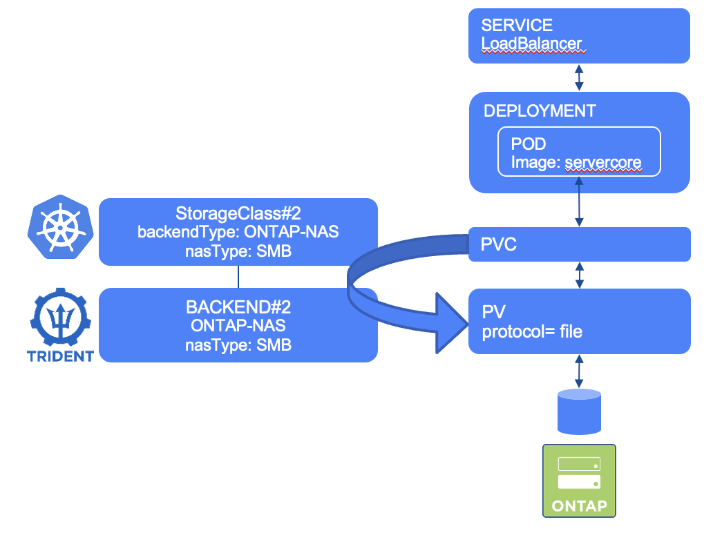
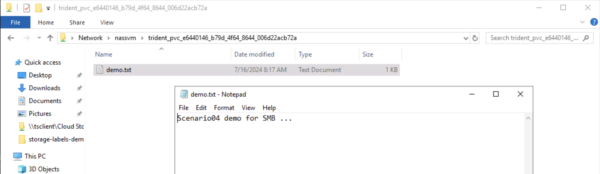

#########################################################################################
# SCENARIO 4: Create your first Application with a SMB PVC
#########################################################################################  

For this demo, we are going to use a Windows Server image that also includes Powershell.  
<p align="center"></p>

## A. Create the app

We will create this app in its own namespace (also very useful to clean up everything).  
We consider that the ONTAP-NAS backend & storage class have already been created. ([cf Scenario02](../../Scenario02))  
```bash
$ kubectl create -f Webserver/
namespace/webserver created
persistentvolumeclaim/pvc-smb created
secret/smbcreds created
service/win-webserver created
deployment.apps/win-webserver created

$ kubectl get -n webserver all,pvc,secret
NAME                                 READY   STATUS    RESTARTS   AGE
pod/win-webserver-85db4d6cdd-dq4d5   1/1     Running   0          2m27s

NAME                    TYPE           CLUSTER-IP       EXTERNAL-IP     PORT(S)        AGE
service/win-webserver   LoadBalancer   10.107.254.231   192.168.0.212   80:30522/TCP   2m27s

NAME                            READY   UP-TO-DATE   AVAILABLE   AGE
deployment.apps/win-webserver   1/1     1            1           2m27s

NAME                                       DESIRED   CURRENT   READY   AGE
replicaset.apps/win-webserver-85db4d6cdd   1         1         1       2m27s

NAME                            STATUS   VOLUME                                     CAPACITY   ACCESS MODES   STORAGECLASS        VOLUMEATTRIBUTESCLASS   AGE
persistentvolumeclaim/pvc-smb   Bound    pvc-e6440146-b79d-4f64-8644-006d22acb72a   1Gi        RWX            storage-class-smb   <unset>                 2m27s

NAME              TYPE     DATA   AGE
secret/smbcreds   Opaque   2      2m27s
```

Notice that this application comes with a secret called _smbcreds_.  
To understand what it refers to, please read the details in the [Scenario02](../../Scenario02).  

## B. Access the app  

It takes a few seconds for the POD to be in a *running* state.  
The web server service is configured as a Load Balancer. MetalLB will then assign an IP address from its pool, in our example _192.168.0.212_.  
Give it a try !  

## C. Explore the app container  

Let's enter the pod and create a file in the mounted volume (C:\Data).  
```bash
$ kubectl -n webserver exec $(kubectl get pod -n webserver -o name) -it -- powershell.exe
Windows PowerShell
Copyright (C) Microsoft Corporation. All rights reserved.

PS C:\> ls

    Directory: C:\

Mode                LastWriteTime         Length Name
----                -------------         ------ ----
d-----        7/16/2024  12:04 AM                Data
d-----        7/16/2024  12:04 AM                dev
d-r---         4/5/2024   7:41 PM                Program Files
d-----         4/5/2024   7:39 PM                Program Files (x86)
d-r---         4/5/2024   7:45 PM                Users
d-----        7/16/2024  12:04 AM                var
d-----        7/16/2024  12:07 AM                Windows
-a----         6/8/2023   5:35 AM           5647 License.txt

PS C:\> cd Data
PS C:\> echo "Scenario04 demo for SMB ..." > demo.txt
PS C:\> ls

    Directory: C:\Data

Mode                LastWriteTime         Length Name
----                -------------         ------ ----
-a----        7/16/2024   1:17 AM             60 demo.txt
```

Now that we created a file, let's see its content directly from the lab jumphost.  
Open the Windows Explorer and type \\nassvm. Then navigate to the NFS volume created by Trident.  
You can then see the demo.txt file and read its content:
<p align="center"></p>  

## D. Cleanup (optional)

```bash
$ kubectl delete ns webserver
namespace "webserver" deleted
```

## E. What's next

I hope you are getting more familiar with Trident now. You can move on to:  
- [NFS](../1_NFS/): Try to use a volume with NFS  
- [Scenario05](../../Scenario05): Configure your first iSCSI backends & storage classes 
- [Scenario07](../../Scenario07): Use the 'import' feature of Trident  
- [Scenario08](../../Scenario08): Consumption control  
- [Scenario09](../../Scenario09): Resize a NFS CSI PVC  

Or go back to the [FrontPage](https://github.com/YvosOnTheHub/LabNetApp)