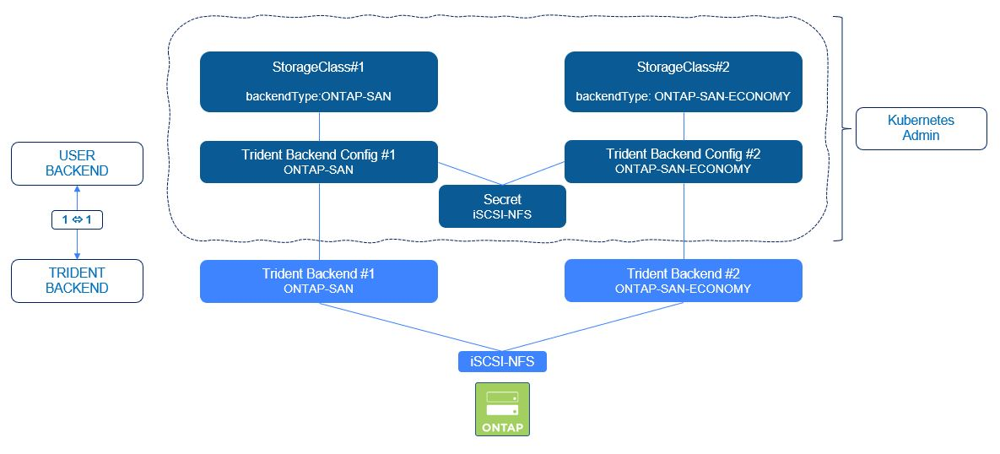

 #########################################################################################
# SCENARIO 5: Create your first SAN backends 
#########################################################################################

**GOAL:**  
You understood how to create backends and what they are for.  
You probably have also created a few ones with the NAS drivers (cf [Scenario02](../Scenario02/)).  
It is now time to add more backends that can be used for block storage.  

<p align="center"></p>

This lab already has 2 backends configured to provide NFS & SMB volumes with the ONTAP-NAS driver.  
As they have been created with the _tridentctl_ tool, there is no TBC (TridentBackendConfig) object associated with them that allow backend management with kubectl. We will then first go through the creation of the 2 TBC.  
Then, we will also create a ONTAP-NAS-ECONOMY backend which will then create qtrees in ONTAP.  

## A. Create the TBC objects corresponding to the existing SAN backends

```bash
$ tridentctl -n trident get backend
+-----------------+----------------+--------------------------------------+--------+------------+---------+
|      NAME       | STORAGE DRIVER |                 UUID                 | STATE  | USER-STATE | VOLUMES |
+-----------------+----------------+--------------------------------------+--------+------------+---------+
| BackendForNFS   | ontap-nas      | 11d28fb4-6cf5-4c59-931d-94b8d8a5e061 | online | normal     |       0 |
| BackendForSMB   | ontap-nas      | 7f9d71c8-b6a9-4f1f-ac20-4b594dbf37e3 | online | normal     |       0 |
| BackendForNVMe  | ontap-san      | 493fef7f-8328-41d4-99f2-dea4281324a1 | online | normal     |       0 |
| BackendForiSCSI | ontap-san      | 17c482e4-6aa7-4a0a-b4f8-26c75eae8a59 | online | normal     |       0 |
+-----------------+----------------+--------------------------------------+--------+------------+---------+
```
Moving from a tridentctl based backend to a kubectl one requires the creation of 2 objects:  
- a secret
- a TBC
When going through that process, make sure that the backend parameters are correctly reported in the TBC.  

As the iSCSI configuration is secured with CHAP authentication, we will create a secret per protocol (NVMe is not compatible with CHAP).  

This folder already contains the necesary files:
```bash
$ kubectl create -f secret-ontap-iscsi-svm-creds.yaml
secret/secret-iscsi-svm-creds created
$ kubectl create -f backend-tbc-iscsi.yaml
tridentbackendconfig.trident.netapp.io/backend-tbc-iscsi created

$ kubectl create -f secret-ontap-nvme-svm-creds.yaml
secret/secret-nvme-svm-creds created
$ kubectl create -f backend-tbc-nvme.yaml
tridentbackendconfig.trident.netapp.io/backend-tbc-nvme created
```

Let's check that it all went fine. Backends should be displayed as "status=success" & no new entry should be visible when listing the backends with tridentctl.  
```bash
$ kubectl get tbc -A
NAMESPACE   NAME                BACKEND NAME      BACKEND UUID                           PHASE   STATUS
trident     backend-tbc-iscsi   BackendForiSCSI   17c482e4-6aa7-4a0a-b4f8-26c75eae8a59   Bound   Success
trident     backend-tbc-nvme    BackendForNVMe    493fef7f-8328-41d4-99f2-dea4281324a1   Bound   Success

$ tridentctl -n trident get backend
+-----------------+----------------+--------------------------------------+--------+------------+---------+
|      NAME       | STORAGE DRIVER |                 UUID                 | STATE  | USER-STATE | VOLUMES |
+-----------------+----------------+--------------------------------------+--------+------------+---------+
| BackendForNFS   | ontap-nas      | 11d28fb4-6cf5-4c59-931d-94b8d8a5e061 | online | normal     |       0 |
| BackendForSMB   | ontap-nas      | 7f9d71c8-b6a9-4f1f-ac20-4b594dbf37e3 | online | normal     |       0 |
| BackendForNVMe  | ontap-san      | 493fef7f-8328-41d4-99f2-dea4281324a1 | online | normal     |       0 |
| BackendForiSCSI | ontap-san      | 17c482e4-6aa7-4a0a-b4f8-26c75eae8a59 | online | normal     |       0 |
+-----------------+----------------+--------------------------------------+--------+------------+---------+
```
All good !

Note that all backend modifications must be applied to the _trident backend config_ objects, not the _trident backend_ ones.  

The storage classes are already present, so no need to recreate or modify them.  
```bash
$ kubectl get sc
NAME                  PROVISIONER             RECLAIMPOLICY   VOLUMEBINDINGMODE   ALLOWVOLUMEEXPANSION   AGE
storage-class-iscsi   csi.trident.netapp.io   Delete          Immediate           true                   75d
storage-class-nfs     csi.trident.netapp.io   Delete          Immediate           true                   75d
storage-class-nvme    csi.trident.netapp.io   Delete          Immediate           true                   75d
storage-class-smb     csi.trident.netapp.io   Delete          Immediate           true                   75d
```

## B. Create a ONTAP-SAN-ECONOMY environment with iSCSI  

When using ONTAP-SAN with the iSCSI protocol, one PVC corresponds to one LUN, which will be created in one ONTAP FlexVol.
Everything has limits, and specifically with ONTAP you can host up to 2500 FlexVol per controller (that depends on various parameters, such as version or architecture. Check hwu.netapp.com for correct values). There is also a limit for number of LUN per controller.    

If those limits are too low, one alternative is to move to the ONTAP-SAN-ECONOMY Trident driver, which will then host several LUN per ONTAP FlexVol. Trident allow you to create up to 50 LUN for FlexVol.  

Important to note that volume import is not supported with ONTAP-SAN-ECONOMY  

The TBC we are going to create uses the same iSCSI _secret_ created in the first part of this chapter.  
We also need a new storage class to complete the process.  
```bash
$ kubectl create -f backend-san-eco.yaml
tridentbackendconfig.trident.netapp.io/backend-tbc-iscsi-eco created
$ kubectl create -f sc-iscsi-ontap-san-eco.yaml
storageclass.storage.k8s.io/storage-class-iscsi-economy created

$ kubectl get -n trident tbc backend-tbc-iscsi-eco
NAME                    BACKEND NAME         BACKEND UUID                           PHASE   STATUS
backend-tbc-iscsi-eco   BackendForiSCSIEco   9591fe15-9dac-42a4-b4c3-bdddfdfdbec5   Bound   Success
```

## C. Validate the CHAP configuration on the storage backend

If you take a closer look at the iSCSI secret manifests you will see a bunch of parameter related to bidirectional CHAP, which will add authenticated iSCSI connections.  
You can learn more about it on the following link:  
https://docs.netapp.com/us-en/trident/trident-use/ontap-san-prep.html#authenticate-connections-with-bidirectional-chap  

CHAP authentication is optional & disabled by default. In this lab, both iSCSI SAN backends use CHAP.  

You can check that the CHAP configuration has been set correctly with the following command (password: Netapp1!)

```bash
$ ssh -l admin 192.168.0.101 iscsi security show
Password:
                                    Auth   Auth CHAP Inbound CHAP       Outbound CHAP
Vserver      Initiator Name         Type   Policy    User Name          User Name
----------   ---------------------- ------ --------- ----------------   -------------
sansvm       default                CHAP   local     uh2a1io325bFFILn   iJF4sgjrnwOwQ
```

You find here both usernames set in the backend parameters.  
Now, you can only see the CHAP configuration on the host once a POD has mounted a PVC, which you will do in the Scenario06.

## D. LUKS

You can use LUKS (Linux Unified Key Setup) to encrypt the data on the ONTAP-SAN & ONTAP-SAN-ECONOMY volumes.  

The main requirement for such configuration is to install Cryptsetup (https://gitlab.com/cryptsetup/cryptsetup) on the worker nodes.  
The LoD nodes already have this module installed:
```bash
$ cryptsetup --version
cryptsetup 2.6.0 flags: UDEV BLKID KEYRING FIPS KERNEL_CAPI PWQUALITY
```
It is also recommended to check if the worker nodes support encryption instructions:  
```bash
grep "aes" /proc/cpuinfo
```

Activating LUKS in a Trident backend is done with one option in the _spec_:
```yaml
  defaults:
    luksEncryption: "true"
```

The corresponding storage class contains 2 extra parameters:
```yaml
csi.storage.k8s.io/node-stage-secret-name: luks-${pvc.name}
csi.storage.k8s.io/node-stage-secret-namespace: ${pvc.namespace}
```
The _node-stage-secret-namespace_ parameter indicates what namespace contains the LUKS secret.  
In our example, the secret is in the same namespace as the PVC that requires encryption.  
The _node-stage-secret-name_ parameter defines the secret name format, which in this example uses the PVC name.  

Let's apply that configuration:  
```bash
$ kubectl create -f backend-san-luks.yaml
tridentbackendconfig.trident.netapp.io/backend-tbc-iscsi-luks created
$ kubectl create -f sc-iscsi-ontap-san-luks.yaml
storageclass.storage.k8s.io/storage-class-iscsi-luks created

$ kubectl get -n trident tbc backend-tbc-iscsi-luks
NAME                     BACKEND NAME          BACKEND UUID                           PHASE   STATUS
backend-tbc-iscsi-luks   BackendForiSCSILUKS   0f908faf-ec2f-4933-b9f7-ef28f8149eeb   Bound   Success
```

## E. What's next

Now, you have some SAN Backends & some storage classes configured. You can proceed to the creation of a stateful application:  
- [Scenario06](../Scenario06): Deploy your first app with Block storage  

Or go back to the [FrontPage](https://github.com/YvosOnTheHub/LabNetApp)