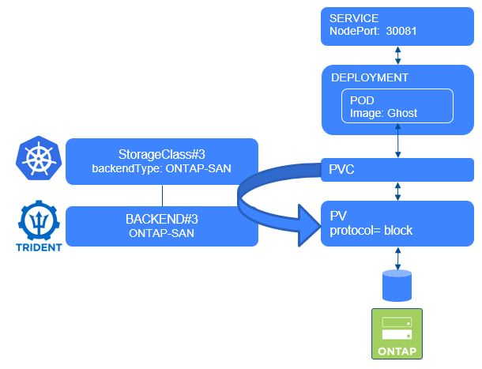

#########################################################################################
# SCENARIO 6: Create your first App with an iSCSI LUN
#########################################################################################

**GOAL:**  
We will deploy the same App as in the scenario 4, but instead of using File Storage, we will use Block Storage with the iSCSI protocol.

<p align="center"></p>

## A. Create the app

We will create this app in its own namespace (also very useful to clean up everything).  
We consider that the ONTAP-SAN backend for iSCSI & storage class have already been created. ([cf Scenario05](../Scenario05))

```bash
$ kubectl create -f Ghost/
namespace/ghost-iscsi created
persistentvolumeclaim/blog-content-iscsi created
deployment.apps/blog-iscsi created
service/blog-iscsi created

$ kubectl get -n ghost-iscsi all,pvc
NAME                              READY   STATUS    RESTARTS   AGE
pod/blog-iscsi-66cffd58dd-82d6s   1/1     Running   0          108s

NAME                 TYPE       CLUSTER-IP      EXTERNAL-IP   PORT(S)        AGE
service/blog-iscsi   NodePort   10.107.81.190   <none>        80:30181/TCP   46s

NAME                         READY   UP-TO-DATE   AVAILABLE   AGE
deployment.apps/blog-iscsi   1/1     1            1           108s

NAME                                    DESIRED   CURRENT   READY   AGE
replicaset.apps/blog-iscsi-66cffd58dd   1         1         1       108s

NAME                                       STATUS   VOLUME                                     CAPACITY   ACCESS MODES   STORAGECLASS          VOLUMEATTRIBUTESCLASS   AGE
persistentvolumeclaim/blog-content-iscsi   Bound    pvc-d1d39be5-073d-4bac-926c-9d5647cb1a73   5Gi        RWO            storage-class-iscsi   <unset>                 108s
```

## B. Access the app

It takes a few seconds for the POD to be in a *running* state
The Ghost service is configured with a NodePort type, which means you can access it from every node of the cluster on port 30181.
Give it a try !
=> `http://192.168.0.63:30181`

## C. Explore the app container

Let's see if the */var/lib/ghost/content* folder is indeed mounted to the SAN PVC that was created.

```bash
$ kubectl exec -n ghost-iscsi $(kubectl -n ghost-iscsi get pod -o name) -- df /var/lib/ghost/content
Filesystem           1K-blocks      Used Available Use% Mounted on
/dev/mapper/3600a0980774f6a34712b572d41767173
                       5074592       500   4795564   0% /var/lib/ghost/content

$ kubectl exec -n ghost-iscsi $(kubectl -n ghost-iscsi get pod -o name) -- ls /var/lib/ghost/content
apps
data
images
logs
lost+found
settings
themes
```  

## D. About CHAP & multipathing

This application was deployed using secured authentication with the storage backend. We can now see the configuration on the host.  
Let's first look at what server hosts the POD:

```bash
$ kubectl get -n ghost-iscsi pod -o wide
NAME                          READY   STATUS    RESTARTS   AGE    IP               NODE    NOMINATED NODE   READINESS GATES
blog-iscsi-66cffd58dd-82d6s   1/1     Running   0          8m9s   192.168.28.123   rhel2   <none>           <none>
```

Now that host had been identified, let's take a look at CHAP (on _host2_ in this case).  
You will notice the following block appear twice in the configuration, which is due to multipathing.  
```bash
$ iscsiadm -m session -P 3 | grep CHAP -A 5
                CHAP:
                *****
                username: uh2a1io325bFFILn
                password: ********
                username_in: iJF4sgjrnwOwQ
                password_in: ********
```
You can compare those values with the ones set in the Trident backend created in [Scenario05](../../Scenario05).  
You will notice they are the exact same ones!  

With recent versions of Trident, **multipathing** is mandatory.  
The ONTAP SVM hosting block workloads has 2 Data LIF configured for iSCSI: _192.168.0.135_ & _192.168.0.136_.  
Let's check what we see on the node hosting the Ghost pod (_rhel2_ in my case, where only one LUN is mounted) about iSCSI sessions & multipathing:  
```bash
$ iscsiadm -m session
tcp: [1] 192.168.0.135:3260,1030 iqn.1992-08.com.netapp:sn.7c8b4c9af76e11ee8aac005056b0f629:vs.4 (non-flash)
tcp: [2] 192.168.0.136:3260,1031 iqn.1992-08.com.netapp:sn.7c8b4c9af76e11ee8aac005056b0f629:vs.4 (non-flash)

$ multipath -ll
3600a0980774f6a34712b572d41767173 dm-3 NETAPP,LUN C-Mode
size=5.0G features='3 queue_if_no_path pg_init_retries 50' hwhandler='1 alua' wp=rw
`-+- policy='service-time 0' prio=50 status=active
  |- 33:0:0:0 sdb 8:16 active ready running
  `- 34:0:0:0 sdc 8:32 active ready running

$ lsblk /dev/sdb
NAME                           MAJ:MIN RM SIZE RO TYPE  MOUNTPOINTS
sdb                              8:16   0   5G  0 disk
└─3600a0980774f6a34712b572d41767173
                               253:3    0   5G  0 mpath /var/lib/kubelet/pods/52526e43-38e9-469f-9045-b1e689ecf066/volumes/kubernetes.io~csi/pvc-d1d39be5-073d-4bac-926c-9d5647cb1a73/mount

$ lsblk /dev/sdc
NAME                           MAJ:MIN RM SIZE RO TYPE  MOUNTPOINTS
sdc                              8:32   0   5G  0 disk
└─3600a0980774f6a34712b572d41767173
                               253:3    0   5G  0 mpath /var/lib/kubelet/pods/52526e43-38e9-469f-9045-b1e689ecf066/volumes/kubernetes.io~csi/pvc-d1d39be5-073d-4bac-926c-9d5647cb1a73/mount
```

You can see how both disk references point to the same LUN (_multipath -ll_) & the same PVC (_lsbk_).  


## E. Cleanup

Instead of deleting each object one by one, you can directly delete the namespace which will then remove all of its objects.

```bash
$ kubectl delete ns ghost-iscsi
namespace "ghost-iscsi" deleted
```

## F. What's next

Now that you have tried working with SAN backends, you can try to resize a PVC:

- [Scenario09](../../Scenario09): Resize a iSCSI CSI PVC  

Or go back to the [FrontPage](https://github.com/YvosOnTheHub/LabNetApp)