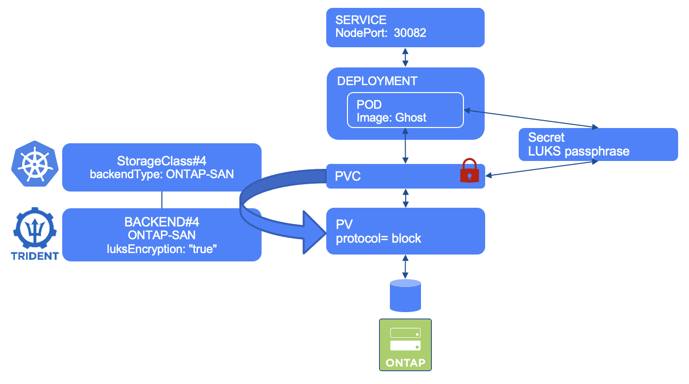

#########################################################################################
# SCENARIO 6: Create an application that mounts an encrypted iSCSI LUN  
#########################################################################################

**GOAL:**  
We will deploy the same App as in the previous chapter, but this time, LUKS is going to be used to encrypt the content of the LUN.

<p align="center"></p>

## A. Create the app

We will create this app in its own namespace (also very useful to clean up everything).  
We consider that the ONTAP-SAN backend for iSCSI & storage class (both compatible with LUKS) have already been created. ([cf Scenario05](../Scenario05))

```bash
$ kubectl create -f Ghost/
namespace/ghost-iscsi-luks created
secret/luks-blog-content-iscsi created
persistentvolumeclaim/blog-content-iscsi created
deployment.apps/blog-iscsi created
service/blog-iscsi created

$ kubectl get -n ghost-iscsi-luks pod,pvc,svc,secret
NAME                              READY   STATUS    RESTARTS   AGE
pod/blog-iscsi-788d56ccc5-gfk9z   1/1     Running   0          117s

NAME                                       STATUS   VOLUME                                     CAPACITY   ACCESS MODES   STORAGECLASS               VOLUMEATTRIBUTESCLASS   AGE
persistentvolumeclaim/blog-content-iscsi   Bound    pvc-6a2fc60b-1c0b-4475-9509-78016e778cff   5Gi        RWO            storage-class-iscsi-luks   <unset>                 22m

NAME                 TYPE       CLUSTER-IP       EXTERNAL-IP   PORT(S)        AGE
service/blog-iscsi   NodePort   10.105.149.171   <none>        80:30182/TCP   19m

NAME                             TYPE     DATA   AGE
secret/luks-blog-content-iscsi   Opaque   2      2m3s
```

Notice that there is a secret associated to this app.  
This object contains the passphrase to encrypt/decrypt the data in the PVC.  
Also, its name follows the template defined in the storage class (ie node-stage-secret-name: luks-${pvc.name}).  

## B. Access the app

It takes a few seconds for the POD to be in a *running* state
The Ghost service is configured with a NodePort type, which means you can access it from every node of the cluster on port 30182.
Give it a try !
=> `http://192.168.0.63:30182`

## C. Explore the app container

Let's see if the */var/lib/ghost/content* folder is indeed mounted to the SAN PVC that was created.  
```bash
$ kubectl exec -n ghost-iscsi-luks $(kubectl -n ghost-iscsi-luks get pod -o name) -- df /var/lib/ghost/content
Filesystem           1K-blocks      Used Available Use% Mounted on
/dev/mapper/luks-san_luks_pvc_6a2fc60b_1c0b_4475_9509_78016e778cff
                       5058432       500   4780224   0% /var/lib/ghost/content

$ kubectl exec -n ghost-iscsi-luks $(kubectl -n ghost-iscsi-luks get pod -o name) -- ls /var/lib/ghost/content
apps
data
images
logs
lost+found
settings
themes
```
We can indeed access the content of the PVC.  

## D. LUKS

How do we know that the volume is encrypted.  
You can check that on the worker node where the pod is running:  
```bash
$ kubectl get -n ghost-iscsi-luks pod -o wide
NAME                          READY   STATUS    RESTARTS   AGE    IP              NODE    NOMINATED NODE   READINESS GATES
blog-iscsi-788d56ccc5-gfk9z   1/1     Running   0          5m8s   192.168.28.80   rhel2   <none>           <none>
```
Now that we know that the app runs on RHEL2, let's use the **lsblk** & **blkid** tools to read the configration of the LUN:  
```bash
$ ssh rhel2 blkid -t TYPE=crypto_LUKS -o device
/dev/sdc
/dev/mapper/3600a0980774f6a34712b572d41767173

ssh rhel2 lsblk /dev/sdb /dev/sdc
NAME                                                       MAJ:MIN RM SIZE RO TYPE  MOUNTPOINTS
sdb                                                          8:16   0   5G  0 disk
└─3600a0980774f6a34712b572d41767173                        253:3    0   5G  0 mpath
  └─luks-san_luks_pvc_6a2fc60b_1c0b_4475_9509_78016e778cff 253:4    0   5G  0 crypt /var/lib/kubelet/pods/83ede634-6f3c-463a-9abf-f2590a35a156/volumes/kubernetes.io~csi/pvc-6a2fc60b-1c0b-4475-9509-78016e778cff/mount
sdc                                                          8:32   0   5G  0 disk
└─3600a0980774f6a34712b572d41767173                        253:3    0   5G  0 mpath
  └─luks-san_luks_pvc_6a2fc60b_1c0b_4475_9509_78016e778cff 253:4    0   5G  0 crypt /var/lib/kubelet/pods/83ede634-6f3c-463a-9abf-f2590a35a156/volumes/kubernetes.io~csi/pvc-6a2fc60b-1c0b-4475-9509-78016e778cff/mount
```

Notice the **crypt** type of each device?  
By the way, there are 2 devices because of the multipathing.  


## E. Cleanup

Instead of deleting each object one by one, you can directly delete the namespace which will then remove all of its objects.

```bash
$ kubectl delete ns ghost-iscsi-luks
namespace "ghost-iscsi-luks" deleted
```

## F. What's next

Now that you have tried working with SAN backends, you can try to resize a PVC:

- [Scenario09](../../Scenario09): Resize a iSCSI CSI PVC  

Or go back to the [FrontPage](https://github.com/YvosOnTheHub/LabNetApp)