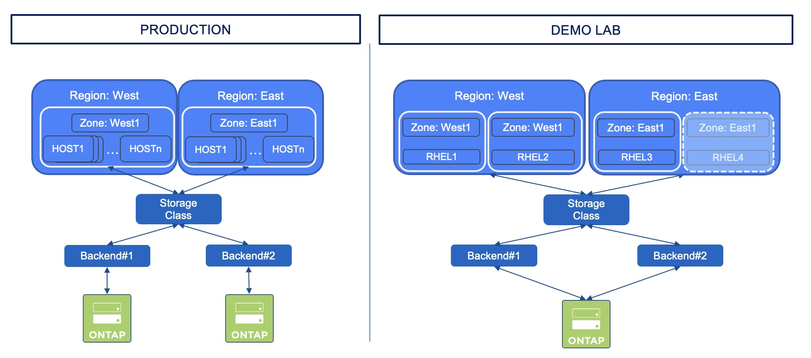

#########################################################################################
# SCENARIO 15: CSI Topology
#########################################################################################

**GOAL:**  
Trident 20.10 introduced the support of the CSI Topology feature. This scenario will guide you in the Trident configuration with regards to topology.  

Some details about CSI Topology:  
- Kubernetes details: https://kubernetes-csi.github.io/docs/topology.html
- Trident details: https://docs.netapp.com/us-en/trident/trident-use/csi-topology.html  

This feature allows you to segment nodes of a Kubernetes cluster into sub-groups, so that you can manage:  
- their location (Rack#1 vs Rack#2, Zone#1 vs Zone#2, DC#1 vs DC#2...)
- their target use (Production vs Dev)
- ...

In a real environment, you will probably use a different storage platform in each zone. To simplify the configuration of this scenario, we will use the same storage backend to host volumes from both zones, while using different prefixes, in order to simulate having two different zones or datacenters.

<p align="center"></p>

If you have not yet read the [Addenda08](../../Addendum/Addenda08) about the Docker Hub management, it would be a good time to do so.  
Also, if no action has been made with regards to the container images, you can find a shell script in this directory _scenario15_pull_images.sh_ to pull images utilized in this scenario if needed:  
```bash
sh scenario15_pull_images.sh
```

You may want to add an extra node (_RHEL4_) to the Kubernetes cluster to have 2 nodes on each zone.  
You can follow the procedure described in the [Addenda01](../../Addendum/Addenda01) to perform that operation.  

Let's first check what labels are set on the nodes:
```bash
$ kubectl get nodes -l kubernetes.io/os=linux -o=custom-columns=NODE:.metadata.name,REGION:".metadata.labels.topology\.kubernetes\.io/region",ZONE:".metadata.labels.topology\.kubernetes\.io/zone"
NODE    REGION   ZONE
rhel1   west     west1
rhel2   west     west1
rhel3   east     east1
rhel4   east     east1
```

**Note that if you added the topology labels after Trident was deployed, you must restart the daemonsets in order to take into account those values.**  

We are going to create two new backends, each one pointing to a different region.  
You can see in the json files that I used a parameter called **supportedTopologies** to specify this.  
```bash
$ kubectl create -f backend-east-and-west.yaml
tridentbackendconfig.trident.netapp.io/backend-tbc-ontap-nas-west created
tridentbackendconfig.trident.netapp.io/backend-tbc-ontap-nas-east created
```

We can now create a Kubernetes Storage Class that does not necessarily point to a particular Trident Backend.  
We will use the _sc_topology.yaml_ file which refers to both regions & zones. One could decide to implement separate storage classes (1 for each region), however, letting Trident decide where to create the volume based on one single Storage Class is easier to manage.  
```bash
$ kubectl create -f sc-topology.yaml
storageclass.storage.k8s.io/sc-topology created

$ kubectl get sc
NAME                 PROVISIONER             RECLAIMPOLICY   VOLUMEBINDINGMODE      ALLOWVOLUMEEXPANSION   AGE
sc-topology          csi.trident.netapp.io   Delete          WaitForFirstConsumer   false                  6m39s
```

You will also notice that these is a specific optional parameter in this storage class: **volumeBindingMode** set to _WaitForFirstConsumer_ (default value: _Immediate_).  This means that the PVC will not be created until referenced in a POD.  

Let's use a specific namespace for this scenario:  
```bash
$ kubectl create ns topology
namespace/topology created
```

This directory contains 2 sets of PVC/POD, one for each region. Let's start by creating the PVC:
```bash
$ kubectl create -f pvc-east-and-west.yaml
persistentvolumeclaim/pvc-east created
persistentvolumeclaim/pvc-west created

$ kubectl get pvc -n topology
NAME              STATUS    VOLUME             CAPACITY   ACCESS MODES   STORAGECLASS    AGE
pvc-east          Pending                                                sc-topology     2s
pvc-west          Pending                                                sc-topology     2s
```

As you can see, both PVC have not yet been created, simply because of the _volumeBindingMode_ parameter set in the storage class.  
```bash
$ kubectl describe -n topology pvc pvc-west | grep -C 3 Events
Access Modes:
VolumeMode:    Filesystem
Mounted By:    <none>
Events:
  Type    Reason                Age                  From                         Message
  ----    ------                ----                 ----                         -------
  Normal  WaitForFirstConsumer  56s (x142 over 36m)  persistentvolume-controller  waiting for first consumer to be created before binding
```

Let's create two applications.  
If you take a look the POD yaml files, you will notice I have used the **nodeAffinity** parameters to also define where the POD would be created.

As expected:  
- the **WEST** Pod should run on either **Host1** or **Host2**
- the **EAST** Pod should run on **Host3** (or **Host4** if you have already added this fourth node)

```bash
$ kubectl create -f pod-busybox-east-and-west.yaml
pod/busybox-west created
pod/busybox-east created
```

Now that the PODs have been requested, you can also see that both PVC have been succesfully created.  
```bash
$ kubectl get pvc -n topology
NAME         STATUS   VOLUME                                     CAPACITY   ACCESS MODES   STORAGECLASS     AGE
pvc-east     Bound    pvc-d0a8aa71-840b-4248-92d6-850b680988a3   5Gi        RWX            sc-topology      15h
pvc-west     Bound    pvc-f468c589-1a88-4393-a827-f6bd0b4c1902   5Gi        RWX            sc-topology      15h
```

Finally, let's check that our 2 PODs have been created on the right hosts, as expected:  
```bash
$ kubectl get pod -n topology -o wide
NAME              READY   STATUS    RESTARTS   AGE     IP          NODE    NOMINATED NODE   READINESS GATES
busybox-east      1/1     Running   0          97s     10.44.0.8   rhel3   <none>           <none>
busybox-west      1/1     Running   0          92s     10.36.0.5   rhel2   <none>           <none>
```

Last check, each volume in ONTAP should have a prefix related to its region:  
```bash
$ curl -X GET -ku vsadmin:Netapp1! "https://192.168.0.133/api/storage/volumes?name=*st_pvc*" -H "accept: application/json"
{
  "records": [
    {
      "uuid": "15d666a3-b64f-11ec-8f11-005056818e21",
      "name": "west_pvc_f468c589_1a88_4393_a827_f6bd0b4c1902"
    },
    {
      "uuid": "ebdad3f2-b64e-11ec-8f11-005056818e21",
      "name": "east_pvc_d0a8aa71_840b_4248_92d6_850b680988a3"
    }
  ],
  "num_records": 2
}
```

=> Tadaaaa!

## Cleanup the environment

```bash
$ kubectl delete namespace topology
namespace "topology" deleted
```

## What's next

You can go back to the [FrontPage](https://github.com/YvosOnTheHub/LabNetApp)