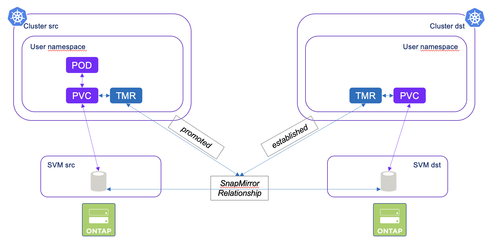

#########################################################################################
# SCENARIO 24: Mirroring volumes
#########################################################################################

Trident 24.06.1 brought you the mirroring feature.  
A user can now manage the snapmirror relationships directly in Kubernetes, via a new object called _TridentMirrorRelationship_.  
This gives you the opportunity to configure a disaster recovery plan between 2 Kubernetes clusters, for the data only.  

The scenario takes you through the setup of such configuration, as well as the activation of secondary volume.  
Here are the steps you will perform:  
- creation a new Trident backend for both the source Kubernetes cluster & the target Kubernetes cluster  
- creation a new storage class for both the source Kubernetes cluster & the target Kubernetes cluster  
- creation of an application on the source cluster  
- creation of the mirroring relationship between the 2 clusters  
- activation of the DR environment following a issue on the first cluster

Some requirements for this:  
- Ansible is used for part of the configuration: [Addenda04](../../Addendum/Addenda04/)  
- A second Kubernetes is of course needed: [Addenda12](../../Addendum/Addenda12/)  
- A new SVM is also needed to host the secondary volume: [Addenda13](../../Addendum/Addenda13/)  

## A. SVM Peering

Trident does not take care of the peering configuration.  
The storage admin must perform this task beforehand.  

Most of the time, peering & mirroring will happen between 2 ONTAP clusters. In this lab, we will configure mirroring between 2 SVM.  
This configuration is done via Ansible in this scenario:  
```bash
$ ansible-playbook svm_peering.yaml
PLAY [Create SVM Peering] 
TASK [Gathering Facts] 
TASK [Create vserver peer] 
PLAY RECAP 
localhost                  : ok=2    changed=1    unreachable=0    failed=0    skipped=0    rescued=0    ignored=0
```

## B. Trident configuration

Let's create a new backend per cluster:  
```bash
$ kubectl create -f rhel3_scenario24_trident_config.yaml
secret/sc24-credentials created
tridentbackendconfig.trident.netapp.io/backend-tmr created
storageclass.storage.k8s.io/sc-mirror created

$ kubectl create --kubeconfig=/root/.kube/config_rhel5 -f rhel5_scenario24_trident_config.yaml
secret/sc24-credentials created
tridentbackendconfig.trident.netapp.io/backend-tmr created
storageclass.storage.k8s.io/sc-mirror created
```
Note that you can pass two optional parameters to a Trident backend:  
- _replicationPolicy_: existing policy to apply to the the replication relationship (default: _MirrorAndVault_)  
- _replicationSchedule_: existing schedule to apply to the replication relationship (default: empty)  

In this example, here are the 2 values set:  
- replicationPolicy: _MirrorAllSnapshots_
- replicationSchedule: 5 minutes (_5min_)

Also the storage class is snapmirror enabled with the annotation: _trident.netapp.io/replication: "true"_.

## C. Application create

This part is pretty easy:  
```bash
$ kubectl create -f rhel3_busybox.yaml
namespace/sc24busybox created
persistentvolumeclaim/mydata created
deployment.apps/busybox created

$ kubectl get -n sc24busybox pod,pvc
NAME                           READY   STATUS    RESTARTS   AGE
pod/busybox-7ff78f8654-5cqw7   1/1     Running   0          9s

NAME                           STATUS   VOLUME                                     CAPACITY   ACCESS MODES   STORAGECLASS   VOLUMEATTRIBUTESCLASS   AGE
persistentvolumeclaim/mydata   Bound    pvc-164ab34a-a5a6-4333-bf1a-6f122b5198aa   1Gi        RWX            sc-mirror      <unset>                 12m
```
Let's create some content on the application volume:  
```bash
$ kubectl exec -n sc24busybox $(kubectl get pod -n sc24busybox -o name) -- sh -c 'echo "SnapMirror test!" > /data/test.txt'
$ kubectl exec -n sc24busybox $(kubectl get pod -n sc24busybox -o name) -- more /data/test.txt
SnapMirror test!
```

## D. Mirroring configuration

This part is done with a new CR called a **TridentMirrorRelationship** (_TMR_ in short).  
A TMR can have 3 states:  
- _promoted_: the PVC is ReadWrite & mountable  
- _established_: the local PVC is part of a new SnapMirror relationship  
- _reestablished_: the local PVC is part of a preexisting SnapMirror  

<p align="center"></p>

Let's create a TMR on the first cluster.  
This object refers to the PVC to protect (PVC _mydata_ in this exercise).  
```bash
$ kubectl create -f rhel3_tmr.yaml
tridentmirrorrelationship.trident.netapp.io/busybox-mirror created
```
On the secondary cluster, we will now create 2 objects:
- a TMR that refers to the source volume  
- a PVC that will be the destination of the mirror relatioship  

This folder contains a script that will retrieve the internal volume name & customize the target TMR:  
```bash
$ sh rhel5_tmr.sh
namespace/sc24busybox created
tridentmirrorrelationship.trident.netapp.io/busybox-mirror created
```
Last, we can now create the volume:  
```bash
$ kubectl create -f pvc5.yaml --kubeconfig=/root/.kube/config_rhel5
persistentvolumeclaim/mydata created
```
Now, the SnapMirror relationship should be present. Let's check:  
```bash
$ curl -s -X GET -ku admin:Netapp1! "https://cluster1.demo.netapp.com/api/snapmirror/relationships" -H "accept: application/json"
{
  "records": [
    {
      "uuid": "94d84307-5667-11ef-a235-0050568566d7",
      "source": {
        "path": "nassvm:tmr_pvc_164ab34a_a5a6_4333_bf1a_6f122b5198aa",
        "svm": {
          "name": "nassvm"
        }
      },
      "destination": {
        "path": "svm_secondary:tmr_pvc_74afee3e_0b61_4c00_ae18_fe092d963364",
        "svm": {
          "name": "svm_secondary"
        }
      },
      "state": "snapmirrored",
      "healthy": true
    }
  ],
  "num_records": 1
}
```

## E. Disaster Recovery in action

```bash
$ kubectl delete ns sc24busybox
namespace "sc24busybox" deleted
```
Holalalalala ! I just deleted my whole stateful app!! Did I lose the data ?? (of course not)  

We first need to  update the state the secondary TMR to _promoted_.  
Once done, we can redeploy the application on top of the volume.  
```bash
$ kubectl --kubeconfig=/root/.kube/config_rhel5 -n sc24busybox patch tmr busybox-mirror  --type=merge -p '{"spec":{"state":"promoted"}}'
tridentmirrorrelationship.trident.netapp.io/busybox-mirror patched

$ kubectl --kubeconfig=/root/.kube/config_rhel5 create -f rhel5_busybox.yaml
deployment.apps/busybox created

$ kubectl --kubeconfig=/root/.kube/config_rhel5 -n sc24busybox get pod,pvc
NAME                           READY   STATUS    RESTARTS   AGE
pod/busybox-7ff78f8654-x9sjq   1/1     Running   0          40s

NAME                           STATUS   VOLUME                                     CAPACITY   ACCESS MODES   STORAGECLASS   VOLUMEATTRIBUTESCLASS   AGE
persistentvolumeclaim/mydata   Bound    pvc-74afee3e-0b61-4c00-ae18-fe092d963364   1Gi        RWX            sc-mirror      <unset>                 94m
```
Last thing to verify: what is the content of our PVC:  
```bash
$ kubectl --kubeconfig=/root/.kube/config_rhel5 exec -n sc24busybox $(kubectl --kubeconfig=/root/.kube/config_rhel5 get pod -n sc24busybox -o name) -- more /data/test.txt
SnapMirror test!
```
& voilà, you managed to test how to protect the data if an application & how to restart it on a different environment !