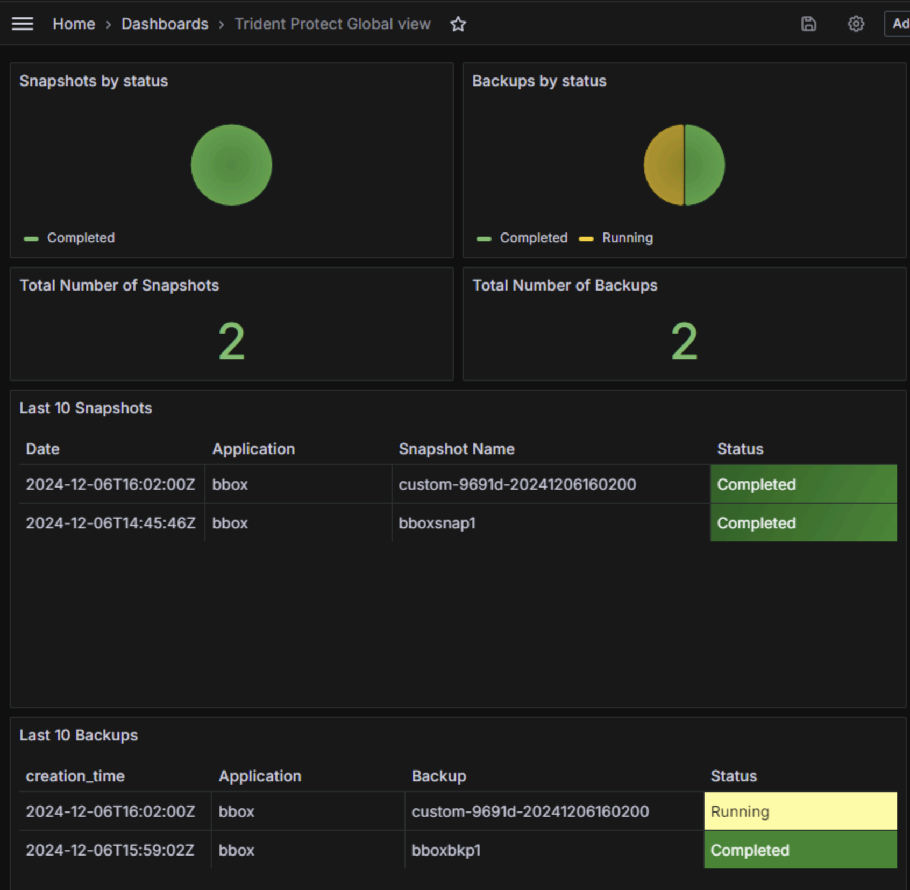

#########################################################################################
# SCENARIO 4: Trident Protect Monitoring 
#########################################################################################  

Trident Protect does not currently provide metrics to monitor activity.  
However you can put in place external mechanisms to do the job.

## A. Kube State Metrics

>> kube-state-metrics (KSM) is a simple service that listens to the Kubernetes API server and generates metrics about the state of the objects. It is not focused on the health of the individual Kubernetes components, but rather on the health of the various objects inside, such as deployments, nodes and pods.

>> The metrics are exported on the HTTP endpoint /metrics on the listening port (default 8080). They are served as plaintext. They are designed to be consumed either by Prometheus itself or by a scraper that is compatible with scraping a Prometheus client endpoint. You can also open /metrics in a browser to see the raw metrics. Note that the metrics exposed on the /metrics endpoint reflect the current state of the Kubernetes cluster. When Kubernetes objects are deleted they are no longer visible on the /metrics endpoint.

We will see here how to use Kube State Metrics (ie _KSM_)to monitor the following Trident Protect CR:  
- snapshots  
- backups  
- exec hooks runs  

KSM can be installed & configured with a Helm Chart. 
If integrated with Prometheus, you will find the new metrics labelled *kube_customresource_*.  
Let's look at the details of this configuration.  

First what does a _Trident Protect Snapshot CR_ look like:  
```yaml
apiVersion: v1
items:
- apiVersion: protect.trident.netapp.io/v1
  kind: Snapshot
  metadata:
 ...
    name: bboxsnap1
    namespace: bbox
    ownerReferences:
    - apiVersion: protect.trident.netapp.io/v1
      kind: Application
      name: bbox
      uid: cf39607b-14d2-4e26-b2d7-53e62298fb74
    resourceVersion: "2148491"
    uid: ca3eab8e-6f0b-4646-8c01-c51d9493f149
  spec:
    appVaultRef: bbox-vault
    applicationRef: bbox
    completionTimeout: 0s
    reclaimPolicy: Delete
    volumeSnapshotsCreatedTimeout: 0s
    volumeSnapshotsReadyToUseTimeout: 0s
  status:
    appArchivePath: bbox_cf39607b-14d2-4e26-b2d7-53e62298fb74/snapshots/20241206144546_bboxsnap1_ca3eab8e-6f0b-4646-8c01-c51d9493f149
    completionTimestamp: "2024-12-06T14:45:54Z"
 ...
    postSnapshotExecHooksRunResults: []
    preSnapshotExecHooksRunResults: []
    state: Completed
    volumeSnapshots:
    - name: snapshot-ca3eab8e-6f0b-4646-8c01-c51d9493f149-pvc-23245503-d1db-4e29-ada8-5244e45d683a
      namespace: bbox
kind: List
metadata:
  resourceVersion: ""
```
To monitor snapshots, I will retrieve the following fields to create customized metrics:
- metadata.uid
- metadata.name
- metadata.creationTimestamp
- spec.appVaultRef
- spec.applicationRef
- status.state

With those fields, I will build the follow KSM entry:  
```yaml
      resources:
      - groupVersionKind:
          group: protect.trident.netapp.io
          kind: "Snapshot"
          version: "v1"
        labelsFromPath:
          snapshot_uid: [metadata, uid]
          snapshot_name: [metadata, name]
          creation_time: [metadata, creationTimestamp]
        metrics:
        - name: snapshot_info
          help: "Exposes details about the Snapshot state"
          each:
            type: Info
            info:
              labelsFromPath:
                appVaultReference: ["spec", "appVaultRef"]
                appReference: ["spec", "applicationRef"]
                status: [status, state]
```

However, in order to access those CR fields, KSM needs to have the corresponding RBAC.  
Hence the following parameters to allow access to snapshots on all namespaces (since snapshots are created in the application namespace):  
```yaml
rbac:
  extraRules:
  - apiGroups: ["protect.trident.netapp.io"]
    resources: ["snapshots"]
    verbs: ["list", "watch"]

# collect metrics from ALL namespaces
namespaces: ""
```

Let's install KSM and check what's new!  
```bash
$ helm install trident-protect prometheus-community/kube-state-metrics --version 5.21.0 -n monitoring -f ksm-values.yaml

$ kubectl get -n monitoring pod -l app.kubernetes.io/instance=trident-protect
NAME                                                 READY   STATUS    RESTARTS   AGE
trident-protect-kube-state-metrics-d7664bd89-q2b6t   1/1     Running   0          2m53s

$ kubectl get -n monitoring svc -l app.kubernetes.io/instance=trident-protect
NAME                                 TYPE        CLUSTER-IP      EXTERNAL-IP   PORT(S)    AGE
trident-protect-kube-state-metrics   ClusterIP   10.102.211.64   <none>        8080/TCP   3m30s
```
By default, metrics are exposed on the port 8080. You can already see the result of the configuration by polling that port:  
```bash
$ TP_RHEL3=$(kubectl get -n monitoring svc trident-protect-kube-state-metrics -o jsonpath='{.spec.clusterIP}')
$ curl -s $TP_RHEL3:8080/metrics
# HELP kube_customresource_snapshot_info Exposes details about the Snapshot state
# TYPE kube_customresource_snapshot_info info
kube_customresource_snapshot_info{appReference="bbox",appVaultReference="ontap-vault",creation_time="2024-12-06T14:45:46Z",customresource_group="protect.trident.netapp.io",customresource_kind="Snapshot",customresource_version="v1",snapshot_name="bboxsnap1",snapshot_uid="ca3eab8e-6f0b-4646-8c01-c51d9493f149",status="Completed"} 1
```
You can see here the various fields that were setup in the configuration, as well as their value for that particular snapshot.  
Similar points have been created for backups & exec hooks.  

## B. Integration with Prometheus

KSM works now! But how do we ask Prometheus to retrieve those new metrics?  
This is done by a ServiceMonitor (created with the KSM Helm Chart):  
```yaml
# deploy a ServiceMonitor so the metrics are collected by Prometheus
prometheus:
  monitor:
    enabled: true
    additionalLabels: 
      release: prometheus
```
This configuration will add the following object to the existing Prometheus setup:  
```bash
$ kubectl get -n monitoring smon -l app.kubernetes.io/instance=trident-protect
NAME                                 AGE
trident-protect-kube-state-metrics   8m25s
```

Prometheus will take into account those metrics based on a label (which varies depending on the Prometheus deployment method).
In our case, that label is _release: prometheus_.  

To make sure that it is the correct label, you need to look into the Prometheus configuration as follows:  
```bash
$ kubectl -n monitoring get prometheus -o=jsonpath='{.items[0].spec.serviceMonitorSelector}' | jq
{
  "matchLabels": {
    "release": "prometheus"
  }
}
```

## C. Grafana

Our monitoring systems is functional. Time to look into dashboards with Grafana!  
There is already a dashboard available in this folder.  
You can either copy/paste the content in the Grafana UI or create a configmap that will automatically import it:  
```bash
$ kubectl create configmap -n monitoring cm-trident-protect-dashboard --from-file=dashboard.json
configmap/tridentdashboard created

$ kubectl label configmap -n monitoring cm-trident-protect-dashboard grafana_dashboard=1
configmap/cm-trident-protect-dashboard labeled
```

Here is what you would see with the current dashboard:  
<p align="center"></p>