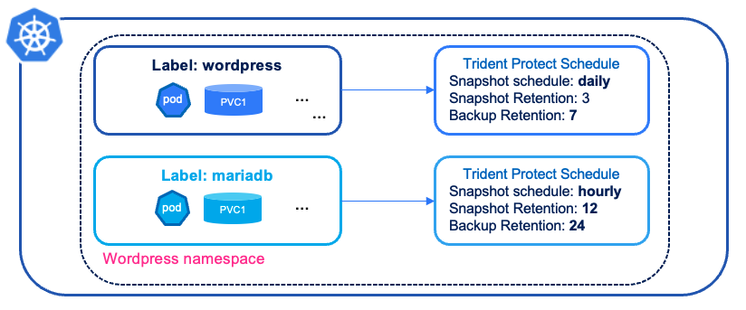

#########################################################################################
# SCENARIO 7: Selective application
#########################################################################################  

Let's consider a "two tier" application.  
The frontend may only need to be backed up once a day (very static configuration), whereas the backend every 5 minutes (it is a database with frequent changes). This can be achieved by applying specific labels at each level & defining a Trident Protect application based on those labels.  

<p align="center"></p>

Another use case would be to protect the PVC only. Maybe because all other objects are managed differently (maybe GitOps?).  
This is the example that is going to be covered in this chapter.  

You can use the _busybox.yaml_ present in this folder to create the following elements:  
- namespace  
- busybox deployment with 2 PVC  
- the required service account to create a Trident Protect application  

```bash
$ kubectl create -f bbox.yaml
namespace/sc07bbox1 created
persistentvolumeclaim/mydata1 created
persistentvolumeclaim/mydata2 created
deployment.apps/busybox created
serviceaccount/protect-user-secret created
secret/protect-user-secret created
rolebinding.rbac.authorization.k8s.io/bbox-tenant-rolebinding created
```
Let's also write some data in the 2 volumes:  
```bash
kubectl exec -n sc07bbox1 $(kubectl get pod -n sc07bbox1 -o name) -- sh -c 'echo "test on folder mydata1" > /mydata1/test.txt'
kubectl exec -n sc07bbox1 $(kubectl get pod -n sc07bbox1 -o name) -- more /mydata1/test.txt
kubectl exec -n sc07bbox1 $(kubectl get pod -n sc07bbox1 -o name) -- sh -c 'echo "test on folder mydata2" > /mydata2/test.txt'
kubectl exec -n sc07bbox1 $(kubectl get pod -n sc07bbox1 -o name) -- more /mydata2/test.txt
```
If you look at this manifest, you will see 2 differences for the PVC:  
- the volume _mydata1_ is labelled _category: tmp_  
- the volume _mydata2_ is labelled _category: toprotect_  

The goal of this folder is to only protect the PVC _mydata2_.  
To do so, we will create a Trident Protect application which carries the label to use:  
```bash
$ tridentctl protect create app bbox --namespaces 'sc07bbox1(category=toprotect)' -n sc07bbox1

$ tridentctl protect get app -n bbox
+------+------------+-------+------+
| NAME | NAMESPACES | STATE | AGE  |
+------+------------+-------+------+
| bbox | sc07bbox1  | Ready | 2h8m |
+------+------------+-------+------+
```
Let's continue with a snapshot & a backup of this application:  
```bash
$ tridentctl protect create snapshot bboxsnap1 --app bbox --appvault ontap-vault -n sc07bbox1
Snapshot "bboxsnap1" created.

$ tridentctl protect get snap -n sc07bbox1
+-----------+---------+-----------+-----+-------+
|   NAME    | APP REF |   STATE   | AGE | ERROR |
+-----------+---------+-----------+-----+-------+
| bboxsnap1 | bbox    | Completed | 37s |       |
+-----------+---------+-----------+-----+-------+

$ tridentctl protect create backup bboxbkp1 --app bbox --snapshot bboxsnap1 --appvault ontap-vault  --data-mover kopia -n sc07bbox1
Backup "bboxbkp1" created.

$ tridentctl protect get backup -n sc07bbox1
+----------+---------+-----------+-------+-------+
|   NAME   | APP REF |   STATE   |  AGE  | ERROR |
+----------+---------+-----------+-------+-------+
| bboxbkp1 | bbox    | Completed | 1m16s |       |
+----------+---------+-----------+-------+-------+
```

Out of curiosity, let's check what data was copied to the AppVault.  
To do so, we first need part of the backup path of this applivation.  
Since I used the Kopia data mover, you will find objects in a kopia subfolder:  
```bash
$ BKPPATHROOT=$(kubectl -n sc07bbox1 get backup bboxbkp1 -o=jsonpath='{.status.appArchivePath}' | awk -F '/' '{print $1}')
$ aws s3 ls --no-verify-ssl --endpoint-url http://192.168.0.230 s3://s3lod/$BKPPATHROOT/kopia --recursive --summarize
2025-01-16 11:02:40        770 bbox_47492e88-1b22-4505-85b7-be8202af9507/kopia/sc07bbox1/mydata2_602b75fb-dca9-49eb-a369-d2e2164defb0/_log_20250116110240_3b8d_1737025360_1737025360_1_2a14e9ef2e58a57be4e6347717559685
2025-01-16 11:02:40       2003 bbox_47492e88-1b22-4505-85b7-be8202af9507/kopia/sc07bbox1/mydata2_602b75fb-dca9-49eb-a369-d2e2164defb0/_log_20250116110240_7cc0_1737025360_1737025360_1_2282f1741a875421b3a890c4e2ea3113
2025-01-16 11:02:39         30 bbox_47492e88-1b22-4505-85b7-be8202af9507/kopia/sc07bbox1/mydata2_602b75fb-dca9-49eb-a369-d2e2164defb0/kopia.blobcfg
2025-01-16 11:02:40       1118 bbox_47492e88-1b22-4505-85b7-be8202af9507/kopia/sc07bbox1/mydata2_602b75fb-dca9-49eb-a369-d2e2164defb0/kopia.maintenance
2025-01-16 11:02:39       1101 bbox_47492e88-1b22-4505-85b7-be8202af9507/kopia/sc07bbox1/mydata2_602b75fb-dca9-49eb-a369-d2e2164defb0/kopia.repository
2025-01-16 11:02:40       4298 bbox_47492e88-1b22-4505-85b7-be8202af9507/kopia/sc07bbox1/mydata2_602b75fb-dca9-49eb-a369-d2e2164defb0/pd072a7af2e1df1565dd68e8dac4c9430-s7341d370dbf64bb0130
2025-01-16 11:02:40       4339 bbox_47492e88-1b22-4505-85b7-be8202af9507/kopia/sc07bbox1/mydata2_602b75fb-dca9-49eb-a369-d2e2164defb0/q9d3a45ee49f02033e60a05955da98564-s7341d370dbf64bb0130
2025-01-16 11:02:40       4298 bbox_47492e88-1b22-4505-85b7-be8202af9507/kopia/sc07bbox1/mydata2_602b75fb-dca9-49eb-a369-d2e2164defb0/qedc32a123084076af03929b2fb94d45a-se8189b0c3c38c124130
2025-01-16 11:02:40        143 bbox_47492e88-1b22-4505-85b7-be8202af9507/kopia/sc07bbox1/mydata2_602b75fb-dca9-49eb-a369-d2e2164defb0/xn0_565d75bbc7a2f5551832d82ea40108e8-se8189b0c3c38c124130-c1
2025-01-16 11:02:40        277 bbox_47492e88-1b22-4505-85b7-be8202af9507/kopia/sc07bbox1/mydata2_602b75fb-dca9-49eb-a369-d2e2164defb0/xn0_6aad1e5ec45214e690ed2ccb9ab3f977-s7341d370dbf64bb0130-c1
```
Notice there is only data related to the _mydata2_ pvc as expected.  

Next, let's restore that "application" to a different namespace and check the result:
```bash
$ tridentctl protect create br bboxbr1 --namespace-mapping sc07bbox1:sc07bbox1br --backup sc07bbox1/bboxbkp1 -n sc07bbox1br
BackupRestore "bboxbr1" created.

$ tridentctl protect get br -n sc07bbox1br
+---------+-------------+-----------+-----+-------+
|  NAME   |  APPVAULT   |   STATE   | AGE | ERROR |
+---------+-------------+-----------+-----+-------+
| bboxbr1 | ontap-vault | Completed | 33s |       |
+---------+-------------+-----------+-----+-------+

$ kubectl -n sc07bbox1br get pod,pvc
NAME                            STATUS   VOLUME                                     CAPACITY   ACCESS MODES   STORAGECLASS        VOLUMEATTRIBUTESCLASS   AGE
persistentvolumeclaim/mydata2   Bound    pvc-b067047f-db70-477b-89a0-92de55a0dbe7   2Gi        RWX            storage-class-nfs   <unset>                 15s
```
There you go! Only the second PVC was restored.  
More, you can check the content of this volume. To do so, you just need to deploy a new pod on top of it.  
You can use the _busybox-br.yaml_ manifest to perform that task:  
```bash
$ kubectl create -n sc07bbox1br -f busybox-bbr.yaml
pod/busybox-br created

$ kubectl get -n sc07bbox1br pod,pvc
NAME             READY   STATUS    RESTARTS   AGE
pod/busybox-br   1/1     Running   0          60s

NAME                            STATUS   VOLUME                                     CAPACITY   ACCESS MODES   STORAGECLASS        VOLUMEATTRIBUTESCLASS   AGE
persistentvolumeclaim/mydata2   Bound    pvc-b067047f-db70-477b-89a0-92de55a0dbe7   2Gi        RWX            storage-class-nfs   <unset>                 3m35s

$ kubectl exec -n sc07bbox1br $(kubectl get pod -n sc07bbox1br -o name) -- ls /data/
test.txt
$ kubectl exec -n sc07bbox1br $(kubectl get pod -n sc07bbox1br -o name) -- more /data/test.txt
test on folder mydata2
```bash

& voilà! The content of the volume is indeed present!