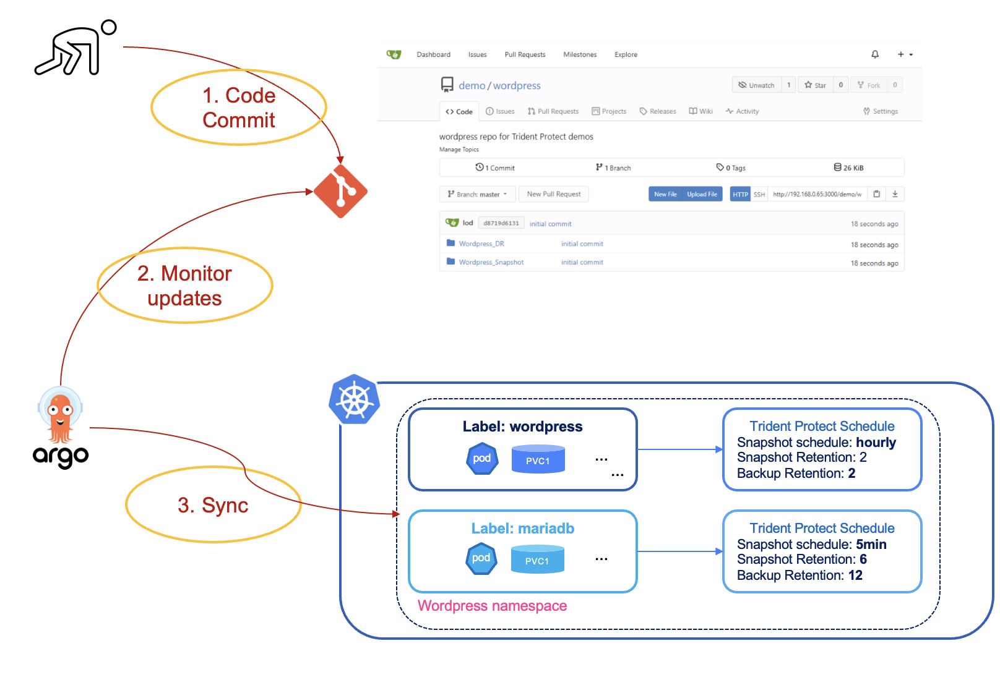
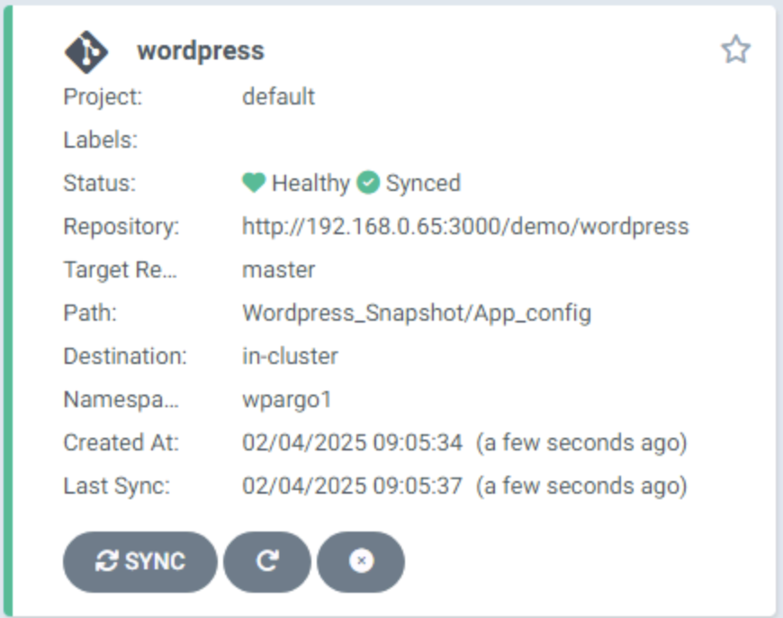
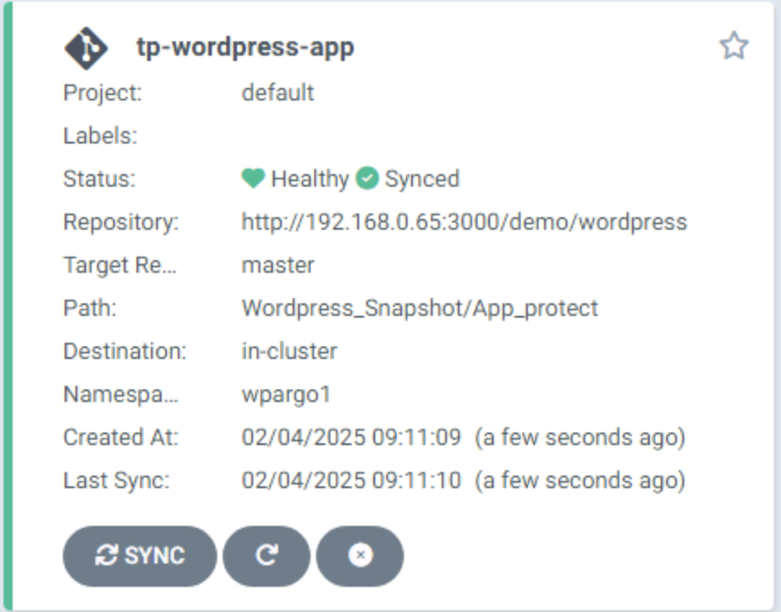

#########################################################################################
# SCENARIO 8: Protection policies & GitOps
#########################################################################################  

In this scenario, we are going see how we can automatically protect an application with Trident Protect & ArgoCD:
<p align="center"></p>

## A. Wordpress deployment with ArgoCD

Let's deploy a new application. Instead of creating it with Helm, we are going to use ArgoCD.  
This could be done with the GUI or via the ArgoCD CRD, method used in the following example:  
```bash
$ kubectl create -f ~/LabNetApp/Kubernetes_v6/Trident_Protect_Scenarios/Scenario08/1_Snapshot/argocd_wordpress_deploy.yaml
application.argoproj.io/wordpress created
```
In a nutshell, we defined in the _argocd_wordpress_deploy.yaml_ file the following:
- the repo where the YAML manifests are stored ("ht<span>tp://</span>192.168.0.203:30000/demo/wordpress")
- the directory to use in that repo (Wordpress_Snapshot/App_config)
- the target namespace (wpargo1)  

If all went well, you would see the app in the ArgoCD GUI:
<p align="center"></p>

This card does not automatically sync its content.  
In order for ArgoCD to deploy Wordpress, you can press on the **Sync** button on the app tile (leave all options as is).  
The application will immediately appear on the Kubernetes cluster:   
```bash
$ kubectl get -n wpargo1 pod,svc,pvc
NAME                                   READY   STATUS    RESTARTS   AGE
pod/wordpress-7c945b79c8-zv7sl         1/1     Running   0          3m52s
pod/wordpress-mysql-7c4d5fc78c-4xpjh   1/1     Running   0          3m52s

NAME                      TYPE           CLUSTER-IP       EXTERNAL-IP     PORT(S)        AGE
service/wordpress         LoadBalancer   172.28.187.240   192.168.0.213   80:32467/TCP   3m52s
service/wordpress-mysql   ClusterIP      None             <none>          3306/TCP       3m52s

NAME                              STATUS   VOLUME                                     CAPACITY   ACCESS MODES   STORAGECLASS         AGE
persistentvolumeclaim/mysql-pvc   Bound    pvc-9dc10e4f-54a8-45fe-a7db-4765b53b6165   20Gi       RWO            storage-class-nfs    3m52s
persistentvolumeclaim/wp-pvc      Bound    pvc-86ec7250-3566-48db-be92-107dd7e5eb88   20Gi       RWO            storage-class-nfs    3m52s
```
In the ArgoCD, once the application is fully deployed, you can the following:  
<p align="center"></p>


Connect to the address assigned by the Load Balancer (_192.168.0.213_ in this example) to check that it works.  
I recommend adding your own blog, so that you can really understand Trident Protect's benefits.  

## B. Wordpress protection with ArgoCD

Time to protect this application!  
The repo also has a few files in the _App_protect_ folder to create some Trident Protect CR:
- _wordpress-application.yaml_ to define the frontend as a Trident Protect application
- _mysql-application.yaml_ to define the backend as a Trident Protect application  
- _wordpress-schedule.yaml_ to automatically take snapshots & backups of the frontend  
- _mysql-schedule.yaml_ to automatically take snapshots & backups of the backend  
- _mysql-hook-pre-snap.yaml_ to quiesce the database so that the snapshot is consistent  
- _mysql-hook-post-snap.yaml_ to thaw the database  

>> Note that the pre snapshot hook used in this scenario will freeze the database for about a minute.    
>> The effect is that if you try to update the blog while the snapshot process is running, saving the result will wait for the database to be thawed.  
>> If you do not setup the hooks, the snapshot is almost immediate, which is fine for a demo, but maybe not for production...  

We defined in the _argocd_wordpress_protect.yaml_ file the following:
- the repo where the YAML manifests are stored ("ht<span>tp://</span>192.168.0.203:30000/demo/wordpress")  
- the directory to use in that repo (Wordpress_Snapshot/App_protect)  

The protecting schedule is configured this way:  
- frontend: hourly (10 minutes after the top of the hour) 
- backend: every 5 minutes  

You may want to change the frontend schedule if you want to witness quickly the creation of snapshots.  
```bash
$ kubectl create -f ~/LabNetApp/Kubernetes_v6/Trident_Protect_Scenarios/Scenario08/1_Snapshot/argocd_wordpress_protect.yaml
application.argoproj.io/tp-wordpress-app created
```
If all went well, you would see the app in the ArgoCD GUI:
<p align="center"></p>

Checked in the CLI, you can also see that the Trident Protect configuration is present, which means your application has been automatically set up for protection!  
```bash
$ tridentctl-protect get application -n wpargo1
+--------------------+------------+-------+-------+
|        NAME        | NAMESPACES | STATE |  AGE  |
+--------------------+------------+-------+-------+
| wordpress-frontend | wpargo1    | Ready | 3m14s |
| wordpress-mysql    | wpargo1    | Ready | 3m14s |
+--------------------+------------+-------+-------+

$ tridentctl-protect get schedule -n wpargo1
+--------------------+--------------------+--------------------------------+---------+-------+-----+-------+
|        NAME        |        APP         |            SCHEDULE            | ENABLED | STATE | AGE | ERROR |
+--------------------+--------------------+--------------------------------+---------+-------+-----+-------+
| wordpress-frontend | wordpress-frontend | Hourly:min=10                  | true    |       | 15s |       |
| wordpress-mysql    | wordpress-mysql    | DTSTART:20250106T000100Z       | true    |       | 15s |       |
|                    |                    | RRULE:FREQ=MINUTELY;INTERVAL=5 |         |       |     |       |
+--------------------+--------------------+--------------------------------+---------+-------+-----+-------+

$ tridentctl-protect get exechook -n wpargo1
+-----------------+-----------------+---------------------+----------+-------+---------+-----+-------+
|      NAME       |       APP       |        MATCH        |  ACTION  | STAGE | ENABLED | AGE | ERROR |
+-----------------+-----------------+---------------------+----------+-------+---------+-----+-------+
| mysql-snap-post | wordpress-mysql | containerName:mysql | Snapshot | Post  | true    | 44s |       |
| mysql-snap-pre  | wordpress-mysql | containerName:mysql | Snapshot | Pre   | true    | 42s |       |
+-----------------+-----------------+---------------------+----------+-------+---------+-----+-------+
```
Depending on the schedule set, you should see soon or later snapshots appear.  
Notice the difference of timing
```bash
$ tridentctl-protect get snapshot -n wpargo1
+-----------------------------+--------------------+-----------+--------+-------+
|            NAME             |      APP REF       |   STATE   |  AGE   | ERROR |
+-----------------------------+--------------------+-----------+--------+-------+
| custom-cc413-20250126160600 | wordpress-mysql    | Completed | 10m37s |       |
| custom-cc413-20250126161100 | wordpress-mysql    | Completed | 5m37s  |       |
| custom-cc413-20250126161600 | wordpress-mysql    | Completed | 37s    |       |
| hourly-03413-20250126161000 | wordpress-frontend | Completed | 6m37s  |       |
+-----------------------------+--------------------+-----------+--------+-------+
```

## C. Snapshot Restore

Now what?  
SEEK & DESTROY !!  

Let's delete the **wordpress** database, just for fun ...  
```bash
$ kubectl exec -n wpargo1 $(kubectl get pod -n wpargo1 -l tier=mysql -o name) -- sh -c 'export MYSQL_PWD=Netapp1!; mysql -e "SHOW DATABASES;"'
Database
information_schema
mysql
performance_schema
sys
wordpress

$ kubectl exec -n wpargo1 $(kubectl get pod -n wpargo1 -l tier=mysql -o name) -- sh -c 'export MYSQL_PWD=Netapp1!; mysql -e "DROP DATABASE wordpress;"'

$ kubectl exec -n wpargo1 $(kubectl get pod -n wpargo1 -l tier=mysql -o name) -- sh -c 'export MYSQL_PWD=Netapp1!; mysql -e "SHOW DATABASES;"'
Database
information_schema
mysql
performance_schema
sys
```
WHOOPSY ... I think I did it again...  

If you try to connect to the Wordpress UI, you will then see:
<p align="center"></p>

Let's try to restore lost data from one of our snapshots, in order to go back to a nominal state.  
Trident Protect allows to you to restore:
- in-place (to the source namespace)  
- to a different destination (same cluster or different cluster)  
- all the objects (full restore)  
- a subset of objects (partial restore)  

Let's restore only the PVC & the POD the latest mysql snapshot:  
```bash
$ tridentctl-protect create sir mysqlsir1 --snapshot wpargo1/custom-cc413-20250126161600 -n wpargo1 \
  --resource-filter-exclude='[{"kind":"Secret"},{"kind":"Service"}]'
SnapshotInplaceRestore "mysqlsir1" created.

$ tridentctl-protect get sir -n wpargo1
+-----------+-------------+-----------+------+-------+
|   NAME    |  APPVAULT   |   STATE   | AGE  | ERROR |
+-----------+-------------+-----------+------+-------+
| mysqlsir1 | ontap-vault | Completed | 1m1s |       |
+-----------+-------------+-----------+------+-------+
```
Once done, you can see from the "AGE" fields that the _excluded_ objects were indeed not restored from the snapshot:  
```bash
$ kubectl get -n wpargo1 pod,pvc,svc,secret
NAME                                   READY   STATUS    RESTARTS   AGE
pod/wordpress-7c945b79c8-zv7sl         1/1     Running   0          37m
pod/wordpress-mysql-5d8b966d55-lx8bn   1/1     Running   0          88s

NAME                              STATUS   VOLUME                                     CAPACITY   ACCESS MODES   STORAGECLASS        VOLUMEATTRIBUTESCLASS   AGE
persistentvolumeclaim/mysql-pvc   Bound    pvc-95ed0695-dbd3-4161-90a7-2e7a564c8886   20Gi       RWO            storage-class-nfs   <unset>                 89s
persistentvolumeclaim/wp-pvc      Bound    pvc-86ec7250-3566-48db-be92-107dd7e5eb88   20Gi       RWO            storage-class-nfs   <unset>                 37m

NAME                      TYPE           CLUSTER-IP       EXTERNAL-IP     PORT(S)        AGE
service/wordpress         LoadBalancer   172.28.187.240   192.168.0.213   80:30912/TCP   37m
service/wordpress-mysql   ClusterIP      None             <none>          3306/TCP       15m

NAME                TYPE     DATA   AGE
secret/mysql-pass   Opaque   1      15m
```

Next, you can also verify that the **mysql** database is back:  
```bash
$ kubectl exec -n wpargo1 $(kubectl get pod -n wpargo1 -l tier=mysql -o name) -- sh -c 'export MYSQL_PWD=Netapp1!; mysql -e "SHOW DATABASES;"'
Database
information_schema
mysql
performance_schema
sys
wordpress
```
Last, if you refresh the browser, Wordpress will be back on its feet, with the blog you created earlier. 
