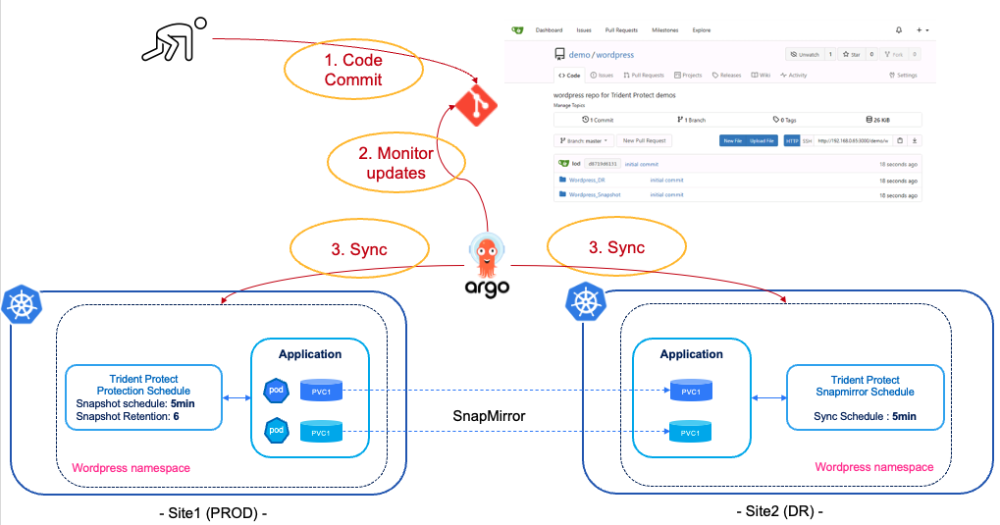
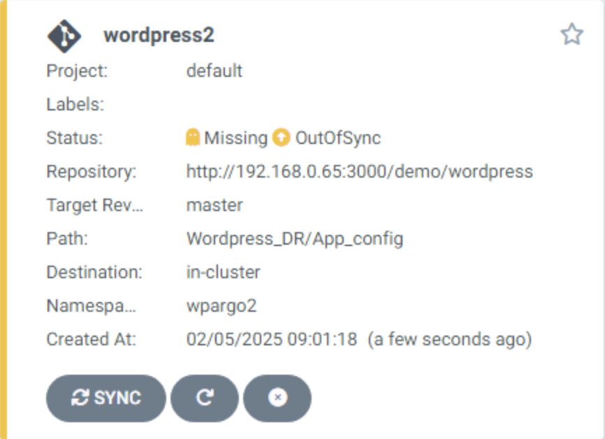
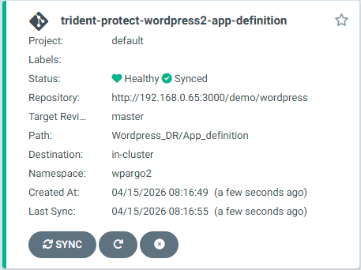
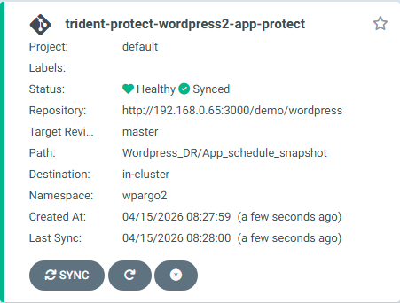
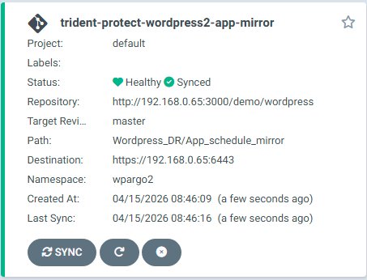
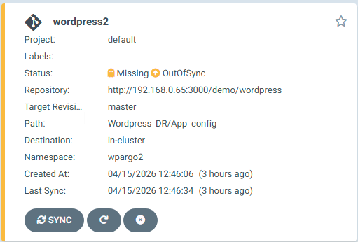
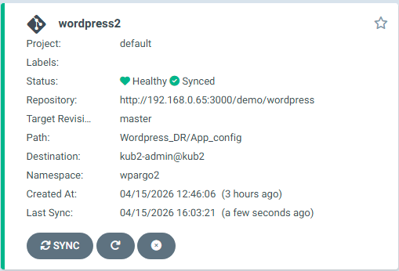
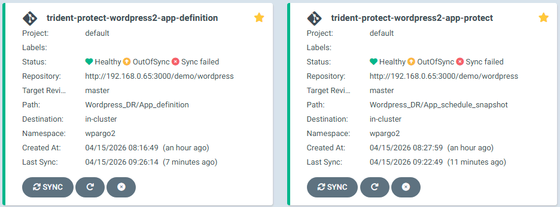
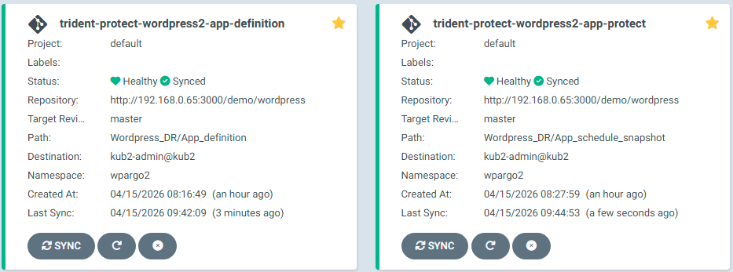

#########################################################################################
# SCENARIO 8: Disaster Recovery & GitOps
#########################################################################################  

In this chapter, we will see how to failover your application on a secondary cluster in case of a failure.  
<p align="center"></p>

## A. Wordpress deployment with ArgoCD

Let's deploy a new application. Instead of creating it with Helm, we are going to use ArgoCD one more time.  
This could be done with the GUI or via the ArgoCD CRD, method used in the following example:  
```bash
$ kubectl create -f ~/LabNetApp/Kubernetes_v6/Trident_Protect_Scenarios/Scenario08/2_DR/1-argocd-wordpress-deploy.yaml
application.argoproj.io/wordpress2 created
```
In a nutshell, we defined in the _argocd_wordpress_deploy.yaml_ file the following:
- the repo where the YAML manifests are stored ("ht<span>tp://</span>192.168.0.203:30000/demo/wordpress")
- the directory to use in that repo (Wordpress_DR/App_config)
- the target namespace (wpargo2)  

If all went well, you would see the app in the ArgoCD GUI:
<p align="center"></p>

This card does not automatically sync its content.  
In order for ArgoCD to deploy Wordpress, you can press on the **Sync** button on the app tile (leave all options as is).  
The application will immediately appear on the Kubernetes cluster:  
```bash
$ kubectl get -n wpargo2 pod,svc,pvc
NAME                                   READY   STATUS    RESTARTS   AGE
pod/wordpress-7755d84f78-ts7n5         1/1     Running   0          103s
pod/wordpress-mysql-5d8b966d55-hmwcs   1/1     Running   0          103s

NAME                      TYPE           CLUSTER-IP       EXTERNAL-IP     PORT(S)        AGE
service/wordpress         LoadBalancer   10.101.110.164   192.168.0.214   80:31453/TCP   104s
service/wordpress-mysql   ClusterIP      None             <none>          3306/TCP       104s

NAME                              STATUS   VOLUME                                     CAPACITY   ACCESS MODES   STORAGECLASS        VOLUMEATTRIBUTESCLASS   AGE
persistentvolumeclaim/mysql-pvc   Bound    pvc-14f39235-f5b0-4e78-8608-9b9a02ac4c35   20Gi       RWO            storage-class-nfs   <unset>                 104s
persistentvolumeclaim/wp-pvc      Bound    pvc-109e03c7-c31c-48a5-977d-7c762ad15b6c   20Gi       RWO            storage-class-nfs   <unset>                 104s
```
Connect to the address assigned by the Load Balancer (_192.168.0.214_ in this example) to check that it works.  
I recommend adding your own blog, so that you can really understand Trident Protect's benefits.  

## B. Wordpress snapshot scheduling with ArgoCD

We are now going to define Wordpress in Trident Protect, as well as create a snapshot schedule.  
The repo also has a few files to create some Trident Protect CR:
- _wordpress-application.yaml_ to define the wpargo2 namespace as Trident application  
- _wordpress-schedule.yaml_ to automatically take snapshots & backups of that application  
- _mysql-hook-pre-snap.yaml_ and _mysql-hook-post-snap.yaml_ for the snapshot consistency.  

We will use 2 separate cards in ArgoCD, in order to manage the application and the protection schedule differently depending on the cluster where the application runs.  

Let's first declare the Wordpress application in Trident Protect.  
This can be done with the _2-argocd-wordpress-declare.yaml_ file, which contains:  
- the repo where the YAML manifests are stored ("ht<span>tp://</span>192.168.0.203:30000/demo/wordpress")  
- the directory to use in that repo (Wordpress_DR/App_definition)  
- automated sync policy  

```bash
$ kubectl create -f ~/LabNetApp/Kubernetes_v6/Trident_Protect_Scenarios/Scenario08/2_DR/2-argocd-wordpress-declare.yaml
application.argoproj.io/trident-protect-wordpress2-app-definition created
```
You will immediately see a new card in the ArgoCD GUI. As auto-sync is enabled, ArgoCD will automatically create the corresponding objects in Trident Protect:  
<p align="center"></p>

You can verify that the result in Kubernetes:  
```bash
$ tridentctl-protect get app -n wpargo2
+-----------+------------+-------+------+
|   NAME    | NAMESPACES | STATE | AGE  |
+-----------+------------+-------+------+
| wordpress | wpargo2    | Ready | 2m8s |
+-----------+------------+-------+------+
$ tridentctl-protect get eh -n wpargo2
+-----------------+-----------+---------------------+----------+-------+---------+-------+-------+
|      NAME       |    APP    |        MATCH        |  ACTION  | STAGE | ENABLED | ERROR |  AGE  |
+-----------------+-----------+---------------------+----------+-------+---------+-------+-------+
| mysql-snap-post | wordpress | containerName:mysql | Snapshot | Post  | true    |       | 6m7s  |
| mysql-snap-pre  | wordpress | containerName:mysql | Snapshot | Pre   | true    |       | 6m10s |
+-----------------+-----------+---------------------+----------+-------+---------+-------+-------+
```
Let's proceed with the snapshot schedule:  
```bash
$ kubectl create -f ~/LabNetApp/Kubernetes_v6/Trident_Protect_Scenarios/Scenario08/2_DR/3-argocd-wordpress-protect.yaml
application.argoproj.io/trident-protect-wordpress2-app-protect created
```
You will immediately see a new card in the ArgoCD GUI. As auto-sync is enabled, ArgoCD will automatically create the snapshot schedule in Trident Protect, which in turn triggers a snapshot creation:  
<p align="center"></p>

Let's check the result:  
```bash
$ tridentctl-protect get sched -n wpargo2
+-----------+-----------+--------------------------------+-----+---------+-------+-------+-------+
|   NAME    |    APP    |            SCHEDULE            | FBR | ENABLED | STATE | ERROR |  AGE  |
+-----------+-----------+--------------------------------+-----+---------+-------+-------+-------+
| wordpress | wordpress | DTSTART:20250106T000100Z       |     | true    |       |       | 1m27s |
|           |           | RRULE:FREQ=MINUTELY;INTERVAL=5 |     |         |       |       |       |
+-----------+-----------+--------------------------------+-----+---------+-------+-------+-------+
$ tridentctl-protect get snap -n wpargo2
+-----------------------------+-----------+----------------+-----------+-------+-------+
|            NAME             |    APP    | RECLAIM POLICY |   STATE   | ERROR |  AGE  |
+-----------------------------+-----------+----------------+-----------+-------+-------+
| custom-5f47d-20260415082800 | wordpress | Delete         | Completed |       | 1m32s |
+-----------------------------+-----------+----------------+-----------+-------+-------+
$ tridentctl-protect get ehr -n wpargo2
+----------------------------------------------------+-----------+----------+-------+-----------------+-----------+-------+-------+
|                        NAME                        |    APP    |  ACTION  | STAGE | RESOURCE FILTER |   STATE   | ERROR |  AGE  |
+----------------------------------------------------+-----------+----------+-------+-----------------+-----------+-------+-------+
| post-snapshot-571ca450-407a-411d-a00d-889d54deb86e | wordpress | Snapshot | Post  | false           | Completed |       | 2m2s  |
| pre-snapshot-571ca450-407a-411d-a00d-889d54deb86e  | wordpress | Snapshot | Pre   | false           | Completed |       | 2m22s |
+----------------------------------------------------+-----------+----------+-------+-----------------+-----------+-------+-------+
```

There you go, the application is now protected locally.  

## C. Mirroring setup with ArgoCD

Time to setup the mirror.  

You can see in the repository a specific manifest in the *App_schedule_mirror* folder.  
It contains the configuration of the Trident Protect AMR (_AppMirrorRelationship_) object.  

Configuring an AMR requires knowing the UUID of the source app.  
As wordpress is now managed by Trident, we can retrieve that information and update the Git repository:  
```bash
$ APP_UUID=$(kubectl get application.protect.trident.netapp.io wordpress -o=jsonpath='{.metadata.uid}' -n wpargo2) && echo $APP_UUID
a9a1c12c-d4dd-4203-bb89-8691ab37e45c

$ sed -e s/CHANGE_ME/$APP_UUID/ -i ~/Repository/Wordpress_DR/App_schedule_mirror/wordpress-mirror.yaml

$ git adcom "added App ID"
[master e71098d] added App ID
 1 file changed, 1 insertions(+), 1 deletions(-)

$ git push
...
remote: Processed 1 references in total
To http://192.168.0.65:3000/demo/wordpress.git
   d8719d6..e71098d  master -> master
```
The Git repo is now up to date.  
But as you have noticed, ArgoCD is not yet connected to the secondary Kubernetes cluster.  
This can be achieved with the argocd binary, which will retrieve the kub2 context.  
Note that even if ArgoCD is configured without a password, that only applies to the GUI.  
You then first need to retrieve the initial admin password to interact with that binary:  
```bash
$ kubectl -n argocd get secret argocd-initial-admin-secret -o jsonpath="{.data.password}" | base64 -d; echo
qTTj3KFu52EpsGvd

$ argocd login 192.168.0.212 --username admin --password qTTj3KFu52EpsGvd --insecure
WARNING: server is not configured with TLS. Proceed (y/n)? y
'admin:login' logged in successfully
Context '192.168.0.212' updated

$ argocd cluster add kub2-admin@kub2 -y
INFO[0000] ServiceAccount "argocd-manager" already exists in namespace "kube-system"
INFO[0000] ClusterRole "argocd-manager-role" updated
INFO[0000] ClusterRoleBinding "argocd-manager-role-binding" updated
INFO[0000] Created bearer token secret for ServiceAccount "argocd-manager"
Cluster 'https://192.168.0.65:6443' added
```

We can finally create the mirror relationship:  
```bash
$ kubectl create -f ~/LabNetApp/Kubernetes_v6/Trident_Protect_Scenarios/Scenario08/2_DR/4-argocd-wordpress-mirror.yaml
application.argoproj.io/trident-protect-wordpress2-app-mirror created
```
A new card will appear in the ArgoCD GUI:  
<p align="center"></p>

This will launch the configuration of the AppMirrorRelationship in the target namespace:  
```bash
$ tridentctl-protect get amr -n wpargo2 --context kub2-admin@kub2
+-----------+------------+------------------+-----------------+-----------------------+---------------+-------------+-------+-------+
|   NAME    | SOURCE APP | SOURCE APP VAULT | DESTINATION APP | DESTINATION APP VAULT | DESIRED STATE |    STATE    | ERROR |  AGE  |
+-----------+------------+------------------+-----------------+-----------------------+---------------+-------------+-------+-------+
| wordpress | wordpress  | ontap-vault      | wordpress       | ontap-vault           | Established   | Established |       | 2m14s |
+-----------+------------+------------------+-----------------+-----------------------+---------------+-------------+-------+-------+
```

You can also check the content of the namespace, which should only have the target PVC for the time beeing:  
```bash
$ kubectl --context=kub2-admin@kub2 get -n wpargo2 pvc
NAME        STATUS   VOLUME                                     CAPACITY   ACCESS MODES   STORAGECLASS   VOLUMEATTRIBUTESCLASS   AGE
mysql-pvc   Bound    pvc-f5665b5a-3322-4fab-8b45-d8a7d8cfe0fc   20Gi       RWO            sc-nfs         <unset>                 103m
wp-pvc      Bound    pvc-60e385aa-28c3-44c3-b137-dd8c77ad0683   20Gi       RWO            sc-nfs         <unset>                 103m
```
Opening a terminal on the ONTAP platform will also prove that there is a new snapmirror relationship:  
```bash
cluster1::> snapmirror show
                                                                       Progress
Source            Destination Mirror  Relationship   Total             Last
Path        Type  Path        State   Status         Progress  Healthy Updated
----------- ---- ------------ ------- -------------- --------- ------- --------
nassvm:trident_pvc_109e03c7_c31c_48a5_977d_7c762ad15b6c
            XDP  svm_secondary:trident_pvc_60e385aa_28c3_44c3_b137_dd8c77ad0683
                              Snapmirrored
                                      Idle           -         true    -
nassvm:trident_pvc_14f39235_f5b0_4e78_8608_9b9a02ac4c35
            XDP  svm_secondary:trident_pvc_f5665b5a_3322_4fab_8b45_d8a7d8cfe0fc
                              Snapmirrored
                                      Idle           -         true    -
2 entries were displayed.
```
At this point, your application is fully protect with a snapshot schedule & a mirror relationship.  

## D. Failing over your application

Time to break something!  
Let's delete the whole primary namespace:  
```bash
$ kubectl delete ns wpargo2
namespace "wpargo2" deleted
```
While it takes a few seconds to complete, you can immediately see in ArgoCR that there is an issue:
<p align="center"></p>

In order to failover your application, you could change the target AMR manually...  
But the game here is to use your Git repo as a source of truth. Let's change the state of the CR in the repo:  
```bash
$ sed -e 's/Established/Promoted/' -i ~/Repository/Wordpress_DR/App_schedule_mirror/wordpress-mirror.yaml

$ git adcom "app failover"
1 file changed, 1 insertion(+), 1 deletion(-)

$ git push
...
remote: Processed 1 references in total
To http://192.168.0.65:3000/demo/wordpress.git
   e71098d..54359ab  master -> master
```
Note that the change should automatically be detected & processed by ArgoCD.  
By default, ArgoCD checks the repo every 180seconds. For this demo, the reconciliation timeout has been changed to 10 seconds.  

Once the reconciliation happens, you will see your application failing over.  
You could also click on "Sync" on the "trident-protect-wordpress2-app-mirror" tile, which will trigger the update if you are in a hurry:  
```bash
$ tridentctl-protect get amr -n wpargo2 --context kub2-admin@kub2
+-----------+------------+------------------+-----------------+-----------------------+---------------+----------+-------+--------+
|   NAME    | SOURCE APP | SOURCE APP VAULT | DESTINATION APP | DESTINATION APP VAULT | DESIRED STATE |  STATE   | ERROR |  AGE   |
+-----------+------------+------------------+-----------------+-----------------------+---------------+----------+-------+--------+
| wordpress | wordpress  | ontap-vault      | wordpress       | ontap-vault           | Promoted      | Promoted |       | 33m38s |
+-----------+------------+------------------+-----------------+-----------------------+---------------+----------+-------+--------+

$ kubectl --context=kub2-admin@kub2 get -n wpargo2 all,pvc
NAME                                   READY   STATUS    RESTARTS   AGE
pod/wordpress-7755d84f78-lmgb7         1/1     Running   0          2m33s
pod/wordpress-mysql-5d8b966d55-jlc6b   1/1     Running   0          2m33s
```
At this point, the PVC are now available on the secondary cluster.  
You then need to tell ArgoCD to redeploy the whole app on the secondary cluster.  
You can do this through the GUI or by patching the resource:  
```bash
$ kubectl patch application wordpress2 -n argocd --type=merge -p '{"spec":{"destination":{"server":"https://192.168.0.65:6443"}}}'
application.argoproj.io/wordpress2 patched
```
Once done, you can sync the application. This task can also be done with the GUI or the CLI:  
```bash
argocd app sync wordpress2
```
Notice that the card displays the correct cluster name:  
<p align="center"></p>

If you check the content of the namespace, you will see now that Wordpress is back on its feet:  
```bash
$ kubectl --context=kub2-admin@kub2 get -n wpargo2 pod,svc,pvc
NAME                                   READY   STATUS    RESTARTS   AGE
pod/wordpress-7755d84f78-tq24w         1/1     Running   0          3m17s
pod/wordpress-mysql-5d8b966d55-5l726   1/1     Running   0          3m17s

NAME                      TYPE           CLUSTER-IP       EXTERNAL-IP     PORT(S)        AGE
service/wordpress         LoadBalancer   10.108.223.168   192.168.0.220   80:30173/TCP   3m17s
service/wordpress-mysql   ClusterIP      None             <none>          3306/TCP       3m17s

NAME                              STATUS   VOLUME                                     CAPACITY   ACCESS MODES   STORAGECLASS   VOLUMEATTRIBUTESCLASS   AGE
persistentvolumeclaim/mysql-pvc   Bound    pvc-3cb65351-2867-4860-a25d-bae943cc1067   20Gi       RWO            sc-nfs         <unset>                 37m
persistentvolumeclaim/wp-pvc      Bound    pvc-2d554711-9e05-49e2-a874-629de4e3fb0c   20Gi       RWO            sc-nfs         <unset>                 37m
```

By connecting to the IP address provided by the Load Balancer (192.168.0.220 in this example), you will see your blog!  
& With that you saw how to manage, protect & failover your application following GitOps methodologies.  

Note that in this lab, Wordpress is accessed with an IP address, not a FQDN.  
This information is also stored in the MySQL Database:  
```bash
$ kubectl exec -n wpargo2 $(kubectl get pod -n wpargo2 -l tier=mysql -o name) --   sh -c 'export MYSQL_PWD=Netapp1!; mysql -e "SELECT option_name, option_value FROM wordpress.wp_options WHERE option_name IN ('\''siteurl'\'', '\''home'\'');"'
option_name     option_value
home    http://192.168.0.214
siteurl http://192.168.0.214
```
If you start navigating through the failed over Wordpress instance, you will quickly see that it is trying to reach the old IP address, which does not exist anymore...  
Here is a command to update it to the correct value:  
```bash
SITEIP=$(kubectl -n wpargo2 get svc wordpress -o jsonpath="{.status.loadBalancer.ingress[0].ip}") && echo $SITEIP
kubectl exec -n wpargo2 $(kubectl get pod -n wpargo2 -l tier=mysql -o name) -- \
  sh -c "export MYSQL_PWD=Netapp1\!; mysql -e \"UPDATE wordpress.wp_options SET option_value = 'http://$SITEIP' WHERE option_name IN ('siteurl', 'home');\""
``` 

Next, now that Wordpress is running again, you also need to modify the Trident Protect definition card, as well as the snapshot schedule.  
You can see in the GUI that both cards are in _Sync failed_ status:
<p align="center"></p>

When creating a mirror relationship with Trident Protect, an _application_ is automatically created on the secondary cluster:  
```bash
$ tridentctl-protect get app -n wpargo2 --context kub2-admin@kub2
+-----------+------------+-------+--------+
|   NAME    | NAMESPACES | STATE |  AGE   |
+-----------+------------+-------+--------+
| wordpress | wpargo2    | Ready | 39m10s |
+-----------+------------+-------+--------+
```
We then just need to tell ArgoCD to monitor the corresponding card on the secondary cluster:  
```bash
$ kubectl patch application trident-protect-wordpress2-app-definition -n argocd --type=merge -p '{"spec":{"destination":{"server":"https://192.168.0.65:6443"}}}'
application.argoproj.io/trident-protect-wordpress2-app-definition patched
```
Once done, you can also perform the same operation for the snapshot schedule:  
```bash
$ kubectl patch application trident-protect-wordpress2-app-protect -n argocd --type=merge -p '{"spec":{"destination":{"server":"https://192.168.0.65:6443"}}}'
application.argoproj.io/trident-protect-wordpress2-app-protect patched
```
Once reconciled, everything is _green_ again!  
<p align="center"></p>

Let's check the content of the namespace one last time:  
```bash
$ tridentctl-protect get schedule -n wpargo2 --context kub2-admin@kub2
+-----------+-----------+--------------------------------+-----+---------+-------+-------+-------+
|   NAME    |    APP    |            SCHEDULE            | FBR | ENABLED | STATE | ERROR |  AGE  |
+-----------+-----------+--------------------------------+-----+---------+-------+-------+-------+
| wordpress | wordpress | DTSTART:20250106T000100Z       |     | true    |       |       | 1m41s |
|           |           | RRULE:FREQ=MINUTELY;INTERVAL=5 |     |         |       |       |       |
+-----------+-----------+--------------------------------+-----+---------+-------+-------+-------+
$ tridentctl-protect get snapshot -n wpargo2 --context kub2-admin@kub2
+-----------------------------+-----------+----------------+-----------+-------+-------+
|            NAME             |    APP    | RECLAIM POLICY |   STATE   | ERROR |  AGE  |
+-----------------------------+-----------+----------------+-----------+-------+-------+
| custom-3d2c8-20260415094454 | wordpress | Delete         | Completed |       | 1m50s |
+-----------------------------+-----------+----------------+-----------+-------+-------+
$ tridentctl-protect get ehr -n wpargo2 --context kub2-admin@kub2
+----------------------------------------------------+-----------+----------+-------+-----------------+-----------+-------+-------+
|                        NAME                        |    APP    |  ACTION  | STAGE | RESOURCE FILTER |   STATE   | ERROR |  AGE  |
+----------------------------------------------------+-----------+----------+-------+-----------------+-----------+-------+-------+
| post-snapshot-9aa52d87-f43f-4542-a8e5-94f5f331994b | wordpress | Snapshot | Post  | false           | Completed |       | 1m40s |
| pre-snapshot-9aa52d87-f43f-4542-a8e5-94f5f331994b  | wordpress | Snapshot | Pre   | false           | Completed |       | 1m59s |
+----------------------------------------------------+-----------+----------+-------+-----------------+-----------+-------+-------+
```

And voilà !

About the reconciliation timeout, you can check the value in one of the ArgoCD config maps:  
```bash
$ kubectl get -n argocd cm argocd-cm -o jsonpath={".data.timeout\.reconciliation"}; echo
10s
```
This duration was set during the Argo installation with Helm. 

<!-- NOTES

# How to display the PROCESSLIST table
kubectl exec -n wpargo2 $(kubectl get pod -n wpargo2 -l tier=mysql -o name) -- sh -c 'export MYSQL_PWD=Netapp1!; mysql -e "SHOW PROCESSLIST;"'

# How to display if Trident Protect finds a match for all ExecHooksRun
kubectl get exechooksrun -n wpargo2 -o custom-columns='NAME:.metadata.name,APP:.spec.applicationRef,STATE:.status.state,AGE:.metadata.creationTimestamp,MATCHES:.status.conditions[0].message'

# How to delete all 4 apps in one command
argocd app delete -y trident-protect-wordpress2-app-mirror trident-protect-wordpress2-app-protect trident-protect-wordpress2-app-definition wordpress2

# How to display the sites URL stored in the MySQL database
kubectl exec -n wpargo2 $(kubectl get pod -n wpargo2 -l tier=mysql -o name) -- \
  sh -c 'export MYSQL_PWD=Netapp1!; mysql -e "SELECT option_name, option_value FROM wordpress.wp_options WHERE option_name IN ('\''siteurl'\'', '\''home'\'');"'

# How to update the sites URL stored in the MySQL database
SITEIP=$(kubectl -n wpargo2 get svc wordpress -o jsonpath="{.status.loadBalancer.ingress[0].ip}") && echo $SITEIP
kubectl exec -n wpargo2 $(kubectl get pod -n wpargo2 -l tier=mysql -o name) -- \
  sh -c "export MYSQL_PWD=Netapp1\!; mysql -e \"UPDATE wordpress.wp_options SET option_value = 'http://$SITEIP' WHERE option_name IN ('siteurl', 'home');\""

-->