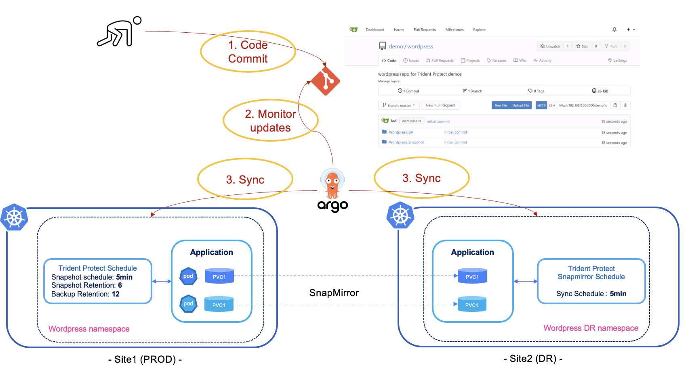

#########################################################################################
# SCENARIO 8: Disaster Recovery & GitOps
#########################################################################################  

In this chapter, we will see how to failover your application on a secondary cluster in case of a failure.  
<p align="center"></p>

## A. Wordpress deployment with ArgoCD

Let's deploy a new application. Instead of creating it with Helm, we are going to use ArgoCD one more time.  
This could be done with the GUI or via the ArgoCD CRD, method used in the following example:  
```bash
$ kubectl create -f ~/LabNetApp/Kubernetes_v6/Trident_Protect_Scenarios/Scenario08/2_DR/argocd_wordpress_deploy.yaml
application.argoproj.io/wordpress2 created
```
In a nutshell, we defined in the _argocd_wordpress_deploy.yaml_ file the following:
- the repo where the YAML manifests are stored ("ht<span>tp://</span>192.168.0.203:30000/demo/wordpress")
- the directory to use in that repo (Wordpress_DR/App_config)
- the target namespace (wpargo2)  

If all went well, you would see the app in the ArgoCD GUI:
<p align="center"></p>

This card does not automatically sync its content.  
In order for ArgoCD to deploy Wordpress, you can press on the **Sync** button on the app tile (leave all options as is).  
The application will immediately appear on the Kubernetes cluster:  
```bash
$ kubectl get -n wpargo2 pod,svc,pvc
NAME                                   READY   STATUS    RESTARTS   AGE
pod/wordpress-7755d84f78-ts7n5         1/1     Running   0          103s
pod/wordpress-mysql-5d8b966d55-hmwcs   1/1     Running   0          103s

NAME                      TYPE           CLUSTER-IP       EXTERNAL-IP     PORT(S)        AGE
service/wordpress         LoadBalancer   10.101.110.164   192.168.0.214   80:31453/TCP   104s
service/wordpress-mysql   ClusterIP      None             <none>          3306/TCP       104s

NAME                              STATUS   VOLUME                                     CAPACITY   ACCESS MODES   STORAGECLASS        VOLUMEATTRIBUTESCLASS   AGE
persistentvolumeclaim/mysql-pvc   Bound    pvc-14f39235-f5b0-4e78-8608-9b9a02ac4c35   20Gi       RWO            storage-class-nfs   <unset>                 104s
persistentvolumeclaim/wp-pvc      Bound    pvc-109e03c7-c31c-48a5-977d-7c762ad15b6c   20Gi       RWO            storage-class-nfs   <unset>                 104s
```
Connect to the address assigned by the Load Balancer (_192.168.0.214_ in this example) to check that it works.  
I recommend adding your own blog, so that you can really understand Trident Protect's benefits.  

## B. Wordpress snapshot scheduling with ArgoCD

We are now going to define wordpress in Trident Protect, as well as add a snapshot
The repo also has a few files in the _App_tp_definition_ folder to create some Trident Protect CR:
- _wordpress-application.yaml_ to define the wpargo2 namespace as Trident application  
- _wordpress-schedule.yaml_ to automatically take snapshots & backups of that application  

We defined in the _argocd_wordpress_protect.yaml_ file the following:
- the repo where the YAML manifests are stored ("ht<span>tp://</span>192.168.0.203:30000/demo/wordpress")  
- the directory to use in that repo (Wordpress_DR/App_tp_definition)  
- automated sync policy  

The protecting schedule is configured to take a snapshot every 5 minutes.  

You may want to change the frontend schedule if you want to witness quickly the creation of snapshots.  
```bash
$ kubectl create -f ~/LabNetApp/Kubernetes_v6/Trident_Protect_Scenarios/Scenario08/2_DR/argocd_wordpress_protect.yaml
application.argoproj.io/tp-wordpress2-app created
```
If all went well, you would see the app in the ArgoCD GUI:
<p align="center"></p>

Checked in the CLI, you can also see that the Trident Protect configuration is present, which means your application has been automatically set up for protection!  
```bash
$ tridentctl-protect get application -n wpargo2
+-----------+------------+-------+-------+
|    NAME   | NAMESPACES | STATE |  AGE  |
+-----------+------------+-------+-------+
| wordpress | wpargo2    | Ready | 3m14s |
+-----------+------------+-------+-------+

$ tridentctl-protect get schedule -n wpargo2
+-----------+-----------+--------------------------------+---------+-------+-----+-------+
|    NAME   |    APP    |            SCHEDULE            | ENABLED | STATE | AGE | ERROR |
+-----------+-----------+--------------------------------+---------+-------+-----+-------+
| wordpress | wordpress | DTSTART:20250106T000100Z       | true    |       | 15s |       |
|           |           | RRULE:FREQ=MINUTELY;INTERVAL=5 |         |       |     |       |
+-----------+-----------+--------------------------------+---------+-------+-----+-------+
```
Depending on the schedule set, you should see soon or later snapshots appear.  
Notice the difference of timing
```bash
$ tridentctl-protect get snapshot -n wpargo2
+-----------------------------+-----------+-----------+-------+-------+
|            NAME             |  APP REF  |   STATE   |  AGE  | ERROR |
+-----------------------------+-----------+-----------+-------+-------+
| custom-9ad85-20250204102100 | wordpress | Completed | 9m14s |       |
| custom-9ad85-20250204102600 | wordpress | Completed | 4m14s |       |
+-----------------------------+-----------+-----------+-------+-------+
```
There you go, the application is now protected locally.  

## C. Mirroring setup with ArgoCD

Time to setup the mirror.  

You can see in the repository a specific manifest in the *App_tp_dr* folder.  
It contains the configuration of the Trident Protect AMR (_AppMirrorRelationship_) object.  

Configuring an AMR requires knowing the UUID of the source app.  
As wordpress is now managed by Trident, we can retrieve that information and update the Git repository:  
```bash
$ kubectl get application.protect.trident.netapp.io wordpress -o=jsonpath='{.metadata.uid}' -n wpargo2; echo
a9a1c12c-d4dd-4203-bb89-8691ab37e45c

$ sed -e 's/CHANGE_ME/a9a1c12c-d4dd-4203-bb89-8691ab37e45c/' -i ~/Repository/Wordpress_DR/App_tp_dr/wordpress-dr.yaml

$ git adcom "added App ID"
[master e71098d] added App ID
 1 file changed, 1 insertions(+), 1 deletions(-)

$ git push
...
remote: Processed 1 references in total
To http://192.168.0.65:3000/demo/wordpress.git
   d8719d6..e71098d  master -> master
```
The Git repo is now up to date.  
But as you have noticed, ArgoCD is not yet connected to the secondary Kubernetes cluster.  
This can be achieved with the argocd binary, which will retrieve the kub2 context.  
Note that even if ArgoCD is configured without a password, that only applies to the GUI.  
You then first need to retrieve the initial admin password to interact with that binary:  
```bash
$ kubectl -n argocd get secret argocd-initial-admin-secret -o jsonpath="{.data.password}" | base64 -d; echo
qTTj3KFu52EpsGvd

$  argocd login 192.168.0.212 --username admin --password qTTj3KFu52EpsGvd --insecure
WARNING: server is not configured with TLS. Proceed (y/n)? y
'admin:login' logged in successfully
Context '192.168.0.212' updated

$ argocd cluster add kub2-admin@kub2 -y
INFO[0000] ServiceAccount "argocd-manager" already exists in namespace "kube-system"
INFO[0000] ClusterRole "argocd-manager-role" updated
INFO[0000] ClusterRoleBinding "argocd-manager-role-binding" updated
INFO[0000] Created bearer token secret for ServiceAccount "argocd-manager"
Cluster 'https://192.168.0.65:6443' added
```

We can finally create the mirror relationship:  
```bash
$ kubectl create -f ~/LabNetApp/Kubernetes_v6/Trident_Protect_Scenarios/Scenario08/2_DR/argocd_wordpress_dr_setup.yaml
application.argoproj.io/tp-wordpress2-dr created
```
A new card will appear in the ArgoCD GUI:  
<p align="center"></p>

You can also check the content of the namespace, which should only have the target PVC for the time beeing:  
```bash
$ kubectl --context=kub2-admin@kub2 get -n wpargo2dr pvc
NAME        STATUS   VOLUME                                     CAPACITY   ACCESS MODES   STORAGECLASS   VOLUMEATTRIBUTESCLASS   AGE
mysql-pvc   Bound    pvc-f5665b5a-3322-4fab-8b45-d8a7d8cfe0fc   20Gi       RWO            sc-nfs         <unset>                 103m
wp-pvc      Bound    pvc-60e385aa-28c3-44c3-b137-dd8c77ad0683   20Gi       RWO            sc-nfs         <unset>                 103m
```
Opening a terminal on the ONTAP platform will also prove that there is a new snapmirror relationship:  
```bash
cluster1::> snapmirror show
                                                                       Progress
Source            Destination Mirror  Relationship   Total             Last
Path        Type  Path        State   Status         Progress  Healthy Updated
----------- ---- ------------ ------- -------------- --------- ------- --------
nassvm:trident_pvc_109e03c7_c31c_48a5_977d_7c762ad15b6c
            XDP  svm_secondary:trident_pvc_60e385aa_28c3_44c3_b137_dd8c77ad0683
                              Snapmirrored
                                      Idle           -         true    -
nassvm:trident_pvc_14f39235_f5b0_4e78_8608_9b9a02ac4c35
            XDP  svm_secondary:trident_pvc_f5665b5a_3322_4fab_8b45_d8a7d8cfe0fc
                              Snapmirrored
                                      Idle           -         true    -
2 entries were displayed.
```
At this point, your application is fully protect with snapshots, backups & mirror.  

## D. Failing over your application

Time to break something!  
Let's delete the whole primary namespace:  
```bash
$ kubectl delete ns wpargo2
namespace "wpargo2" deleted
```
While it takes a few seconds to complete, you can immediately see in ArgoCR that there is an issue:
<p align="center"></p>

In order to failover your application, you could change the target AMR manually...  
But the game here is to use your Git repo as a source of truth. Let's change the state of the CR in the repo:  
```bash
$ sed -e 's/Established/Promoted/' -i ~/Repository/Wordpress_DR/App_tp_dr/wordpress-dr.yaml

$ git adcom "app failover"
1 file changed, 1 insertion(+), 1 deletion(-)

$ git push
...
remote: Processed 1 references in total
To http://192.168.0.65:3000/demo/wordpress.git
   e71098d..54359ab  master -> master
```
Note that the change should automatically be detected & processed by ArgoCD.  
By default, ArgoCD checks the repo every 180seconds. For this demo, the reconciliation timeout has been changed to 10 seconds.  

Once the reconciliation happens, you will see your application failing over.  
You could also click on "Sync" on the "tp-wordpress2-dr" tile, which will trigger the update if you are in a hurry:  
```bash
$ kubectl --context=kub2-admin@kub2 get -n trident-protect amr -n wpargo2dr
NAME        DESIRED STATE   STATE      ERROR   AGE
wordpress   Promoted        Promoted           117m

$ kubectl --context=kub2-admin@kub2 get -n wpargo2dr pod,svc,pvc
NAME                                   READY   STATUS    RESTARTS   AGE
pod/wordpress-7755d84f78-lmgb7         1/1     Running   0          2m33s
pod/wordpress-mysql-5d8b966d55-jlc6b   1/1     Running   0          2m33s

NAME                      TYPE           CLUSTER-IP      EXTERNAL-IP     PORT(S)        AGE
service/wordpress         LoadBalancer   10.106.205.26   192.168.0.220   80:31354/TCP   2m33s
service/wordpress-mysql   ClusterIP      None            <none>          3306/TCP       2m33s

NAME                              STATUS   VOLUME                                     CAPACITY   ACCESS MODES   STORAGECLASS   VOLUMEATTRIBUTESCLASS   AGE
persistentvolumeclaim/mysql-pvc   Bound    pvc-f5665b5a-3322-4fab-8b45-d8a7d8cfe0fc   20Gi       RWO            sc-nfs         <unset>                 116m
persistentvolumeclaim/wp-pvc      Bound    pvc-60e385aa-28c3-44c3-b137-dd8c77ad0683   20Gi       RWO            sc-nfs         <unset>                 116m
```

By connecting to the IP address provided by the Load Balancer (192.168.0.220 in this example), you will see your blog!  
& With that you saw how to manage, protect & failover your application following GitOps methodologies.  

About the reconciliation timeout, you can check the value in one of the ArgoCD config maps:  
```bash
$ kubectl get -n argocd cm argocd-cm -o jsonpath={".data.timeout\.reconciliation"}; echo
10s
```
This duration was set during the Argo installation with Helm.  