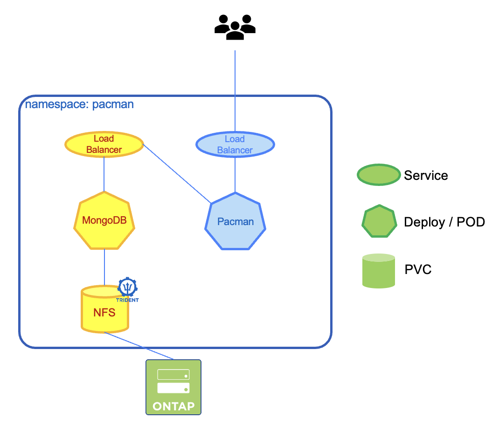
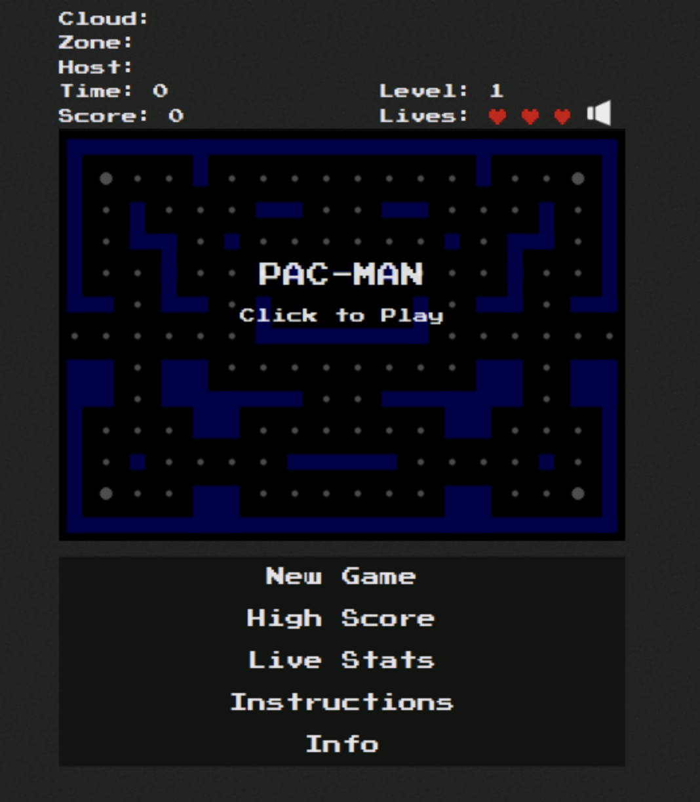

#########################################################################################
# SCENARIO 2.1: Pacman's installation
#########################################################################################

Pacman is essentially a NodeJS application that uses a MongoDB database to store its scores.  
More details about it can be found on the following links:
- https://github.com/font/pacman 
- https://github.com/font/k8s-example-apps/tree/master/pacman-nodejs-app  

<p align="center"></p>

As we are using the lab image registry, you can run the following script to pull & push the required Mongo image:  
```bash
sh scenario09_pull_images.sh
```

Let's deploy Pacman !  
```bash
$ kubectl create -f pacman.yaml
namespace/pacman created
persistentvolumeclaim/mongo-storage created
service/mongo created
deployment.apps/mongo created
service/pacman created
deployment.apps/pacman created

$ kubectl get -n pacman pod,pvc,svc
NAME                         READY   STATUS    RESTARTS   AGE
pod/mongo-89f5b4697-pdxkc    1/1     Running   0          13m
pod/pacman-b5ddc45d9-6vt5s   1/1     Running   0          13m

NAME                                  STATUS   VOLUME                                     CAPACITY   ACCESS MODES   STORAGECLASS        VOLUMEATTRIBUTESCLASS   AGE
persistentvolumeclaim/mongo-storage   Bound    pvc-263eb43d-a4b8-4ae8-ac7b-2ac8d6eea521   8Gi        RWO            storage-class-nfs   <unset>                 13m

NAME             TYPE           CLUSTER-IP      EXTERNAL-IP     PORT(S)           AGE
service/mongo    LoadBalancer   10.111.46.167   192.168.0.214   27017:32077/TCP   13m
service/pacman   LoadBalancer   10.111.210.70   192.168.0.215   80:30855/TCP      13m
```

In my example, Pacman is available on the _192.168.0.215_ address.  
Let's give it a try!  
<p align="center"></p>

Time to have fun, play a few games & enter some names for the high scores.  
In my case, I have:
<p align="center"></p>

You can also check that the highscores have been properly entered in the database with the following command:
```bash
$ kubectl exec -it -n pacman $(kubectl get pod -n pacman -l "name=mongo" -o name) -- mongo --eval 'db.highscore.find().pretty()' pacman
MongoDB shell version: 3.2.21
connecting to: pacman
{
	"_id" : ObjectId("642d49034b50670012f4fef8"),
	"name" : "KATOS",
	"cloud" : "unknown",
	"zone" : "unknown",
	"host" : "unknown",
	"score" : 1530,
	"level" : 1,
	"date" : "Thu Jan 05 2023 10:10:11 GMT+0000 (UTC)",
	"referer" : "http://192.168.0.232/",
	"user_agent" : "Mozilla/5.0 (X11; Linux x86_64) AppleWebKit/537.36 (KHTML, like Gecko) Chrome/111.0.0.0 Safari/537.36",
	"hostname" : "192.168.0.232",
	"ip_addr" : "::ffff:192.168.0.223"
}
{
	"_id" : ObjectId("642d59284b50670012f4fef9"),
	"name" : "yvos",
	"cloud" : "unknown",
	"zone" : "unknown",
	"host" : "unknown",
	"score" : 1250,
	"level" : 1,
	"date" : "Thu Jan 05 2023 11:19:04 GMT+0000 (UTC)",
	"referer" : "http://192.168.0.232/",
	"user_agent" : "Mozilla/5.0 (X11; Linux x86_64) AppleWebKit/537.36 (KHTML, like Gecko) Chrome/111.0.0.0 Safari/537.36",
	"hostname" : "192.168.0.232",
	"ip_addr" : "::ffff:192.168.0.223"
}
```

Now that some scores are saved on the database, you can proceed with managing the app with [Trident Protect](../2_Protect)
