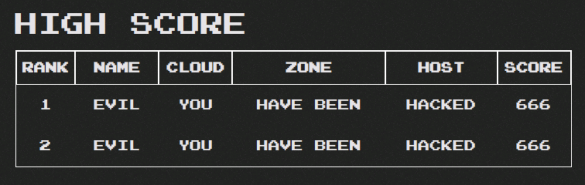
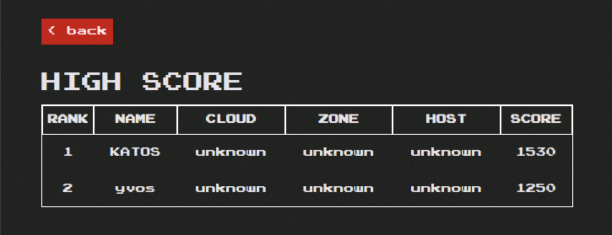

#########################################################################################
# SCENARIO 2.3: Seek & Destroy ! (and restore)
#########################################################################################

We currently are in a safe zone. Pacman is running. Snapshots & backups are planned.  
Similarly to most fairy tales, an evil person joins the party !

```bash
$ kubectl exec -it -n pacman $(kubectl get pod -n pacman -l "name=mongo" -o name) -- mongo --eval 'db.highscore.updateMany({},{$set:{name:"EVIL",cloud:"YOU",zone:"HAVE BEEN",host:"HACKED",score:"666"}});' pacman
MongoDB shell version: 3.2.21
connecting to: pacman
{ "acknowledged" : true, "matchedCount" : 2, "modifiedCount" : 0 }
```

<p align="center">:boom: :boom: :boom: :boom: :boom: :boom: :boom: :boom: :boom: :boom: :boom: :boom: :boom: :boom: :boom: :boom:</p>  
<p align="center"></p>
<p align="center">:boom: :boom: :boom: :boom: :boom: :boom: :boom: :boom: :boom: :boom: :boom: :boom: :boom: :boom: :boom: :boom:</p>  

As a great wise man would say: "oh oh !"  

No worries, you did all the necessary to protect your application.  
In my case, I can simply perform an _in place restore_ operation from the first manual snapshot we took.  
```bash
$ tridentctl protect create sir pacsir1 --snapshot pacman/pacsnap1 --resource-filter-include='[{"kind":"PersistentVolumeClaim"}]' -n pacman
SnapshotInplaceRestore "pacsir1" created.

$ tridentctl protect get sir -n pacman
+---------+-------------+-----------+-----+-------+
|  NAME   |  APPVAULT   |   STATE   | AGE | ERROR |
+---------+-------------+-----------+-----+-------+
| pacsir1 | ontap-vault | Completed | 51s |       |
+---------+-------------+-----------+-----+-------+
```
The Pacman app only has one PVC that hosts the Mongo database.  
Filtering on the PVC will also trigger a restore of the pod mounting the volume (you can verify that with the _AGE_ of the objects):  
```bash
$ kubectl get -n pacman pod,pvc,svc
NAME                         READY   STATUS    RESTARTS   AGE
pod/mongo-89f5b4697-hhcc8    1/1     Running   0          87s
pod/pacman-b5ddc45d9-6vt5s   1/1     Running   0          79m

NAME                                  STATUS   VOLUME                                     CAPACITY   ACCESS MODES   STORAGECLASS        VOLUMEATTRIBUTESCLASS   AGE
persistentvolumeclaim/mongo-storage   Bound    pvc-263eb43d-a4b8-4ae8-ac7b-2ac8d6eea521   8Gi        RWO            storage-class-nfs   <unset>                 88s

NAME             TYPE           CLUSTER-IP      EXTERNAL-IP     PORT(S)           AGE
service/mongo    LoadBalancer   10.111.46.167   192.168.0.214   27017:32077/TCP   79m
service/pacman   LoadBalancer   10.111.210.70   192.168.0.215   80:30855/TCP      79m
```
Now that the operation is done, you can go back to the game & see your scores again.  

<p align="center"></p>

& Once again, Trident saved the world from evil !