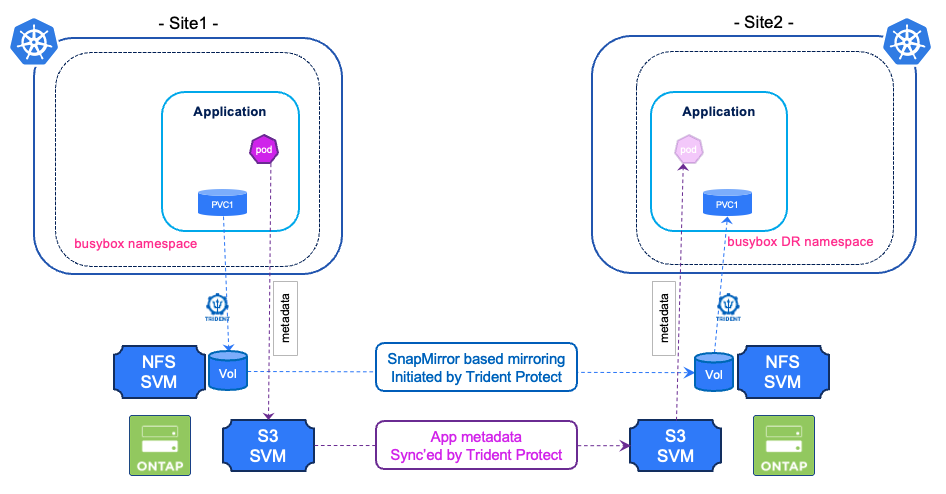

#########################################################################################
# SCENARIO 10: Two buckets and Disaster Recovery
#########################################################################################

In the previous scenarios, you always used one single bucket represented by the same AppVault definition in the source and in the destination.  
Here, you will see how to use 2 different AppVaults, hence 2 different buckets.

In this context, when a mirror update is performed, Trident Protect will: 
- trigger a snapmirror update for the application volumes  
- update the source bucket with any changes and copy those changes to the destination bucket  

Let's see that in action!

<p align="center"></p>

## A. AppVault Creation on the secondary cluster

You can now proceed with that task. The secret used to configure this object is already present.  
Notice the second command uses the _context_ flag:  
```bash
$ tridentctl-protect create appvault OntapS3 ontap-vault2 -s s3-2-creds --bucket s3lod2 --endpoint 192.168.0.231 --skip-cert-validation --no-tls -n trident-protect --context kub2-admin@kub2
AppVault "ontap-vault2" created.
```

Let's check that you now can see 2 AppVaults on the secondary environment:  
```bash
$ tridentctl-protect get appvault -n trident-protect --context kub2-admin@kub2
+--------------+----------+-----------+-------+---------+--------+
|     NAME     | PROVIDER |   STATE   | ERROR | MESSAGE |  AGE   |
+--------------+----------+-----------+-------+---------+--------+
| ontap-vault  | OntapS3  | Available |       |         | 28m23s |
| ontap-vault2 | OntapS3  | Available |       |         | 1m20s  |
+--------------+----------+-----------+-------+---------+--------+
```

Right now, the secondary bucket is not hosting any snapshot.  
If you browse it, you will only see the AppVault definition file:
```bash
$ aws s3 ls --no-verify-ssl --endpoint-url http://192.168.0.231 s3://s3lod2/ --profile s3lod2
2025-06-18 08:45:04         39 appVault.json
```

## B. Setup the application mirror relationship

The last setup step of this scenario is to initiate the Mirror relationship, after having retrieved the App ID and having created the namespace on the secondary environment:
```bash
$ kubectl create ns tpsc10busyboxdr --kubeconfig=/root/.kube/config_rhel5
namespace/tpsc10busyboxdr created

$ SRCAPPID=$(kubectl get application bbox -n tpsc10busybox -o=jsonpath='{.metadata.uid}' -n tpsc10busybox) && echo $SRCAPPID

$ cat << EOF | kubectl apply --kubeconfig=/root/.kube/config_rhel5 -f -
apiVersion: protect.trident.netapp.io/v1
kind: AppMirrorRelationship
metadata:
  name: bboxamr1
  namespace: tpsc10busyboxdr
spec:
  desiredState: Established
  destinationAppVaultRef: ontap-vault2
  namespaceMapping:
  - destination: tpsc10busyboxdr
    source: tpsc10busybox
  recurrenceRule: |-
    DTSTART:20240901T000200Z
    RRULE:FREQ=MINUTELY;INTERVAL=5
  sourceAppVaultRef: ontap-vault
  sourceApplicationName: bbox
  sourceApplicationUID: $SRCAPPID
  storageClassName: sc-nfs
EOF
appmirrorrelationship.protect.trident.netapp.io/bboxamr1 created
```
It takes a few seconds to complete (ie status _Established_):
```bash
$ tridentctl-protect get amr -n tpsc10busyboxdr  --context kub2-admin@kub2
+----------+------------+------------------+-----------------+-----------------------+---------------+-------------+-------+-----+
|   NAME   | SOURCE APP | SOURCE APP VAULT | DESTINATION APP | DESTINATION APP VAULT | DESIRED STATE |    STATE    | ERROR | AGE |
+----------+------------+------------------+-----------------+-----------------------+---------------+-------------+-------+-----+
| bboxamr1 | bbox       | ontap-vault      | bbox            | ontap-vault2          | Established   | Established |       | 47s |
+----------+------------+------------------+-----------------+-----------------------+---------------+-------------+-------+-----+
```
The PVC is now mirrored, and you can see it in the target namespace:
```bash
$ kubectl get pod,pvc -n tpsc10busyboxdr --kubeconfig=/root/.kube/config_rhel5
NAME                           STATUS   VOLUME                                     CAPACITY   ACCESS MODES   STORAGECLASS   VOLUMEATTRIBUTESCLASS   AGE
persistentvolumeclaim/mydata   Bound    pvc-96f0a15e-44ee-4076-b587-27793c09bdd0   1Gi        RWX            sc-nfs         <unset>                 101s
```

## C. AppVault content

The interesting part is to also check the content of the secondary AppVault:  
```bash
$ aws s3 ls --no-verify-ssl --endpoint-url http://192.168.0.231 s3://s3lod2/ --profile s3lod2
                           PRE bbox_4faa60d0-d6be-4871-960f-b719788a25d6/
2025-06-18 08:45:04         39 appVault.json
```
**You can see a new folder!**  

Its name is based on the DR application UID as you notice with the following command:  
```bash
$ DRAPPID=$(kubectl -n tpsc10busyboxdr get application bbox --kubeconfig=/root/.kube/config_rhel5 -o=jsonpath='{.metadata.uid}'); echo $DRAPPID
4faa60d0-d6be-4871-960f-b719788a25d6
```
Let's see what we have in that folder:  
```bash
$ aws s3 ls --no-verify-ssl --endpoint-url http://192.168.0.231 s3://s3lod2/bbox_$DRAPPID/replicatedSnapshots/ --profile s3lod2
                           PRE 20250618160506_bboxsnap1_27c105b9-f3d9-422c-8415-cb9aae208cbc/
```
Let's compare that folder name with the snapshot on the primary cluster:
```bash
$ SRCAPPIDFOLDER=$(echo $SNAPPATH | awk -F '/' '{print $1}')
$ aws s3 ls --no-verify-ssl --endpoint-url http://192.168.0.230 s3://s3lod/$SRCAPPIDFOLDER/snapshots/
                           PRE 20250618160506_bboxsnap1_27c105b9-f3d9-422c-8415-cb9aae208cbc/
```
As you can see, this is the exact same snapshot, hence with the same content:
```bash
$ DSTSNAPFOLDER=$(aws s3 ls --no-verify-ssl --endpoint-url http://192.168.0.230 s3://s3lod/$SRCAPPIDFOLDER/snapshots/ | awk -F ' ' '{print $2}')
$ aws s3 ls --no-verify-ssl --endpoint-url http://192.168.0.231 s3://s3lod2/bbox_$DRAPPID/replicatedSnapshots/$DSTSNAPFOLDER --profile s3lod2
2025-06-18 16:30:48       1230 application.json
2025-06-18 16:30:48          3 exec_hooks.json
2025-06-18 16:30:48       2546 post_snapshot_execHooksRun.json
2025-06-18 16:30:48       2569 pre_snapshot_execHooksRun.json
2025-06-18 16:30:48       2516 resource_backup.json
2025-06-18 16:30:48       8336 resource_backup.tar.gz
2025-06-18 16:30:48       4686 resource_backup_summary.json
2025-06-18 16:30:48       4516 snapshot.json
2025-06-18 16:30:48        682 volume_snapshot_classes.json
2025-06-18 16:30:48       1877 volume_snapshot_contents.json
2025-06-18 16:30:48       2233 volume_snapshots.json
```

Tadaaaa!  
You have now validated that Trident Protect also mirrors the content of the AppVault.

## D. Failing over your application

Now that the buckets are synchronized and up to date, when activating the DR, Trident Protect will fetch the app metadata from the local bucket. In an environment where distance is high between both sites, this could really improve the time to bring back up your app (the RTO):   

```bash
$ kubectl patch amr bboxamr1 -n tpsc10busyboxdr --type=merge -p '{"spec":{"desiredState":"Promoted"}}' --kubeconfig=/root/.kube/config_rhel5
appmirrorrelationship.protect.trident.netapp.io/bboxamr1 patched

$ tridentctl-protect get amr -n tpsc10busyboxdr  --context kub2-admin@kub2
+----------+------------+------------------+-----------------+-----------------------+---------------+----------+-------+--------+
|   NAME   | SOURCE APP | SOURCE APP VAULT | DESTINATION APP | DESTINATION APP VAULT | DESIRED STATE |  STATE   | ERROR |  AGE   |
+----------+------------+------------------+-----------------+-----------------------+---------------+----------+-------+--------+
| bboxamr1 | bbox       | ontap-vault      | bbox            | ontap-vault2          | Promoted      | Promoted |       | 14h11m |
+----------+------------+------------------+-----------------+-----------------------+---------------+----------+-------+--------+
```
As expected, if you look in namespace, the pod is now running, and the volume contains the file created earlier:  
```bash
$ kubectl get -n tpsc10busyboxdr po,pvc  --kubeconfig=/root/.kube/config_rhel5
NAME                          READY   STATUS    RESTARTS   AGE
pod/busybox-7f96d99bc-xxcg2   1/1     Running   0          50s

NAME                           STATUS   VOLUME                                     CAPACITY   ACCESS MODES   STORAGECLASS   VOLUMEATTRIBUTESCLASS   AGE
persistentvolumeclaim/mydata   Bound    pvc-96f0a15e-44ee-4076-b587-27793c09bdd0   1Gi        RWX            sc-nfs         <unset>                 14h

$ kubectl exec -n tpsc10busyboxdr --kubeconfig=/root/.kube/config_rhel5 $(kubectl get pod -n tpsc10busyboxdr -o name --kubeconfig=/root/.kube/config_rhel5) -- more /data/file.txt
bbox test for Scenario10!
```

## E. Failing back your application

If you wish to test the fail back of your application on the primary environment, you must also create the second AppVault on the first Kubernetes cluster.  
In order to synchronize objects between buckets, Trident Protect must have access to both of them.  
Missing that part will lead to Trident not finding the correct objects when you try to promote the AMR.


## F. Cleanup

The next chapter requires the secondary bucket to be empty.  
Let's delete all the objects created in this chapter and clear the bucket:  
```bash
tridentctl-protect delete amr bboxamr1 -n tpsc10busyboxdr  --context kub2-admin@kub2
tridentctl-protect delete application bbox -n tpsc10busyboxdr  --context kub2-admin@kub2

tridentctl-protect delete appvault ontap-vault2 -n trident-protect --context kub2-admin@kub2
aws s3 rm --no-verify-ssl --endpoint-url http://192.168.0.231 s3://s3lod2 --recursive  --quiet --profile s3lod2
```

## G. What's next

Let's see how to use 2 buckets with [Backup&Restore](../2_BackupRestore).
