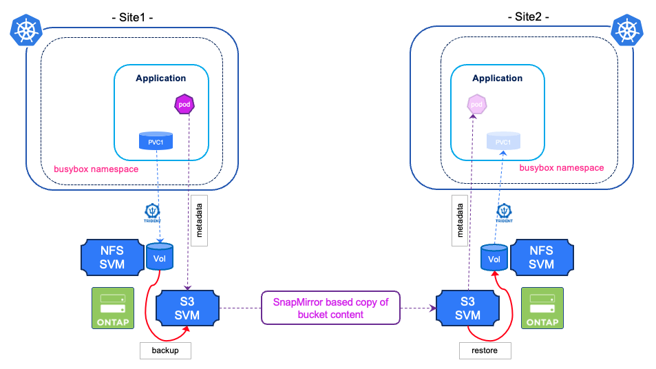

#########################################################################################
# SCENARIO 10: Two buckets, Backup & Restore
#########################################################################################

In some cases, you are protecting your applications locally with a backup to an object store on the same site.  
You also plan on restoring the content on a different Kubernetes cluster, that may be in a different datacenter or even in the cloud!  

In all previous scenarios, you always restored your applications from the same bucket where the backup was stored, which is totally fine.  
However, you may be in a situation where the 2 sites are too far apart, latencies high, hence restore from a local bucket may be much faster.  

In this specific case, the infrastructure team would mirror the first bucket to a secondary bucket.  
You are going to test this configuration here, granted the 2 buckets are on the same ONTAP cluster in this lab.  

<p align="center"></p>

## A. Setup

As we are going to use NetApp SnapMirror to mirror data from one bucket to the next, we need to configure a few extra elements for the scenarion to be successful:  
- SVM Peering between the 2 SVM containing the buckets  
- Intercluster LIF used by ONTAP to mirror the data between the 2 buckets  
- Generate keys for the SVM root users  
- Create a specific policy for the snapmirror relationship with a RPO of 2 minutes (default is 1hour)

An Ansible playbook (*scenario10_setup.yaml*) is available in this folder to help achieve those tasks:  
```bash
$ ansible-playbook scenario10_setup.yaml
PLAY [Scenario setup] 
TASK [Gathering Facts] 
TASK [Create vserver peer SVM_S3] 
TASK [Create Intercluster LIF] 
TASK [Regenerate keys for root user in SVM_S3] 
TASK [Regenerate keys for root user in SVM_S3_2] 
TASK [Create SnapMirror policy with RPO 2min] 
PLAY RECAP 
localhost                  : ok=6    changed=5    unreachable=0    failed=0    skipped=0    rescued=0    ignored=0
```

## B. Bucket mirroring

Now that the setup is complete, let's configure the mirror relationship between the 2 buckets.  
This can be achieved with the *scenario10_snapmirror.yaml* playbook you can find in this folder.  
```bash
$ ansible-playbook scenario10_snapmirror_create.yaml
PLAY [SnapMirror Management] 
TASK [Gathering Facts] 
TASK [Create SnapMirror relationship between SVM_S3 and SVM_S3_2] 
PLAY RECAP 
localhost                  : ok=2    changed=1    unreachable=0    failed=0    skipped=0    rescued=0    ignored=0
```
The policy used in this example synchronizes all objects **every 2 minutes**.  

## C. Bucket content

As a snapshot is already present in the primary bucket at the time of the mirroring initialization.  
When browing the content of the mirrored bucket, you will see the _snapshots_ folder with the app metadata:  
```bash
$ aws s3 ls --no-verify-ssl --endpoint-url http://192.168.0.231 s3://s3lod2/ --profile s3lod2
                           PRE bbox_7600848c-ee1e-4de6-938f-83aba7773ae1/
2025-06-18 08:45:04         39 appVault.json

$ aws s3 ls --no-verify-ssl --endpoint-url http://192.168.0.231 s3://s3lod2/bbox_7600848c-ee1e-4de6-938f-83aba7773ae1/ --profile s3lod2
                           PRE snapshots/
```

## D. Application backup creation

Of course, you cannot restore remotely from a snapshot.  
You first need to create a backup on the primary site before going ahead:  
```bash
$ tridentctl protect create backup bboxbkp1 --app bbox --snapshot bboxsnap1 --appvault ontap-vault  --data-mover kopia -n tpsc10busybox
Backup "bboxbkp1" created.

$ tridentctl protect get backup -n tpsc10busybox
+----------+------+----------------+-----------+-------+-------+
|   NAME   | APP  | RECLAIM POLICY |   STATE   | ERROR |  AGE  |
+----------+------+----------------+-----------+-------+-------+
| bboxbkp1 | bbox | Retain         | Completed |       | 1m34s |
+----------+------+----------------+-----------+-------+-------+
```
Browsing again the source bucket, you will see 2 new folders _backups_ for the app metadata & _kopia_ for the data:  
```bash
$ SRCAPPIDFOLDER=$(echo $SNAPPATH | awk -F '/' '{print $1}')
$ aws s3 ls --no-verify-ssl --endpoint-url http://192.168.0.230 s3://s3lod/$SRCAPPIDFOLDER/
                           PRE backups/
                           PRE kopia/
                           PRE snapshots/
```
Not long after (2 minutes max, cf the policy used for the SnapMirror replication), you will see the backup appearing on the secondary bucket:  
```bash
$ aws s3 ls --no-verify-ssl --endpoint-url http://192.168.0.231 s3://s3lod2/$SRCAPPIDFOLDER/ --profile s3lod2
                           PRE backups/
                           PRE kopia/
                           PRE snapshots/
```

## E. Mirroring relationship deletion

The second bucket is currently in Read-Only mode, hence you can browse the content, but not write in it.  
Restoring an application also requires writing some state in the AppVault.  
You then first need to break the snapmirror relationship which in turn will modify the bucket to ReadWrite.  
This can be achieved by the *scenario10_snapmirror_delete.yaml* file you can see in this folder:  
```bash
$ ansible-playbook scenario10_snapmirror_create.yaml
PLAY [Cleanup] 
TASK [Gathering Facts] 
TASK [Delete SnapMirror relationship between SVM_S3_2 and SVM_S3] 
changed: [localhost]
PLAY RECAP 
localhost                  : ok=2    changed=1    unreachable=0    failed=0    skipped=0    rescued=0    ignored=0
```

## F. AppVault creation

Let's proceed with the AppVault creation on the secondary Kubernetes cluster:  
```bash
$ tridentctl protect create appvault OntapS3 ontap-vault2 -s s3-2-creds --bucket s3lod2 --endpoint 192.168.0.231 --skip-cert-validation --no-tls -n trident-protect --context kub2-admin@kub2
AppVault "ontap-vault2" created.

$ tridentctl protect get appvault ontap-vault2 -n trident-protect --context kub2-admin@kub2
+--------------+----------+-----------+-------+---------+-------+
|     NAME     | PROVIDER |   STATE   | ERROR | MESSAGE |  AGE  |
+--------------+----------+-----------+-------+---------+-------+
| ontap-vault2 | OntapS3  | Available |       |         | 1m15s |
+--------------+----------+-----------+-------+---------+-------+
```

## G. Application restore

In order to restore our app, we first need to find the path of the backup we want to restore:  
```bash
$ tridentctl protect get appvaultcontent ontap-vault2 -n trident-protect --context kub2-admin@kub2
+---------+------+--------+----------+---------------+---------------------------+
| CLUSTER | APP  |  TYPE  |   NAME   |   NAMESPACE   |         TIMESTAMP         |
+---------+------+--------+----------+---------------+---------------------------+
| lod1    | bbox | backup | bboxbkp1 | tpsc10busybox | 2025-06-24 07:27:14 (UTC) |
+---------+------+--------+----------+---------------+---------------------------+

$ tridentctl protect get appvaultcontent ontap-vault2 --show-paths -n trident-protect --context kub2-admin@kub2
+---------+------+--------+----------+---------------+---------------------------+-------------------------------------------------------------------------------------------------+
| CLUSTER | APP  |  TYPE  |   NAME   |   NAMESPACE   |         TIMESTAMP         |                                              PATH                                               |
+---------+------+--------+----------+---------------+---------------------------+-------------------------------------------------------------------------------------------------+
| lod1    | bbox | backup | bboxbkp1 | tpsc10busybox | 2025-06-24 07:27:14 (UTC) | bbox_7600848c-ee1e-4de6-938f-83aba7773ae1/backups/bboxbkp1_a26668fa-3503-49f2-9445-0718191184e6 |
+---------+------+--------+----------+---------------+---------------------------+-------------------------------------------------------------------------------------------------+
```
We now have all the required information to perform the app restore:
```bash
$ BKPPATH=$(tridentctl protect get appvaultcontent ontap-vault2 --app bbox --show-resources backup --show-paths -n trident-protect --context kub2-admin@kub2 | grep bboxbkp1  | awk -F '|' '{print $8}')

$ tridentctl protect create br bboxbr1 --namespace-mapping tpsc10busybox:tpsc10busyboxbr --appvault ontap-vault2 -n tpsc10busyboxbr \
  --storageclass-mapping storage-class-nfs:sc-nfs \
  --context kub2-admin@kub2 \
  --path $BKPPATH
BackupRestore "bboxbr1" created.

$ tridentctl protect get br -n tpsc10busyboxbr --context kub2-admin@kub2
+---------+--------------+-----------+-------+-----+
|  NAME   |   APPVAULT   |   STATE   | ERROR | AGE |
+---------+--------------+-----------+-------+-----+
| bboxbr1 | ontap-vault2 | Completed |       | 35s |
+---------+--------------+-----------+-------+-----+

$ kubectl -n tpsc10busyboxbr get pod,pvc --kubeconfig=/root/.kube/config_rhel5
NAME                          READY   STATUS    RESTARTS   AGE
pod/busybox-7f96d99bc-86j65   1/1     Running   0          43s

NAME                           STATUS   VOLUME                                     CAPACITY   ACCESS MODES   STORAGECLASS   VOLUMEATTRIBUTESCLASS   AGE
persistentvolumeclaim/mydata   Bound    pvc-302dd479-eb79-423b-a34b-c3b4df94243a   1Gi        RWX            sc-nfs         <unset>                 44s
```
Let's verify the content of the app:  
```bash
kubectl exec -n tpsc10busyboxbr --kubeconfig=/root/.kube/config_rhel5 $(kubectl get pod -n tpsc10busyboxbr -o name --kubeconfig=/root/.kube/config_rhel5) -- more /data/file.txt
bbox test for Scenario10!
```

Tadaa !
