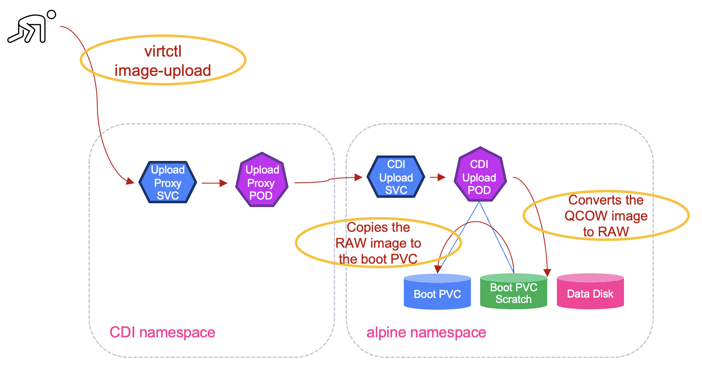

#########################################################################################
# SCENARIO 11: Protecting Virtual Machines: Setup
#########################################################################################

Alpine was chosen because it is leightweight, does not need much CPU/RAM, hence is well fitted for the Lab on Demand.  
There are multiple variations of Alpine available, we are going to deploy the **nocloud** one, as it can be customized for our needs.  

This scenario will run in its own namespace *alpine*. Let's first create it:  
```bash
$ kubectl create ns alpine
namespace/alpine created
```

## A. Virtual Machine disks preparation

We first need to download the Alpine image in order to create a bootable disk:  
```bash
mkdir -p ~/images && cd ~/images
wget https://dl-cdn.alpinelinux.org/alpine/v3.22/releases/cloud/nocloud_alpine-3.22.1-x86_64-bios-tiny-r0.qcow2
```

You can find in this scenario folder the *alpine_disks.yaml* file which contains the definition of the 2 disks you are going to use.  
A few things to notice:   
- *alpine-boot-pvc* is the boot disk on which you are going to upload the Alpine image  
- *alpine-data-pvc* is an extra disk attached to the Virtual Machine  
- both disks use the *ReadWriteMany* access mode, and are of *Block* type  
- the boot disk has the annotation *cdi.kubevirt.io/storage.upload.target* which makes it suitable to receive the VM image

Let's create those disks and list the content of the namespace:  
```bash
$ kubectl create -f alpine_disks.yaml
persistentvolumeclaim/alpine-boot-pvc created
persistentvolumeclaim/alpine-data-pvc created

$ kubectl get -n alpine po,pvc
NAME                             READY   STATUS    RESTARTS   AGE
pod/cdi-upload-alpine-boot-pvc   1/1     Running   0          27s

NAME                                            STATUS   VOLUME                                     CAPACITY   ACCESS MODES   STORAGECLASS          VOLUMEATTRIBUTESCLASS   AGE
persistentvolumeclaim/alpine-boot-pvc           Bound    pvc-c786e1a0-bbd6-4a3d-8e84-43f391376bd8   1Gi        RWX            storage-class-iscsi   <unset>                 28s
persistentvolumeclaim/alpine-boot-pvc-scratch   Bound    pvc-6cfae1c1-8040-42d5-8d2b-2bb35e1f5ef8   1086Mi     RWO            storage-class-iscsi   <unset>                 27s
persistentvolumeclaim/alpine-data-pvc           Bound    pvc-58ab7490-c473-4323-a5c1-fd7b6ad3191c   1Gi        RWX            storage-class-iscsi   <unset>                 28s
```
2 things to note:  
- a pod *cdi-upload-alpine-boot* was automatically created, thanks to the annotation set on the boot pvc  
- an extra PVC *scratch* was also automatically added.

Both objects were created by the CDI component (Containerized Data Importer). The **scratch PVC** is a temporary volume used during the upload process.  

Let's dive a bit into this upload process:  
- the _virtctl image-upload_ command will first connect to the CDI Upload Proxy  
- within the target namespace, Kubevirt will use the scratch PVC is a temporary work space, especially to convert the image from QCOW to RAW if required  
- note that both _boot-pvc_ & _boot-pvc-scratch_ are mounted on the _CDI upload pod_  
- when the RAW file is ready, the _CDI upload pod_ will write this file to the _boot-pvc_  
- at this point, the upload process it complete and the temporary resources are deleted.  

<p align="center"></p>

About the volume access mode, if you set *ReadWriteOnce* for the PVC, you will find the following message in the VM:  
```yaml
    Message:               cannot migrate VMI: PVC alpine-boot-pvc is not shared, live migration requires that all PVCs must be shared (using ReadWriteMany access mode)
    Reason:                DisksNotLiveMigratable
```
And the following status for the VMI (notice the field _LIVE-MIGRATABLE_):  
```bash
$ kubectl get vmi -n alpine -o wide
NAME        AGE   PHASE     IP              NODENAME   READY   LIVE-MIGRATABLE   PAUSED
alpine-vm   35s   Running   192.168.28.65   rhel2      True    False
```
This shows the importance of running **ReadWriteMany** volumes!  

Time to upload the Alpine image on the boot disk:  
```bash
$ virtctl image-upload pvc alpine-boot-pvc \
  --namespace alpine \
  --image-path=/root/images/nocloud_alpine-3.22.1-x86_64-bios-tiny-r0.qcow2 \
  --size=1Gi \
  --insecure \
   --uploadproxy-url=https://192.168.0.212:443
Using existing PVC alpine/alpine-boot-pvc
Uploading data to https://192.168.0.212:443

114.31 MiB / 114.31 MiB [-----------------------------------------------------------------------------------------------------------------------------] 100.00% 163.64 MiB p/s 900ms

Uploading data completed successfully, waiting for processing to complete, you can hit ctrl-c without interrupting the progress
Processing completed successfully
Uploading /root/images/nocloud_alpine-3.22.1-x86_64-bios-tiny-r0.qcow2 completed successfully
```

NOTE: if the Proxy address was different for you, the command would need to reflect that...  

When the process is done, the temporary resources will be deleted.  
You will then only see your 2 PVC in the namespace:  
```bash
$ kubectl get -n alpine po,pvc
NAME                                    STATUS   VOLUME                                     CAPACITY   ACCESS MODES   STORAGECLASS          VOLUMEATTRIBUTESCLASS   AGE
persistentvolumeclaim/alpine-boot-pvc   Bound    pvc-c786e1a0-bbd6-4a3d-8e84-43f391376bd8   1Gi        RWX            storage-class-iscsi   <unset>                 10m
persistentvolumeclaim/alpine-data-pvc   Bound    pvc-58ab7490-c473-4323-a5c1-fd7b6ad3191c   1Gi        RWX            storage-class-iscsi   <unset>                 10m
```

## B. Virtual Machine bootstrap customization

You can put together a set of commands that will customize the initial boot.  
Alpine images use the *tiny-cloud* process for that matter (more details here: https://gitlab.alpinelinux.org/alpine/cloud/tiny-cloud).  

In this chapter, you are going to:  
- create a SSH key pair that will be injected in the VM to allow passwordless connectivity. 
- create a cloud config that will set the password for the *alpine* user, the login message and pass the SSH key  

Let's start by creating a set of keys that will be used to connect to the Alpine VM.  
The _public_ key will be added to a Kubernetes _secret_ in the Alpine namespace.  
```bash
ssh-keygen -t rsa -N "" -f /root/.ssh/alpine
kubectl create secret generic alpinepub --from-file=key1=/root/.ssh/alpine.pub -n alpine
```
For future usage, let's copy those 2 keys (public & private) on the secondary cluster:
```bash
scp /root/.ssh/alpine rhel5:/root/.ssh/alpine
scp /root/.ssh/alpine.pub rhel5:/root/.ssh/alpine.pub
```

The Alpine image does not allow direct SSH key injection with the use of the _accessCredentials_ parameter with Tiny Cloud.  
The alternative would be to write it in clear in the VM manifest in the _cloudInitNoCloud_ parameter, but that is not very **clean**, is it?  
We are then going to create a *secret* with all the parameters used during the VM bootstrap:  

```bash
$ kubectl create secret generic alpine-cloudinit-userdata -n alpine --from-literal=userdata="#cloud-config
users:
  - name: alpine
    ssh_authorized_keys:
      - $(kubectl get secret alpinepub -n alpine -o jsonpath='{.data.key1}' | base64 -d)
chpasswd:
  expire: false
ssh_pwauth: True
runcmd:
  - echo "alpine:alpine" | chpasswd
  - echo '################################################' > /etc/motd
  - echo 'Welcome to Alpine on KubeVirt in the NetApp LoD!' >> /etc/motd
  - echo '################################################' >> /etc/motd
"
secret/alpine-cloudinit-userdata created
```

## C. Virtual Machine creation

We are going to use the *alpine_vm.yaml* file available in this scenario's folder.  
Before creating it, let's decrypt its content.  

Let's start with the disks:  
```yaml
        devices:
          disks:
            - name: rootdisk
              disk:
                bus: virtio
            - name: datadisk
              disk:
                bus: virtio
            - name: cloudinitdisk
              disk:
                bus: virtio
```
The VM has 3 disks:  
- _rootdisk_, labelled **vda** inside the VM, that corresponds to the boot volume  
- _datadisk_, labelled **vdb**, that corresponds to an extra disk, and comes not formatted  
- _cloudinitdisk_, labelled **vdc** which refers to the secret containing the init parameters. This is one is not backed by a PVC.  

Let's continue with the network configuration:  
```yaml
          interfaces:
            - name: default
              masquerade: {}
```
With masquerade binding, the VM’s network interface is NATed (Network Address Translated) behind the pod’s IP address.
- Outbound traffic from the VM is masqueraded (NATed) to appear as coming from the pod.
- Inbound traffic to the VM can be accessed via the pod’s IP and port-forwarding or Kubernetes Services.  
  
Note that Masquerade binding supports live migration of VMs.

We can verify that both pod and vmi appear to have the same IP address:
```bash
$ kubectl get po,vmi -n alpine -o wide
NAME                                READY   STATUS    RESTARTS   AGE     IP               NODE    NOMINATED NODE   READINESS GATES
pod/virt-launcher-alpine-vm-m6q2r   2/2     Running   0          5h50m   192.168.25.117   rhel3   <none>           1/1

NAME                                           AGE     PHASE     IP               NODENAME   READY   LIVE-MIGRATABLE   PAUSED
virtualmachineinstance.kubevirt.io/alpine-vm   5h50m   Running   192.168.25.117   rhel3      True    True
```
If you do not set the correct network configuration, you will find the following message in the VM:  
```yaml
 Message:               cannot migrate VMI which does not use masquerade, bridge with kubevirt.io/allow-pod-bridge-network-live-migration VM annotation or a migratable plugin to connect to the pod network
    Reason:                InterfaceNotLiveMigratable
```
And the following status for the VMI (notice the field _LIVE-MIGRATABLE_):  
```bash
$ kubectl get vmi -n alpine -o wide
NAME        AGE   PHASE     IP               NODENAME   READY   LIVE-MIGRATABLE   PAUSED
alpine-vm   35s   Running   192.168.28.121   rhel2      True    False
```
For this environment, I chose the easiest network configuration (_masquerade_), as there is no access to the underlying configuration.  

ok, let's create our VM!  
```bash
$ kubectl create -f alpine_vm.yaml
virtualmachine.kubevirt.io/alpine-vm created
```
In just a couple of seconds, your VM is ready:  
```bash
$ kubectl get -n alpine all,pvc
Warning: kubevirt.io/v1 VirtualMachineInstancePresets is now deprecated and will be removed in v2.
NAME                                READY   STATUS    RESTARTS   AGE
pod/virt-launcher-alpine-vm-v9tj9   2/2     Running   0          16s

NAME                                           AGE   PHASE     IP               NODENAME   READY
virtualmachineinstance.kubevirt.io/alpine-vm   16s   Running   192.168.25.116   rhel3      True

NAME                                   AGE   STATUS    READY
virtualmachine.kubevirt.io/alpine-vm   16s   Running   True

NAME                                    STATUS   VOLUME                                     CAPACITY   ACCESS MODES   STORAGECLASS          VOLUMEATTRIBUTESCLASS   AGE
persistentvolumeclaim/alpine-boot-pvc   Bound    pvc-c786e1a0-bbd6-4a3d-8e84-43f391376bd8   1Gi        RWX            storage-class-iscsi   <unset>                 47m
persistentvolumeclaim/alpine-data-pvc   Bound    pvc-58ab7490-c473-4323-a5c1-fd7b6ad3191c   1Gi        RWX            storage-class-iscsi   <unset>                 47m
```
Some explanations:  
- *pod/virt-launcher-alpine-vm-v9tj9*: The pod that actually runs the Alpine VM. It is managed by KubeVirt and is ephemeral (recreated as needed).  
- *virtualmachineinstance.kubevirt.io/alpine-vm*: The running instance of the VM (VMI). This object represents the live VM, including its current state, IP, and runtime info. It is ephemeral and recreated from the VirtualMachine spec.  
- *virtualmachine.kubevirt.io/alpine-vm*: The declarative definition of the VM. This is the main object you manage (like a Deployment for pods). It contains the VM’s configuration, disks, cloud-init, etc.

One the VM is ready, it will boot and start its initial setup.  
Using the following command will let you see all the boot steps:
```bash
virtctl console alpine-vm -n alpine
```
As an alternative, and since you injected a SSH key, you can also use it to connect to the VM without the password:  
```bash
ALPINE_IP=$(kubectl get vmi -n alpine alpine-vm -o jsonpath='{.status.interfaces[0].ipAddress}') && echo $ALPINE_IP
ssh alpine@$ALPINE_IP -i /root/.ssh/alpine
```
There you go, your Virtual Machine is up and running, and you can connect to it!

## D. Virtual Machine data disk management

This paragraph is performed inside the Virtual Machine.  
Alpine does not use _sudo_ to access root privileges, but rather the command **doas**.  
Let's check the disks connected to our Virtual Machine:  
```bash
$ cat /proc/partitions
major minor  #blocks  name

 253        0    1048576 vda
 253       16    1048576 vdb
 253       32       1024 vdc

$ doas fdisk -l  /dev/vdb
Disk /dev/vdb: 1024 MB, 1073741824 bytes, 2097152 sectors
2080 cylinders, 16 heads, 63 sectors/track
Units: sectors of 1 * 512 = 512 bytes

Disk /dev/vdb doesn't contain a valid partition table
```
The _data_ disk was mounted as a raw block device, but is totally empty.  
You will now create a partition on this disk, format it and mount it on the **/data** folder:  
```bash
echo -e "o\nn\np\n1\n\n\nw" | doas fdisk /dev/vdb
doas mkfs.ext4 /dev/vdb1
doas mkdir /data
doas mount /dev/vdb1 /data
doas chmod 777 /data
```
In order to make that partition persistent accross reboot, you also need to update the fstab configuraiton:  
```bash
UUID=$(doas blkid -s UUID -o value /dev/vdb1) && echo "UUID=$UUID   /data   ext4   defaults   0 0" | doas tee -a /etc/fstab
```

Last, let's create some content on this disk:  
```bash
echo "this is my alpine test" > /data/alpine.txt
```

## E. Post setup tasks

The CloudInitVolume is harmless and does not take much space. Most of the time, it is safe to leave it connected, especially when the VM is short lived.  
However, since we want to create a persistent VM, and potentially recreate it from a snapshot or as part as a failover operation, you should remove this disk, as the VM is already configured. Failing to do so will lead to the VM restore to fail, as it may not find the init parameters...  
Removing it is also necessary if you want to create a template from this VM.  

First, let's clean up the Virtual Machine definition:  
```bash
$ kubectl -n alpine patch vm alpine-vm --type='json' -p='[
  {"op": "remove", "path": "/spec/template/spec/domain/devices/disks/2"},
  {"op": "remove", "path": "/spec/template/spec/volumes/2"}
]'
virtualmachine.kubevirt.io/alpine-vm patched
```
In this context, you need to restart the VM in order for the configuration to be applied:  
```bash
$ virtctl restart alpine-vm -n alpine
VM alpine-vm was scheduled to restart
```
This operation takes a few seconds to complete, at which point the VMI will have most certainly changed IP address if you want to connect with SSH.  
Reconnect to the VM to check if the cloud init disk is gone:  
```bash
$ virtctl console alpine-vm -n alpine
...
Welcome to Alpine Linux 3.22
Kernel 6.12.38-0-virt on x86_64 (/dev/ttyS0)

alpine-vm.alpine.svc.cluster.local login: alpine
...

alpine-vm:~$ cat /proc/partitions
major minor  #blocks  name

 253        0    1048576 vda
 253       16    1048576 vdb
 253       17    1048544 vdb1
```
& voilà, the vdc disk is gone!

You can now proceed with the [Virtual Machine protection](../2_Protection/)!