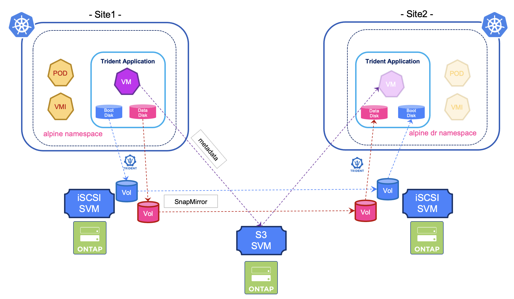

#########################################################################################
# SCENARIO 11: Protecting Virtual Machines
#########################################################################################

All the scenarios until now covered containerized applications protection.  
This scenario goes a step further by demonstrating how to protect Virtual Machines running on KubeVirt.  

First of all, you need to install & configure KubeVirt on both primary and secondary cluster.  
Please refer to the [Addenda15](../../Addendum/Addenda15/) to do so.  

In this scenario, you will perform the following tasks:  
- create and configure an Alpine Virtual Machine with 2 disks (_boot_ and _data_)  
- create a file in the data disk  
- define alpine as a Trident Protect application  
- create an application snapshot  
- configure Disaster Recovery and fail over the VM on the secondary cluster  

There are two chapters in this scenario:  
[1.](./1_Setup/) Virtual Machine creation  
[2.](./2_Protection/) Virtual Machine protection  
