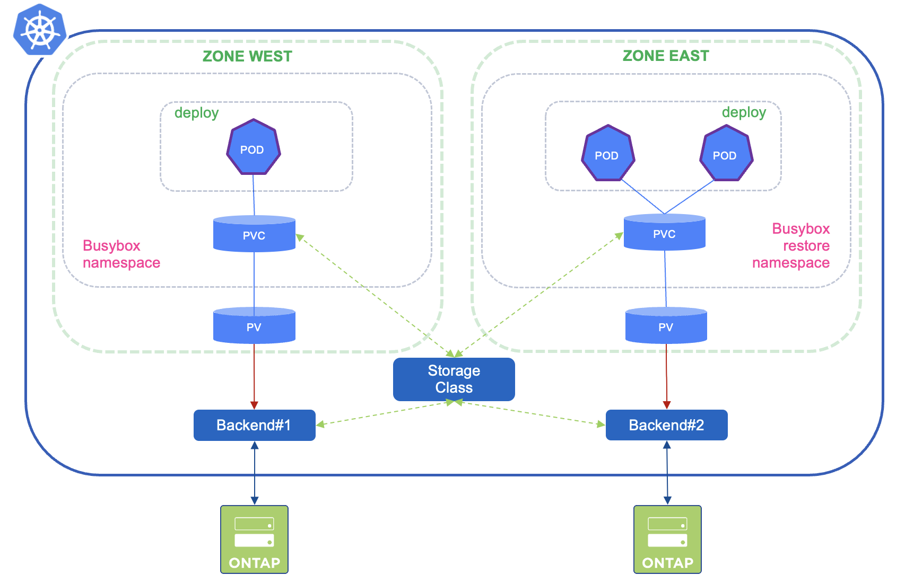
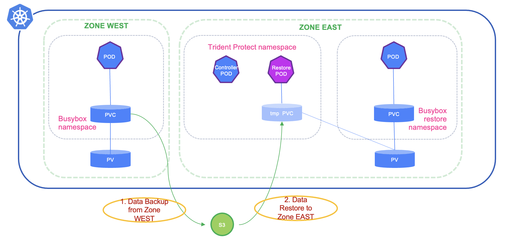

#########################################################################################
# SCENARIO 12: Ch-ch-ch-changes
#########################################################################################

Trident Protect 26.06 introduced a great feature called **resource modification**.  
In a nutshell you can modify a resource during the restore or failover of an application.  

This is configured by adding a **transformations** block to your YAML manifest, or by passing the **--transformation** flag to the cli.  
6 operations are currently available:
- *add*: adds a new field to a specific path.  
- *copy*: copies a value from one path to another one within the same resource.  
- *move*: moves a value from one path to another one within the same resource.  
- *remove*: deletes a field at a specific path.  
- *replace*: replaces an existing value at a specific path.  
- *test*: tests a value before running other transformations.  

Note that this does not apply to PVC or namespaces.  

Let's see this in action. We will set up an application using CSI Topology, create a backup, and restore it on a different zone, while modifying the number of replicas as well as the container image to use.  

<p align="center"></p>

## 1. Setup  

Let's modify the existing node labels to reflect the following topology:  
- node *rhel1*: region *dc* and zone *west* (which may already be the case).  
- node *rhel2*: region *dc* and zone *east*.  
- node *rhel3*: region *dc* and zone *central*.  

```bash
kubectl label node rhel1 "topology.kubernetes.io/zone=west" --overwrite
kubectl label node rhel2 "topology.kubernetes.io/zone=east" --overwrite
kubectl label node rhel3 "topology.kubernetes.io/zone=central" --overwrite
```
In order for Trident to pick that change, you need to restart the daemonset (it takes a minute):  
```bash
$ kubectl rollout restart ds/trident-node-linux -n trident
daemonset.apps/trident-node-linux restarted
```

Now, we need to create new Trident backends, one per zone, as well as a storage class, all set to work with CSI Topology.  
As the SVM has 2 DataLIF and 2 ManagementLIF, I explicitely chose a different set per backend:  
```bash
kubectl create -f backend-east-and-west.yaml
kubectl create -f sc-topology.yaml
```
Make sure the backends are ready and that the storage class is correctly mapped:  
```bash
$ kubectl get tbc -n trident backend-nas-west backend-nas-east
NAME               BACKEND NAME   BACKEND UUID                           PHASE   STATUS
backend-nas-west   nas-west       fe70c7c4-8641-433a-814b-379fd2fb2781   Bound   Success
backend-nas-east   nas-east       4a6f39d7-1991-49b1-8285-d83ed86c8ff6   Bound   Success

$ tridentctl -n trident get storageclass sc-topology -o json | jq  '[.items[] | {storageClass: .Config.name, backends: [.storage]|unique}]'
...
    "storageClass": "sc-topology",
    "backends": [
      {
        "nas-east": [
          "aggr2"
        ],
        "nas-west": [
          "aggr1"
        ]
...
```
Next, let's create 2 different Busybox tags, one per zone. This can be achieved by running the following script in this folder:  
```bash
sh scenario12_pull_images.sh
```
We can now deploy our application:  
```bash
$ kubectl create -f busybox.yaml
namespace/scenario12 created
persistentvolumeclaim/mydata created
deployment.apps/busybox created
```
Let's verify that the app is running, and the volume is in the right zone (which can be seen with the volume prefix):  
```bash
$ kubectl get -n scenario12 all,pvc
NAME                           READY   STATUS    RESTARTS   AGE
pod/busybox-5d667c9ff9-hkhfc   1/1     Running   0          14s

NAME                      READY   UP-TO-DATE   AVAILABLE   AGE
deployment.apps/busybox   1/1     1            1           21m

NAME                                 DESIRED   CURRENT   READY   AGE
replicaset.apps/busybox-5d667c9ff9   1         1         1       21m

NAME                           STATUS   VOLUME                                     CAPACITY   ACCESS MODES   STORAGECLASS   VOLUMEATTRIBUTESCLASS   AGE
persistentvolumeclaim/mydata   Bound    pvc-bf240eb8-8489-45b8-b960-d2d5f298b81c   10Gi       RWX            sc-topology    <unset>                 14s

$ kubectl exec -n scenario12 $(kubectl get -n scenario12 po -o name) -- df /data
Filesystem           1K-blocks      Used Available Use% Mounted on
192.168.0.132:/west_pvc_bf240eb8_8489_45b8_b960_d2d5f298b81c
                      10485760       256  10485504   0% /data
```
As expected, the volume name is prefixed with *west* and the DataLIF is *192.168.0.132*.  

Finally, let's create some files in this application:  
```bash
kubectl exec -n scenario12 $(kubectl get pod -n scenario12 -o name) -- sh -c 'echo "file created in the west zone!" > /data/file.txt'
kubectl exec -n scenario12 $(kubectl get pod -n scenario12 -o name) -- sh -c 'dd if=/dev/urandom of=/data/random bs=1M count=500'
```

## 2. Trident Protect customization

Restoring a backup with Trident Protect involves creating temporary resources in the _trident protect_ namespace such as PVC and PODs.  
The PVC will then be deleted, and the underlying PV rebound to the PVC in the target namespace.  

With CSI Topology enabled, the zone of the PVC will depend on where the first pod mounting it will be created...  
However, the temporary restore pods are not topology aware, so the PVC may or may not end up where you want it to be!  

In order to make sure you get the expected result, let's add a specific label on the target zone and add this label to the Trident Protect installation.
```bash
kubectl label node rhel2 tridentprotectpod=yes

helm upgrade trident-protect -n trident-protect netapp-trident-protect/trident-protect --reuse-values \
     --set nodeSelector.tridentprotectpod=yes
```
From now on, all the Trident Protect pods will run on the node _rhel2_, which is where the scenario will restore its application.  
Of course, if later on you wanted to restore it again on a different zone, you would have to update the nodes labels.

<p align="center"></p>

## 3. Application protection

When defining the Trident Protect application at the namespace level, everything is protected.  
In our example, as we want to modify multiple fields (replicas), we should only protect a subset of the namespace (deployment and PVC will be enough).  
Using the namespace would mean ReplicatSets would be also also protected, and then restored, which is not really an issue, but will add unnecessary steps to the process.  

Let's apply a label on deployement and the PVC:  
```bash
kubectl label -n scenario12 deploy busybox "protect=yes"
kubectl label -n scenario12 pvc mydata "protect=yes"
```
We will then use Trident Protect to define what to protect (the *namespace* and the *label*), as well create a backup:  
```bash
tridentctl-protect create app scenario12 --namespaces 'scenario12(protect=yes)' -n scenario12
tridentctl-protect create backup bboxbkp1 --app scenario12 --appvault ontap-vault  --data-mover kopia -n scenario12
```
It takes about two minutes for the backup to complete:  
```bash
$ tridentctl-protect get backup -n scenario12
+----------+------------+----------------+-----------+-------+-------+
|   NAME   |    APP     | RECLAIM POLICY |   STATE   | ERROR |  AGE  |
+----------+------------+----------------+-----------+-------+-------+
| bboxbkp1 | scenario12 | Retain         | Completed |       | 2m22s |
+----------+------------+----------------+-----------+-------+-------+
```

## 4. Application restore

Now the fun part starts!  
Let's restore the backup, while transforming the following:  
- change the affinity so that the pod restart on the zone *east*.  
- change the number of replicas.  
- change the image tag.  

We will use a YAML manifest to restore the backup a new namespace (scenario12br), which makes it easier to read with all the changes we will apply:  
```bash
kubectl create ns scenario12br

BKPPATH=$(tridentctl-protect get appvaultcontent ontap-vault --app scenario12 --show-resources backup --show-paths -n trident-protect | grep bboxbkp1  | awk -F '|' '{print $11}') && echo $BKPPATH

cat << EOF | kubectl apply -f -
apiVersion: protect.trident.netapp.io/v1
kind: BackupRestore
metadata:
  name: bboxbr1
  namespace: scenario12br
spec:
  appArchivePath: $BKPPATH
  appVaultRef: ontap-vault
  namespaceMapping:
  - destination: scenario12br
    source: scenario12
  transformations:
  - resource:
      kind: Deployment
    operations:
      - op: replace
        path: "/spec/template/spec/affinity/nodeAffinity/requiredDuringSchedulingIgnoredDuringExecution/nodeSelectorTerms/0/matchExpressions/0/values/0"
        value: "east"
      - op: replace
        path: "/spec/replicas"
        value: 2
      - op: replace
        path: "/spec/template/spec/containers/0/image"
        value: "registry.demo.netapp.com/busybox:east"
EOF
```
Within 2 minutes, you can see the following in the target namespace:  
```bash
$ kubectl get -n scenario12br all,pvc
Warning: kubevirt.io/v1 VirtualMachineInstancePresets is now deprecated and will be removed in v2.
NAME                           READY   STATUS    RESTARTS   AGE
pod/busybox-64f5779947-q92qp   1/1     Running   0          10m
pod/busybox-64f5779947-r25bt   1/1     Running   0          10m

NAME                      READY   UP-TO-DATE   AVAILABLE   AGE
deployment.apps/busybox   2/2     2            2           10m

NAME                                 DESIRED   CURRENT   READY   AGE
replicaset.apps/busybox-64f5779947   2         2         2       10m

NAME                           STATUS   VOLUME                                     CAPACITY   ACCESS MODES   STORAGECLASS   VOLUMEATTRIBUTESCLASS   AGE
persistentvolumeclaim/mydata   Bound    pvc-4696c2a4-832c-47a4-b179-531b3ac10d28   10Gi       RWX            sc-topology    <unset>                 10m
```
Notice the source Replicaset is not present here, as expected.  
We can also verify that the PVC was created in the correct zone (_east_) with the volume name prefix, as well as the IP address used to mount the volume:  
```bash
$ kubectl exec -n scenario12br $(kubectl get -n scenario12br po -o name) -- df /data
Filesystem           1K-blocks      Used Available Use% Mounted on
192.168.0.131:/east_pvc_4696c2a4_832c_47a4_b179_531b3ac10d28
                      10485760    514432   9971328   5% /data
```
Last, let's check the content of the PVC & also check we can write on it:  
```bash
$ kubectl exec -n scenario12br $(kubectl get -n scenario12br po -o name) -- ls /data
file.txt
random

$ kubectl exec -n scenario12br $(kubectl get -n scenario12br po -o name) -- sh -c 'echo "file modified in the east zone!" >> /data/file.txt'

$ kubectl exec -n scenario12br $(kubectl get -n scenario12br po -o name) -- more /data/file.txt
file created in the west zone!
file modified in the east zone!
```

You now have a solution to protect your CSI Topology aware applications!