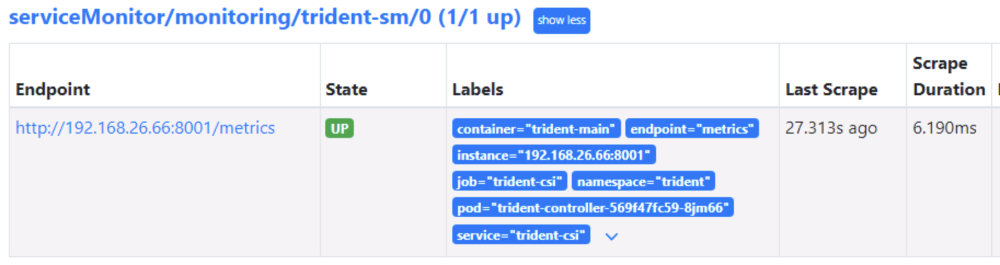
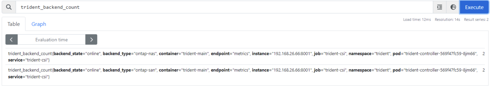

#########################################################################################
# SCENARIO 3: Navigate through Prometheus
#########################################################################################

## A. Check the configuration & understand how data is retrieved

How does Prometheus retrieve data from Trident?  
It uses the concept of **Service Monitor**. We can see that there are plenty of those already configured on this platform, and that one has been created for Trident.  
```bash
$ kubectl get servicemonitor -n monitoring
NAME                                                 AGE
prometheus-grafana                                   47d
prometheus-kube-prometheus-alertmanager              47d
prometheus-kube-prometheus-apiserver                 47d
prometheus-kube-prometheus-coredns                   47d
prometheus-kube-prometheus-kube-controller-manager   47d
prometheus-kube-prometheus-kube-etcd                 47d
prometheus-kube-prometheus-kube-proxy                47d
prometheus-kube-prometheus-kube-scheduler            47d
prometheus-kube-prometheus-kubelet                   47d
prometheus-kube-prometheus-operator                  47d
prometheus-kube-prometheus-prometheus                47d
prometheus-kube-state-metrics                        47d
prometheus-prometheus-node-exporter                  47d
prometheus-prometheus-windows-exporter               47d
trident-sm                                           47d
```

Let's take a look at the specifications of the Trident Service Monitor:  
```bash
$ kubectl describe -n monitoring servicemonitor trident-sm | grep -A 10 Spec
Spec:
  Endpoints:
    Interval:  15s
    Port:      metrics
  Job Label:   trident
  Namespace Selector:
    Match Names:
      trident
  Selector:
    Match Labels:
      App:  controller.csi.trident.netapp.io
```

Seems like it is looking for data every 15 seconds on a specific port called _metrics_, by using filters (_namespace_ & _label_).  
Let's look at the endpoint:  
```bash
$ kubectl describe svc -n trident -l app=controller.csi.trident.netapp.io
Name:              trident-csi
Namespace:         trident
Labels:            app=controller.csi.trident.netapp.io
                   k8s_version=v1.29.4
                   trident_version=v24.10.0
Annotations:       <none>
Selector:          app=controller.csi.trident.netapp.io
Type:              ClusterIP
IP Family Policy:  SingleStack
IP Families:       IPv4
IP:                10.107.253.84
IPs:               10.107.253.84
Port:              https  34571/TCP
TargetPort:        8443/TCP
Endpoints:         192.168.26.66:8443
Port:              metrics  9220/TCP
TargetPort:        8001/TCP
Endpoints:         192.168.26.66:8001
Session Affinity:  None
Events:            <none>
```

There you go. Trident only has one service with several ports exposed, one of them called _metrics_.  
You can verify if you can get access these metrics by the using the _curl_ command, but remember to
change the IP address to the one shown as `Endpoint` in the above output, as yours might be different:
```bash
$ curl -s 192.168.26.66:8001  | grep trident_backend_count
# HELP trident_backend_count The total number of backends
# TYPE trident_backend_count gauge
trident_backend_count{backend_state="online",backend_type="ontap-nas"} 2
trident_backend_count{backend_state="online",backend_type="ontap-san"} 2
```

Tadaaa! You now understand how the data is retrieved!  
You can also find in this folder, the yaml manifest to create a Service Monitor for Trident.  

## B. Check the configuration

The _monitoring_ namespaces has plenty of different services. Let's see how to access the Prometheus dashboard:  
```bash
$ kubectl get -n monitoring svc -l app=kube-prometheus-stack-prometheus
NAME                                    TYPE           CLUSTER-IP      EXTERNAL-IP     PORT(S)                         AGE
prometheus-kube-prometheus-prometheus   LoadBalancer   10.97.110.181   192.168.0.210   9090:31923/TCP,8080:31912/TCP   47d
```

This service is exposed via a LoadBalancer and with 2 ports (9090 is the one you need in this lab to access the GUI).  
You can either use the IP address provided by MetalLB, or use directly http://prometheus.demo.netapp.com:9090 to access the GUI.

You can check that the Trident endpoint is taken into account and in the right state by going to the menu STATUS => TARGETS
<p align="center"></p>  

In the _Graph_ page, you can start querying different metrics, from all objects monitored by Prometheus.  
If you type **tri** in the query box, you will see all the available metrics.  

Polling the _trident_backend_count_ metric will list all the backends configured in Trident:  
<p align="center"></p>

You could also use more complex queries or even build graphs.  

## C. What's next

Let's see how to use [Grafana](../2_Grafana).

