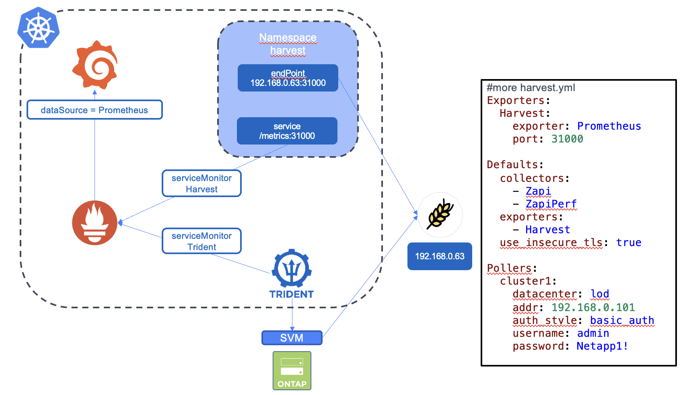
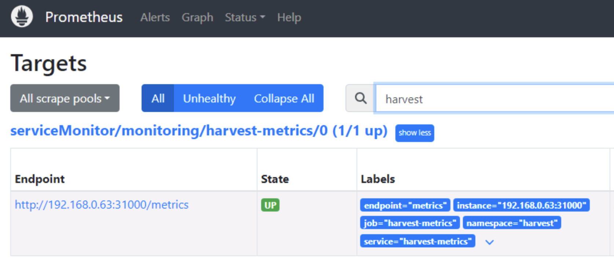

#########################################################################################
# SCENARIO 3: Integrating with NetApp Harvest
#########################################################################################

NetApp Harvest 2.0 is the swiss-army knife for monitoring datacenters. The default package collects performance,capacity and hardware metrics from ONTAP clusters. New metrics can be collected by editing the config files. Metrics can be delivered to multiple databases - Prometheus, InfluxDB and Graphite - and displayed in Grafana dashboards.
In the context of Kubernetes, you could use performance metrics gathered by Harvest and create neat dashboards in Grafana with regards to Persistent Volumes.

More information about Harvest can be found here: https://www.github.com/netapp/harvest  

The scenario will guide you through the installation of Harvest on _rhel3_ (port _31000_) and how to connect it to the Prometheus instance running in Kubernetes.
The file _harvest.yml_ in this repo can be used to configure Harvest to work on this lab.

Let's start by downloading Harvest and installing it (on _rhel3_):
```bash
$ VERSION=25.11.0
$ wget https://github.com/NetApp/harvest/releases/download/v${VERSION}/harvest-${VERSION}-1_linux_amd64.tar.gz -O ~/harvest-${VERSION}.tar.gz
$ mkdir -p ~/harvest
$ tar -xf ~/harvest-${VERSION}.tar.gz -C ~/harvest --strip-components=1
$ mv ~/harvest/harvest.yml ~/harvest/harvest.bak
$ cp harvest.yml ~/harvest/
$ cd ~/harvest
$ bin/harvest start
  Datacenter |  Poller  |  PID   | PromPort | Status
-------------+----------+--------+----------+----------
  lod        | cluster1 | 639779 |    31000 | running
```

To make sure your Harvest installation works, you can run the following:  
```bash
$ curl -s 192.168.0.63:31000/metrics | grep volume_size_total
...
volume_size_total{cluster="cluster1",datacenter="lod",aggr="aggr1",node="cluster1-01",style="flexvol",svm="nassvm",volume="nassvm_root"} 19922944
volume_size_total{cluster="cluster1",datacenter="lod",aggr="aggr1",node="cluster1-01",style="flexvol",svm="nassvm",volume="trident_pvc_1978e262_a8d1_4201_9168_aaa584997d6d"} 1073741824
volume_size_total{cluster="cluster1",datacenter="lod",aggr="aggr1",node="cluster1-01",style="flexvol",svm="sansvm",volume="sansvm_root"} 19922944
...
```

There are several ways for Prometheus to retrieve metrics exposed by Harvest.  
In this scenario, we will create a Service Monitor as well as a few objects to specify where to get the data:
- **NameSpace**: tenant that will host the EndPoint and Service
- **EndPoint**: Kubernetes object that specifies the address of the Prometheus exporter exposed by Harvest
- **Service**: Kubernetes object that describes how to access the metrics (port)
- **ServiceMonitor**: Prometheus object that specifies what Service to monitor and with what frequency

<p align="center"></p>

```bash
$ kubectl create -f Harvest_in_Kubernetes.yaml
namespace/harvest created
endpoints/harvest-metrics created
service/harvest-metrics created
servicemonitor.monitoring.coreos.com/harvest-metrics created
```

If all went well, you should see a new _Target_ showing up in Prometheus, with a status _UP_.  

<p align="center"></p>

Last, Harvest comes with a predefined set of dashboards. If you would like to import them into this environment, I would recommend looking into the following link which also describes how to generate an API Token in Grafana, which will be used by Harvest:
https://netapp.github.io/harvest/24.05/dashboards/ 

As you will not need the ONTAP 7Mode dashboard, you can use the following command on the host RHEL6 to only import dashboards related to ONTAP 9:  
```bash
$ cd ~/harvest
$ bin/grafana import -a "http://192.168.0.63:30267" --directory grafana/dashboards/cmode --serverfolder ONTAP9
using API token from config
connected to Grafana server (version: 10.4.1)
created Grafana folder [ONTAP9] - OK
...
OK - imported ONTAP9 / [harvest_dashboard_volume.json]
OK - imported ONTAP9 / [harvest_dashboard_volume_details.json]
Imported 34 dashboards to [ONTAP9] from [grafana/dashboards/cmode]
```