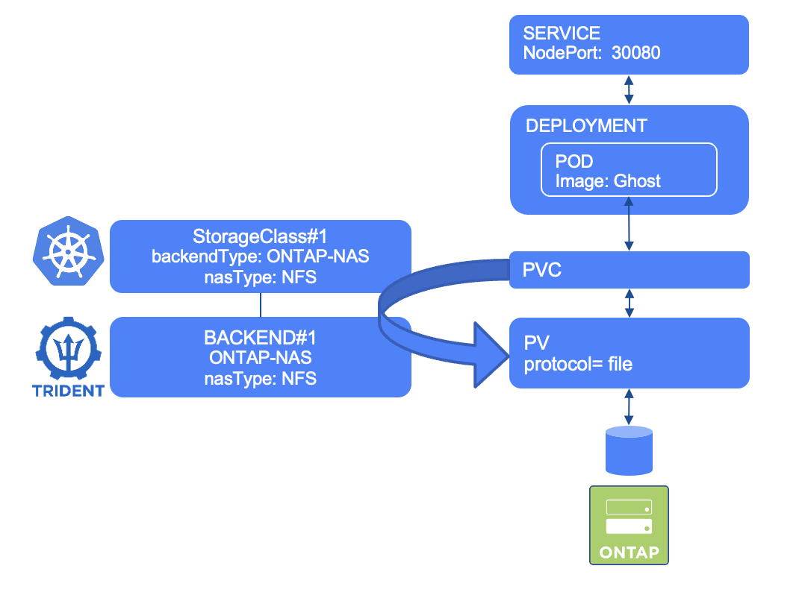

#########################################################################################
# SCENARIO 4: Create your first Application with a NFS PVC
#########################################################################################

Ghost is a light weight web portal. You will a few YAML files in the Ghost directory:  
- a PVC to manage the persistent storage of this app
- a DEPLOYMENT that will define how to manage the app
- a SERVICE to expose the app

<p align="center"></p>

If you have not yet read the [Addenda08](../../../Addendum/Addenda08) about the Docker Hub management, it would be a good time to do so.  
Also, if no action has been made with regards to the container images, you can find a shell script in this directory *scenario04_pull_images.sh* to pull images utilized in this scenario if needed:  
```bash
sh scenario04_pull_images.sh
```

## A. Create the app

We will create this app in its own namespace (also very useful to clean up everything).  
We consider that the ONTAP-NAS backend & storage class have already been created. ([cf Scenario02](../../Scenario02))  
```bash
$ kubectl create -f Ghost/
persistentvolumeclaim/blog-content created
deployment.apps/blog created
service/blog created

$ kubectl get -n ghost all,pvc
NAME                        READY   STATUS    RESTARTS   AGE
pod/blog-596445b7f7-hvgqg   1/1     Running   0          29s

NAME           TYPE       CLUSTER-IP       EXTERNAL-IP   PORT(S)        AGE
service/blog   NodePort   10.109.188.133   <none>        80:30080/TCP   29s

NAME                   READY   UP-TO-DATE   AVAILABLE   AGE
deployment.apps/blog   1/1     1            1           29s

NAME                              DESIRED   CURRENT   READY   AGE
replicaset.apps/blog-596445b7f7   1         1         1       29s

NAME                                 STATUS   VOLUME                                     CAPACITY   ACCESS MODES   STORAGECLASS        VOLUMEATTRIBUTESCLASS   AGE
persistentvolumeclaim/blog-content   Bound    pvc-03a2e4c8-7c71-4728-bebf-01f94e0e18d8   5Gi        RWX            storage-class-nfs   <unset>                 29s
```

## B. Access the app

It takes a few seconds for the POD to be in a *running* state.  
The Ghost service is configured with a NodePort type, which means you can access it from every node of the cluster on port 30080.  
Give it a try !  
=> `http://192.168.0.63:30080`

## C. Explore the app container

Let's see if the */var/lib/ghost/content* folder is indeed mounted to the NFS PVC that was created.  
```bash
$ kubectl exec -n ghost $(kubectl -n ghost get pod -o name) -- df /var/lib/ghost/content
Filesystem           1K-blocks      Used Available Use% Mounted on
192.168.0.131:/trident_pvc_03a2e4c8_7c71_4728_bebf_01f94e0e18d8
                       5242944       832   5242112   0% /var/lib/ghost/content

$ kubectl exec -n ghost $(kubectl -n ghost get pod -o name) -- ls /var/lib/ghost/content
apps
data
images
logs
settings
themes
```

If you have configured Grafana, you can go back to your dashboard, to check what is happening (cf http://192.168.0.211).  

## D. Cleanup (optional)

:boom:  
**The PVC will be reused in the [scenario07](../Scenario07) ('import a volume'). Only clean up if you dont plan to do the scenario07.**
Instead of deleting each object one by one, you can directly delete the namespace which will then remove all of its objects.
:boom:  

```bash
$ kubectl delete ns ghost
namespace "ghost" deleted
```

## E. What's next

I hope you are getting more familiar with Trident now. You can move on to:  
- [SMB](../2_SMB/): Try to use a volume with SMB  
- [Scenario05](../../Scenario05): Configure your first iSCSI backends & storage classes 
- [Scenario07](../../Scenario07): Use the 'import' feature of Trident  
- [Scenario08](../../Scenario08): Consumption control  
- [Scenario09](../../Scenario09): Resize a NFS CSI PVC  

Or go back to the [FrontPage](https://github.com/YvosOnTheHub/LabNetApp)