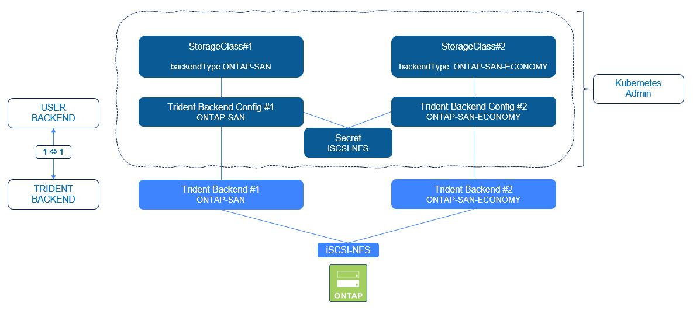

 #########################################################################################
# SCENARIO 5: Create your first SAN backends 
#########################################################################################

**GOAL:**  
You understood how to create backends and what they are for.  
You probably have also created a few ones with the NAS drivers (cf [Scenario02](../Scenario02/)).  
It is now time to add more backends that can be used for block storage:  
- [_backend-iscsi_](#iscsi): Trident driver ONTAP-SAN: creates an iSCSI LUN in an ONTAP FlexVol (one LUN per FlexVol).  
- [_backend-iscsi-luks_](#luks): Trident driver ONTAP-SAN: same as _backend-iscsi_ but with LUKS enabled.   
- [_backend-iscsi-eco_](#iscsi-eco): Trident driver ONTAP-SAN-ECONOMY: creates up to 200 iSCSI LUN in one ONTAP FlexVol. 
- [_backend-nvme_](#nvme): Trident driver ONTAP-SAN: creates an NVMe namespace in an ONTAP FlexVol (one namespace per FlexVol).  

<p align="center"></p>

Note that Trident also supports FCP, but as the lab is not equipped for such infrastructure, it will not be covered in this repo.  

## A. Create an iSCSI backend
<a name="iscsi"></a>

The SVM _sansvm_ is already configured to provide CHAP authentication.  
Reflecting that in the Trident backend is done with the _useCHAP: true_ parameter.  
The CHAP keys can also be found in the corresponding _secret_ (_chapInitiatorSecret_, _chapTargetInitiatorSecret_, _chapTargetUsername_ and _chapUsername_).  

This folder already contains the necessary files to start the setup:
```bash
$ kubectl create -f secret-ontap-iscsi-svm-creds.yaml
secret/secret-iscsi-svm-creds created
$ kubectl create -f backend-iscsi-ontap-san.yaml
tridentbackendconfig.trident.netapp.io/backend-iscsi created
```
As the iSCSI configuration is secured with CHAP authentication, we will create a secret per protocol (NVMe is not compatible with CHAP).  

This folder already contains the necesary files:
```bash
$ kubectl create -f secret-ontap-iscsi-svm-creds.yaml
secret/secret-iscsi-svm-creds created
$ kubectl create -f backend-tbc-iscsi.yaml
tridentbackendconfig.trident.netapp.io/backend-tbc-iscsi created
```
Let's check that it all went fine. The new backend should be displayed as "status=success".  
```bash
$ kubectl get tbc backend-tbc-iscsi -n trident
NAME                BACKEND NAME      BACKEND UUID                           PHASE   STATUS
backend-tbc-iscsi   BackendForiSCSI   17c482e4-6aa7-4a0a-b4f8-26c75eae8a59   Bound   Success

$ tridentctl -n trident get backend BackendForiSCSI
+-----------------+----------------+--------------------------------------+--------+------------+---------+
|      NAME       | STORAGE DRIVER |                 UUID                 | STATE  | USER-STATE | VOLUMES |
+-----------------+----------------+--------------------------------------+--------+------------+---------+
| BackendForiSCSI | ontap-san      | 17c482e4-6aa7-4a0a-b4f8-26c75eae8a59 | online | normal     |       0 |
+-----------------+----------------+--------------------------------------+--------+------------+---------+
```
All good !

## B. Create a ONTAP-SAN-ECONOMY environment with iSCSI  
<a name="iscsi-eco"></a>

When using ONTAP-SAN with the iSCSI protocol, one PVC corresponds to one LUN, which will be created in one ONTAP FlexVol.
Everything has limits, and specifically with ONTAP you can host up to 2500 FlexVol per controller (that depends on various parameters, such as version or architecture. Check hwu.netapp.com for correct values). There is also a limit for number of LUN per controller.    

If those limits are too low, one alternative is to move to the ONTAP-SAN-ECONOMY Trident driver, which will then host several LUN per ONTAP FlexVol. Trident allow you to create up to 200 LUN for FlexVol (minimum: 50, default: 100).  

The TBC we are going to create uses the same iSCSI _secret_ created in the first part of this chapter.  
We also need a new storage class to complete the process.  
```bash
$ kubectl create -f backend-iscsi-ontap-san-eco.yaml
tridentbackendconfig.trident.netapp.io/backend-iscsi-eco created
$ kubectl create -f sc-iscsi-ontap-san-eco.yaml
storageclass.storage.k8s.io/storage-class-iscsi-economy created

$ kubectl get -n trident tbc backend-tbc-iscsi-eco
NAME                BACKEND NAME         BACKEND UUID                           PHASE   STATUS
backend-iscsi-eco   BackendForiSCSIEco   9591fe15-9dac-42a4-b4c3-bdddfdfdbec5   Bound   Success
```

## C. Validate the CHAP configuration on the storage backend

If you take a closer look at the iSCSI secret manifests you will see a bunch of parameter related to bidirectional CHAP, which will add authenticated iSCSI connections.  
You can learn more about it on the following link:  
https://docs.netapp.com/us-en/trident/trident-use/ontap-san-prep.html#authenticate-connections-with-bidirectional-chap  

CHAP authentication is optional & disabled by default. In this lab, both iSCSI SAN backends use CHAP.  

You can check that the CHAP configuration has been set correctly with the following command (password: Netapp1!)  
```bash
$ ssh -l admin 192.168.0.101 iscsi security show
Password:
                                    Auth   Auth CHAP Inbound CHAP       Outbound CHAP
Vserver      Initiator Name         Type   Policy    User Name          User Name
----------   ---------------------- ------ --------- ----------------   -------------
sansvm       default                CHAP   local     uh2a1io325bFFILn   iJF4sgjrnwOwQ
```

You find here both usernames set in the backend parameters.  
Now, you can only see the CHAP configuration on the host once a POD has mounted a PVC, which you will do in the Scenario06.

## D. LUKS
<a name="luks"></a>

You can use LUKS (Linux Unified Key Setup) to encrypt the data on the ONTAP-SAN & ONTAP-SAN-ECONOMY volumes.  

The main requirement for such configuration is to install Cryptsetup (https://gitlab.com/cryptsetup/cryptsetup) on the worker nodes.  
The LoD nodes already have this module installed:
```bash
$ cryptsetup --version
cryptsetup 2.6.0 flags: UDEV BLKID KEYRING FIPS KERNEL_CAPI PWQUALITY
```
It is also recommended to check if the worker nodes support encryption instructions:  
```bash
grep "aes" /proc/cpuinfo
```

Activating LUKS in a Trident backend is done with one option in the _spec_:
```yaml
  defaults:
    luksEncryption: "true"
```

The corresponding storage class contains 2 extra parameters:
```yaml
csi.storage.k8s.io/node-stage-secret-name: luks-${pvc.name}
csi.storage.k8s.io/node-stage-secret-namespace: ${pvc.namespace}
```
The _node-stage-secret-namespace_ parameter indicates what namespace contains the LUKS secret.  
In our example, the secret is in the same namespace as the PVC that requires encryption.  
The _node-stage-secret-name_ parameter defines the secret name format, which in this example uses the PVC name.  

Let's apply that configuration:  
```bash
$ kubectl create -f backend-iscsi-ontap-san-luks.yaml
tridentbackendconfig.trident.netapp.io/backend-iscsi-luks created
$ kubectl create -f sc-iscsi-ontap-san-luks.yaml
storageclass.storage.k8s.io/storage-class-iscsi-luks created

$ kubectl get -n trident tbc backend-iscsi-luks
NAME                     BACKEND NAME          BACKEND UUID                           PHASE   STATUS
backend-iscsi-luks   BackendForiSCSILUKS   0f908faf-ec2f-4933-b9f7-ef28f8149eeb   Bound   Success
```

## E. Create a NVMe backend
<a name="nvme"></a>

As NVMe does not support CHAP, the backend will have its own secret:  
```bash
$ kubectl create -f secret-ontap-nvme-svm-creds.yaml
secret/secret-nvme-svm-creds created
$ kubectl create -f backend-nvme-ontap-san.yaml
tridentbackendconfig.trident.netapp.io/backend-nvme created
```

Let's check that it all went fine. Backends should be displayed as "status=success" & no new entry should be visible when listing the backends with tridentctl.  
```bash
$ kubectl get tbc backend-nvme -n trident
NAME            BACKEND NAME      BACKEND UUID                           PHASE   STATUS
backend-nvme    BackendForNVMe    493fef7f-8328-41d4-99f2-dea4281324a1   Bound   Success

$ tridentctl -n trident get backend BackendForNVMe
+-----------------+----------------+--------------------------------------+--------+------------+---------+
|      NAME       | STORAGE DRIVER |                 UUID                 | STATE  | USER-STATE | VOLUMES |
+-----------------+----------------+--------------------------------------+--------+------------+---------+
| BackendForNVMe  | ontap-san      | 493fef7f-8328-41d4-99f2-dea4281324a1 | online | normal     |       0 |
+-----------------+----------------+--------------------------------------+--------+------------+---------+
```
and voilà.

Some information about this NVMe backend:  
- not supported with the Trident driver ONTAP-SAN-ECONOMY. 
- contrary to iSCSI where you have an iGroup per worker node, Trident uses a "shared super-susbsystem" which can be linked to a maximum of 64 nodes. 


## F. What's next

Now, you have some SAN Backends & some storage classes configured. You can proceed to the creation of a stateful application:  
- [Scenario06](../Scenario06): Deploy your first app with Block storage  

Or go back to the [FrontPage](https://github.com/YvosOnTheHub/LabNetApp)