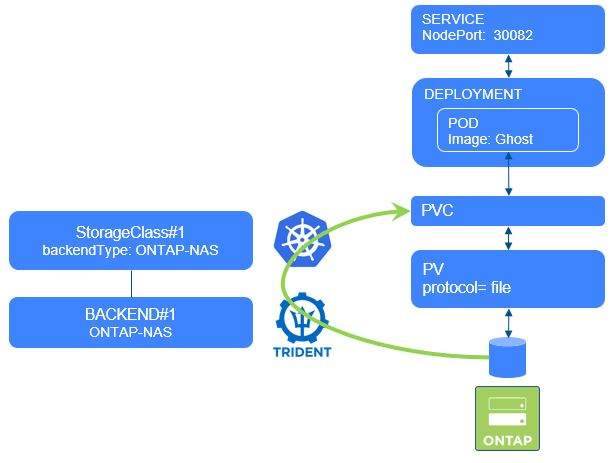

#########################################################################################
# SCENARIO 7-1: Import a NFS volume
#########################################################################################

**GOAL:**  
Let's first copy the NFS volume we used in the [Scenario04](../../Scenario04), which will then be imported, and used to create a new Ghost instance  

<p align="center"></p>

If you have not yet read the [Addenda08](../../../Addendum/Addenda08) about the Docker Hub management, it would be a good time to do so.  
Also, if no action has been made with regards to the container images, you can find a shell script in this directory *scenario07_pull_images.sh* to pull images utilized in this scenario if needed:  
```bash
sh ../scenario07_pull_images.sh
```

## A. Identify & copy the volume on the NetApp backend.

The full name of the volume is available in the PV metadata.  
You can retrieve it if with the 'kubectl describe' command, or use the following (note how to use the jsonpath feature!)  
```bash
$ kubectl get pv $( kubectl get pvc blog-content -n ghost -o=jsonpath='{.spec.volumeName}') -o=jsonpath='{.spec.csi.volumeAttributes.internalName}{"\n"}'
trident_pvc_6777dffb_b21d_42b5_be71_d8675c9e7db9
```

Now that you know the full name of the volume, you can copy it. This copy will be done in 2 stages (clone & split)
Open Putty, connect to "cluster1" and finally enter all the following:  
```bash
vol clone create -flexclone to_import -vserver nassvm -parent-volume trident_pvc_6777dffb_b21d_42b5_be71_d8675c9e7db9
vol clone split start -flexclone to_import -vserver nassvm
snapshot create -vserver nassvm -volume to_import -snapshot snap-to-import
```

In this example, the new volume's name is 'to_import'.  
A snapshot was also created for the next chapter of this scenario (snapshot import).  

## B. Import the volume with tridentctl

In the 'Ghost' directory, you will see some yaml files to build a new 'Ghost' app.
Open the PVC definition file, & notice the difference with the one used in the scenario5.

```bash
$ tridentctl -n trident import volume BackendForNFS to_import -f Ghost/1_pvc.yaml
+------------------------------------------+---------+-------------------+----------+--------------------------------------+--------+---------+
|                   NAME                   |  SIZE   |   STORAGE CLASS   | PROTOCOL |             BACKEND UUID             | STATE  | MANAGED |
+------------------------------------------+---------+-------------------+----------+--------------------------------------+--------+---------+
| pvc-e193d612-dd46-4e71-b31d-b0f57ca558f6 | 5.0 GiB | storage-class-nfs | file     | 11d28fb4-6cf5-4c59-931d-94b8d8a5e061 | online | true    |
+------------------------------------------+---------+-------------------+----------+--------------------------------------+--------+---------+

$ tridentctl -n trident get volume
+------------------------------------------+---------+--------------------+----------+--------------------------------------+-------+---------+
|                   NAME                   |  SIZE   |   STORAGE CLASS    | PROTOCOL |             BACKEND UUID             | STATE | MANAGED |
+------------------------------------------+---------+--------------------+----------+--------------------------------------+-------+---------+
| pvc-6777dffb-b21d-42b5-be71-d8675c9e7db9 | 5.0 GiB | storage-class-nfs  | file     | 11d28fb4-6cf5-4c59-931d-94b8d8a5e061 |       | true    |
| pvc-e193d612-dd46-4e71-b31d-b0f57ca558f6 | 5.0 GiB | storage-class-nfs  | file     | 11d28fb4-6cf5-4c59-931d-94b8d8a5e061 |       | true    |
+------------------------------------------+---------+--------------------+----------+--------------------------------------+-------+---------+

$ kubectl get pvc -n ghost
NAME                  STATUS   VOLUME                                     CAPACITY   ACCESS MODES   STORAGECLASS        AGE
blog-content          Bound    pvc-6777dffb-b21d-42b5-be71-d8675c9e7db9   5Gi        RWX            storage-class-nfs   <unset>                 3m59s
blog-content-import   Bound    pvc-e193d612-dd46-4e71-b31d-b0f57ca558f6   5Gi        RWX            storage-class-nfs   <unset>                 34s
```

Notice that the volume full name on the storage backend has changed to respect the CSI specifications:  
```bash
$ kubectl get pv $( kubectl get pvc blog-content-import -n ghost -o=jsonpath='{.spec.volumeName}') -o=jsonpath='{.spec.csi.volumeAttributes.internalName}{"\n"}'
trident_pvc_e193d612_dd46_4e71_b31d_b0f57ca558f6
```

Even though the name of the original PV has changed, you can still see it if you look into its annotations.  
```bash
$ kubectl describe pvc blog-content-import -n ghost | grep importOriginalName
               trident.netapp.io/importOriginalName: to_import
```

## C. Create a new Ghost app.

You can now create the deployment & expose it on a new port:  
```bash
$ kubectl create -n ghost -f Ghost/2_deploy.yaml
deployment.apps/blogimport created
$ kubectl create -n ghost -f Ghost/3_service.yaml
service/blogimport created

$ kubectl get pod,svc -n ghost
NAME                           READY   STATUS    RESTARTS   AGE
pod/blog-cd5894ddd-d2tqp       1/1     Running   0          20h
pod/blogimport-66945d9-bsw9b   1/1     Running   0          24m

NAME                 TYPE       CLUSTER-IP       EXTERNAL-IP   PORT(S)        AGE
service/blog         NodePort   10.111.248.112   <none>        80:30080/TCP   20h
service/blogimport   NodePort   10.104.52.17     <none>        80:30083/TCP   24m
```

## D. Access the app

The Ghost service is configured with a NodePort type, which means you can access it from every node of the cluster on port 30082.
Give it a try !  
=> http://192.168.0.63:30083  

## E. Importing a volume without managing it  

In the previous example, the imported volume is managed by Trident, ie you can apply all Trident features on that volume. In some cases, you just want to import the volume, without having it managed later on by Trident. This can be achieved by adding the flag _--no-manage_ in the import command. Let's see the difference.  

Let's start by creating a new clone:  
```bash
vol clone create -flexclone to_import_nm -vserver nassvm -parent-volume trident_pvc_6777dffb_b21d_42b5_be71_d8675c9e7db9
vol clone split start -flexclone to_import_nm -vserver nassvm
vol mount -vserver nassvm -volume to_import_nm -junction-path /to_import_nm
```
Notice that there is an extra step for the import operation succeed, the volume must be mounted in ONTAP.  
Now, let's use Trident to import that volume:  
```bash
$ tridentctl -n trident import volume BackendForNFS to_import_nm -f Ghost/1_pvc_nm.yaml --no-manage
+------------------------------------------+---------+-------------------+----------+--------------------------------------+--------+---------+
|                   NAME                   |  SIZE   |   STORAGE CLASS   | PROTOCOL |             BACKEND UUID             | STATE  | MANAGED |
+------------------------------------------+---------+-------------------+----------+--------------------------------------+--------+---------+
| pvc-6d373e1a-33bd-4b8c-8074-5f57965117ad | 5.0 GiB | storage-class-nfs | file     | 11d28fb4-6cf5-4c59-931d-94b8d8a5e061 | online | false   |
+------------------------------------------+---------+-------------------+----------+--------------------------------------+--------+---------+

$ tridentctl -n trident get volume
+------------------------------------------+---------+--------------------+----------+--------------------------------------+-------+---------+
|                   NAME                   |  SIZE   |   STORAGE CLASS    | PROTOCOL |             BACKEND UUID             | STATE | MANAGED |
+------------------------------------------+---------+--------------------+----------+--------------------------------------+-------+---------+
| pvc-6777dffb-b21d-42b5-be71-d8675c9e7db9 | 5.0 GiB | storage-class-nfs  | file     | 11d28fb4-6cf5-4c59-931d-94b8d8a5e061 |       | true    |
| pvc-6d373e1a-33bd-4b8c-8074-5f57965117ad | 5.0 GiB | storage-class-nfs  | file     | 11d28fb4-6cf5-4c59-931d-94b8d8a5e061 |       | false   |
| pvc-e193d612-dd46-4e71-b31d-b0f57ca558f6 | 5.0 GiB | storage-class-nfs  | file     | 11d28fb4-6cf5-4c59-931d-94b8d8a5e061 |       | true    |
+------------------------------------------+---------+--------------------+----------+--------------------------------------+-------+---------+
```
Notice the _Managed_ flag, set to _false_ for this volume.  
Another difference is that the ONTAP volume is not renamed this time:  
```bash
$ kubectl get pv $( kubectl get pvc blog-content-import-nm -n ghost -o=jsonpath='{.spec.volumeName}') -o=jsonpath='{.spec.csi.volumeAttributes.internalName}{"\n"}'
to_import_nm
```

## F. Import the volume with kubectl

Until now, you have tested volume import with _tridentctl_, let's how to use _kubectl_ to perform this action.  

Let's start by creating another clone:  
```bash
vol clone create -flexclone to_import_kubectl -vserver nassvm -parent-volume trident_pvc_6777dffb_b21d_42b5_be71_d8675c9e7db9
vol clone split start -flexclone to_import_kubectl -vserver nassvm
vol mount -vserver nassvm -volume to_import_kubectl -junction-path /to_import_kubectl
```
Now that a ONTAP volume, let's see how to import it in Kubernetes (notice the 3 new annotations):  
```bash
cat << EOF | kubectl apply -f -
kind: PersistentVolumeClaim
apiVersion: v1
metadata:
  name: blog-content-import-kubectl
  namespace: ghost
  annotations:
    trident.netapp.io/importOriginalName: "to_import_kubectl"
    trident.netapp.io/importBackendUUID: "11d28fb4-6cf5-4c59-931d-94b8d8a5e061"
    trident.netapp.io/notManaged: "false"
spec:
  accessModes:
    - ReadWriteMany
  resources:
    requests:
      storage: 5Gi
  storageClassName: storage-class-nfs
EOF
persistentvolumeclaim/blog-content-import-kubectl created
```
And just like that, you have a new PVC available!  
```bash
$ kubectl get pvc -n ghost
NAME                          STATUS   VOLUME                                     CAPACITY   ACCESS MODES   STORAGECLASS        AGE
blog-content                  Bound    pvc-6777dffb-b21d-42b5-be71-d8675c9e7db9   5Gi        RWX            storage-class-nfs   <unset>                 5m59s
blog-content-import           Bound    pvc-e193d612-dd46-4e71-b31d-b0f57ca558f6   5Gi        RWX            storage-class-nfs   <unset>                 3m59s
blog-content-import-kubectl   Bound    pvc-3311fc5c-7014-49c8-8567-94c1fc1ba4bd   5Gi        RWX            storage-class-nfs   <unset>                 4m47s
```
Again, notice that the volume full name on the storage backend has changed to respect the CSI specifications:  
```bash
$ kubectl get pv $( kubectl get pvc blog-content-import-kubectl -n ghost -o=jsonpath='{.spec.volumeName}') -o=jsonpath='{.spec.csi.volumeAttributes.internalName}{"\n"}'
trident_pvc_3311fc5c_7014_49c8_8567_94c1fc1ba4bd
```

Even though the name of the original PV has changed, you can still see it if you look into its annotations.  
```bash
$ kubectl describe pvc blog-content-import-kubectl -n ghost | grep importOriginalName
               trident.netapp.io/importOriginalName: to_import_kubectl
```


## G. Cleanup

Only proceed with the cleanup if you are not planning on testing the snapshot import feature, which you can find in the second chapter of this scenario.

```bash
$ kubectl delete ns ghost
namespace "ghost" deleted
```

## G. What's next

You can now move on to:  
- [Scenario07_2](../2_SMB_import): Importing a SMB volume  
- [Scenario07_3](../3_Snapshot_Import): Importing a snapshot  
- [Scenario07_4](../4_iSCSI_import): Importing an iSCSI volume  
- [Scenario07_5](../5_NVMe_import): Importing a NVMe volume  
- [Scenario08](../../Scenario08): Consumption control  
- [Scenario10](../../Scenario10): Using Virtual Storage Pools 
- [Scenario11](../../Scenario11): StatefulSets & Storage consumption  

Or go back to the [FrontPage](https://github.com/YvosOnTheHub/LabNetApp)
