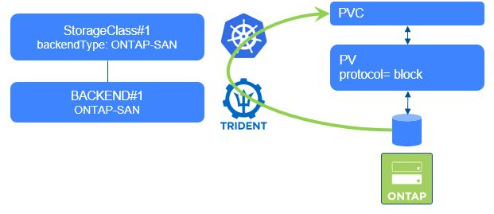

#########################################################################################
# SCENARIO 7-4: Import a iSCSI Block volume
#########################################################################################

**GOAL:**  
Trident 20.07 introduced the possibility to import into Kubernetes a iSCSI LUN that exists in an ONTAP platform.  
An iSCSI Backend must already be present in order to complete this scenario. This can be achieved by following the [scenario5](../../Scenario05)

<p align="center"></p>

## A. Import a single LUN with ONTAP-SAN & tridentctl

We are first going to create a new flexvol, as well as a LUN.  
To create these 2 objects, we will use the CURL command in order to reach ONTAP REST API:  
```bash
$ curl -X POST -ku admin:Netapp1! -H "accept: application/json" -H "Content-Type: application/json" -d '{
  "aggregates": [{"name": "aggr1"}],
  "name": "scenario7_4",
  "size": "10g",
  "style": "flexvol",
  "svm": {"name": "sansvm"}
}' "https://cluster1.demo.netapp.com/api/storage/volumes"

$ curl -X POST -ku admin:Netapp1! -H "accept: application/json" -H "Content-Type: application/json" -d '{
  "name": "/vol/scenario7_4/lun0",
  "os_type": "linux",
  "space": {"size": 1073741824},
  "svm": {"name": "sansvm"}
}' "https://cluster1.demo.netapp.com/api/storage/luns"
```

A lun called **lun0** has been created in the FlexVol **scenario7_4**.  
We are now going to import this LUN into Kubernetes.

To know more about ONTAP REST API, please take a look at the following link:
https://library.netapp.com/ecmdocs/ECMLP2856304/html/index.html

Bringing that LUN in Kubernetes can be achieved using the same _tridentctl import_ command used for NFS.  
Please note that:  
- You need to enter the name of the volume containing the LUN & not the LUN name
- The LUN does not need to be mapped to an iGroup when importing it with Trident
- The volume hosting the LUN is going to be renamed once imported in order to follow the CSI specifications

```bash
$ tridentctl -n trident import volume BackendForiSCSI scenario7_4 -f pvc_rwo_import.yaml
+------------------------------------------+---------+---------------------+----------+--------------------------------------+--------+---------+
|                   NAME                   |  SIZE   |    STORAGE CLASS    | PROTOCOL |             BACKEND UUID             | STATE  | MANAGED |
+------------------------------------------+---------+---------------------+----------+--------------------------------------+--------+---------+
| pvc-6b41338d-0c82-407a-9396-d9e99478a573 | 1.0 GiB | storage-class-iscsi | block    | 17c482e4-6aa7-4a0a-b4f8-26c75eae8a59 | online | true    |
+------------------------------------------+---------+---------------------+----------+--------------------------------------+--------+---------+

$ kubectl get pvc
NAME          STATUS   VOLUME                                     CAPACITY   ACCESS MODES   STORAGECLASS          VOLUMEATTRIBUTESCLASS   AGE
lun-import1   Bound    pvc-6b41338d-0c82-407a-9396-d9e99478a573   1Gi        RWO            storage-class-iscsi   <unset>                 14s
```

Notice that the FlexVol full name on the storage backend has changed to respect the CSI specifications:  
```bash
$ kubectl get pv $(kubectl get pvc lun-import1 -o=jsonpath='{.spec.volumeName}') -o=jsonpath='{.spec.csi.volumeAttributes.internalName}{"\n"}'
trident_pvc_6b41338d_0c82_407a_9396_d9e99478a573
```

Even though the name of the original PV has changed, you can still see it if you look into its annotations.  
```bash
$ kubectl describe pvc lun-import1 | grep importOriginalName
               trident.netapp.io/importOriginalName: scenario7_4
```

## B. Import multiple LUNs with ONTAP-SAN-ECONOMY & kubectl

Importing LUNs with ONTAP-ASN-ECONOMY was introduced in Trident 24.06.  
We are going to see here how to use that method.  

But first, let's create a new Flexvol that contains 2 LUNs:  
```bash
$ curl -X POST -ku admin:Netapp1! -H "accept: application/json" -H "Content-Type: application/json" -d '{
  "aggregates": [{"name": "aggr1"}],
  "name": "scenario7_4_2",
  "size": "21g",
  "style": "flexvol",
  "svm": {"name": "sansvm"}
}' "https://cluster1.demo.netapp.com/api/storage/volumes"

$ curl -X POST -ku admin:Netapp1! -H "accept: application/json" -H "Content-Type: application/json" -d '{
  "name": "/vol/scenario7_4_2/lun0",
  "os_type": "linux",
  "space": {"size": 1073741824},
  "svm": {"name": "sansvm"}
}' "https://cluster1.demo.netapp.com/api/storage/luns"

$ curl -X POST -ku admin:Netapp1! -H "accept: application/json" -H "Content-Type: application/json" -d '{
  "name": "/vol/scenario7_4_2/lun1",
  "os_type": "linux",
  "space": {"size": 1073741824},
  "svm": {"name": "sansvm"}
}' "https://cluster1.demo.netapp.com/api/storage/luns"
```
This time, we are going to import those LUNs with kubectl.  
That said, we still need to know the backend UUID, parameter passed later to the PVC as an annotation:  
```bash
$ tridentctl -n trident get backend BackendForiSCSIEco
+--------------------+-------------------+--------------------------------------+--------+------------+---------+
|        NAME        |  STORAGE DRIVER   |                 UUID                 | STATE  | USER-STATE | VOLUMES |
+--------------------+-------------------+--------------------------------------+--------+------------+---------+
| BackendForiSCSIEco | ontap-san-economy | 8a802f70-8782-4acf-bd24-8d287f9e3e6c | online | normal     |       0 |
+--------------------+-------------------+--------------------------------------+--------+------------+---------+
```
We now have all the information we need to import the first LUN.  
Notice the 3 annotations, especially the **importOrginalName** one, which contains the FlexVol name, as well as the LUN name:  
```bash
$ cat << EOF | kubectl apply -f -
kind: PersistentVolumeClaim
apiVersion: v1
metadata:
  name: lun-import2
  annotations:
    trident.netapp.io/importOriginalName: "scenario7_4_2/lun0"
    trident.netapp.io/importBackendUUID: "8a802f70-8782-4acf-bd24-8d287f9e3e6c"
    trident.netapp.io/notManaged: "false"
spec:
  accessModes:
    - ReadWriteOnce
  resources:
    requests:
      storage: 1Gi
  storageClassName: storage-class-iscsi-economy
EOF
persistentvolumeclaim/lun-import2 created

$ kubectl get pvc lun-import2
NAME          STATUS   VOLUME                                     CAPACITY   ACCESS MODES   STORAGECLASS                  VOLUMEATTRIBUTESCLASS   AGE
lun-import2   Bound    pvc-6963d92c-751c-4adb-9db5-1f70cd887045   1Gi        RWO            storage-class-iscsi-economy   <unset>                 16s
```
As expected, the LUN was renamed: 
```bash
$ kubectl get pv $(kubectl get pvc lun-import2 -o=jsonpath='{.spec.volumeName}') -o=jsonpath='{.spec.csi.volumeAttributes.internalName}{"\n"}'
san_eco_pvc_6963d92c_751c_4adb_9db5_1f70cd887045
```
Note that the FlexVol containing both LUNs also got renamed.  
You can see that by connecting to the ONTAP plaform:  
```bash
cluster1::> lun show
Vserver   Path                            State   Mapped   Type        Size
--------- ------------------------------- ------- -------- -------- --------
sansvm    /vol/trident_lun_pool_san_eco_SCKBODRXZD/lun1
                                          online  unmapped linux         1GB
sansvm    /vol/trident_lun_pool_san_eco_SCKBODRXZD/san_eco_pvc_6963d92c_751c_4adb_9db5_1f70cd887045
                                          online  unmapped linux         1GB
2 entries were displayed.
```

To import the second LUN, you must then use the updated FlexVol name:  
```bash
$ cat << EOF | kubectl apply -f -
kind: PersistentVolumeClaim
apiVersion: v1
metadata:
  name: lun-import3
  annotations:
    trident.netapp.io/importOriginalName: "trident_lun_pool_san_eco_SCKBODRXZD/lun1"
    trident.netapp.io/importBackendUUID: "8a802f70-8782-4acf-bd24-8d287f9e3e6c"
    trident.netapp.io/notManaged: "false"
spec:
  accessModes:
    - ReadWriteOnce
  resources:
    requests:
      storage: 1Gi
  storageClassName: storage-class-iscsi-economy
EOF
persistentvolumeclaim/lun-import3 created

$ kubectl get pvc lun-import3
NAME          STATUS   VOLUME                                     CAPACITY   ACCESS MODES   STORAGECLASS                  VOLUMEATTRIBUTESCLASS   AGE
lun-import3   Bound    pvc-7da756f9-0362-4717-9eb9-bb66c4d751ae   1Gi        RWO            storage-class-iscsi-economy   <unset>                 25s
```
Last check, to verify that the LUN was also renamed:  
```bash
cluster1::> lun show
Vserver   Path                            State   Mapped   Type        Size
--------- ------------------------------- ------- -------- -------- --------
sansvm    /vol/trident_lun_pool_san_eco_SCKBODRXZD/san_eco_pvc_6963d92c_751c_4adb_9db5_1f70cd887045
                                          online  unmapped linux         1GB
sansvm    /vol/trident_lun_pool_san_eco_SCKBODRXZD/san_eco_pvc_7da756f9_0362_4717_9eb9_bb66c4d751ae
                                          online  unmapped linux         1GB
2 entries were displayed.
```


## C. Cleanup (optional)

This volume is no longer required & can be deleted from the environment.

```bash
$ kubectl delete pvc lun-import1 lun-import2 lun-import3
persistentvolumeclaim "lun-import1" deleted
persistentvolumeclaim "lun-import2" deleted
persistentvolumeclaim "lun-import3" deleted
```

## D. What's next

You can now move on to:  
- [Scenario07_5](../5_NVMe_import): Importing a NVMe volume  
- [Scenario08](../../Scenario08): Consumption control  
- [Scenario09](../../Scenario09): Expanding volumes
- [Scenario10](../../Scenario10): Using Virtual Storage Pools 
- [Scenario11](../../Scenario11): StatefulSets & Storage consumption  

Or go back to the [FrontPage](https://github.com/YvosOnTheHub/LabNetApp)