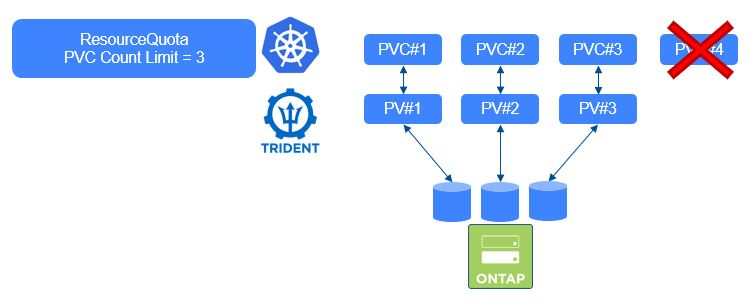
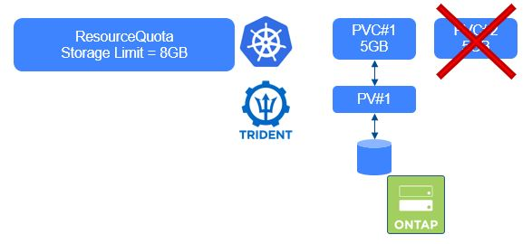

#########################################################################################
# SCENARIO 8: Consumption control: Kubernetes Parameters
#########################################################################################

You can create different objects to control the storage consumption directly in Kubernetes:  
- LimitRange: controls the maximum (& minimum) size for each claim in a namespace
- ResourceQuotas: limits the number of PVC or the amount of cumulative storage in a namespace

In order to restrict the tests to a small environment & not affect other projects, we will create a specific namespace called _control_.  
We consider that the ONTAP-NAS NFS backend & storage class have already been created. ([cf Scenario02](../../Scenario02)).  

## A. Resource Quotas

We will here create two types of quotas:  
1. limit the number of PVC a user can create
2. limit the total capacity a user can create  

```bash
$ kubectl create namespace control
namespace/control created
$ kubectl create -f rq-pvc-count-limit.yaml
resourcequota/pvc-count-limit created
$ kubectl create -f rq-sc-resource-limit.yaml
resourcequota/sc-resource-limit created

$ kubectl get resourcequota -n control
NAME                AGE   REQUEST                                                                                                  LIMIT
pvc-count-limit     11s   persistentvolumeclaims: 0/5, storage-class-nfs.storageclass.storage.k8s.io/persistentvolumeclaims:       0/3
sc-resource-limit   16s   requests.storage: 0/10Gi, storage-class-nfs.storageclass.storage.k8s.io/requests.storage:                0/8Gi

$ kubectl describe quota pvc-count-limit -n control
Name:                                                                 pvc-count-limit
Namespace:                                                            control
Resource                                                              Used  Hard
--------                                                              ----  ----
persistentvolumeclaims                                                0     5
storage-class-nfs.storageclass.storage.k8s.io/persistentvolumeclaims  0     3
```

Now let's start creating some PVC within the namespace _control_ & check the resource quota usage
<p align="center"></p>

```bash
$ kubectl create -f pvc-quotasc-1.yaml
persistentvolumeclaim/quotasc-1 created
$ kubectl create -f pvc-quotasc-2.yaml
persistentvolumeclaim/quotasc-2 created

$ kubectl describe quota pvc-count-limit -n control
Name:                                                                 pvc-count-limit
Namespace:                                                            control
Resource                                                              Used  Hard
--------                                                              ----  ----
persistentvolumeclaims                                                2     5
storage-class-nfs.storageclass.storage.k8s.io/persistentvolumeclaims  2     3

$ kubectl create -f pvc-quotasc-3.yaml
persistentvolumeclaim/quotasc-3 created

$ kubectl describe quota pvc-count-limit -n control
Name:                                                                 pvc-count-limit
Namespace:                                                            control
Resource                                                              Used  Hard
--------                                                              ----  ----
persistentvolumeclaims                                                3     5
storage-class-nfs.storageclass.storage.k8s.io/persistentvolumeclaims  3     3
```

Theoretically, you got the maximum number of PVC allowed for this storage class. Let's see what happens next...  
```bash
$ kubectl create -f pvc-quotasc-4.yaml
Error from server (Forbidden): error when creating "pvc-quotasc-4.yaml": persistentvolumeclaims "quotasc-4" is forbidden: exceeded quota: pvc-count-limit, requested: storage-class-nfs.storageclass.storage.k8s.io/persistentvolumeclaims=1, used: storage-class-nfs.storageclass.storage.k8s.io/persistentvolumeclaims=3, limited: storage-class-nfs.storageclass.storage.k8s.io/persistentvolumeclaims=3
```

As expected, you cannot create a new PVC in this storage class...  
Let's clean up the PVC  
```bash
$ kubectl delete pvc -n control --all
persistentvolumeclaim "quotasc-1" deleted
persistentvolumeclaim "quotasc-2" deleted
persistentvolumeclaim "quotasc-3" deleted
```

Time to look at the capacity quotas  
<p align="center"></p>

```bash
$ kubectl describe quota sc-resource-limit -n control
Name:                                                           sc-resource-limit
Namespace:                                                      control
Resource                                                        Used  Hard
--------                                                        ----  ----
requests.storage                                                0     10Gi
storage-class-nfs.storageclass.storage.k8s.io/requests.storage  0     8Gi
```

Each PVC you are going to use is 5GB.  
```bash
$ kubectl create -f pvc-5Gi-1.yaml
persistentvolumeclaim/5gb-1 created

$ kubectl describe quota sc-resource-limit -n control
Name:                                                           sc-resource-limit
Namespace:                                                      control
Resource                                                        Used  Hard
--------                                                        ----  ----
requests.storage                                                5Gi   10Gi
storage-class-nfs.storageclass.storage.k8s.io/requests.storage  5Gi   8Gi
```

Seeing the size of the second PVC file, the creation should fail in this namespace.  
```bash
$ kubectl create -f pvc-5Gi-2.yaml
Error from server (Forbidden): error when creating "pvc-5Gi-2.yaml": persistentvolumeclaims "5gb-2" is forbidden: exceeded quota: sc-resource-limit, requested: storage-class-nfs.storageclass.storage.k8s.io/requests.storage=5Gi, used: storage-class-nfs.storageclass.storage.k8s.io/requests.storage=5Gi, limited: storage-class-nfs.storageclass.storage.k8s.io/requests.storage=8Gi
```

Before starting the second part of this scenario, let's clean up.  
```bash
$ kubectl delete pvc -n control 5gb-1
persistentvolumeclaim "5gb-1" deleted
$ kubectl delete resourcequota -n control --all
resourcequota "pvc-count-limit" deleted
resourcequota "sc-resource-limit" deleted
```

## B. Limit Range

We will use the LimitRange object type to control the maximum size of the volumes we create in a namespace. However, you can also decide to use this object type to control compute & memory limits.  
```bash
$ kubectl create -f lr-pvc.yaml
limitrange/storagelimits created

$ kubectl describe -n control limitrange storagelimits
Name:                  storagelimits
Namespace:             control
Type                   Resource  Min  Max  Default Request  Default Limit  Max Limit/Request Ratio
----                   --------  ---  ---  ---------------  -------------  -----------------------
PersistentVolumeClaim  storage   -    2Gi  -                -              -
```

Now that we have create a 2Gi limit, let's try to create a 5Gi volume, operation that should fail.  
```bash
$ kubectl create -f pvc-5Gi-1.yaml
Error from server (Forbidden): error when creating "pvc-5Gi-1.yaml": persistentvolumeclaims "5gb-1" is forbidden: maximum storage usage per PersistentVolumeClaim is 2Gi, but request is 5Gi
```

Magical, right?  
Note that Trident also has a similar parameter called _limitVolumeSize_ that controls the maximum capacity of a PVC per Trident Backend.  
This is going to be described in the next chapter.  

OK, time to clean up again!  

```bash
$ kubectl delete -n control limitrange storagelimits
limitrange "storagelimits" deleted
```

## What's next

You can now move on to the next section of this chapter: [Trident parameters](../2_Trident_parameters)

Or go back to the [FrontPage](https://github.com/YvosOnTheHub/LabNetApp)