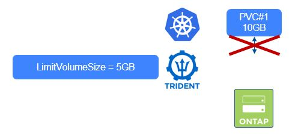

#########################################################################################
# SCENARIO 8: Consumption control: Trident parameters
#########################################################################################

You have a few control options within Trident configured at the backend level:  
- [_limitVolumeSize_](#a-limiting-the-size-of-the-pvc): limits the size of PVCs    
- [_limitVolumePoolSize_](#b-limiting-the-size-of-the-flexvol-hosting-qtrees-or-luns-when-using-economy-drivers): limits the size of the FlexVol hosting Qtrees or LUNs when using ECONOMY drivers  
- [_limitAggregateUsage_](#c-limiting-the-usage-of-an-aggregate): limits the overall capacity of ONTAP aggregates  
- [_qtreesPerFlexVol_](#d-limiting-the-number-of-pvc-per-flexvol-with-the-economy-drivers): limits the number of Qtrees per FlexVol with the ONTAP-NAS-ECONOMY driver  
- [_lunsPerFlexVol_](#d-limiting-the-number-of-pvc-per-flexvol-with-the-economy-drivers): limits the number of LUNs per FlexVol with the ONTAP-SAN-ECONOMY driver  
- [_denyNewVolumePools_](#e-outsource-pool-creation-to-the-storage-team): remove from Trident the capability to create new Pools  

## A. Limiting the size of the PVC  

One parameter stands out in the Trident configuration when it comes to control sizes: _limitVolumeSize_  
https://docs.netapp.com/us-en/trident/trident-reco/storage-config-best-practices.html#limit-the-maximum-size-of-volumes-created-by-trident  

<p align="center">:boom: :boom: :boom: :boom: :boom: :boom: :boom: :boom: :boom: :boom: :boom: :boom: :boom: :boom: :boom: :boom:</p>  
**Starting with Trident 24.06**, this parameter will limit the size of the PVC whatever Trident driver you use with whatever protocol.  
Note that with older versions of Trident, and in the context of ECONOMY driver, this parameter used to control the size of the FlexVol hosting Qtrees or LUNs.  
<p align="center">:boom: :boom: :boom: :boom: :boom: :boom: :boom: :boom: :boom: :boom: :boom: :boom: :boom: :boom: :boom: :boom:</p>  

<p align="center"></p>

Let's create a backend with this parameter setup (limitVolumeSize = 5g), followed by the storage class that points to it, using the storagePools parameter:  
```bash
$ kubectl create -f backend_nas-limitvolumesize.yaml
tridentbackendconfig.trident.netapp.io/backend-tbc-ontap-nas-limit-volsize created
storageclass.storage.k8s.io/sclimitvolumesize created
```

Let's see the behavior of the PVC creation, using the pvc-10Gi-volume.yaml file.  
```bash
$ kubectl create -f pvc-10Gi-volume.yaml
persistentvolumeclaim/10gvol created

$ kubectl get pvc 10gvol
NAME      STATUS    VOLUME                                  CAPACITY   ACCESS MODES   STORAGECLASS        AGE
10gvol    Pending                                                                     sclimitvolumesize   10s
```

The PVC will remain in the _Pending_ state. You need to look either in the PVC logs or Trident's  
```bash
$ kubectl describe pvc 10gvol
Name:          10gvol
Namespace:     default
StorageClass:  sclimitvolumesize
Status:        Pending
Volume:
Labels:        <none>
Annotations:   volume.beta.kubernetes.io/storage-provisioner: csi.trident.netapp.io
               volume.kubernetes.io/storage-provisioner: csi.trident.netapp.io
Finalizers:    [kubernetes.io/pvc-protection]
Capacity:
Access Modes:
VolumeMode:    Filesystem
Used By:       <none>
Events:
  Type     Reason                Age                From                                                                                            Message
  ----     ------                ----               ----                                                                                            -------
  Normal   ExternalProvisioning  15s (x3 over 35s)  persistentvolume-controller                                                                     Waiting for a volume to be created either by the external provisioner 'csi.trident.netapp.io' or manually by the system administrator. If volume creation is delayed, please verify that the provisioner is running and correctly registered.
  Normal   Provisioning          11s (x3 over 35s)  csi.trident.netapp.io_trident-controller-5bf59dc7c6-mtn7d_7d7e553b-dab8-4e8c-aae0-243952c527e8  External provisioner is provisioning volume for claim "default/10gvol"
  Warning  ProvisioningFailed    11s (x3 over 35s)  csi.trident.netapp.io_trident-controller-5bf59dc7c6-mtn7d_7d7e553b-dab8-4e8c-aae0-243952c527e8  failed to provision volume with StorageClass "sclimitvolumesize": rpc error: code = OutOfRange desc = unsupported capacity range; requested size: 10737418240 > the size limit: 5368709120
```

The error is now identified...  
You can decide to review the size of the PVC, or you can next ask the admin to update the Backend definition in order to go on.

Let's clean up before moving to the last chapter of this scenario.  
```bash
$ kubectl delete pvc 10gvol
persistentvolumeclaim "10gvol" deleted
$ kubectl delete sc sclimitvolumesize
storageclass.storage.k8s.io "sclimitvolumesize" deleted
$ kubectl delete -n trident tbc backend-tbc-ontap-nas-limit-volsize
tridentbackendconfig.trident.netapp.io "backend-tbc-ontap-nas-limit-volsize" deleted
```

## B. Limiting the size of the FlexVol hosting Qtrees or LUNs when using ECONOMY drivers  

Trident 24.06 introduced the _limitVolumePoolSize_ parameter which can be useful when you want to limit the size of the Pool (ie FlexVol) where the Qtrees or LUNs are going to be populated by Trident. Note that this only works with ECONOMY drivers.  

Let's create a backend with this parameter setup (limitVolumePoolSize = 5g), followed by the storage class that points to it, using the storagePools parameter:  
```bash
$ kubectl create -f backend_nas-limitpoolsize.yaml
tridentbackendconfig.trident.netapp.io/backend-tbc-ontap-nas-limit-poolsize created
storageclass.storage.k8s.io/sclimitpoolsize created
```
Now, let's request 4 PVC, 3 of them with a size of 2Gi, the last one with a size of 10Gi  
Theoretically:
- the two first volumes will will be created in the same pool  
- the third volume will be hosted in a new pool, as there is only 1Gi left in the first pool  
- the fourth volume request will fail as its size is higher than the pool limit  
```bash
$ kubectl create -f pvc-pool.yaml
persistentvolumeclaim/2gvol1 created
persistentvolumeclaim/2gvol2 created
persistentvolumeclaim/2gvol3 created
persistentvolumeclaim/10gvol created

$ kubectl get pvc
NAME     STATUS    VOLUME                                     CAPACITY   ACCESS MODES   STORAGECLASS      VOLUMEATTRIBUTESCLASS   AGE
10gvol   Pending                                                                        sclimitpoolsize   <unset>                 6s
2gvol1   Bound     pvc-3d4fcc09-5f14-437f-b6c1-1737ed23305c   2Gi        RWX            sclimitpoolsize   <unset>                 6s
2gvol2   Bound     pvc-b991efef-e163-4883-8244-131f8fbac996   2Gi        RWX            sclimitpoolsize   <unset>                 6s
2gvol3   Bound     pvc-dfa130c3-7301-4ab9-b886-d474a21178ea   2Gi        RWX            sclimitpoolsize   <unset>                 6s

$ kubectl get pv $( kubectl get pvc 2gvol1 -o=jsonpath='{.spec.volumeName}') -o=jsonpath='{.spec.csi.volumeAttributes.internalID}' | awk -F '/' '{print $5}'
trident_qtree_pool_trident_XGZUOMKNLM

$ kubectl get pv $( kubectl get pvc 2gvol2 -o=jsonpath='{.spec.volumeName}') -o=jsonpath='{.spec.csi.volumeAttributes.internalID}' | awk -F '/' '{print $5}'
trident_qtree_pool_trident_XGZUOMKNLM

$ kubectl get pv $( kubectl get pvc 2gvol3 -o=jsonpath='{.spec.volumeName}') -o=jsonpath='{.spec.csi.volumeAttributes.internalID}' | awk -F '/' '{print $5}'
trident_qtree_pool_trident_MJKJYUODFW
```
As you can see, the 2 first PVC are indeed in the same pool (_trident_qtree_pool_trident_XGZUOMKNLM_), while the third PVC needed a new pool to succeed (_trident_qtree_pool_trident_MJKJYUODFW_).

The last PVC will remain in the _Pending_ state. You need to look either in the PVC logs or Trident's  
```bash
 kdesc pvc 10g
Name:          10gvol
Namespace:     default
StorageClass:  sclimitpoolsize
Status:        Pending
Volume:
Labels:        <none>
Annotations:   volume.beta.kubernetes.io/storage-provisioner: csi.trident.netapp.io
               volume.kubernetes.io/storage-provisioner: csi.trident.netapp.io
Finalizers:    [kubernetes.io/pvc-protection]
Capacity:
Access Modes:
VolumeMode:    Filesystem
Used By:       <none>
Events:
  Type     Reason                Age                     From                                                                                            Message
  ----     ------                ----                    ----                                                                                            -------
  Warning  ProvisioningFailed    3m10s (x12 over 7m34s)  csi.trident.netapp.io_trident-controller-5bf59dc7c6-mtn7d_7d7e553b-dab8-4e8c-aae0-243952c527e8  failed to provision volume with StorageClass "sclimitpoolsize": rpc error: code = Unknown desc = encountered error(s) in creating the volume: [Failed to create volume pvc-c624d245-123a-4ace-bc81-a4804fd30633 on storage pool aggr1 from backend nas-limit-poolsize: backend cannot satisfy create request for volume trident_pvc_c624d245_123a_4ace_bc81_a4804fd30633: (ONTAP-NAS-QTREE pool aggr1/aggr1; Flexvol location/creation failed trident_pvc_c624d245_123a_4ace_bc81_a4804fd30633: unsupported capacity range; requested size: 10737418240 > the pool size limit: 5368709120)]
  Normal   Provisioning          2m10s (x14 over 7m37s)  csi.trident.netapp.io_trident-controller-5bf59dc7c6-mtn7d_7d7e553b-dab8-4e8c-aae0-243952c527e8  External provisioner is provisioning volume for claim "default/10gvol"
  Normal   ExternalProvisioning  84s (x26 over 7m36s)    persistentvolume-controller                                                                     Waiting for a volume to be created either by the external provisioner 'csi.trident.netapp.io' or manually by the system administrator. If volume creation is delayed, please verify that the provisioner is running and correctly registered.
```

The error is now identified...  
You can decide to review the size of the PVC, or you can next ask the admin to update the Backend definition in order to go on.

Let's clean up before moving to the last chapter of this scenario.  
```bash
$ kubectl delete pvc -l scenario=sc8_2
persistentvolumeclaim "10gvol" deleted
persistentvolumeclaim "2gvol1" deleted
persistentvolumeclaim "2gvol2" deleted
persistentvolumeclaim "2gvol3" deleted
$ kubectl delete sc sclimitpoolsize
storageclass.storage.k8s.io "sclimitpoolsize" deleted
$ kubectl delete -n trident tbc backend-tbc-ontap-nas-limit-poolsize
tridentbackendconfig.trident.netapp.io "backend-tbc-ontap-nas-limit-poolsize" deleted
```

## C. Limiting the usage of an aggregate

The third parameter you can set in a Trident backend allows the admin to limit the used space of an aggregate.  
More details on this link: https://docs.netapp.com/us-en/trident/trident-use/ontap-nas-examples.html#backend-configuration-options

Please note that:  
- It does not refer to the space used only by Trident, but really the overall space (example: limit set to 50%, aggregate already filled up to 45% by a virtualized environment: 5% left for Trident)
- **It requires CLUSTER ADMIN credentials**

Let's first look at how much space is used in the _aggr1_ aggregate  
```bash
$ ssh -l admin 192.168.0.101 df -A -h -aggregate aggr1
Aggregate                total       used      avail capacity
aggr1                     76GB       29GB       47GB      38%
aggr1/.snapshot             0B         0B         0B       0%
2 entries were displayed.
```

As you can see, there are 38% of the 76GB currently used. Let's set the limit to 40GB.  
If you need a higher limit, you can edit the backend-nas-limitaggr.json file.  
```bash
$ kubectl create -f backend_nas-limitaggr.yaml
secret/ontap-cluster-secret-username created
tridentbackendconfig.trident.netapp.io/backend-tbc-ontap-nas-limit-aggr created
storageclass.storage.k8s.io/sclimitaggr created
```

Side note, in order to prove my point, I use Thick Provisioning as a default parameter.  
I also set a very low limit, in order to witness what happens when the limit is hit.  
Let's now see the behavior of the PVC creation, using the pvc-10Gi-aggr.yaml file.  
```bash
$ kubectl create -f pvc-10Gi-aggr.yaml
persistentvolumeclaim/10gaggr created

$ kubectl get pvc 10gaggr
NAME      STATUS    VOLUME                                  CAPACITY   ACCESS MODES   STORAGECLASS    AGE
10gaggr   Pending                                                                     sclimitaggr     10s
```

The PVC will remain in the _Pending_ state. You need to look either in the PVC logs or Trident's.  
```bash
$ kubectl describe pvc 10gaggr
Name:          10gaggr
Namespace:     default
StorageClass:  sclimitaggr
Status:        Pending
Volume:
Labels:        <none>
Annotations:   volume.beta.kubernetes.io/storage-provisioner: csi.trident.netapp.io
               volume.kubernetes.io/storage-provisioner: csi.trident.netapp.io
Finalizers:    [kubernetes.io/pvc-protection]
Capacity:
Access Modes:
VolumeMode:    Filesystem
Used By:       <none>
Events:
  Type     Reason                Age               From                                                                                            Message
  ----     ------                ----              ----                                                                                            -------
  Normal   ExternalProvisioning  9s (x2 over 12s)  persistentvolume-controller                                                                     Waiting for a volume to be created either by the external provisioner 'csi.trident.netapp.io' or manually by the system administrator. If volume creation is delayed, please verify that the provisioner is running and correctly registered.
  Normal   Provisioning          4s (x2 over 12s)  csi.trident.netapp.io_trident-controller-5bf59dc7c6-mtn7d_7d7e553b-dab8-4e8c-aae0-243952c527e8  External provisioner is provisioning volume for claim "default/10gaggr"
  Warning  ProvisioningFailed    4s (x2 over 12s)  csi.trident.netapp.io_trident-controller-5bf59dc7c6-mtn7d_7d7e553b-dab8-4e8c-aae0-243952c527e8  failed to provision volume with StorageClass "sclimitaggr": rpc error: code = Unknown desc = encountered error(s) in creating the volume: [Failed to create volume pvc-a221d1d2-f75d-4b99-a437-590d273d2210 on storage pool aggr1 from backend nas-limit-aggr: backend cannot satisfy create request for volume trident_pvc_a221d1d2_f75d_4b99_a437_590d273d2210: (ONTAP-NAS pool aggr1/aggr1; error: aggregate usage of 52.48 %!w(MISSING)ould exceed the limit of 30.00 %!(NOVERB))]
```

The error is now identified...  
You can decide to review the size of the PVC, or you can next ask the admin to update the Backend definition in order to go on.  

Let's clean up before moving to the last chapter of this scenario.  
```bash
$ kubectl delete pvc 10gaggr
persistentvolumeclaim "10gaggr" deleted
$ kubectl delete sc sclimitaggr
storageclass.storage.k8s.io "sclimitaggr" deleted
$ kubectl delete -n trident tbc backend-tbc-ontap-nas-limit-aggr
tridentbackendconfig.trident.netapp.io "backend-tbc-ontap-nas-limit-aggr" deleted
```

## D. Limiting the number of PVC per FlexVol with the ECONOMY drivers

You can also limit the number of Qtrees or LUNs Trident will be create in each pool (ie FlexVol).  
This is obviously only feasable with ECONOMY drivers:

| Trident driver | Object | Protocol | Default | Minimum | Maximum |
| :---: | :---: | :---: | :---: | :---: | :---: |
| ONTAP-NAS-ECONOMY | Qtree | NFS / SMB | 200 | 50 | 300 |
| ONTAP-SAN-ECONOMY | LUN | iSCSI | 100 | 50 | 200 |

## E. Outsource pool creation to the storage team  

When using the ECONOMY drivers, Trident also creates and manages the pool (ie ONTAP _FlexVol_) where the PVCs will take place.  
If that pool is full, Trident will automatically create a new one, unless you set the _denyNewVolumePools_ parameter!  
In this case, the storage team is in charge of managing those volumes. Hence they need to know all the options that must be positioned on the FlexVol, so that Trident can identify it.  

The best way to have the exact configuration would be to enable _debugMode_ on a Trident backend, which writes Trident's API calls in the logs, leave the denyNewVolumePools disabled, create a new PVC which triggers the creation of a new pool. Once you have all the API calls, you can then lock the backend and build your own volume creation workflow.  

Let's start by creating a new backend. I purposely set multiple parameters:  
```bash
$ kubectl create -f backend_denyNewVolumePool.yaml
tridentbackendconfig.trident.netapp.io/backend-nas-eco-dnvp created
storageclass.storage.k8s.io/sc-eco-dnvp created

$ kubectl get tbc backend-nas-eco-dnvp -n trident
NAME                   BACKEND NAME   BACKEND UUID                           PHASE   STATUS
backend-nas-eco-dnvp   nas-eco-dnvp   b399cd9a-df21-40a6-a696-e9067cd4ea64   Bound   Success
```
Creating a PVC will trigger the creation of a new pool:  
```bash
$ kubectl create -f pvc-dnvp.yaml
persistentvolumeclaim/dnvppvc1 created

$ kubectl get pvc
NAME       STATUS   VOLUME                                     CAPACITY   ACCESS MODES   STORAGECLASS   VOLUMEATTRIBUTESCLASS   AGE
dnvppvc1   Bound    pvc-f7357d73-0dab-4c37-a3d9-0ce81acef3ba   5Gi        RWX            sc-eco-dnvp    <unset>                 23s
```
Time to decypher the Trident logs. The following will export the logs into a text file, and display the API calls ran by Trident:   
```bash
$ tridentctl -n trident logs -o yaml > tridentlogs.txt
$ awk '/POST|PATCH/ && !(/ems/) && !(/msg=\"HTTP/)' tridentlogs.txt
```
Now that you have this list, you can write your own set of commands that will create a volume recognizable by Trident.  
Note that the suffix of the FlexVol name is random, but in the following example I used "DEMOSDEMOS":  
```bash
curl -X POST -ku admin:Netapp1! -H "accept: application/json" -H "Content-Type: application/json" -d '{
  "name": "dnvp_empty",
  "svm": {"name": "nassvm"}
}' "https://cluster1.demo.netapp.com/api/protocols/nfs/export-policies"

curl -X POST -ku admin:Netapp1! -H "accept: application/json" -H "Content-Type: application/json" -d '{
  "aggregates": [{"name": "aggr2"}],
  "comment": "",
  "guarantee":{"type":"none"},
  "name": "trident_qtree_pool_dnvp_DEMOSDEMOS",
  "nas":{
	  "export_policy":{"name":"dnvp_empty"},
	  "security_style":"unix",
	  "unix_permissions":711
  },
  "size": "1073741824",
  "snapshot_policy":{"name":"none"},
  "space":{"snapshot":{"reserve_percent":0}},
  "state":"online",
  "style": "flexvol",
  "svm": {"name":"nassvm"},
  "tiering":{"policy":"none"}
}' "https://cluster1.demo.netapp.com/api/storage/volumes"

GETVOL=$(curl -X GET -ku admin:Netapp1! "https://cluster1.demo.netapp.com/api/storage/volumes?fields=nas.path&name=trident_qtree_pool_dnvp_DEMOSDEMOS&state=online&style=flexvol&svm.name=nassvm" -H "accept: application/json")
VOLID=$(echo $GETVOL | jq -r .records[0].uuid) && echo $VOLID

curl -X PATCH -ku admin:Netapp1! -H "accept: application/json" -H "Content-Type: application/json" -d '{
	"snapshot_directory_access_enabled": "false"
}' "https://cluster1.demo.netapp.com/api/storage/volumes/$VOLID"

curl -X PATCH -ku admin:Netapp1! -H "accept: application/json" -H "Content-Type: application/json" -d '{
	"nas": { "path": "/trident_qtree_pool_dnvp_DEMOSDEMOS" }
}' "https://cluster1.demo.netapp.com/api/storage/volumes/$VOLID"

curl -X POST -ku admin:Netapp1! -H "accept: application/json" -H "Content-Type: application/json" -d '{
	"qtree":{"name":""},
	"space":{"hard_limit":-1},
	"svm":{"name":"nassvm"},
	"type":"tree",
	"volume":{"name":"trident_qtree_pool_dnvp_DEMOSDEMOS"}
}' "https://cluster1.demo.netapp.com/api/storage/quota/rules"

curl -X PATCH -ku admin:Netapp1! -H "accept: application/json" -H "Content-Type: application/json" -d '{
	"quota":{"enabled": "true"}
}' "https://cluster1.demo.netapp.com/api/storage/volumes/$VOLID"
```
Try running all those API calls to create a new FlexVol.  
A few extra comments:
- the first API Call that creates an export policy is only necessary if you start from a clean environment.  
- the FlexVol size you choose does not really matter as Trident will resize the FlexVol to fit the first PVC size.  

Before trying the result to see if your volume is compatible with Trident, let's delete our first PVC as well as the first pool Trident created (otherwise you will not see the expected result). The following will identify the name of the FlexVol, and request its deletion via REST API:  
```bash
FLEXVOL=$(kubectl get -n trident tvol $(kubectl get pvc dnvppvc1 -o=jsonpath='{.spec.volumeName}') -o=jsonpath='{.config.internalID}' | awk -F'/' '{print $5}') && echo $FLEXVOL
kubectl delete -f pvc-dnvp.yaml

GETVOL=$(curl -X GET -ku admin:Netapp1! "https://cluster1.demo.netapp.com/api/storage/volumes?fields=nas.path&name=$FLEXVOL&state=online&style=flexvol&svm.name=nassvm" -H "accept: application/json")
VOLID=$(echo $GETVOL | jq -r .records[0].uuid) && echo $VOLID
curl -X DELETE -ku admin:Netapp1! -H "accept: */*" -H "Content-Type: application/json" "https://cluster1.demo.netapp.com/api/storage/volumes/$VOLID"
```
Voilà, you are in a clean state.  
Now, let's patch the Trident backend in order to activate the _denyNewVolumePools_ feature and disable debug mode:
```bash
$ kubectl -n trident patch tridentbackendconfig backend-nas-eco-dnvp --type='json' \
  -p '[{"op":"replace","path":"/spec/denyNewVolumePools","value":'true'},{"op":"remove","path":"/spec/debugTraceFlags"}]'
tridentbackendconfig.trident.netapp.io/backend-nas-eco-dnvp patched
```
If we recreate the PVC, Trident should logically use the new FlexVol.
```bash
$ kubectl create -f pvc-dnvp.yaml
persistentvolumeclaim/dnvppvc1 created

$ kubectl get pvc
NAME       STATUS   VOLUME                                     CAPACITY   ACCESS MODES   STORAGECLASS   VOLUMEATTRIBUTESCLASS   AGE
dnvppvc1   Bound    pvc-2cd6e1da-b159-4afb-b04c-bfcec0bd3d1f   10Gi       RWX            sc-eco-dnvp    <unset>                 14s

$ kubectl get -n trident tvol $(kubectl get pvc dnvppvc1 -o=jsonpath='{.spec.volumeName}') -o=jsonpath='{.config.internalID}' | awk -F'/' '{print $5}'
trident_qtree_pool_dnvp_DEMOSDEMOS
```

There you go, you now know how to manage the _denyNewVolumePools_ option!

Also, if Trident could not find a pool that fits its requirements, you would find the following in the PVC events:  
```bash
  Warning  ProvisioningFailed    7s (x2 over 15s)   csi.trident.netapp.io_trident-controller-75f4b547b5-fhvh6_1c9a0ba4-3e38-4326-a139-f6c8848ebb03  failed to provision volume with StorageClass "sc-eco-dnvp2": rpc error: code = Unknown desc = encountered error(s) in creating the volume: [Failed to create volume pvc-c950638d-bc46-4b5e-a907-9f029cd46c40 on storage pool aggr2 from backend nas-eco-dnvp: backend cannot satisfy create request for volume dnvp_default_dnvppvc_c9506: (ONTAP-NAS-QTREE pool aggr2/aggr2; Flexvol location/creation failed dnvp_default_dnvppvc_c9506: new Flexvol creation not permitted)]
```

## F. What's next

You can now move on to the next section of this chapter: [ONTAP parameters](../3_ONTAP_parameters)

Or go back to the [FrontPage](https://github.com/YvosOnTheHub/LabNetApp)