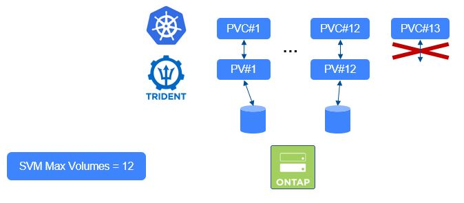
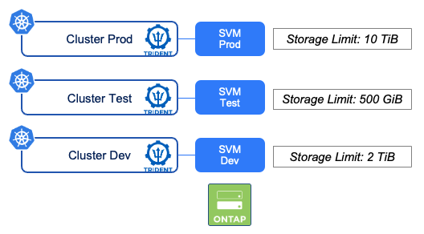

#########################################################################################
# SCENARIO 8: Consumption control: ONTAP parameters
#########################################################################################

An ONTAP admin can create various tenants (ie SVM) and apply parameters to control:  
- the number of FlexVol the SVM can host
- the capacity the SVM can use

Both features can be tested on this lab.  

## A. Control the number of FlexVols

The amount of ONTAP volumes (Flexvols) you can have on a ONTAP cluster depends on several parameters:  
- version
- size of the ONTAP cluster (in terms of controllers)  

If the storage platform is also used by other workloads (Databases, Files Services ...), you may want to limit the number of PVC you build in your storage Tenant (ie SVM)
This can be achieved by setting a parameter on this SVM.  
https://docs.netapp.com/us-en/trident/trident-reco/storage-config-best-practices.html#limit-the-maximum-volume-count  

<p align="center"></p>

Before setting a limit in the SVM _nassvm_, you first need to look for the current number of volumes you have.  
You can either login to System Manager & count, or run the following (password Netapp1!).  
```bash
ssh -l admin 192.168.0.101 vol show -vserver nassvm | grep entries | head -c 1; echo
```

In my case, I have 7 volumes, I will then set the maximum to 10 for this exercise.  
```bash
ssh -l admin 192.168.0.101 vserver modify -vserver nassvm -max-volumes 10
```

If you would like to check if the command has well been taken into account, you can run the following command:  
```bash
$ ssh -l admin 192.168.0.101 vserver show -vserver nassvm -fields max-volumes
vserver    max-volumes
-------    -----------
nassvm     10
```

Let's try to create a few new PVC.  
```bash
$ kubectl create -f pvc-ontap-1-to-4.yaml
persistentvolumeclaim/ontaplimit-1 created
persistentvolumeclaim/ontaplimit-2 created
persistentvolumeclaim/ontaplimit-3 created
persistentvolumeclaim/ontaplimit-4 created

$ kubectl get pvc  -l scenario=ontap
NAME           STATUS    VOLUME                                     CAPACITY   ACCESS MODES   STORAGECLASS        VOLUMEATTRIBUTESCLASS   AGE
ontaplimit-1   Bound     pvc-6869a783-2b5e-495c-83e6-349b7db2b0ad   1Gi        RWX            storage-class-nfs   <unset>                 31s
ontaplimit-2   Bound     pvc-9ee890c3-d37e-435f-a1de-fa9a7aadb1a8   1Gi        RWX            storage-class-nfs   <unset>                 31s
ontaplimit-3   Bound     pvc-7ca08387-d02a-41e5-8d6e-cae08443e7c2   1Gi        RWX            storage-class-nfs   <unset>                 31s
ontaplimit-4   Pending                                                                         storage-class-nas   4s
```

The last PVC will remain in the _Pending_ state. You need to look either in the PVC logs or Trident's 
```bash
$ kubectl describe pvc ontaplimit-4
...
 Warning  ProvisioningFailed    15s  
 API status: failed, Reason: Cannot create volume. Reason: Maximum volume count for Vserver nassvm reached.  Maximum volume count is 10. , Code: 13001
...
```
There you go, point demonstrated!  

Time to clean up  
```bash
$ kubectl delete pvc -l scenario=ontap
persistentvolumeclaim "ontaplimit-1" deleted
persistentvolumeclaim "ontaplimit-2" deleted
persistentvolumeclaim "ontaplimit-3" deleted
persistentvolumeclaim "ontaplimit-4" deleted
```

## B. Limit the capacity

ONTAP 9.13.1 introduced the possibility to set a capacity limit per SVM, as well as a threshold against which alerts will be sent.  

<p align="center"></p>

This can be configured in System Manager or through CLI with the following command:  
```bash
vserver modify -vserver vserver_name -storage-limit value [GB|TB] -storage-limit-threshold-alert percentage
```

In the following example, 22GB are already allocated in the _nassvm_ tenant.  
Let's set a 30GiB limit & try to create a 10GiB PVC:  
```bash
$ ssh -l admin 192.168.0.101 vserver modify -vserver nassvm -storage-limit 30GB -storage-limit-threshold-alert 80

$ kubectl create -f pvc-ontap-5.yaml
persistentvolumeclaim/ontaplimit-5 created

$ kubectl get pvc ontaplimit-5
NAME           STATUS    VOLUME   CAPACITY   ACCESS MODES   STORAGECLASS        VOLUMEATTRIBUTESCLASS   AGE
ontaplimit-5   Pending                                      storage-class-nfs   <unset>                 51s
```

This PVC will remain in the _Pending_ state. You need to look either in the PVC logs or Trident's 
```bash
$ kubectl describe pvc ontaplimit-5
...
 Warning  ProvisioningFailed    15s  
 error creating volume trident_pvc_7fea9a80_241b_4b56_96fe_92d588680e4d: API status: failed, Reason: Request to perform volume operation failed because there is insufficient storage available in the Vserver "nassvm". To increase the available storage in the Vserver, you can, for example, delete volumes, Snapshot copies, or files. Other options include raising the storage limit., Code: 13001
...
```
et voilà !   

Together, these two features really bring more control to the storage team, especially when multiple environments are in play.  

## C. What's next

You can now move on to the next section of this chapter: [a bit of everything](../4_A_bit_of_everything)

Or go back to the [FrontPage](https://github.com/YvosOnTheHub/LabNetApp)