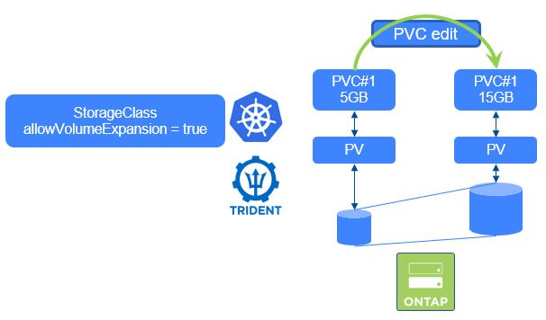

#########################################################################################
# SCENARIO 9.1: NFS Volume resizing
#########################################################################################

**GOAL:**  
Here we will go through a SMB Resizing ...

We consider that the ONTAP-NAS backend has already been created. ([cf Scenario04](../../Scenario02))

<p align="center"></p>

If you have not yet read the [Addenda08](../../../Addendum/Addenda08) about the Docker Hub management, it would be a good time to do so.  
Also, if no action has been made with regards to the container images, you can find a shell script in this directory *scenario09_pull_images.sh* to pull images utilized in this scenario if needed:  
```bash
sh ../scenario09_pull_images.sh
```

## A. Setup the environment

Now let's create a PVC & a Centos POD using this PVC, in their own namespace.  
```bash
$ kubectl create -f webserver-smb.yaml
namespace/resize created
secret/smbcreds created
persistentvolumeclaim/pvc-smb created
pod/webserver created

$ kubectl get -n resize pod,pvc
NAME            READY   STATUS    RESTARTS   AGE
pod/webserver   1/1     Running   0          35s

NAME                            STATUS   VOLUME                                     CAPACITY   ACCESS MODES   STORAGECLASS        VOLUMEATTRIBUTESCLASS   AGE
persistentvolumeclaim/pvc-smb   Bound    pvc-7e856490-5c7c-4b6c-a969-ce33a37e6b8a   1Gi        RWX            storage-class-smb   <unset>                 35s
```

You can now check that the 5G volume is indeed mounted into the POD.  
```bash
$ kubectl -n resize exec busyboxnfs -- df -h /data
Filesystem                Size      Used Available Use% Mounted on
192.168.0.131:/trident_pvc_38f580ef_6a0a_4d72_8beb_7e9a68d1b2ed
                          5.0G    256.0K      5.0G   0% /data
```

kubectl -n resize exec webserver -it -- powershell.exe


## C. Resize the PVC & check the result

Resizing a PVC can be done in different ways. We will here edit the definition of the PVC & manually modify it.  
Look for the *storage* parameter in the spec part of the definition & change the value (here for the example, we will use 15GB)  
```bash
$ kubectl -n resize edit pvc pvc-to-resize-nfs
persistentvolumeclaim/pvc-to-resize-nfs edited

spec:
  accessModes:
  - ReadWriteMany
  resources:
    requests:
      storage: 15Gi
  storageClassName: storage-class-nfs
  volumeMode: Filesystem
  volumeName: pvc-38f580ef-6a0a-4d72-8beb-7e9a68d1b2ed
```

Let's see the result.

```bash
$ kubectl -n resize get pvc
NAME                STATUS   VOLUME                                     CAPACITY   ACCESS MODES   STORAGECLASS        AGE
pvc-to-resize-nfs   Bound    pvc-38f580ef-6a0a-4d72-8beb-7e9a68d1b2ed   15Gi       RWX            storage-class-nfs   5m

$ kubectl -n resize exec busyboxnfs -- df -h /data
192.168.0.131:/trident_pvc_38f580ef_6a0a_4d72_8beb_7e9a68d1b2ed
                         15.0G    256.0K     15.0G   0% /data
```
 
This could also have been achieved by using the _kubectl patch_ command. Try the following one:  
```bash
kubectl patch -n resize pvc pvc-to-resize-nfs -p '{"spec":{"resources":{"requests":{"storage":"20Gi"}}}}'
```

## C. Cleanup the environment

```bash
$ kubectl delete namespace resize
namespace "resize" deleted
```

## D. What's next

You can now move on to:  
- [Scenario9.2](../2_SMB): Resize a SMB PVC  
- [Scenario10](../../Scenario10): Using Virtual Storage Pools  
- [Scenario11](../../Scenario11): StatefulSets & Storage consumption  

Or go back to the [FrontPage](https://github.com/YvosOnTheHub/LabNetApp)
