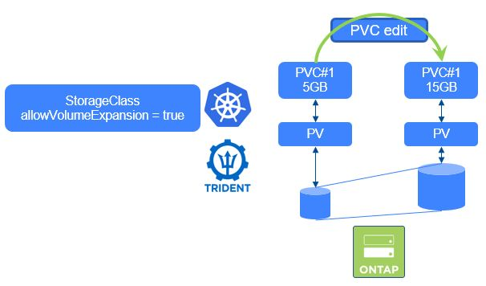

#########################################################################################
# SCENARIO 9.1: NFS Volume resizing
#########################################################################################

**GOAL:**  
Here we will go through a SMB Resizing ...

We consider that the ONTAP-NAS backend has already been created. ([cf Scenario04](../../Scenario02))

<p align="center"></p>

If you have not yet read the [Addenda08](../../../Addendum/Addenda08) about the Docker Hub management, it would be a good time to do so.  
Also, if no action has been made with regards to the container images, you can find a shell script in this directory *scenario09_pull_images.sh* to pull images utilized in this scenario if needed:  
```bash
sh ../scenario09_pull_images.sh
```

## A. Setup the environment

Now let's create a PVC & a Centos POD using this PVC, in their own namespace.  
```bash
$ kubectl create -f webserver-smb.yaml
namespace/resize created
secret/smbcreds created
persistentvolumeclaim/pvc-smb created
pod/webserver created

$ kubectl get -n resize pod,pvc
NAME            READY   STATUS    RESTARTS   AGE
pod/webserver   1/1     Running   0          35s

NAME                            STATUS   VOLUME                                     CAPACITY   ACCESS MODES   STORAGECLASS        VOLUMEATTRIBUTESCLASS   AGE
persistentvolumeclaim/pvc-smb   Bound    pvc-dc12b9c0-84cf-4437-94b7-6be4c02a7bdc   5Gi        RWX            storage-class-smb   <unset>                 35s
```

You can now check that the 5G volume is indeed mounted into the POD.  
Not as easy as in unix environments as you will see. Easier to read from within the container:  
```bash
$ kubectl -n resize exec webserver -- powershell.exe

PS C:\> $free = $total = $totalfree = [uint64]0
PS C:\> Add-Type -TypeDefinition @"
using System;
using System.Runtime.InteropServices;
public class Disk {
  [DllImport("kernel32.dll", CharSet=CharSet.Auto)]
  public static extern bool GetDiskFreeSpaceEx(string p, out ulong a, out ulong b, out ulong c);
}
"@

PS C:\> [Disk]::GetDiskFreeSpaceEx('C:\Data', [ref]$free, [ref]$total, [ref]$totalfree)
True

PS C:\> "Total: {0:N2} GB" -f ($total/1GB)
Total: 5.00 GB

PS C:\> "Free:  {0:N2} GB" -f ($free/1GB)
Free: 5.00 GB
```

## C. Resize the PVC & check the result

Let's resize the volume by simply patching the PVC:    
```bash
$ kubectl patch -n resize pvc pvc-smb -p '{"spec":{"resources":{"requests":{"storage":"20Gi"}}}}'
persistentvolumeclaim/pvc-smb patched
```

Let's see the result:  
```bash
$ kubectl -n resize get pvc
NAME      STATUS   VOLUME                                     CAPACITY   ACCESS MODES   STORAGECLASS        VOLUMEATTRIBUTESCLASS   AGE
pvc-smb   Bound    pvc-dc12b9c0-84cf-4437-94b7-6be4c02a7bdc   20Gi       RWX            storage-class-smb   <unset>                 23m

$ kubectl -n resize exec webserver -- powershell.exe

PS C:\> $free = $total = $totalfree = [uint64]0
PS C:\> Add-Type -TypeDefinition @"
using System;
using System.Runtime.InteropServices;
public class Disk {
  [DllImport("kernel32.dll", CharSet=CharSet.Auto)]
  public static extern bool GetDiskFreeSpaceEx(string p, out ulong a, out ulong b, out ulong c);
}
"@

PS C:\> [Disk]::GetDiskFreeSpaceEx('C:\Data', [ref]$free, [ref]$total, [ref]$totalfree)
True

PS C:\> "Total: {0:N2} GB" -f ($total/1GB)
Total: 20.00 GB

PS C:\> "Free:  {0:N2} GB" -f ($free/1GB)
Free: 20.00 GB
```

## C. Cleanup the environment

```bash
$ kubectl delete namespace resize
namespace "resize" deleted
```

## D. What's next

You can now move on to:  
- [Scenario9.3](../3_iSCSI): Resize an iSCSI PVC  
- [Scenario10](../../Scenario10): Using Virtual Storage Pools  
- [Scenario11](../../Scenario11): StatefulSets & Storage consumption  

Or go back to the [FrontPage](https://github.com/YvosOnTheHub/LabNetApp)
