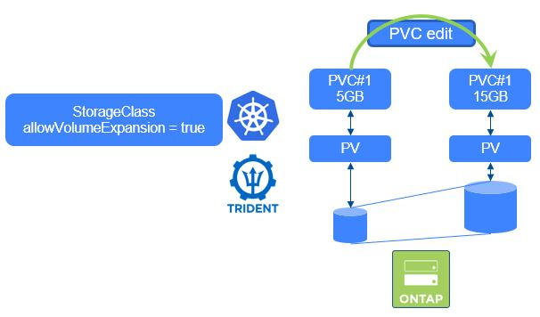

#########################################################################################
# SCENARIO 12: iSCSI Volume resizing
#########################################################################################

**GOAL:**  
Here we will go through a iSCSI PVC Expansion ...

<p align="center"></p>

If you have not yet read the [Addenda08](../../../Addendum/Addenda08) about the Docker Hub management, it would be a good time to do so.  
Also, if no action has been made with regards to the container images, you can find a shell script in this directory *scenario09_pull_images.sh* to pull images utilized in this scenario if needed:  
```bash
sh ../scenario09_pull_images.sh
```

## A. Setup the environment

Now let's create a PVC & a Centos POD using this PVC, in their own namespace.  
```bash
$ kubectl create -f busybox-iscsi.yaml
namespace/resize created
persistentvolumeclaim/pvc-to-resize-iscsi created
pod/busyboxiscsi created

$ kubectl -n resize get pod,pvc
NAME               READY   STATUS    RESTARTS   AGE
pod/busyboxiscsi   1/1     Running   0          21s

NAME                                        STATUS   VOLUME                                     CAPACITY   ACCESS MODES   STORAGECLASS          VOLUMEATTRIBUTESCLASS   AGE
persistentvolumeclaim/pvc-to-resize-iscsi   Bound    pvc-37dbada3-84cd-4201-bc22-e2ceefa4c9bf   5Gi        RWO            storage-class-iscsi   <unset>                 21s
```

You can now check that the 5G volume is indeed mounted into the POD.  
```bash
$ kubectl -n resize exec busyboxiscsi -- df -h /data
Filesystem                Size      Used Available Use% Mounted on
/dev/mapper/3600a0980774f6a34712b572d41767177
                          4.8G     24.0K      4.6G   0% /data
```

## C. Resize the PVC & check the result

Resizing a PVC can be done in different ways, by editing the manifest or patching the object.  
Let's use the patch method:
```bash
$ kubectl patch -n resize pvc pvc-to-resize-iscsi -p '{"spec":{"resources":{"requests":{"storage":"20Gi"}}}}'
persistentvolumeclaim/pvc-to-resize-iscsi patched
```

Let's see the result (it takes a few seconds to take effect).  
```bash
$ kubectl -n resize get pvc
NAME                  STATUS   VOLUME                                     CAPACITY   ACCESS MODES   STORAGECLASS          VOLUMEATTRIBUTESCLASS   AGE
pvc-to-resize-iscsi   Bound    pvc-37dbada3-84cd-4201-bc22-e2ceefa4c9bf   20Gi       RWO            storage-class-iscsi   <unset>                 2m50s

$ kubectl -n resize exec busyboxiscsi -- df -h /data
Filesystem                Size      Used Available Use% Mounted on
/dev/mapper/3600a0980774f6a34712b572d41767177
                         19.6G     24.0K     18.7G   0% /data
```
As you can see, the resizing was done totally dynamically without any interruption.  
The POD rescanned its devices to discover the new size of the volume.  

## C. Cleanup the environment

```bash
$ kubectl delete namespace resize
namespace "resize" deleted
```

## D. What's next

You can now move on to:  
- [Scenario9.4](../4_NVMe): Resize a NVMe PVC  
- [Scenario10](../../Scenario10): Using Virtual Storage Pools  
- [Scenario11](../../Scenario11): StatefulSets & Storage consumption  

Or go back to the [FrontPage](https://github.com/YvosOnTheHub/LabNetApp)