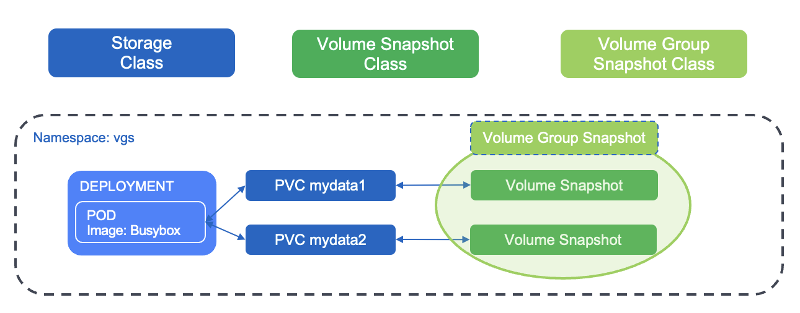

#########################################################################################
# SCENARIO 14: Volume Group Snapshots
#########################################################################################

A CSI Snapshot is a construct that is linked to a PVC.  
If an application uses multiple volumes and you want to create snapshots, there was no native way to ensure consistency between all the snapshots until recently. Think of an application writing data on one volume and logs on a different one. If snapshots are not taken at the exact same time, they are not going to be consistent.   

To answer that challenge, Kubernetes 1.27 introduced **Volume Group Snapshots** in Alpha.  
Later, that feature turned Beta in Kubernetes 1.32.  

Volume Group Snapshot come with a set of new APIs, allowing users to take crash consistent snapshots for a set of volumes. Behind the scenes, Kubernetes uses a label selector to group multiple PersistentVolumeClaims for snapshotting.

<p align="center"></p>

Trident 25.06 brings you the support of that feature, currently only for the ONTAP-SAN driver with the iSCSI protocol.  

In order to test Volume Group Snapshots:  
- make sure you have upgraded Trident to 25.06 minimum. You can refer to the [Scenario01](../../Scenario01/) for this.  
- upgrade the Kubernetes cluster to 1.32.  
- install the Volume Group Snapshot CRD.  
- upgrade the Snapshot Controller to v8.2 minimum (Beta support for Volume Group Snapshots).  
- enable the Volume Group Snapshot feature gate in the snapshot controller.  

This chapter will guide you through the configuration of this feature, as well as its test with a simple application with 2 volumes.  

## A. Upgrade Kubernetes. 

Upgrades can only be done between minor versions.  
As the lab setup runs Kubernetes 1.29, you need to run 3 consecutive upgrades to reach 1.32.  

The [Addenda14](../../../Addendum/Addenda14/) will guide you through this upgrade.  
The whole process takes between 30 and 45 minutes.  

This addenda contains multiple *all_in_one.sh* scripts to run those upgrades for you.  
Note that thoses scripts only focus on the Linux nodes. If you also want to upgrade the Windows nodes, you would need to follow the chapter step by step.  

If you choose the automated way to upgrade the cluster, I would recommend removing the windows nodes:  
```bash
kubectl delete node win1 win2
sh ~/LabNetApp/Kubernetes_v6/Addendum/Addenda14/upgrade_to_1.30/all_in_one.sh
sh ~/LabNetApp/Kubernetes_v6/Addendum/Addenda14/upgrade_to_1.31/all_in_one.sh
sh ~/LabNetApp/Kubernetes_v6/Addendum/Addenda14/upgrade_to_1.32/all_in_one.sh
```
Once this is all done, you should have the following:  
```bash
$ kubectl get nodes
NAME    STATUS   ROLES           AGE    VERSION
rhel1   Ready    <none>          451d   v1.32.7
rhel2   Ready    <none>          451d   v1.32.7
rhel3   Ready    control-plane   451d   v1.32.7
```

## B. Install the Volume Group Snapshots CRD.

This new feature comes with a new set of APIs, as well as 3 new CRD:  
- volumegroupsnapshots.  
- volumegroupsnapshotcontents.  
- volumegroupsnapshotclasses.  

The current version of the snapshot controller being 6.2, upgrading the environment to the version 8.2 will also update the CSI Snapshots CRD:  
```bash
$ kubectl kustomize https://github.com/kubernetes-csi/external-snapshotter/client/config/crd?ref=v8.2.0 | kubectl apply -f -
customresourcedefinition.apiextensions.k8s.io/volumegroupsnapshotclasses.groupsnapshot.storage.k8s.io created
customresourcedefinition.apiextensions.k8s.io/volumegroupsnapshotcontents.groupsnapshot.storage.k8s.io created
customresourcedefinition.apiextensions.k8s.io/volumegroupsnapshots.groupsnapshot.storage.k8s.io created
customresourcedefinition.apiextensions.k8s.io/volumesnapshotclasses.snapshot.storage.k8s.io configured
customresourcedefinition.apiextensions.k8s.io/volumesnapshotcontents.snapshot.storage.k8s.io configured
customresourcedefinition.apiextensions.k8s.io/volumesnapshots.snapshot.storage.k8s.io configured
```

## C. Update the Snapshot Controller and activate the Volume Group Snapshot feature gate.    

As we need to activate the Volume Group Snapshots through a **feature gate** in the snapshot controller, let's clone its repository to tailor the configuration. In order not to download the whole repository, let's filter on the required folder only:  
```bash
cd
git clone --depth 1 --no-checkout --filter=tree:0 https://github.com/kubernetes-csi/external-snapshotter.git
cd external-snapshotter
git switch -c release-8.2.0
git sparse-checkout set --no-cone /deploy/kubernetes/snapshot-controller
git checkout
```

Activating a feature gate could be done directly by modifying the controller pod, but as we need to also update it, let's just modify the yaml manifest:  
```bash
cd deploy/kubernetes/snapshot-controller
sed -i '40 a \            - "--feature-gates=CSIVolumeGroupSnapshot=true"' setup-snapshot-controller.yaml
```

Also, this YAML manifest does not contain any _nodeSelector_ field.  
If you kept the Windows nodes in the Kubernetes cluster, you would also need to add those 2 lines to make sure the controller pods run on the Linux nodes:  
```bash
sed -i '33 a \      nodeSelector:' setup-snapshot-controller.yaml
sed -i '34 a \        kubernetes.io/os: linux' setup-snapshot-controller.yaml
```

You can now apply this new configuration, after cleaning the existing controller:  
```bash
$ kubectl -n kube-system delete deploy snapshot-controller
deployment.apps "snapshot-controller" deleted

$ kubectl -n kube-system kustomize . | kubectl create -f -
serviceaccount/snapshot-controller unchanged
role.rbac.authorization.k8s.io/snapshot-controller-leaderelection unchanged
clusterrole.rbac.authorization.k8s.io/snapshot-controller-runner unchanged
rolebinding.rbac.authorization.k8s.io/snapshot-controller-leaderelection unchanged
clusterrolebinding.rbac.authorization.k8s.io/snapshot-controller-role unchanged
deployment.apps/snapshot-controller created
```

Once the Controller is up to date, Trident will detect the change, apply the feature gate flag to the CSI sidecar it carries and restart its controller. You can notice the change in the pod's age:  
```bash
$ kubectl get -n trident po
NAME                                  READY   STATUS    RESTARTS      AGE
trident-controller-6d777bb5bf-9hv2p   6/6     Running   0             1h
trident-node-linux-79d2t              2/2     Running   2 (30h ago)   30h
trident-node-linux-lzk5l              2/2     Running   2 (30h ago)   30h
trident-node-linux-sc9px              2/2     Running   2 (30h ago)   30h
trident-operator-797d4c9b65-2h7zj     1/1     Running   0             30h
```

## D. Volume Group Snapshot Class

Similarly to the CSI Snapshots, creating a Volume Group Snapshot (ie **VGS**) is done against a specific class.  
Let's create one before deploying our app.  
You can find an example of a VGS class in this folder:    
```bash
$ kubectl create -f vgsclass.yaml
volumegroupsnapshotclass.groupsnapshot.storage.k8s.io/csi-group-snap-class created
```

## E. Create an application with 2 PVC

In order to test the VGS feature, let's create a busybox app with 2 RWO PVC mounted as iSCSI LUNs:  
```bash
$ kubectl create -f busybox.yaml
namespace/vgs created
persistentvolumeclaim/mydata1 created
persistentvolumeclaim/mydata2 created
deployment.apps/busybox created
```
Let's quickly check the state of the app:  
```bash
$ kubectl get -n vgs po,pvc
NAME                           READY   STATUS    RESTARTS   AGE
pod/busybox-6469767554-9m997   1/1     Running   0          7m50s

NAME                            STATUS   VOLUME                                     CAPACITY   ACCESS MODES   STORAGECLASS          VOLUMEATTRIBUTESCLASS   AGE
persistentvolumeclaim/mydata1   Bound    pvc-e601f0ae-c59e-4e85-a88a-cf642bbd697f   1Gi        RWO            storage-class-iscsi   <unset>                 7m50s
persistentvolumeclaim/mydata2   Bound    pvc-1b702512-513b-49e3-9b7b-cd965a129b64   1Gi        RWO            storage-class-iscsi   <unset>                 7m50s
```

Now that Busybox is running, let's write some data in each PVC:  
```bash
kubectl exec -n vgs $(kubectl get pod -n vgs -o name) -- sh -c 'echo "bbox test1 in folder data1!" > /data1/file.txt'
kubectl exec -n vgs $(kubectl get pod -n vgs -o name) -- sh -c 'echo "bbox test1 in folder data2!" > /data2/file.txt'
```

## F. Create a Volume Group Snapshot

Configuring a VGS requires a specific a label positionned on all the PVC to protect.  
In our example, the 2 PVC of the application are labelled with _consistencygroup=group1_.  
Let's make sure you can filter the elements of the namespace with that label:  
```bash
$ kubectl get -n vgs pvc -l consistencygroup=group1
NAME      STATUS   VOLUME                                     CAPACITY   ACCESS MODES   STORAGECLASS          VOLUMEATTRIBUTESCLASS   AGE
mydata1   Bound    pvc-e601f0ae-c59e-4e85-a88a-cf642bbd697f   1Gi        RWO            storage-class-iscsi   <unset>                 89s
mydata2   Bound    pvc-1b702512-513b-49e3-9b7b-cd965a129b64   1Gi        RWO            storage-class-iscsi   <unset>                 89s
```

You can now create a VGS that will take into account the 2 PVC of your app:  
```bash
$ cat << EOF | kubectl apply -f -
apiVersion: groupsnapshot.storage.k8s.io/v1beta1
kind: VolumeGroupSnapshot
metadata:
  name: vgs1
  namespace: vgs
spec:
  volumeGroupSnapshotClassName: csi-group-snap-class
  source:
    selector:
      matchLabels:
        consistencygroup: group1
EOF
volumegroupsnapshot.groupsnapshot.storage.k8s.io/vgs1 created
```
Let's check the result:
```bash
$ kubectl get -n vgs vgs,vs
NAME                                                    READYTOUSE   VOLUMEGROUPSNAPSHOTCLASS   VOLUMEGROUPSNAPSHOTCONTENT                              CREATIONTIME   AGE
volumegroupsnapshot.groupsnapshot.storage.k8s.io/vgs1   true         csi-group-snap-class       groupsnapcontent-e97c0b2d-d139-4bcd-a5bb-29e163aed394   9m54s          9m54s

NAME                                                                                                               READYTOUSE   SOURCEPVC   SOURCESNAPSHOTCONTENT   RESTORESIZE   SNAPSHOTCLASS   SNAPSHOTCONTENT                                                                CREATIONTIME   AGE
volumesnapshot.snapshot.storage.k8s.io/snapshot-40f79d6fc42b023013271fddd227a02383efc943cbab591064f7b8575af323ac   true         mydata1                             1Gi                           snapcontent-40f79d6fc42b023013271fddd227a02383efc943cbab591064f7b8575af323ac   9m54s          9m52s
volumesnapshot.snapshot.storage.k8s.io/snapshot-9803be62d4495517a455ef15523e21ec1c10d79636387bd8fa9a473bc35f8535   true         mydata2                             1Gi                           snapcontent-9803be62d4495517a455ef15523e21ec1c10d79636387bd8fa9a473bc35f8535   9m54s          9m54s
```
As expected, you now have one Volume Group Snapshot which contains the Volume Snapshots on the two PVC of our app.

## G. Restore data

You currently cannot restore an entire VGS, you can however restore individual Volume Snapshots that are part of the VGS.  
To test this, let's first delete the content of both PVC:  
```bash
kubectl exec -n vgs $(kubectl get pod -n vgs -o name) -- rm -f /data1/file.txt
kubectl exec -n vgs $(kubectl get pod -n vgs -o name) -- rm -f /data2/file.txt
```
Now let's restore the content of the first PVC with its corresponding snapshot.  
This can be achieved with a CR called _TridentActionSnapshotRestore_ (or _TASR_).  
This process requires the volumes to be detached. As the application is of type Deployment, we can scale it to 0 while restoring the data.
```bash
$ kubectl -n vgs scale deploy busybox --replicas=0
deployment.apps/busybox scaled
```
When creating a VGS, the volume snapshots'name contain a UUID and not a name.  
We also need to retrieve the full name of the snapshot corresponding to the PVC _mydata1_:  
```bash
$ MYSNAP=$(kubectl get volumesnapshot -n vgs -o jsonpath='{range .items[?(@.spec.source.persistentVolumeClaimName=="mydata1")]}{.metadata.name}{"\n"}{end}') && echo $MYSNAP
snapshot-40f79d6fc42b023013271fddd227a02383efc943cbab591064f7b8575af323ac

$ cat << EOF | kubectl create -f -
apiVersion: trident.netapp.io/v1
kind: TridentActionSnapshotRestore
metadata:
  generateName: datarestore-
  namespace: vgs
spec:
  pvcName: mydata1
  volumeSnapshotName: $MYSNAP
EOF
tridentactionsnapshotrestore.trident.netapp.io/datarestore-2gt7q created
```
Let's make sure the TASR was successfull: 
```bash
$ kubectl get -n vgs tasr -o=jsonpath='{.items[0].status.state}'; echo
Succeeded
```
Something was restored!
Let's bring the app back up & check the content of both PVC:  
```bash
$ kubectl -n vgs scale deploy busybox --replicas=1
deployment.apps/busybox scaled

$ kubectl exec -n vgs $(kubectl get pod -n vgs -o name) -- ls /data1
file.txt
lost+found

$ kubectl exec -n vgs $(kubectl get pod -n vgs -o name) -- more /data1/file.txt
bbox test1 in folder data1!

$ kubectl exec -n vgs $(kubectl get pod -n vgs -o name) -- ls /data2
lost+found
```
As expected, only the content of the first PVC was restored!