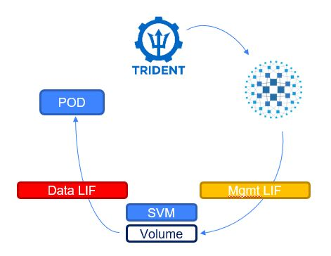

#########################################################################################
# SCENARIO 17: How to configure HAProxy between Trident & ONTAP
#########################################################################################

Some of you may not allow direct management access between Kubernetes & ONTAP. However, a proxy can be configured between both layers to redirect traffic.  
The [Addenda07](../../Addendum/Addenda07) guides you through the installation of HAProxy. We will here see how to continue its configuration to accept Trident Management flows to access ONTAP.  

As Trident communicates with ONTAP through HTTPS, we will first need to create a certificate (self-signed in this example).  
HAProxy requires both the key & the certificate to be concatenated into a single .pem file.  
```bash
mkdir ~/haproxycert
cd ~/haproxycert
openssl genpkey -algorithm RSA -out privkey.pem
openssl req -new -x509 -key privkey.pem -out selfcert.pem -days 366
cat selfcert.pem privkey.pem > haproxy.pem
```

HAProxy works with _frontends_ (entry point, ie Trident=>HAProxy) and _backends_ (exit point, ie HAProxy=>ONTAP).  
All requests coming on port 8443 (in this example) will be forwarded to the SVM Management Interface.

<p align="center"></p>

```bash
$ cat <<EOT >> /etc/haproxy/haproxy.cfg

frontend tridentnashttp
  bind *:8443 ssl crt /root/haproxycert/haproxy.pem
  default_backend ontapnashttp

backend ontapnashttp
  server ontapnashttp 192.168.0.133:443 check ssl verify none
EOT
```

We can now restart HAProxy & check that the new configuration has been taken into account.  
```bash
$ systemctl restart haproxy

$ netstat -aon | grep -e 8443 
tcp        0      0 0.0.0.0:8443            0.0.0.0:*               LISTEN      off (0.00/0/0)
```

Before moving on, let's push the pod image to the local private repository:  
```bash
sh scenario17_pull_images.sh
```

Now, let's configure a new Trident Backend & a new storage class, so that we can test this setup.  
If you take a look a the backend json file, you will notice that its management LIF parameter points to **192.168.0.63:8443**, which is the port that HAProxy listens onto, and not **192.168.0.133** which is the SVM IP address.  
```bash
$ kubectl create -f backend-proxy.yaml
secret/secret-proxy created
tridentbackendconfig.trident.netapp.io/backend-tbc-ontap-nas-proxy created

$ kubectl create -f sc-proxy.yaml
storageclass.storage.k8s.io/sc-proxy created
```

Finally, let's create a volume  
```bash
$ kubectl create -f pod-with-pvc-proxy.yaml
namespace/scproxy created
persistentvolumeclaim/pvc-proxy created
pod/busybox-proxy created

$ kubectl get -n scproxy pvc,pod -o wide
NAME                              STATUS   VOLUME                                     CAPACITY   ACCESS MODES   STORAGECLASS   AGE
persistentvolumeclaim/pvc-proxy   Bound    pvc-15ba0fbf-33e9-4f58-b188-0d979d7d8d23   5Gi        RWX            sc-proxy       34s

NAME               READY   STATUS    RESTARTS   AGE   IP              NODE    NOMINATED NODE   READINESS GATES
pod/busybox-proxy   1/1     Running   0          76s   192.168.24.74   rhel3   <none>           <none>

$ kubectl exec -n scproxy pod/busybox-proxy -- df /data
Filesystem           1K-blocks      Used Available Use% Mounted on
192.168.0.131:/proxy_pvc_15ba0fbf_33e9_4f58_b188_0d979d7d8d23
                       5242880       256   5242624   0% /data
```

There you go, operation successful. Also, the volume is mounted directly as you can see (DataLIP IP address 192.168.0.132).
Let's take a look at the logs

```bash
$ tail -f /var/log/haproxy.log
... 192.168.0.61:33718 [11/Mar/2021:15:03:58.248] tridentnashttp~ ontapnashttp/ontapnashttp 2/0/1/42/45 200 451 - - ---- 1/1/0/1/0 0/0 "POST /servlets/netapp.servlets.admin.XMLrequest_filer HTTP/1.1"
... 192.168.0.61:33722 [11/Mar/2021:15:03:58.295] tridentnashttp~ ontapnashttp/ontapnashttp 2/0/1/397/400 200 403 - - ---- 2/2/0/1/0 0/0 "POST /servlets/netapp.servlets.admin.XMLrequest_filer HTTP/1.1"
... 192.168.0.61:33728 [11/Mar/2021:15:03:58.697] tridentnashttp~ ontapnashttp/ontapnashttp 1/0/2/74/77 200 816 - - ---- 3/3/0/1/0 0/0 "POST /servlets/netapp.servlets.admin.XMLrequest_filer HTTP/1.1"
... 192.168.0.61:33732 [11/Mar/2021:15:03:58.776] tridentnashttp~ ontapnashttp/ontapnashttp 1/0/2/357/360 200 403 - - ---- 4/4/0/1/0 0/0 "POST /servlets/netapp.servlets.admin.XMLrequest_filer HTTP/1.1"
... 192.168.0.61:33734 [11/Mar/2021:15:03:59.136] tridentnashttp~ ontapnashttp/ontapnashttp 2/0/1/53/57 200 9032 - - ---- 5/5/0/1/0 0/0 "POST /servlets/netapp.servlets.admin.XMLrequest_filer HTTP/1.1"
```

Creating a volume led to 5 successive Trident REST API calls of type POST, which were all successful (HTTP Code 200).  
You can also notice that requests all came from the host 192.168.0.61 (rhel1) which is were the Trident Replicaset is running (trident-csi-d47f5f5c6-phg9r):  
```bash
$ kubectl get pod -n trident -o wide
NAME                                  READY   STATUS    RESTARTS   AGE   IP               NODE    NOMINATED NODE   READINESS GATES
trident-controller-85574d7d77-wqhph   6/6     Running   0          3d    192.168.26.35    rhel1   <none>           <none>
trident-node-linux-dw8c7              2/2     Running   0          25h   192.168.0.63     rhel3   <none>           <none>
trident-node-linux-hpsww              2/2     Running   0          25h   192.168.0.64     rhel4   <none>           <none>
trident-node-linux-k4skc              2/2     Running   0          25h   192.168.0.61     rhel1   <none>           <none>
trident-node-linux-vlx5j              2/2     Running   0          25h   192.168.0.62     rhel2   <none>           <none>
trident-operator-5c4f8bd896-9h2r6     1/1     Running   0          3d    192.168.28.121   rhel2   <none>           <none>
```

Time to clean up & move on !

```bash
$ kubectl delete -f pod-with-pvc-proxy.yaml
persistentvolumeclaim "pvc-proxy" deleted
pod "busybox-proxy" deleted

$ kubectl delete -f backend-proxy.yaml
secret/secret-proxy deleted
tridentbackendconfig.trident.netapp.io/backend-tbc-ontap-nas-proxy deleted

$ kubectl delete sc-proxy
storageclass.storage.k8s.io/sc-proxy created
```
