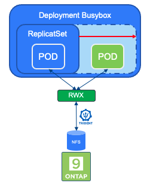
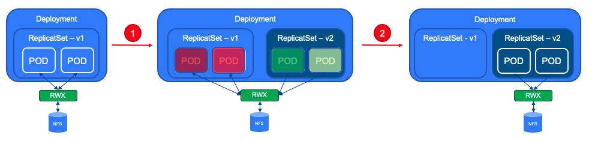

#########################################################################################
# SCENARIO 19: What benefits can RWX & NFS bring over RWO?
#########################################################################################

Shared PVs are by definition good when several PODs must access the same volume.  
Here are a few use cases for RWX:  
- Scale-out: if the data sits outside of the POD, the container image will obviously be smaller & then faster to start. Also, scaling this application will only lead to multiplying the PODs, while the data & the volume will not change. A typical example is a Web Frontend, such as WordPress.
- Upgrade: you probably prefer a non-disruptive upgrade of your application... Rolling updates are much easier & faster with shared PVs
- Efficiency: if you were to use storage on the host, duplicating the same PVC over and over may lead to a quick lack of space left on the device
- CI/CD: probably a consequences coming from the previous points, however, managing several versions of an application (build/test/run ...) while using the same volume can improve TTM.

We will see an example with Busybox connected to RWOP and RWX persistent volumes.  
RWOP was chosen to avoid the possibility of having 2 PODs running on the same worker node.  

Note that Trident also supports RWX with Block protocols, volumes mounted as Raw Block Devices. However, that does not suit all applications...  
Mainly used with Kubernetes based Virtual Machines (with KubeVirt) to allow live migration between worker nodes.  

That is also why NFS brings benefits over block. You natively get RWX without any extra sweat!

## A. Busybox deployment

If you have not yet read the [Addenda08](../../../Addendum/Addenda08) about the Docker Hub management, it would be a good time to do so.  
Also, if no action has been made with regards to the container images, you can find a shell script in this directory *scenario19_pull_images.sh* to pull images utilized in this scenario if needed:  
```bash
sh scenario19_pull_images.sh
```
You can find in this folder two files:  
- _busybox-rwx.yaml_: creates a Busybox deployment with one POD and one RWX PVC in the _busybox-sc19-rwx_ namespace. 
- _busybox-rwop.yaml_: creates a Busybox deployment with one POD and one RWOP PVC in the _busybox-sc19-rwop_ namespace. 

Let's apply both of them:  
```bash
$ kubectl apply -f busybox-rwop.yaml
namespace/busybox-sc19-rwop created
persistentvolumeclaim/mydata created
deployment.apps/busybox created

$ kubectl apply -f busybox-rwx.yaml
namespace/busybox-sc19-rwx created
persistentvolumeclaim/mydata created
deployment.apps/busybox created
```
Make sure everything went well:  
```bash
$ kubectl get -n busybox-sc19-rwop deploy,po,pvc
NAME                      READY   UP-TO-DATE   AVAILABLE   AGE
deployment.apps/busybox   1/1     1            1           19s

NAME                          READY   STATUS    RESTARTS   AGE
pod/busybox-784bdb69b-5dx4f   1/1     Running   0          19s

NAME                           STATUS   VOLUME                                     CAPACITY   ACCESS MODES   STORAGECLASS        VOLUMEATTRIBUTESCLASS   AGE
persistentvolumeclaim/mydata   Bound    pvc-99008906-840d-49c9-a9b2-f399a8c70453   10Gi       RWOP           storage-class-nfs   <unset>                 19s

$ kubectl get -n busybox-sc19-rwx deploy,po,pvc
NAME                      READY   UP-TO-DATE   AVAILABLE   AGE
deployment.apps/busybox   1/1     1            1           56s

NAME                          READY   STATUS    RESTARTS   AGE
pod/busybox-784bdb69b-55tht   1/1     Running   0          56s

NAME                           STATUS   VOLUME                                     CAPACITY   ACCESS MODES   STORAGECLASS        VOLUMEATTRIBUTESCLASS   AGE
persistentvolumeclaim/mydata   Bound    pvc-8194d31e-3c7c-42dc-9d02-f8b80301fec8   10Gi       RWX            storage-class-nfs   <unset>                 56s
```
We can also create some content in our volumes:  
```bash
kubectl exec -n busybox-sc19-rwop $(kubectl get pod -n busybox-sc19-rwop -o name) -- sh -c 'echo "bbox rwop test!" > /data/rwop.txt'
kubectl exec -n busybox-sc19-rwx $(kubectl get pod -n busybox-sc19-rwx -o name) -- sh -c 'echo "bbox rwx test!" > /data/rwx.txt'
```

## B. Scaling Busybox

In our scenario, scaling an application would mean creating a new replica in the existing deployment.  
This can simply done by patching the resource as follows:  
```bash
$ kubectl scale -n busybox-sc19-rwop deploy busybox --replicas=2
deployment.apps/busybox scaled
$ kubectl scale -n busybox-sc19-rwx deploy busybox --replicas=2
deployment.apps/busybox scaled
```
<p align="center"></p>

Let's first look at the RWX environment:  
```bash
$ kubectl get -n busybox-sc19-rwx deploy,po,pvc
NAME                      READY   UP-TO-DATE   AVAILABLE   AGE
deployment.apps/busybox   2/2     2            2           2m14s

NAME                          READY   STATUS    RESTARTS   AGE
pod/busybox-784bdb69b-55tht   1/1     Running   0          2m14s
pod/busybox-784bdb69b-xw7t8   1/1     Running   0          24s

NAME                           STATUS   VOLUME                                     CAPACITY   ACCESS MODES   STORAGECLASS        VOLUMEATTRIBUTESCLASS   AGE
persistentvolumeclaim/mydata   Bound    pvc-8194d31e-3c7c-42dc-9d02-f8b80301fec8   10Gi       RWX            storage-class-nfs   <unset>                 2m14s
```
All went well, we now have 2 PODS mounting the same RWX NFS volume!  
You can even get access to your file from both pods:  
```bash
$ for pod in $(kubectl get po -o name -n busybox-sc19-rwx); do
 echo "--- --- READING FROM POD $pod"
 echo "--- df -h /data: "
 kubectl exec -n busybox-sc19-rwx $pod -- df -h /data
 echo "--- ls /data: "
 kubectl exec -n busybox-sc19-rwx $pod -- ls /data
done

--- --- READING FROM POD pod/busybox-784bdb69b-55tht
--- df -h /data:
Filesystem                Size      Used Available Use% Mounted on
192.168.0.131:/trident_pvc_8194d31e_3c7c_42dc_9d02_f8b80301fec8
                         10.0G    256.0K     10.0G   0% /data
--- ls /data:
rwx.txt
--- --- READING FROM POD pod/busybox-784bdb69b-xw7t8
--- df -h /data:
Filesystem                Size      Used Available Use% Mounted on
192.168.0.131:/trident_pvc_8194d31e_3c7c_42dc_9d02_f8b80301fec8
                         10.0G    256.0K     10.0G   0% /data
--- ls /data:
rwx.txt
```

What about the RWOP environment?  
```bash
$ kubectl get -n busybox-sc19-rwop deploy,po,pvc
NAME                      READY   UP-TO-DATE   AVAILABLE   AGE
deployment.apps/busybox   1/2     2            1           84s

NAME                          READY   STATUS    RESTARTS   AGE
pod/busybox-784bdb69b-5dx4f   1/1     Running   0          84s
pod/busybox-784bdb69b-5wcvv   0/1     Pending   0          26s

NAME                           STATUS   VOLUME                                     CAPACITY   ACCESS MODES   STORAGECLASS        VOLUMEATTRIBUTESCLASS   AGE
persistentvolumeclaim/mydata   Bound    pvc-99008906-840d-49c9-a9b2-f399a8c70453   10Gi       RWOP           storage-class-nfs   <unset>                 84s
```
Well, by definition, a RWOP volume can only be mounted once. That explains why the second pod is in _pending_ state.  
Looking at the pod events, you would see the following message:  
```txt
3 node has pod using PersistentVolumeClaim with the same name and ReadWriteOncePod access mode
```

Let's scale the RWOP application back to one replica before moving to the next chapter:  
```bash
$ kubectl scale -n busybox-sc19-rwop deploy busybox --replicas=1
deployment.apps/busybox scaled
```

## C. Upgrading Busybox with RWX volumes

A new version of Wordpress has been released, & I want to upgrade my environment non-disruptively.  
Let's see how that would work for both environments.  

First, upgrade the RWX deployment:  
```bash
$ kubectl patch -n busybox-sc19-rwx deploy busybox -p '{"spec":{"template":{"spec":{"containers":[{"name":"busybox","image":"registry.demo.netapp.com/busybox:1.35.0"}]}}}}'
deployment.apps/busybox patched
```
New pods will immediately start (status _Running_) while the old one is turned off (status _Terminating_) without the need to wait for the stop operation to complete:  
```bash
$ kubectl get -n busybox-sc19-rwx deploy,po,pvc
NAME                      READY   UP-TO-DATE   AVAILABLE   AGE
deployment.apps/busybox   1/1     1            1           76s

NAME                           READY   STATUS        RESTARTS   AGE
pod/busybox-68494d684b-9xmrr   1/1     Running       0          8s
pod/busybox-68494d684b-fnrrd   1/1     Running       0          6s
pod/busybox-784bdb69b-55tht    1/1     Terminating   0          10m
pod/busybox-784bdb69b-xw7t8    1/1     Terminating   0          9m9s

NAME                           STATUS   VOLUME                                     CAPACITY   ACCESS MODES   STORAGECLASS        VOLUMEATTRIBUTESCLASS   AGE
persistentvolumeclaim/mydata   Bound    pvc-8194d31e-3c7c-42dc-9d02-f8b80301fec8   10Gi       RWX            storage-class-nfs   <unset>                 10m
```
Once the upgrade is fully done, you can take a closer look at the first POD, you will see it is now running a new image version:  
```bash
$ kubectl get -n busybox-sc19-rwx po -o jsonpath='{.items[0].spec.containers[0].image}';echo
registry.demo.netapp.com/busybox:1.35.0
```
By the way, did you notice that the ID in the pods name changed?  
Because we are running a _deployment_, a pod also belongs to a _replicaset_, which is construct that maintains the configuration of a set of pods. The replicaset _busybox-68494d684b_ owns the current configuration (with 2 pods running), while the replicaset _busybox-784bdb69b_ contains the configuration previous to the "patch" operation:  
```bash
$ kubectl get -n busybox-sc19-rwx deploy,rs -o wide
NAME                      READY   UP-TO-DATE   AVAILABLE   AGE   CONTAINERS   IMAGES                                    SELECTOR
deployment.apps/busybox   2/2     2            2           85m   busybox      registry.demo.netapp.com/busybox:1.35.0   app=busybox,app.kubernetes.io/name=scenario19

NAME                                 DESIRED   CURRENT   READY   AGE   CONTAINERS   IMAGES                                    SELECTOR
replicaset.apps/busybox-68494d684b   2         2         2       74m   busybox      registry.demo.netapp.com/busybox:1.35.0   app=busybox,app.kubernetes.io/name=scenario19,pod-template-hash=68494d684b
replicaset.apps/busybox-784bdb69b    0         0         0       85m   busybox      registry.demo.netapp.com/busybox:1.33.0   app=busybox,app.kubernetes.io/name=scenario19,pod-template-hash=784bdb69b
```
<p align="center"></p>

If you wanted to rollback your change, and return to the initial state, you would run the following steps:  
```bash
$ kubectl rollout history deployment/busybox -n busybox-sc19-rwx
deployment.apps/busybox
REVISION  CHANGE-CAUSE
1         <none>
2         <none>

$ kubectl rollout undo deployment/busybox -n busybox-sc19-rwx --to-revision=1
deployment.apps/busybox rolled back

$ kubectl get -n busybox-sc19-rwx deploy,rs -o wide
NAME                      READY   UP-TO-DATE   AVAILABLE   AGE   CONTAINERS   IMAGES                                    SELECTOR
deployment.apps/busybox   2/2     2            2           86m   busybox      registry.demo.netapp.com/busybox:1.33.0   app=busybox,app.kubernetes.io/name=scenario19

NAME                                 DESIRED   CURRENT   READY   AGE   CONTAINERS   IMAGES                                    SELECTOR
replicaset.apps/busybox-68494d684b   0         0         0       75m   busybox      registry.demo.netapp.com/busybox:1.35.0   app=busybox,app.kubernetes.io/name=scenario19,pod-template-hash=68494d684b
replicaset.apps/busybox-784bdb69b    2         2         2       86m   busybox      registry.demo.netapp.com/busybox:1.33.0   app=busybox,app.kubernetes.io/name=scenario19,pod-template-hash=784bdb69b
```
You are now back to using the old image. pretty neat, no?  

## D. Upgrading Busybox with a RWO volume

This time, let's choose a different method to upgrde the image:   
```bash
$ kubectl set image deployment/busybox busybox=registry.demo.netapp.com/busybox:1.35 -n busybox-sc19-rwop
deployment.apps/busybox image updated

$ kubectl rollout status deployment/busybox -n busybox-sc19-rwop
Waiting for deployment "busybox" rollout to finish: 1 old replicas are pending termination...
```
The operation will not complete, as the existing pod is still running. You can also see that a new pod is there, but waiting for his turn:
```bash
$ kubectl get -n busybox-sc19-rwop po                                                               
NAME                       READY   STATUS    RESTARTS   AGE
busybox-68494d684b-mg47g   0/1     Pending   0          75s
busybox-784bdb69b-5dx4f    1/1     Running   0          5m7s
```
So it is only when you delete the old pod, that the upgrade will resume:  
```bash
$ kubectl rollout status deployment/busybox -n busybox-sc19-rwop
Waiting for deployment "busybox" rollout to finish: 1 old replicas are pending termination...
Waiting for deployment "busybox" rollout to finish: 0 of 1 updated replicas are available...
Waiting for deployment "busybox" rollout to finish: 1 old replicas are pending termination...
deployment "busybox" successfully rolled out

$ kubectl get -n busybox-sc19-rwop po
NAME                      READY   STATUS    RESTARTS   AGE
busybox-5b589d968-7sbcb   1/1     Running   0          4m4s

$ kubectl get -n busybox-sc19-rwop po -o jsonpath='{.items[0].spec.containers[0].image}';echo
registry.demo.netapp.com/busybox:1.35.0
```

## E. Conclusion

Aside from the obvious "scalable distributed data" architecture that offers ReadWriteMany volumes, there are other benefits of using NFS that one cannot ignore. Not all applications can use shared data, however if it is built from the ground up to support the RWX model, you will gain on :  
- space (on the host or attached storage). 
- speed to scale (as data does not need to be copied & the container images may be smaller). 
- ease of upgrade non disruptively. 

## F. Clean up

```bash
kubectl delete ns busybox-sc19-rwx busybox-sc19-rwop
```