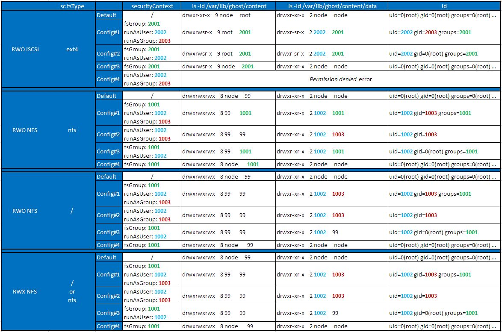

#########################################################################################
# SCENARIO 19: About Security Contexts
#########################################################################################

A security context defines privilege and access control settings for a Pod or Container.  
The complete list of options that can be set is available here: https://kubernetes.io/docs/tasks/configure-pod-container/security-context/

Note that you can configure a security context at the POD level (called a _PodSecurityContext_ object) & a _securityContext_ at the container level.  
If that is the case, the latter one will take precedence over the first one.  

I will focus on this chapter on 3 security context options, and explain how they can be used (or not used) with iSCSI & NFS, as well as RWO & RWX access modes :  
- runAsUser
- runAsGroup
- fsGroup

The **runAsUser** field specifies the User ID (**UID**) to run the Entrypoint (default executable of the image) of the container process. It defaults to the user specified in the image metadata.  

The **runAsGroup** field specifies the primary group ID (**GID**) for all processes within any containers of the Pod. If not set, the GID will be set to the runtime default.  

If both _runAsUser_ & _runAsGroup_ fields are set, all files created within the POD will be owned by these IDs.  

To avoid a situation when a user and a group are not set in the container image, you can set the parameter **runAsNonRoot** in the POD. This will avoid defaulting to root, which could lead to a security hole. This can also be set to prevent privileged processes in containers from accessing the system and the host.  

The **fsGroup** field sets a supplemental group which Kubernetes will change the permissions of all files in volumes to when volumes are mounted by a pod.  
If both _runAsGroup_ and _fsGroup_ parameters are set, the latter one will be used to change the ownership of the volume.
Some guidelines about the use of _fsgroup_:  
- This parameter will only be taken into account for PVC mounted in the POD when the storage class also has the **fsType** parameter set
- Only RWO volumes are compatible with this parameter because it recursively changes the permissions of all the directories in the volume (which could potentially cause issues when multiple pods need to access the same volume)

The resulting list of possibilities is then limited to :  
- RWO + iSCSI and fsType = ext4/ext3/...
- RWO + NFS and fsType = nfs

To test all these parameters, you can find in this folder different yaml files:  
- _RWO_iSCSI_Ghost.yaml_: Blog that mounts a RWO volume backend by an iSCSI LUN
- _RWO_NFS_Ghost_fstype.yaml_: Blog that mounts a RWO volume backend by a NFS volume, the storage class having the fsType parameter set
- _RWO_NFS_Ghost_nofstype.yaml_: Blog that mounts a RWO volume backend by a NFS volume, the storage class **not** having the fsType parameter set
- _RWX_NFS_Ghost.yaml_: Blog that mounts a RWX volume backend by a NFS volume  

Each file contains the following sequence that you can edit as you wish in order to test different combinations:  
```bash
      securityContext:
          fsGroup: 2001
          runAsUser: 2002
          runAsGroup: 2003
          #runAsNonRoot: true
```

Let's see an example with the RWO yaml file:  
```bash
$ kubectl create -f RWO_iSCSI_Ghost.yaml
namespace/sc19 created
persistentvolumeclaim/sc19-pvc created
deployment.apps/sc19-rwo-iscsi created

$ kubectl get -n sc19 -l app.kubernetes.io/name=sc19RwoIscsi pod,pvc
NAME                                 READY   STATUS    RESTARTS   AGE
pod/sc19-rwo-iscsi-7cf8b8966-2bp6d   1/1     Running   0          12s
NAME                             STATUS   VOLUME                                     CAPACITY   ACCESS MODES   STORAGECLASS        AGE
persistentvolumeclaim/sc19-pvc   Bound    pvc-6d6b9d64-5eeb-491b-9f21-0ab8aa94eb9d   5Gi        RWO            storage-class-san   13s

$ kubectl exec -it -n sc19 $(kubectl get -n sc19 pod -l app.kubernetes.io/name=sc19RwoIscsi -o name) -- id
uid=2002 gid=2003 groups=2001

$ kubectl exec -it -n sc19 $(kubectl get -n sc19 pod -l app.kubernetes.io/name=sc19RwoIscsi -o name) --  ls -ld /var/lib/ghost/content
drwxrwsr-x    9 root     2001          4096 Dec  1 19:05 /var/lib/ghost/content

$ kubectl exec -it -n sc19 $(kubectl get -n sc19 pod -l app.kubernetes.io/name=sc19RwoIscsi -o name) --  ls -ld /var/lib/ghost/content/data
drwxr-sr-x    2 2002     2001          4096 Dec  1 19:05 /var/lib/ghost/content/data

$ kubectl delete -f RWO_iSCSI_Ghost.yaml
namespace "sc19" deleted
persistentvolumeclaim "sc19-pvc" deleted
deployment.apps "sc19-rwo-iscsi" deleted
```

In this use case, you see the _fsGroup_ (2001) & _runAsUser_ (2002) were transposed in the result on the attached PVC (refer to the _ls -ld_ commands).

The following diagram summarizes all the different possibilities and proves that the fsGroup paramater is only used for RWO iSCSI & RWO NFS with fsType set.  

<p align="center"></p>

Side note, one of the image layers (5th layer) creates a user called _node_ & a group also called _node_, both with the ID 1000.  
That is the one used to install the Ghost application in the unix base image.

```bash
addgroup -g 1000 node && adduser -u 1000 -G node
```

You can see that on the following link:
https://hub.docker.com/layers/ghost/library/ghost/2.6-alpine/images/sha256-e461f6ad94f73ad5586178f66eaeda79fa888c9bbe3c4bab64e6b590d0fd2336?context=explore 
