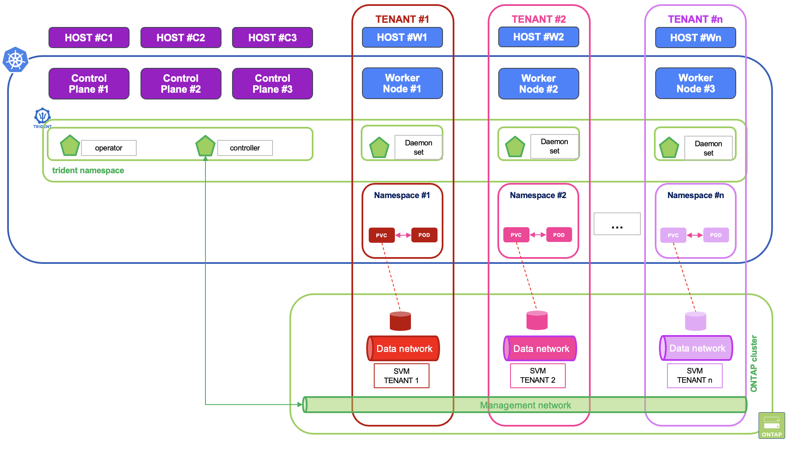

#########################################################################################
# SCENARIO 21: Multi-tenancy level 1
#########################################################################################

Namespaces are way to separate Kubernetes resources by tenants. However, hardware is still shared amongst all the applications sharing a set of servers.  
Take the persistent volume example. Yes, PVC are namespace bound, and by definition cannot be accessed from another namespace (unless using the Trident Cross Namespace Volume Access feature, cf [scenario22](../../Scenario22/)). However, volumes are mounted directly on the worker node! That also means that a rogue user or a hacker who manages to get access on this server will be able to enter all mounted volumes.  

Mainly for security reasons, worker nodes may be dedicated to an end-user or a customer, who will then run his namespace(s) on dedicated nodes. At the storage level, you would also create one SVM per customer, hence creating end-to-end isolated tenants.  

<p align="center"></p>

Putting that architecture together requires some work:  
- Trident operator and controller must run on the Control Plane.  
- all SVMs' management LIF must be reachable from the Trident Controller pod.  
- Worker node storage ports and SVM Data LIF can run on isolated networks.  
- Storage classes being cluster wide resources, you need a way to enforce them to specific namespaces.  
- Pods running in those tenants can only start on the corresponding worker nodes.  

A policy management solution, such as Kyverno, could really help here:  
- pod placement: it can automatically "mutate" a pod by adding a _nodeSelector_ field so that it can only run in its namespace,  
- storage class: it can restrict storage classes to specific namespaces, which is easier at scale compared to manual resource quota management,  
- user changes: it can avoid standard users to change specific field to override policies

Keep in mind that in such configuration, some system applications (monitoring, CSI, alerting, ...) still run a DaemonSet on those worker nodes...  
So, does that architecture answer your multi-tenant requirements? If not, you can also check more advanced solutions in this scenario (provided by Clastix or Loft Labs), or even think about running Kubernetes clusters as KubeVirt tenants!  

In this chapter, we are not going full steam with Kyverno, but let's try to build a light weight multitenant environment.  
Let's create 2 tenants:  
- _tenant1_ which can only use the worker node _rhel1_. 
- _tenant2_ which can only use the worker node _rhel2_. 
  
## A. PreReq

First of all, we want the Control plane to only focus on that role, hence not schedule any user application:  
```bash
$ kubectl taint nodes rhel3 node-role.kubernetes.io/control-plane:NoSchedule
node/rhel3 tainted
```
Next, we want to modify Trident to reflect the following:
-  operator and controller on the control plane
-  daemonsets on the worker nodes (which requires a new label on the worker nodes)

```bash
kubectl label node rhel1 trident.netapp.io/nodeplugin=true
kubectl label node rhel2 trident.netapp.io/nodeplugin=true
helm upgrade --install trident netapp-trident/trident-operator --version 100.2606.0 -n trident --reuse-values -f values.yaml
```
With that command, you should get the following within a minute, which confirm the correct placement:  
```bash
$ kubectl get -n trident po -o wide
NAME                                 READY   STATUS    RESTARTS   AGE   IP               NODE    NOMINATED NODE   READINESS GATES
trident-controller-8bdb6db95-kjvv4   6/6     Running   0          10m   192.168.25.70    rhel3   <none>           <none>
trident-node-linux-8bnrj             2/2     Running   0          10m   192.168.0.62     rhel2   <none>           <none>
trident-node-linux-h2blr             2/2     Running   0          10m   192.168.0.61     rhel1   <none>           <none>
trident-operator-55b579487-vz2qv     1/1     Running   0          10m   192.168.25.127   rhel3   <none>           <none>
```

Let's also cordon the Windows nodes, which we don't need here:
```bash
$ kubectl cordon win1 win2
node/win1 cordoned
node/win2 cordoned
```

## B. Storage setup

The lab already has 2 SVM, which we can reuse immediately.  
the SVM _nassvm_ will be assigned to the tenant _tenant1_, while the SVM _sansvm_ will be assigned to the tenant _tenant2_.  
However, all the existing LIF are accessible from the whole cluster. Let's modify this behavior in order to restrict management to the control plane, and data access to the specific worker nodes.  
As this will be done with Ansible, please refer to the [Addenda04](../../../Addendum/Addenda04/) to install this tool if not yet done.  
You also need to copy the hosts file from this scenario into the /etc/ansible folder.  
```bash
mkdir -p /etc/ansible
if [ -f /etc/ansible/hosts ]; then mv /etc/ansible/hosts /etc/ansible/hosts.bak; fi;
cp hosts /etc/ansible/ 
```
Now you can proceed with the configuration:  
```bash
$ ansible-playbook network_configuration.yaml
PLAY [Multi Tenancy SVM Network Management]
TASK [Gathering Facts] 
TASK [NAS SVM - Create Service Policy for Management (Core)] 
TASK [NAS SVM - Create Service Policy for Management (HTTPS)] 
TASK [NAS SVM - Create Service Policy for NFS (Core)] 
TASK [NAS SVM - Create Service Policy for NFS (Data)] 
TASK [NAS SVM - Modify Mgmt Interface#1]
TASK [NAS SVM - Modify Mgmt Interface#2]
TASK [NAS SVM - Modify Data Interface#1]
TASK [NAS SVM - Modify Data Interface#2]
TASK [NAS SVM - Create Export Policy] 
TASK [NAS SVM - Create ExportPolicyRule]
TASK [SAN SVM - Create Service Policy for Management (Core)] 
TASK [SAN SVM - Create Service Policy for Management (HTTPS)]
TASK [SAN SVM - Create Service Policy for iSCSI (Core)]
TASK [SAN SVM - Create Service Policy for iSCSI (Data)]
TASK [SAN SVM - Create Service Policy for NVMe (Core)] 
TASK [SAN SVM - Create Service Policy for NVMe (Data)] 
TASK [SAN SVM - Modify Mgmt Interface#1]
TASK [SAN SVM - Modify Mgmt Interface#2]
TASK [SAN SVM - Modify Data Interface#1]
TASK [SAN SVM - Modify Data Interface#2]
TASK [SAN SVM - Modify Data Interface#3]

PLAY RECAP 
localhost                  : ok=20   changed=20   unreachable=0    failed=0    skipped=0    rescued=0    ignored=0
```
Easy. We then have the following topology:  
|  | Tenant1 | Tenant2 |
| :--- | :---: | :---: |
| Worker Node | rhel1 | rhel2 |
| Interface | 192.168.0.61 | 192.168.0.62 |
| SVM | nassvm | sansvm |
| DataLIF#1 | 192.168.0.131 | 192.168.0.135 |
| DataLIF#2 | 192.168.0.132 | 192.168.0.136 |
| DataLIF#3 | - | 192.168.0.139 |
| ManagementLIF | 192.168.0.133 | 192.168.0.137 |

## C. Trident backends & storage classes 

Now that the storage layer is ready, time to move back to Kubernetes.  

Before moving to the setup, let's delete existing storage classes, to avoid any issues in this demonstration:  
```bash
kubectl delete sc --all
```

Let's create our two new Trident backends:  
```bash
$ kubectl create -f trident_backends.yaml
tridentbackendconfig.trident.netapp.io/tenant1 created
tridentbackendconfig.trident.netapp.io/tenant2 created

$ kubectl get tbc -n trident tenant1 tenant2
NAME      BACKEND NAME   BACKEND UUID                           PHASE   STATUS
tenant1   Tenant1        63830953-f89a-4f19-b6e8-3d38871d47af   Bound   Success
tenant2   Tenant2        d939fd86-5887-4e6e-85fa-e6ce31729195   Bound   Success
```
Notice that the first tenant does not enable the Dynamic Export Policy feature, but rather uses a preconfigured export policy which contains only the worker node IP address.  

We can now proceed with the storage classes:  
```bash
$ kubectl create -f storage_classes.yaml
storageclass.storage.k8s.io/storage-class-tenant1 created
storageclass.storage.k8s.io/storage-class-tenant2 created

$ kuebctl get sc storage-class-tenant1  storage-class-tenant2
NAME                    PROVISIONER             RECLAIMPOLICY   VOLUMEBINDINGMODE   ALLOWVOLUMEEXPANSION   AGE
storage-class-tenant1   csi.trident.netapp.io   Delete          Immediate           true                   11s
storage-class-tenant2   csi.trident.netapp.io   Delete          Immediate           true                   11s
```
There is a one-to-one relationship between backends and storage classes.  

## D. Worker nodes

You can enforce pod scheduling on specific nodes using the following steps:  
- Label the tenant’s node or node pool.
- Taint that node or node pool so other workloads cannot land there.
- Automatically add matching nodeSelector or nodeAffinity and tolerations to every pod in that namespace.
- Block pods from overriding those rules.
- Add the multi-tenant controls around RBAC, quotas, network policy, and pod security.

In this chapter, we are not going to configure everything, let's focus on labels.  
We will create a **specific label for each tenant**, to dedicate worker nodes:  
```bash
kubectl label node rhel1 tenant-namespace=tenant1
kubectl label node rhel2 tenant-namespace=tenant2
```
Let's also add **taints** to our nodes, to prevent pods from other namespaces to land on the wrong worker node:  
```bash
kubectl taint node rhel1 tenant-namespace=tenant1:NoSchedule
kubectl taint node rhel2 tenant-namespace=tenant2:NoSchedule
```
A pod from tenant1 must then carry the following in order to be scheduled on the correct worker node:  
```yaml
spec:
  nodeSelector:
    tenant-namespace: tenant1
  tolerations:
    - key: tenant-namespace
      operator: Equal
      value: tenant1
      effect: NoSchedule
```
**Remember**: 
- _nodeSelector_ are used to specify where you want your pods to run. 
- _taints_ and _tolerations_ are used to allow pods to run depending on filters

**Note:**.
Kubernetes does not apply scheduling rules automatically from the namespace object to the pods inside it. So if you stop at labels and taints, a user can still create a pod without the required selector/toleration and it will either fail scheduling or, worse, schedule somewhere else if your cluster allows it. That's why it is recommened to use **admission policy** mechanisms, such as Kyverno, to manage that more efficiently (cf [Scenario25](../../Scenario25/)).


## E. Namespaces 

The first part is pretty easy, let's create the namespaces corresponding to our two tenants:  
```bash
kubectl create ns tenant1
kubectl create ns tenant2
```
Storage classes are cluster wide resources, which means that anyone can use any storage class available...  
How can you control that?  

If you have a limited amount of tenants and storage classes, you can then use _ResourceQuotas_.  
The downside is that you do not declare what you allow, instead you block what you do not want, which can be quite cumbersome at scale.  
Also, if you create a new storage class (for a new tenant for instance), you need to update all existing quotas to disallow its use...  
Here again, admission policy mechanisms can help controlling storage classes access at scale.  

For the time being, let's focus on resource quotas:  
```bash
cat << EOF | kubectl apply -f -
apiVersion: v1
kind: ResourceQuota
metadata:
  name: block-other-classes
  namespace: tenant1
spec:
  hard:
    tenant2.storageclass.storage.k8s.io/requests.storage: "0"
    tenant2.storageclass.storage.k8s.io/persistentvolumeclaims: "0"
---
apiVersion: v1
kind: ResourceQuota
metadata:
  name: block-other-classes
  namespace: tenant2
spec:
  hard:
    tenant1.storageclass.storage.k8s.io/requests.storage: "0"
    tenant1.storageclass.storage.k8s.io/persistentvolumeclaims: "0"
EOF
```
You can validate the configuration by running the following:  
```bash
$ kubectl describe quota -n tenant1
Name:                                                       block-other-classes
Namespace:                                                  tenant1
Resource                                                    Used  Hard
--------                                                    ----  ----
tenant2.storageclass.storage.k8s.io/persistentvolumeclaims  0     0
tenant2.storageclass.storage.k8s.io/requests.storage        0     0
```

## F. Applications!  

Let's deploy an application per tenant. If you check the manifest, you will see they are configured with both _nodeSelector_ and _tolerations_:  
```bash
$ kubectl create -f bbox1.yaml
persistentvolumeclaim/mydata created
deployment.apps/busybox created

$ kubectl create -f bbox2.yaml
persistentvolumeclaim/mydata created
deployment.apps/busybox created
```
After a couple of seconds, everything will be up&running, you can also notice that pods are running on their designated nodes:  
```bash
$ kubectl get -n tenant1 po -o wide
NAME                       READY   STATUS    RESTARTS   AGE   IP              NODE    NOMINATED NODE   READINESS GATES
busybox-74ccd99c47-fb59p   1/1     Running   0          98s   192.168.26.43   rhel1   <none>           <none>
$ kubectl get -n tenant1 pvc
NAME     STATUS   VOLUME                                     CAPACITY   ACCESS MODES   STORAGECLASS            VOLUMEATTRIBUTESCLASS   AGE
mydata   Bound    pvc-bd429cd2-eba0-4e74-86ee-e11b65b3ed72   10Gi       RWX            storage-class-tenant1   <unset>                 103s

$ kubectl get -n tenant2 po -o wide
NAME                       READY   STATUS    RESTARTS   AGE    IP              NODE    NOMINATED NODE   READINESS GATES
busybox-6b54d59bd7-wmb7s   1/1     Running   0          104s   192.168.28.95   rhel2   <none>           <none>

$ kubectl get -n tenant2 pvc
NAME     STATUS   VOLUME                                     CAPACITY   ACCESS MODES   STORAGECLASS            VOLUMEATTRIBUTESCLASS   AGE
mydata   Bound    pvc-c25cf105-132e-49b5-9c0d-2d12d76760cf   10Gi       RWO            storage-class-tenant2   <unset>                 110s
```
You can even verify the mount point for the tenant working with NFS, which should correspond to the DataLIF identified earlier:  
```bash
$ kubectl exec -n tenant1 $(kubectl get -n tenant1 pod -o name) -- df -h /data
Filesystem                Size      Used Available Use% Mounted on
192.168.0.131:/trident_pvc_bd429cd2_eba0_4e74_86ee_e11b65b3ed72
                         10.0G    256.0K     10.0G   0% /data
```
There you achieved multi tenancy! (at least part of it).

## G. More Applications!  

Let's now try to create applications with wrong or missing filtering parameters.

The first application does not have the _tolerations_ set:
```bash
$ kubectl create -f tenant1_busybox2.yaml
persistentvolumeclaim/mydata2 created
deployment.apps/busybox2 created

$ kubectl get -n tenant1 po,pvc -l app=busybox2
NAME                            READY   STATUS    RESTARTS   AGE
pod/busybox2-5df797d6b9-7fh4c   0/1     Pending   0          79s

NAME                            STATUS   VOLUME                                     CAPACITY   ACCESS MODES   STORAGECLASS            VOLUMEATTRIBUTESCLASS   AGE
persistentvolumeclaim/mydata2   Bound    pvc-513478e5-af04-4f43-a905-a96a192cbd12   10Gi       RWX            storage-class-tenant1   <unset>                 79s
```
The pod will remain in _Pending_. Let's check the details:  
```bash
$ kubectl get pods -n tenant1 -l app=busybox2 -o name | xargs -I{} kubectl events -n tenant1 --for {}
LAST SEEN           TYPE      REASON             OBJECT                          MESSAGE
3m (x2 over 3m1s)   Warning   FailedScheduling   Pod/busybox2-5df797d6b9-7fh4c   0/5 nodes are available: pod has unbound immediate PersistentVolumeClaims. preemption: 0/5 nodes are available: 5 Preemption is not helpful for scheduling.
2m57s               Warning   FailedScheduling   Pod/busybox2-5df797d6b9-7fh4c   0/5 nodes are available: 1 node(s) had untolerated taint {node-role.kubernetes.io/control-plane: }, 1 node(s) had untolerated taint {tenant-namespace: tenant1}, 1 node(s) had untolerated taint {tenant-namespace: tenant2}, 2 node(s) were unschedulable. preemption: 0/5 nodes are available: 5 Preemption is not helpful for scheduling.
```
Pretty clear, _untolerated taint_ is the reason the pod is not scheduled. We have not allowed the pod to run on any node that requires explicit acceptance.

The second application does not have the _nodeSelector_ present:  
```bash
$ kubectl create -f tenant1_busybox3.yaml
persistentvolumeclaim/mydata3 created
deployment.apps/busybox3 created

$ kubectl get -n tenant1 po,pvc -l app=busybox3
NAME                            READY   STATUS    RESTARTS   AGE
pod/busybox3-7fddc66d86-vs48m   1/1     Running   0          9s

NAME                            STATUS   VOLUME                                     CAPACITY   ACCESS MODES   STORAGECLASS            VOLUMEATTRIBUTESCLASS   AGE
persistentvolumeclaim/mydata3   Bound    pvc-c96e4083-d569-48ef-aaba-b3e0c6a46e0b   10Gi       RWX            storage-class-tenant1   <unset>                 9s
```
This time, it works, simply because we have only one node with the chosen nodeSelector...

The third application has _neither nodeSelector nor tolerations_:  
```bash
$ kubectl create -f tenant1_busybox4.yaml
persistentvolumeclaim/mydata4 created
deployment.apps/busybox4 created

$ kubectl get -n tenant1 po,pvc -l app=busybox4
NAME                            READY   STATUS    RESTARTS   AGE
pod/busybox4-768588dc65-phsgd   0/1     Pending   0          4m51s

NAME                            STATUS   VOLUME                                     CAPACITY   ACCESS MODES   STORAGECLASS            VOLUMEATTRIBUTESCLASS   AGE
persistentvolumeclaim/mydata4   Bound    pvc-0034f276-b53c-4cea-a7f7-ed54a75798a2   10Gi       RWX            storage-class-tenant1   <unset>                 4m33s
```
Looking at the pod event, you can read the following:
```bash
$ kubectl get pods -n tenant1 -l app=busybox4 -o name | xargs -I{} kubectl events -n tenant1 --for {}
LAST SEEN               TYPE      REASON             OBJECT                          MESSAGE
6m23s (x2 over 6m26s)   Warning   FailedScheduling   Pod/busybox4-768588dc65-phsgd   0/5 nodes are available: pod has unbound immediate PersistentVolumeClaims. preemption: 0/5 nodes are available: 5 Preemption is not helpful for scheduling.
53s (x2 over 6m21s)     Warning   FailedScheduling   Pod/busybox4-768588dc65-phsgd   0/5 nodes are available: 1 node(s) had untolerated taint {node-role.kubernetes.io/control-plane: }, 1 node(s) had untolerated taint {tenant-namespace: tenant1}, 1 node(s) had untolerated taint {tenant-namespace: tenant2}, 2 node(s) were unschedulable. preemption: 0/5 nodes are available: 5 Preemption is not helpful for scheduling.
```
Pretty clear, _untolerated taint_ is the reason the pod is not scheduled. We have not allowed the pod to run on any node that requires explicit acceptance.

Next, let's set the wrong nodeSelector (_tenant2_ instead of _tenant1_):
```bash
$ kubectl create -f tenant1_busybox5.yaml
persistentvolumeclaim/mydata5 created
deployment.apps/busybox5 created

$ kubectl get -n tenant1 po,pvc -l app=busybox5
NAME                            READY   STATUS    RESTARTS   AGE
pod/busybox5-6fc884c649-6jkpw   0/1     Pending   0          9s

NAME                            STATUS   VOLUME                                     CAPACITY   ACCESS MODES   STORAGECLASS            VOLUMEATTRIBUTESCLASS   AGE
persistentvolumeclaim/mydata5   Bound    pvc-8fa2c4b6-7a22-447f-b80b-2d1b277b10ab   10Gi       RWX            storage-class-tenant1   <unset>                 9s
```
Maybe the events will give us something different:  
```bash
$ kubectl get pods -n tenant1 -l app=busybox5 -o name | xargs -I{} kubectl events -n tenant1 --for {}
LAST SEEN           TYPE      REASON             OBJECT                          MESSAGE
20s (x2 over 22s)   Warning   FailedScheduling   Pod/busybox5-6fc884c649-6jkpw   0/5 nodes are available: pod has unbound immediate PersistentVolumeClaims. preemption: 0/5 nodes are available: 5 Preemption is not helpful for scheduling.
17s                 Warning   FailedScheduling   Pod/busybox5-6fc884c649-6jkpw   0/5 nodes are available: 1 node(s) didn't match Pod's node affinity/selector, 1 node(s) had untolerated taint {node-role.kubernetes.io/control-plane: }, 1 node(s) had untolerated taint {tenant-namespace: tenant2}, 2 node(s) were unschedulable. preemption: 0/5 nodes are available: 5 Preemption is not helpful for scheduling.
```
Interesting, as expected "1 node(s) didn't match Pod's node affinity/selector".  
By the way, you would have seen the same logs with the right nodeSelector & the wrong tolerations

## H. Clean up time !

```bash
kubectl delete ns tenant1 tenant2
kubectl uncordon win1 win2
kubectl delete sc --all
kubectl delete -n trident tbc tenant1 tenant2
ansible-playbook network_configuration_reset.yaml
sh ../../Scenario02/all_in_one.sh
sh ../../Scenario05/all_in_one.sh
```
Note you will see errors with the 2 last commands. This is expected as Trident backends were not deleted. Those commands are used to recreate the storage classes.  