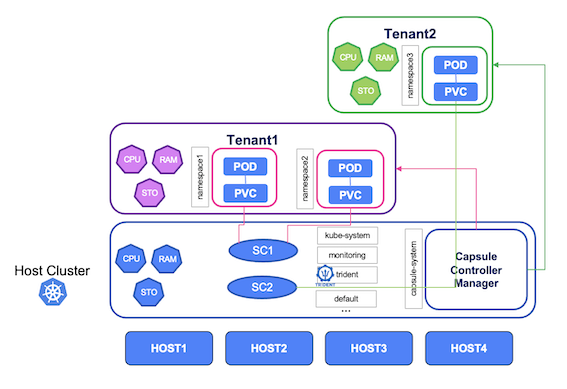

#########################################################################################
# SCENARIO 21: Persistent Volumes and Capsule.
#########################################################################################

Namespaces provide a mechanism for isolating groups of resources within a single cluster. Limits & quotas can also be applied to a namespace to control resource consumption (essentially CPU, Memory & Storage). If the mapping user <-> namespace is a 1 to 1 relationship, then control can be easily implemented, to a certain extent. However, if a user or a group of users request several namespaces, the infrastructure admins do not have an easy way to control all of these like one entity.

That is where Capsule from Clastix comes into the game, with the **Tenant** resource.  

With the help of tenants, resources can be controlled & limited accross several namespaces (example: instead of 5 PVC max per namespace, you would have 15 PVC max per Tenant, with a maximum of 3 namespaces).  

More, it is not only about resources. With the help of Capsule, you can also **enable or disable Kubernetes features for a whole tenant**, with really fine grain mechanisms. This applies to (not an exhaustive list):  
- node selection
- ingress classes
- storage classes
- network policies
- registries
- service control
- ...

In this scenario, we will see how to install & use Capsule, in conjunction with Trident.

<p align="center"></p>

## A. Environment setup  

Before testing Capsule, we will prepare the Trident configuration that can be used here.  
Let's create two new Trident backends associated with specific storage classes, so that we can demonstrate how the Kubernetes admin can control the storage consumption of a Tenant:  
```bash
$ kubectl create -f ../scenario21_trident_config.yaml
secret/sc21_credentials created
tridentbackendconfig.trident.netapp.io/backend-tenant1 created
tridentbackendconfig.trident.netapp.io/backend-tenant2 created

$ kubectl create -f ../scenario21_storage_classes.yaml
storageclass.storage.k8s.io/sc-tenant1 created
storageclass.storage.k8s.io/sc-tenant2 created
```

If you have not yet read the [Addenda08](../../Addendum/Addenda08) about the Docker Hub management, it would be a good time to do so.  
Also, if no action has been made with regards to the container images, you can find a shell script in this directory *scenario21_pull_images.sh* to pull images utilized in this scenario if needed:  
```bash
sh ../scenario21_pull_images.sh
```

In order to best benefit from this experiment, you will also need to:  
- Allow user applications on the control plane: cf [Addenda03](../../../Addendum/Addenda03/)
- Add an extra node to the Kubernetes cluster: cf [Addenda01](../../../Addendum/Addenda01)

With 4 linux nodes, your cluster will look the following:
```bash
$ kubectl get node -l kubernetes.io/os=linux
NAME    STATUS   ROLES           AGE     VERSION
rhel1   Ready    <none>          99d     v1.29.4
rhel2   Ready    <none>          99d     v1.29.4
rhel3   Ready    control-plane   99d     v1.29.4
rhel4   Ready    <none>          2m49s   v1.29.4
```

Last, as both solutions can benefit from labels positioned on nodes, we will already configure some:  
```bash
$ kubectl label node rhel1 "tenant=tenant1"
node/rhel1 labeled
$ kubectl label node rhel2 "tenant=tenant1"
node/rhel2 labeled
$ kubectl label node rhel3 "tenant=tenant2"
node/rhel3 labeled
$ kubectl label node rhel4 "tenant=tenant2"
node/rhel4 labeled
```

You are now ready to proceed with the Capsule installation.  

## B. Capsule Requirements

Capsule implements Kubernetes multi-tenancy capabilities using a minimum set of standard Admission Controllers.  
For this lab, we need to enable the _PodNodeSelector_ alpha feature on the API Server.  
If _NodeSelector_ parameters are set in the tenant configuration (check tenant1.yaml), Capsule will add the parameter _scheduler.alpha.kubernetes.io/node-selector_ to all the namespaces created in the tenant.  
From there, every pod created in the tenant will get a NodeSelector entry in order to respect the requirements.  

To enable this alpha feature, we need to edit the API Server on the Kubernetes control plane (_rhel3_):  
```bash
sed -i '/enable-admission-plugins/ s/$/,PodNodeSelector/' /etc/kubernetes/manifests/kube-apiserver.yaml
```
This will trigger the API Server to restart. To check if the change was taken into account:  
```bash
kubectl get -n kube-system po -l component=kube-apiserver -o=jsonpath='{.items[0].spec.containers[0].command}'  | grep enable-admission-plugins
```

## C. Install Capsule

Capsule can be installed either via Helm chart, or by deploying manually the operator.  
Let's try using the Helm chart, with a file containing its parameters.  

By default, different tenants could potentially decide to create namespaces with the same name, which would end up in error if one already exists. To avoid such behavior, you can enforce a prefix on each namespace with the parameter _forceTenantPrefix: true_:  
```bash
$ helm install capsule projectcapsule/capsule --version 0.7.0 -n capsule-system --create-namespace -f capsule-values.yaml

$ kubectl get -n capsule-system po
NAME                                          READY   STATUS    RESTARTS        AGE
capsule-controller-manager-684c447b95-fk8z5   1/1     Running   1 (9m55s ago)   10m

$ kubectl get crd | grep capsule
capsuleconfigurations.capsule.clastix.io              2024-08-05T16:29:52Z
globaltenantresources.capsule.clastix.io              2024-08-05T16:29:52Z
tenantresources.capsule.clastix.io                    2024-08-05T16:29:52Z
tenants.capsule.clastix.io                            2024-08-05T16:29:52Z
```

## D. Create tenants

As Capsule is fully managed with Kubectl, creating & managing tenants is pretty easy.  
The first Tenant we are going to create contains a few parameters:  
- Only allows images from the private registry _registry.demo.netapp.com_
- The user _owner1_ can create & manage up to 3 namespaces
- Apps running in this tenant are limited to nodes with the "tenant1:true" label (essentially nodes RHEL1 & RHEL2)
- PVC can only be created against the _sc-tenant1_ storage class  

To learn more about how to configure Capsule, please refer to https://capsule.clastix.io/docs/general/tutorial 

```bash
$ kubectl create -f tenant1.yaml
tenant.capsule.clastix.io/tenant1 created

$ kubectl create -f tenant2.yaml
tenant.capsule.clastix.io/tenant2 created

$ kubectl get tenants
NAME      STATE    NAMESPACE QUOTA   NAMESPACE COUNT   NODE SELECTOR                                     AGE
tenant1   Active   3                 0                 {"kubernetes.io/os":"linux","tenant":"tenant1"}   57s
tenant2   Active   1                 0                 {"kubernetes.io/os":"linux","tenant":"tenant2"}   3s
```

Nothing easier than creating tenants. As you can see, you also have some basic information available when listing the tenants.

## E. Access tenants

Each tenant comes with its own admin (respectively _owner1_ & _owner2_) & group of admins.  
A [script](https://github.com/clastix/capsule/blob/master/hack/create-user.sh) provided by Capsule will create the kubeconfig files for each user. A copy of this script (_create-user.sh_) is available in this folder.

```bash
$ sh create-user.sh owner1 tenant1
creating certs in TMPDIR /tmp/tmp.LBoebFHscC
merging groups /O=projectcapsule.dev
certificatesigningrequest.certificates.k8s.io/owner1-tenant1 created
certificatesigningrequest.certificates.k8s.io/owner1-tenant1 approved
kubeconfig file is: owner1-tenant1.kubeconfig
to use it as owner1 export KUBECONFIG=owner1-tenant1.kubeconfig

$ sh create-user.sh owner2 tenant2
creating certs in TMPDIR /tmp/tmp.Wk0D0z4IHY
merging groups /O=projectcapsule.dev
certificatesigningrequest.certificates.k8s.io/owner2-tenant2 created
certificatesigningrequest.certificates.k8s.io/owner2-tenant2 approved
kubeconfig file is: owner2-tenant2.kubeconfig
to use it as owner2 export KUBECONFIG=owner2-tenant2.kubeconfig
```

For now, there is not much to list with either users, as we have not created anything yet.  
By the way, these users cannot by default see the available storage classes, as these are cluster wide resources. The Cluster admin must then provide them with the name of the storage class they are allowed to use:  
```bash
$ kubectl --kubeconfig owner1-tenant1.kubeconfig get sc
Error from server (Forbidden): storageclasses.storage.k8s.io is forbidden: User "owner1" cannot list resource "storageclasses" in API group "storage.k8s.io" at the cluster scope
```

## F. Use tenants

Let's install Ghost on _tenant1_. For that, you can use the _ghost_tenant1.sh_ file from the Ghost_tenant1 folder.  
It will be installed in its own namespace called _tenant1-ghost_.  
Since this application's service is of LoadBalancer type, the script retrieves the IP address & sets it in the pod.  
```bash
$ sh Ghost_tenant1/ghost_tenant1.sh
namespace/tenant1-ghost created
persistentvolumeclaim/blog-content-tenant1 created
service/blog-tenant1 created
deployment.apps/blog-tenant1 created
```

By the way, since I have enforced tenant prefix control, the namespace creation would fail if its name would not start with _tenant1_  
```bash
$ kubectl --kubeconfig owner1-tenant1.kubeconfig create ns test
Error from server (Forbidden): admission webhook "namespaces.projectcapsule.dev" denied the request: The namespace doesn't match the tenant prefix, expected tenant1-test
```

As a tenant admin, I can know list the resources in the newly created namespace:  
```bash
$ kubectl --kubeconfig owner1-tenant1.kubeconfig get svc,pvc -n tenant1-ghost
NAME                   TYPE           CLUSTER-IP     EXTERNAL-IP     PORT(S)        AGE
service/blog-tenant1   LoadBalancer   10.103.57.71   192.168.0.141   80:30371/TCP   3m7s

NAME                                         STATUS   VOLUME                                     CAPACITY   ACCESS MODES   STORAGECLASS   AGE
persistentvolumeclaim/blog-content-tenant1   Bound    pvc-fda5accc-138b-4410-9a73-1fe61bae29c9   5Gi        RWX            sc-tenant1     3m7s

$ kubectl --kubeconfig owner1-tenant1.kubeconfig get pod -n tenant1-ghost -o wide
NAME                                READY   STATUS    RESTARTS   IP               NODE    NOMINATED NODE   READINESS GATES AGE
pod/blog-tenant1-69c8b8bf58-qnvx7   1/1     Running   0          192.168.28.121   rhel2   <none>           <none>          3m7s
```
As you can see, the pod is either running on RHEL1 or RHEL2 (rhel2 in this example), which are the nodes corresponding to the nodeSelector of the tenant.  

The cluster admin can also list the content of this namespace, & will get the same result:  
```bash
$ kubectl get svc,pod,pvc -n tenant1-ghost
NAME                   TYPE           CLUSTER-IP     EXTERNAL-IP     PORT(S)        AGE
service/blog-tenant1   LoadBalancer   10.103.57.71   192.168.0.141   80:30371/TCP   3m7s

NAME                                READY   STATUS    RESTARTS   AGE
pod/blog-tenant1-69c8b8bf58-qnvx7   1/1     Running   0          3m7s

NAME                                         STATUS   VOLUME                                     CAPACITY   ACCESS MODES   STORAGECLASS   AGE
persistentvolumeclaim/blog-content-tenant1   Bound    pvc-fda5accc-138b-4410-9a73-1fe61bae29c9   5Gi        RWX            sc-tenant1     3m7s
```

However, the user of the second tenant will not have the right to list resources from a namespace created by tenant1.  
```bash
$ kubectl --kubeconfig owner2-tenant2.kubeconfig get svc,pod,pvc -n tenant1-ghost
Error from server (Forbidden): services is forbidden: User "owner2" cannot list resource "services" in API group "" in the namespace "tenant1-ghost"
Error from server (Forbidden): pods is forbidden: User "owner2" cannot list resource "pods" in API group "" in the namespace "tenant1-ghost"
Error from server (Forbidden): persistentvolumeclaims is forbidden: User "owner2" cannot list resource "persistentvolumeclaims" in API group "" in the namespace "tenant1-ghost"
```

Last, we can also see that the quota count has increased:  
```bash
$ kubectl get tenant
NAME      STATE    NAMESPACE QUOTA   NAMESPACE COUNT   NODE SELECTOR                                     AGE
tenant1   Active   3                 1                 {"kubernetes.io/os":"linux","tenant":"tenant1"}   92m
tenant2   Active   1                 0                 {"kubernetes.io/os":"linux","tenant":"tenant2"}   91m
```

## G. What about CSI Snapshots

Before discussing Capsule, you need to create a _VolumeSnapshotClass_ if not done yet.  
This is covered in the [Scenario13](../../Scenario13/1_CSI_Snapshots/), where you can find the manifest _sc-volumesnapshot.yaml_ which is a requirement for this exercise.  

Capsule does not natively support CSI Snapshots at this time. However, as Capsule is highly customizable, you can easily enable this feature by yourself.  
This would be done by adding a new role to the Tenant user/group. In this lab, the role will be limited to _volumesnapshots_ objects.  
```bash
$ kubectl create -f clusterrole_volumesnapshots.yaml
clusterrole.rbac.authorization.k8s.io/capsule-volume-snapshot created

$ kubectl describe clusterrole capsule-volume-snapshot -n tenant1-ghost
Name:         capsule-volume-snapshot
Labels:       <none>
Annotations:  <none>
PolicyRule:
  Resources                                       Non-Resource URLs  Resource Names  Verbs
  ---------                                       -----------------  --------------  -----
  volumesnapshots.snapshot.storage.k8s.io         []                 []              [create get list watch update delete]
  volumesnapshots.snapshot.storage.k8s.io/status  []                 []              [update]
```

Once this is done, you can patch or edit the tenant to add this new role.  
Check the _tenant1_patch.yaml_ file to read the patch content.  
```bash
$ kubectl patch tenant/tenant1 --type=merge --patch-file tenant1_patch.yaml
tenant.capsule.clastix.io/tenant1 patched

$ kubectl describe tenant tenant1 | grep -A 10 Events
Events:
  Type    Reason                    Age                    From               Message
  ----    ------                    ----                   ----               -------
  Normal  NamespaceCreationWebhook  9m59s                  tenant-webhook     Namespace tenant1-ghost has been assigned to the desired Tenant
  Normal  tenant1-ghost             7m40s (x4 over 9m59s)  tenant-controller  Ensuring Namespace metadata
  Normal  tenant1-ghost             7m40s (x4 over 9m59s)  tenant-controller  Ensuring RoleBinding capsule-tenant1-0-admin
  Normal  tenant1-ghost             7m40s (x4 over 9m59s)  tenant-controller  Ensuring RoleBinding capsule-tenant1-1-capsule-namespace-deleter
  Normal  tenant1-ghost             7m40s (x2 over 7m40s)  tenant-controller  Ensuring RoleBinding capsule-tenant1-2-capsule-volume-snapshot
```

There you go, patch successful!  

Finally, you can now create CSI Snapshots & new volumes from these snapshots!  
Note that, in this configuration, the tenant owner does not have the capability to list all available snapshot classes, same as storage classes.  
```bash
$ kubectl --kubeconfig owner1-tenant1.kubeconfig -n tenant1-ghost create -f Ghost_tenant1/pvc_snapshot.yaml
volumesnapshot.snapshot.storage.k8s.io/blog-content-tenant1-snapshot created

$ kubectl --kubeconfig owner1-tenant1.kubeconfig -n tenant1-ghost create -f Ghost_tenant1/pvc_from_snap.yaml
persistentvolumeclaim/blog-content-tenant1-from-snap created

$ kubectl --kubeconfig owner1-tenant1.kubeconfig -n tenant1-ghost get pvc,volumesnapshot
NAME                                                   STATUS   VOLUME                                     CAPACITY   ACCESS MODES   STORAGECLASS   AGE
persistentvolumeclaim/blog-content-tenant1             Bound    pvc-fda5accc-138b-4410-9a73-1fe61bae29c9   5Gi        RWX            sc-tenant1     3m22s
persistentvolumeclaim/blog-content-tenant1-from-snap   Bound    pvc-fc47f540-0245-4430-8e45-2e5dabbcb1e9   5Gi        RWX            sc-tenant1     24s

NAME                                                                   READYTOUSE   SOURCEPVC              SOURCESNAPSHOTCONTENT   RESTORESIZE   SNAPSHOTCLASS    SNAPSHOTCONTENT                                    CREATIONTIME   AGE
volumesnapshot.snapshot.storage.k8s.io/blog-content-tenant1-snapshot   true         blog-content-tenant1                           748Ki         csi-snap-class   snapcontent-bae79455-a890-4add-8e80-73e1e5ef76ca   83s            82s
```

& voilà. This opens the door to lots of fun !


## H. Clean up

By default, the Capsule controller assigns to the tenant owner the possibility to delete his own namespaces:  
```bash
$ kubectl get rolebinding -n tenant1-ghost
NAME                                          ROLE                                    AGE
capsule-tenant1-0-admin                       ClusterRole/admin                       8s
capsule-tenant1-1-capsule-namespace-deleter   ClusterRole/capsule-namespace-deleter   8s
```
That way, he can clean up his work, but he does not have the credentials to delete other namespaces:  
```bash
$ kubectl delete ns test
namespace/test created
$ kubectl --kubeconfig owner1-tenant1.kubeconfig delete ns test
Error from server (Forbidden): namespaces "test" is forbidden: User "owner1" cannot delete resource "namespaces" in API group "" in the namespace "test"

$ kubectl --kubeconfig owner1-tenant1.kubeconfig delete ns tenant1-ghost1
namespace "tenant1-ghost1" deleted

$ kubectl delete ns test
namespace "test" deleted
```

Deleting a tenant is pretty straight forward:  
```bash
$ kubectl delete tenant tenant1
tenant.capsule.clastix.io "tenant1" deleted

$ kubectl delete tenant tenant2
tenant.capsule.clastix.io "tenant2" deleted
```

## What's next

You can go back to the [FrontPage](https://github.com/YvosOnTheHub/LabNetApp)